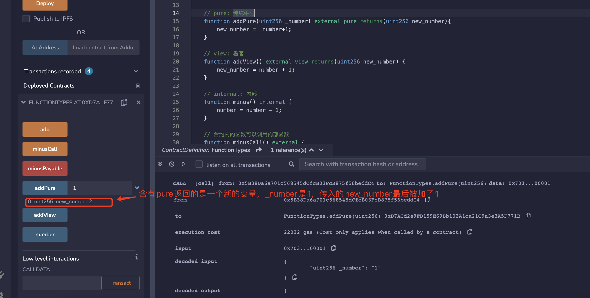
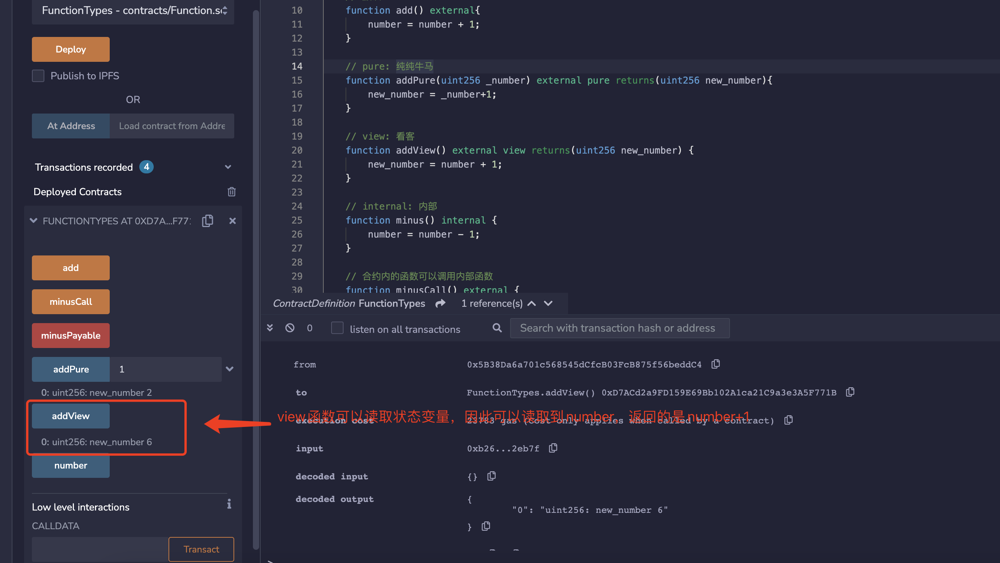
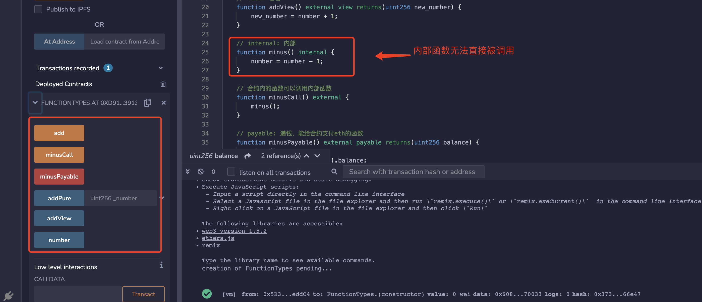
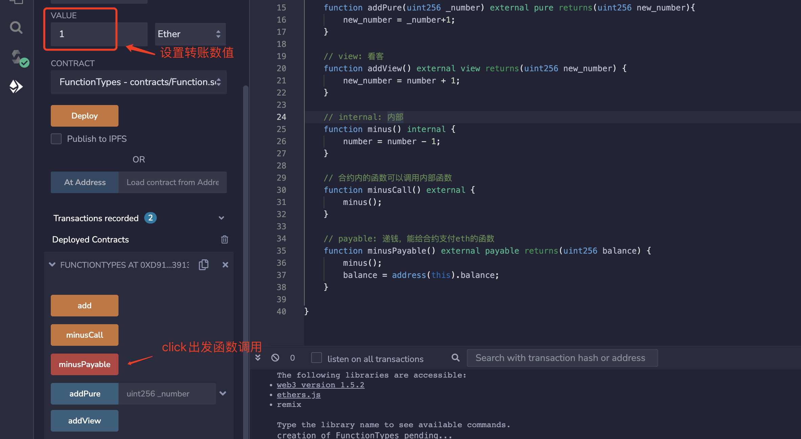

# Solidity极简入门:3. 函数类型
我最近在重新学solidity，巩固一下细节，也写一个“Solidity极简入门”，供小白们使用（编程大佬可以另找教程），每周更新1-3讲。

欢迎关注我的推特：[@0xAA_Science](https://twitter.com/0xAA_Science)

所有代码开源在github(64个star开微信交流群，已开[填表加入](https://docs.google.com/forms/d/e/1FAIpQLSe4KGT8Sh6sJ7hedQRuIYirOoZK_85miz3dw7vA1-YjodgJ-A/viewform)；128个star录教学视频): [github.com/AmazingAng/WTFSolidity](https://github.com/AmazingAng/WTFSolidity)

-----

## Solidity中的函数
solidity官方文档里把函数归到数值类型，但我觉得差别很大，所以单独分一类。我们先看一下solidity中函数的形式：
```solidity
    function (<parameter types>) {internal|external} [pure|view|payable] [returns (<return types>)]
```
看着些复杂，咱们从前往后一个一个看（方括号中的是可写可不写的关键字）：

1. `function`：声明函数时的固定用法，想写函数，就要以function关键字开头。

2. `(<parameter types>)`：圆括号里写函数的参数，也就是要输入到函数的变量类型和名字。

3. `{internal|external|public|private}`：函数可见性说明符，一共4种。没标明函数类型的，默认`internal`。

    - `public`: 内部外部均可见。(也可用于修饰状态变量，public变量会自动生成 `getter`函数，用于查询数值).
    - `private`: 只能从本合约内部访问，继承的合约也不能用（也可用于修饰状态变量）。
    - `external`: 只能从合约外部访问（但是可以用`this.f()`来调用，`f`是函数名）
    - `internal`: 只能从合约内部访问，继承的合约可以用。
4. `[pure|view|payable]`：决定函数权限/功能的关键字。`payable`（可支付的）很好理解，带着它的函数，运行的时候可以给合约转入`ETH`。`pure`和`view`的介绍见下一节。

5. `[returns ()]`：函数返回的变量类型和名称。

## 到底什么是`Pure`和`View`？
我刚开始学`solidity`的时候，一直不理解`pure`跟`view`关键字，因为别的语言没有类似的关键字。`solidity`加入这两个关键字，我认为是因为`gas fee`。合约的状态变量存储在链上，`gas fee`很贵，如果不改写链上变量，就不用付`gas`。调用`pure`跟`view`的函数是不需要付gas的。

我画了一个马里奥插画，帮助大家理解。在插画里，我把合约中的状态变量（存储在链上）比作碧池公主，三种不同的角色代表不同的关键字。


- `pure`，中文意思是“纯”，在`solidity`里理解为“纯纯牛马”。包含`pure`关键字的函数，不能读取也不能写入存储在链上的状态变量。就像小怪一样，看不到也摸不到碧池公主。

- `view`，“看”，在`solidity`里理解为“看客”。包含`view`关键字的函数，能读取但也不能写入状态变量。类似马里奥，能看到碧池，但终究是看客，不能入洞房。

- 不写`pure`也不写`view`，函数既可以读取也可以写入状态变量。类似马里奥里的`boss`，可以对碧池公主为所欲为🐶。

## 代码
### 1. pure v.s. view

我们在合约里定义一个状态变量 `number = 5`。
```solidity
    // SPDX-License-Identifier: MIT
    pragma solidity ^0.8.4;
    contract FunctionTypes{
        uint256 public number = 5;
```
定义一个add() function，每次调用，输出 number + 1。
```solidity
    // 默认
    function add() external{
        number = number + 1;
    }
```
如果`add()`包含了`pure`关键字，例如 `function add() pure external`，就会报错。因为`pure`（纯纯牛马）是不配读取合约里的状态变量的，更不配改写。那`pure`函数能做些什么？举个例子，你可以给函数传递一个参数 `_number`，然后让他返回 `_number+1`。
```solidity
    // pure: 纯纯牛马
    function addPure(uint256 _number) external pure returns(uint256 new_number){
        new_number = _number+1;
    }
```

**Example:**


如果`add()`包含`view`，比如`function add() view external`，也会报错。因为`view`能读取，但不能够改写状态变量。可以稍微改写下方程，让他不改写`number`，而是返回一个新的变量。
```solidity
    // view: 看客
    function addView() external view returns(uint256 new_number) {
        new_number = number + 1;
    }
```

**Example:**

### 2. internal v.s. external
```solidity
    // internal: 内部
    function minus() internal {
        number = number - 1;
    }

    // 合约内的函数可以调用内部函数
    function minusCall() external {
        minus();
    }
```
我们定义一个`internal`的`minus()`函数，每次调用使得`number`变量减1。由于是`internal`，只能由合约内部调用，而外部不能。因此，我们必须再定义一个`external`的`minusCall()`函数，来间接调用内部的`minus()`。
**Example:**


### 3. payable
```solidity
    // payable: 递钱，能给合约支付eth的函数
    function minusPayable() external payable returns(uint256 balance) {
        minus();    
        balance = address(this).balance;
    }
```
我们定义一个`external payable`的`minusPayable()`函数，间接的调用`minus()`，并且返回合约里的`ETH`余额（`this`关键字可以让我们引用合约地址)。
我们可以在调用`minusPayable()`时，往合约里转入1个`ETH`。


我们可以在返回的信息中看到，合约的余额是1 ETH。


**Example:**


## 总结
在第三讲，我们介绍了`solidity`中的函数类型，比较难理解的是`pure`和`view`，在其他语言中没出现过。`solidity`引入`pure`和`view`关键字主要是为了节省`gas`和控制函数权限，这两种方程都是不消耗`gas`的。下一讲我们会介绍引用和映射两种类型，并介绍更复杂的函数。

