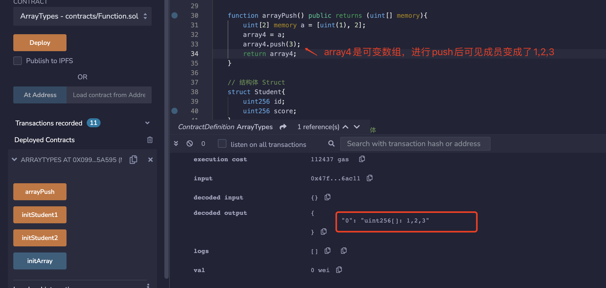

# Solidity极简入门: 5. 引用类型, array, struct

我最近在重新学solidity，巩固一下细节，也写一个“Solidity极简入门”，供小白们使用（编程大佬可以另找教程），每周更新1-3讲。

欢迎关注我的推特：[@0xAA_Science](https://twitter.com/0xAA_Science)

所有代码开源在github(64个star开微信交流群，已开[填表加入](https://docs.google.com/forms/d/e/1FAIpQLSe4KGT8Sh6sJ7hedQRuIYirOoZK_85miz3dw7vA1-YjodgJ-A/viewform)；128个star录教学视频): [github.com/AmazingAng/WTFSolidity](https://github.com/AmazingAng/WTFSolidity)

-----
这一讲，我们将介绍`solidity`中的两个重要变量类型：数组（`array`）和结构体（`struct`）。

## 数组 array
数组（`Array`）是`solidity`常用的一种变量类型，用来存储一组数据（整数，字节，地址等等）。数组分为固定长度数组和可变长度数组两种：

- 固定长度数组：在声明时指定数组的长度。用`T[k]`的格式声明，其中`T`是元素的类型，`k`是长度，例如：
```solidity
    // 固定长度 Array
    uint[8] array1;
    byte[5] array2;
    address[100] array3;
```
- 可变长度数组（动态数组）：在声明时不指定数组的长度。用`T[]`的格式声明，其中`T`是元素的类型，例如（`bytes`比较特殊，是数组，但是不用加`[]`）：
```solidity
    // 可变长度 Array
    uint[] array4;
    byte[] array5;
    address[] array6;
    bytes array7;
```
### 创建数组的规则
在solidity里，创建数组有一些规则：

- 对于`memory`修饰的`动态数组`，可以用`new`操作符来创建，但是必须声明长度，并且声明后长度不能改变。例子：
```solidity
    // memory动态数组
    uint[] memory array8 = new uint[](5);
    bytes memory array9 = new bytes(9);
```
- 数组字面常数是写作表达式形式的数组，并且不会立即赋值给变量，例如`[uint(1),2,3]`（需要声明第一个元素的类型，不然默认用存储空间最小的类型）
- 如果创建的是动态数组，你需要一个一个元素的赋值。
```solidity
    uint[] memory x = new uint[](3);
    x[0] = 1;
    x[1] = 3;
    x[2] = 4;
```
### 数组成员
- `length`: 数组有一个包含元素数量的`length`成员，`memory`数组的长度在创建后是固定的。
- `push()`: `动态数组`和`bytes`拥有`push()`成员，可以在数组最后添加一个`0`元素。
- `push(x)`: `动态数组`和`bytes`拥有`push(x)`成员，可以在数组最后添加一个`x`元素。
- `pop()`: `动态数组`和`bytes`拥有`pop()`成员，可以移除数组最后一个元素。

**Example:**


## 结构体 struct
`Solidity`支持通过构造结构体的形式定义新的类型。创建结构体的方法：
```solidity
    // 结构体
    struct Student{
        uint256 id;
        uint256 score; 
    }
```
```solidity
    Student student; // 初始一个student结构体
```
给结构体赋值的两种方法：
```solidity
    //  给结构体赋值
    // 方法1:在函数中创建一个storage的struct引用
    function initStudent1() external{
        Student storage _student = student; // assign a copy of student
        _student.id = 11;
        _student.score = 100;
    }
```
**Example:**


```solidity
     // 方法2:直接引用状态变量的struct
    function initStudent2() external{
        student.id = 1;
        student.score = 80;
    }
```
**Example:**


## 总结
这一讲，我们介绍了solidity中数组（`array`）和结构体（`struct`）的基本用法。下一讲我们将介绍solidity中的哈希表——映射（`mapping`）。

