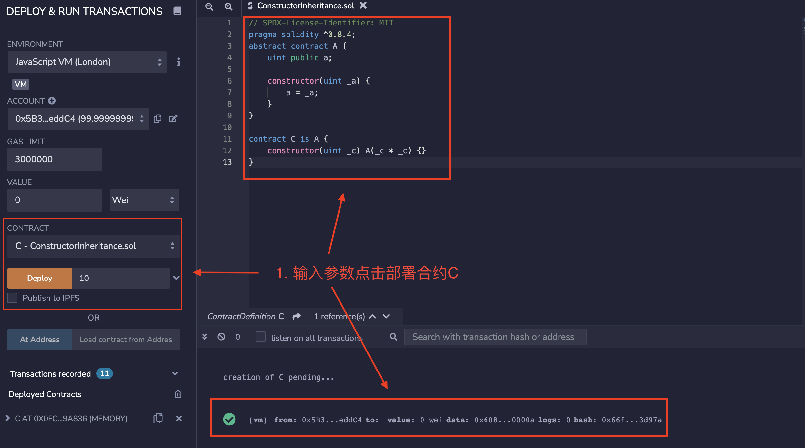
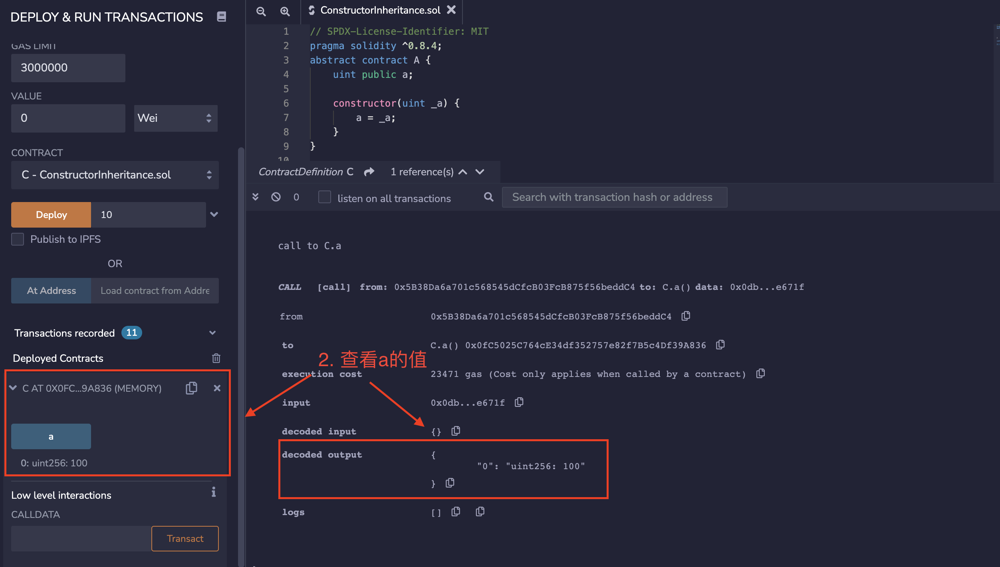
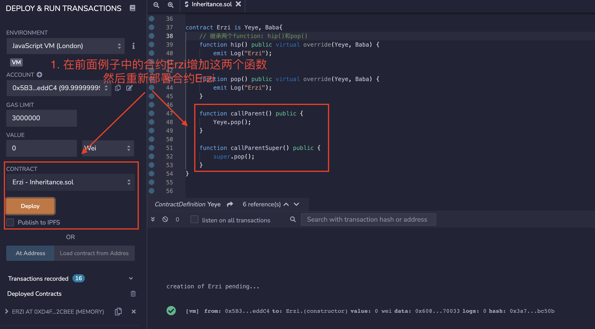

# Solidity极简入门: 10. 继承

我最近在重新学solidity，巩固一下细节，也写一个“Solidity极简入门”，供小白们使用（编程大佬可以另找教程），每周更新1-3讲。

欢迎关注我的推特：[@0xAA_Science](https://twitter.com/0xAA_Science)

所有代码开源在github(64个star开微信交流群，已开[填表加入](https://docs.google.com/forms/d/e/1FAIpQLSe4KGT8Sh6sJ7hedQRuIYirOoZK_85miz3dw7vA1-YjodgJ-A/viewform)；128个star录教学视频): [github.com/AmazingAng/WTFSolidity](https://github.com/AmazingAng/WTFSolidity)

-----
这一讲，我们介绍`solidity`中的继承（`inheritance`），包括简单继承，多重继承，以及修饰器（`modifier`）和构造函数（`constructor`）的继承。

## 继承
继承是面向对象编程很重要的组成部分，可以显著减少重复代码。如果把合约看作是对象的话，`solidity`也是面向对象的编程，也支持继承。

### 规则
- `virtual`: 父合约中的函数，如果希望子合约重写，需要加上`virtual`关键字。

- `override`：子合约重写了父合约中的函数，需要加上`override`关键字。

### 简单继承
我们先写一个简单的爷爷合约`Yeye`，里面包含1个`Log`事件和3个`function`: `hip()`, `pop()`, `yeye()`，输出都是”Yeye”。
```solidity
contract Yeye {
    event Log(string msg);

    // 定义3个function: hip(), pop(), man()，Log值为Yeye。
    function hip() public virtual{
        emit Log("Yeye");
    }

    function pop() public virtual{
        emit Log("Yeye");
    }

    function yeye() public virtual {
        emit Log("Yeye");
    }
}
```
我们再定义一个爸爸合约`Baba`，让他继承`Yeye`合约，语法就是`contract Baba is Yeye`，非常直观。在`Baba`合约里，我们重写一下`hip()`和`pop()`这两个函数，加上`override`关键字，并将他们的输出改为`”Baba”`；并且加一个新的函数`baba`，输出也是`”Baba”`。
```solidity
contract Baba is Yeye{
    // 继承两个function: hip()和pop()，输出改为Baba。
    function hip() public virtual override{
        emit Log("Baba");
    }

    function pop() public virtual override{
        emit Log("Baba");
    }

    function baba() public virtual{
        emit Log("Baba");
    }
}
```
我们部署合约，可以看到`Baba`合约里有4个函数，其中`hip()`和`pop()`的输出被成功改写成`”Baba”`，而继承来的`yeye()`的输出仍然是`”Yeye”`。

### 多重继承
`solidity`的合约可以继承多个合约。规则：

继承时要按辈分最高到最低的顺序排。比如我们写一个`Erzi`合约，继承`Yeye`合约和`Baba`合约，那么就要写成`contract Erzi is Yeye, Baba`，而不能写成`contract Erzi is Baba, Yeye`，不然就会报错。
如果某一个函数在多个继承的合约里都存在，比如例子中的`hip()`和`pop()`，在子合约里必须重写，不然会报错。
重写在多个父合约中重名函数时，`override`关键字后面要加上所有父合约名字，例如`override(Yeye, Baba)`。
例子：
```solidity
contract Erzi is Yeye, Baba{
    // 继承两个function: hip()和pop()，输出值为Erzi。
    function hip() public virtual override(Yeye, Baba){
        emit Log("Erzi");
    }

    function pop() public virtual override(Yeye, Baba) {
        emit Log("Erzi");
    }
```
我们可以看到，`Erzi`合约里面重写了`hip()`和`pop()`两个函数，将输出改为`”Erzi”`，并且还分别从`Yeye`和`Baba`合约继承了`yeye()`和`baba()`两个函数。

### 修饰器的继承
`Solidity`中的修饰器（`Modifier`）同样可以继承，用法与函数继承类似，在相应的地方加`virtual`和`override`关键字即可。
```solidity
contract Base1 {
    modifier exactDividedBy2And3(uint _a) virtual {
        require(_a % 2 == 0 && _a % 3 == 0);
        _;
    }
}

contract Identifier is Base1 {

    //计算一个数分别被2除和被3除的值，但是传入的参数必须是2和3的倍数
    function getExactDividedBy2And3(uint _dividend) public exactDividedBy2And3(_dividend) pure returns(uint, uint) {
        return getExactDividedBy2And3WithoutModifier(_dividend);
    }

    //计算一个数分别被2除和被3除的值
    function getExactDividedBy2And3WithoutModifier(uint _dividend) public pure returns(uint, uint){
        uint div2 = _dividend / 2;
        uint div3 = _dividend / 3;
        return (div2, div3);
    }
}
```
上面的Identifier可以直接在代码中使用exactDividedBy2And3这个修饰器，也可以像下面一样重写修饰器。
```solidity
    modifier exactDividedBy2And3(uint _a) override {
        _;
    }
```

### 构造函数的继承
子合约有两种方法继承父合约的构造函数。举个简单的例子，父合约`A`里面有一个状态变量`a`，并由构造函数的参数来确定：
```solidity
// 构造函数的继承
abstract contract A {
    uint public a;

    constructor(uint _a) {
        a = _a;
    }
}
```
1. 在继承时声明父构造函数的参数，例如：`contract B is A(1)`
2. 在子合约的构造函数中声明构造函数的参数，例如：
```
contract C is A {
    constructor(uint _c) A(_c * _c) {}
}
```
### 调用父合约的函数
子合约有两种方式调用父合约的函数，直接调用和利用`super`关键字。

1. 直接调用：子合约可以直接用`父合约名.函数名()`的方式来调用父合约函数，例如`Yeye.pop()`。
```solidity
    function callParent() public{
        Yeye.pop();
    }
```
2. `super`关键字：子合约可以利用`super.函数名()`来调用最近的父合约函数。`solidity`继承关系按声明时从右到左的顺序是：`contract Erzi is Yeye, Baba`，那么`Baba`是最近的父合约，`super.pop()`将调用`Baba.pop()`而不是`Yeye.pop()`：
```solidity
    function callParentSuper() public{
        // 将调用最近的父合约函数，Baba.pop()
        super.pop();
    }
```
## 在Remix上验证
- 合约简单继承示例, 可以观察到Baba合约多了Yeye的函数
  
  
- 合约多重继承可以参考简单继承的操作步骤来增加部署Erzi合约，然后观察暴露的函数以及尝试调用来查看日志
- 修饰器继承示例
  
  
  
- 构造函数继承示例
  
  
- 调用父合约示例
  
  
## 总结
这一讲，我们介绍了`solidity`继承的基本用法，包括简单继承，多重继承，修饰器和构造函数的继承，以及调用父合约中的函数。

