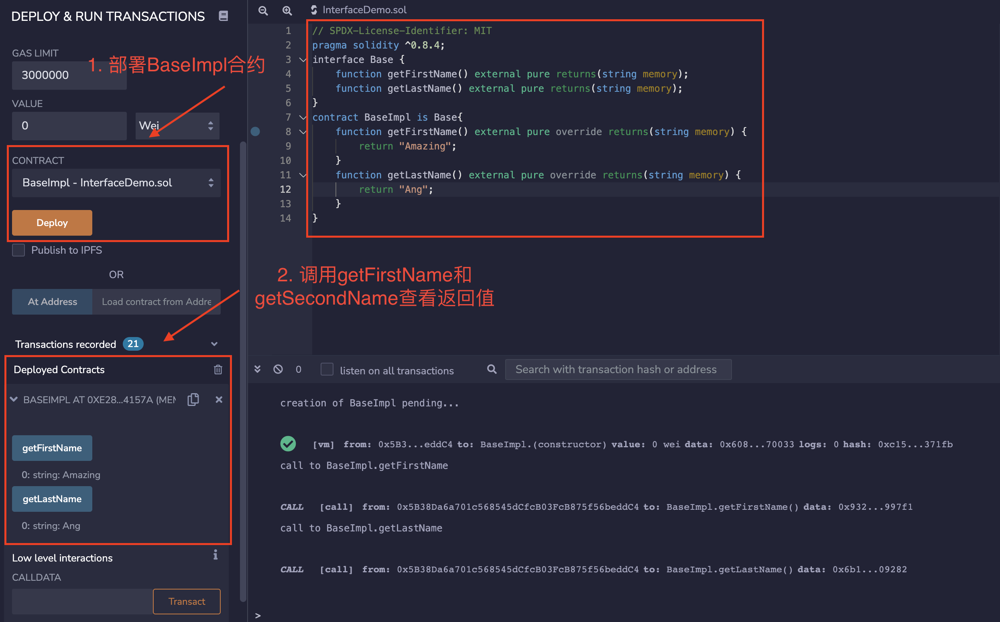

# Solidity极简入门: 11. 抽象合约和接口

我最近在重新学solidity，巩固一下细节，也写一个“Solidity极简入门”，供小白们使用（编程大佬可以另找教程），每周更新1-3讲。

欢迎关注我的推特：[@0xAA_Science](https://twitter.com/0xAA_Science)

所有代码开源在github(64个star开微信交流群，已开[填表加入](https://docs.google.com/forms/d/e/1FAIpQLSe4KGT8Sh6sJ7hedQRuIYirOoZK_85miz3dw7vA1-YjodgJ-A/viewform)；128个star录教学视频): [github.com/AmazingAng/WTFSolidity](https://github.com/AmazingAng/WTFSolidity)

-----

这一讲，我们用`ERC721`的接口合约为例介绍`solidity`中的抽象合约（`abstract`）和接口（`interface`），帮助大家更好的理解`ERC721`标准。

## 抽象合约
如果一个智能合约里至少有一个未实现的函数，即某个函数缺少主体`{}`中的内容，则必须将该合约标为`abstract`，不然编译会报错；另外，未实现的函数需要加`virtual`，以便子合约重写。拿我们之前的[插入排序合约](https://github.com/AmazingAng/WTFSolidity/tree/main/07_InsertionSort)为例，如果我们还没想好具体怎么实现插入排序函数，那么可以把合约标为`abstract`，之后让别人补写上。
```solidity
abstract contract InsertionSort{
    function insertionSort(uint[] memory a) public pure virtual returns(uint[] memory);
}
```
## 接口
接口也是一种合约，跟抽象合约类似，都是为了设立标准和减少代码冗余，但是接口的要求更加严格：

1. 不能包含状态变量
2. 不能包含构造函数
3. 不能继承除接口外的其他合约
4. 所有函数都必须是external（接口与合约的`ABI`等价）

我们看一个`ERC721`接口的例子，所有NFT都使用了这个接口：
```solidity
interface IERC721 is IERC165 {
    event Transfer(address indexed from, address indexed to, uint256 indexed tokenId);
    event Approval(address indexed owner, address indexed approved, uint256 indexed tokenId);
    event ApprovalForAll(address indexed owner, address indexed operator, bool approved);
    
    function balanceOf(address owner) external view returns (uint256 balance);

    function ownerOf(uint256 tokenId) external view returns (address owner);

    function safeTransferFrom(address from, address to, uint256 tokenId) external;

    function transferFrom(address from, address to, uint256 tokenId) external;

    function approve(address to, uint256 tokenId) external;

    function getApproved(uint256 tokenId) external view returns (address operator);

    function setApprovalForAll(address operator, bool _approved) external;

    function isApprovedForAll(address owner, address operator) external view returns (bool);

    function safeTransferFrom( address from, address to, uint256 tokenId, bytes calldata data) external;
}
```
这个接口里面共定义了3个`event`和9个`function`，为所有`ERC721`函数设立了标准：所有`ERC721`合约都要实现这些`function`。

### `ERC721`接口的`Event`
接口中事件的定义和正常合约里一样。`ERC721`接口里面的`event`包括：

1. `Transfer`（转账事件）：记录`发起地址`，`接收地址`，和`tokenId`
2. `Approve`（批准事件）：记录`持有地址`，`批准地址`，和`tokenId`
3. `ApproveForAll`（批量批准事件）：记录`持有地址`，`批准地址`，和一个代表批准与否的`bool`值。可以看到，接口中的事件和正常合约里的事件一样。

### `ERC721`接口的`Function`
接口中所有`function`都必须带有`external`标签（不需要写`virtual`标签，因为默认为`virtual`）。`ERC721`接口里面的`function`包括：

1. `balanceOf`：查询某个地址的`NFT`持有量
2. `ownerOf`：查询某个`tokenId`的持有人
3. `safeTransferFrom`：安全转账（如果接收方是合约地址，会要求实现`ERC721`的接收接口）。
4. `transferFrom`：普通转账
5. `approve`：批准另一个地址使用你的`NFT`
6. `getApproved`：查询`NFT`被批准给了哪个地址
7. `setApprovalForAll`：将全部`NFT`批量批准给某个地址
8. `isApprovedForAll`：查询全部`NFT`是否批准给了某个地址
9. `safeTransferFrom`：安全转账，与`3.`不同的地方在于参数里面包含了`data`
## 什么时候使用抽象合约和接口？
1. 写大工程的时候打草稿用
2. 大神写标准的时候
## 在Remix上验证
- 抽象合约示例（简单的演示代码如图所示）
  
- 接口示例（简单的演示代码如图所示）
  
## 总结
这一讲，我介绍了`solidity`中的抽象合约（`abstract`）和接口（`interface`），他们都可以写模版并且减少代码冗余。我们还讲了`ERC721`接口合约，以后会更详细的讲一下`ERC721`代币标准。

