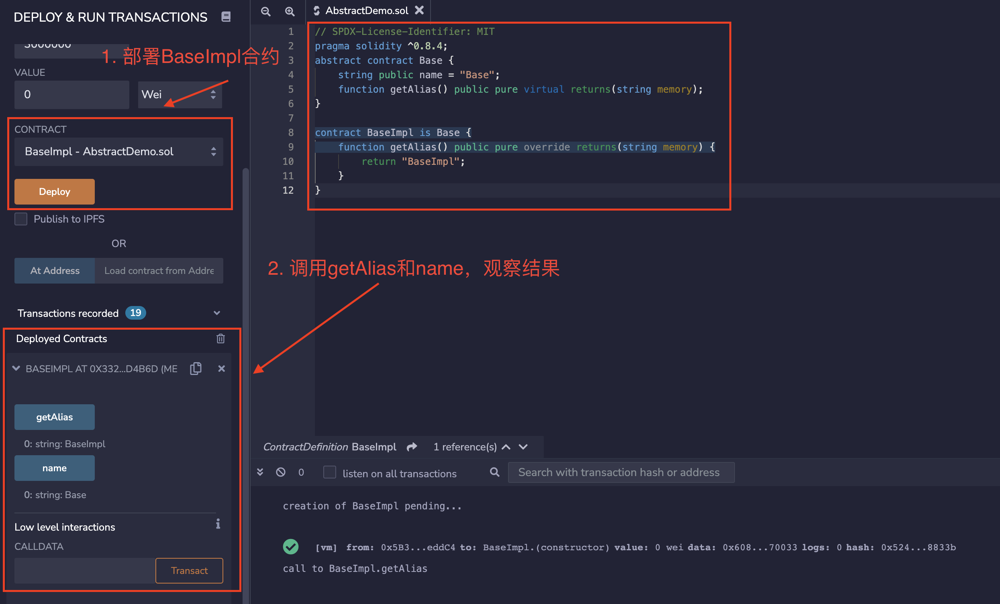
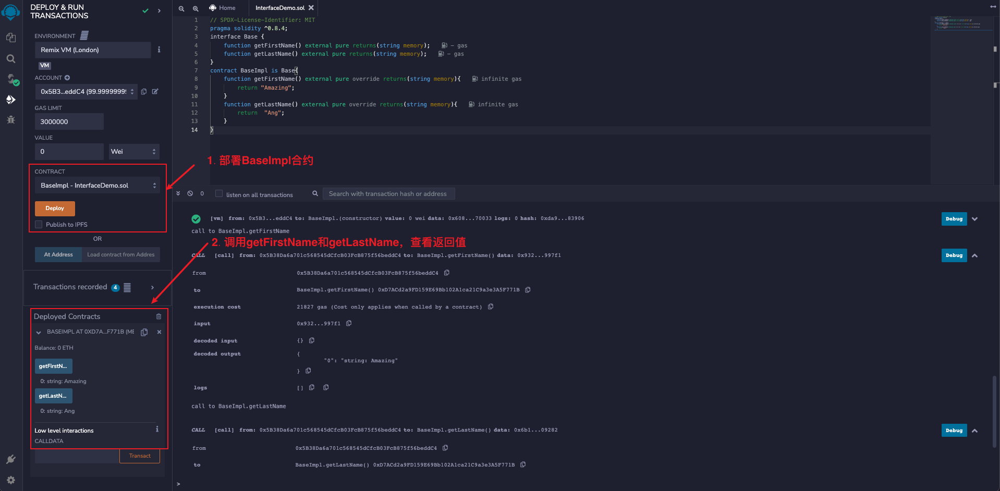

# WTF Solidity极简入门: 14. 抽象合约和接口

我最近在重新学solidity，巩固一下细节，也写一个“WTF Solidity极简入门”，供小白们使用（编程大佬可以另找教程），每周更新1-3讲。

推特：[@0xAA_Science](https://twitter.com/0xAA_Science)

社区：[Discord](https://discord.gg/5akcruXrsk)｜[微信群](https://docs.google.com/forms/d/e/1FAIpQLSe4KGT8Sh6sJ7hedQRuIYirOoZK_85miz3dw7vA1-YjodgJ-A/viewform?usp=sf_link)｜[官网 wtf.academy](https://wtf.academy)

所有代码和教程开源在github: [github.com/AmazingAng/WTFSolidity](https://github.com/AmazingAng/WTFSolidity)

-----

这一讲，我们用`ERC721`的接口合约为例介绍`solidity`中的抽象合约（`abstract`）和接口（`interface`），帮助大家更好的理解`ERC721`标准。

## 抽象合约
如果一个智能合约里至少有一个未实现的函数，即某个函数缺少主体`{}`中的内容，则必须将该合约标为`abstract`，不然编译会报错；另外，未实现的函数需要加`virtual`，以便子合约重写。拿我们之前的[插入排序合约](https://github.com/AmazingAng/WTFSolidity/tree/main/07_InsertionSort)为例，如果我们还没想好具体怎么实现插入排序函数，那么可以把合约标为`abstract`，之后让别人补写上。
```solidity
abstract contract InsertionSort{
    function insertionSort(uint[] memory a) public pure virtual returns(uint[] memory);
}
```
## 接口

接口类似于抽象合约，但它不实现任何功能。接口的规则：

1. 不能包含状态变量
2. 不能包含构造函数
3. 不能继承除接口外的其他合约
4. 所有函数都必须是external且不能有函数体
5. 继承接口的合约必须实现接口定义的所有功能

虽然接口不实现任何功能，但它非常重要。接口是智能合约的骨架，定义了合约的功能以及如何触发它们：如果智能合约实现了某种接口（比如`ERC20`或`ERC721`），其他Dapps和智能合约就知道如何与它交互。因为接口提供了两个重要的信息：

1. 合约里每个函数的`bytes4`选择器，以及函数签名`函数名(每个参数类型）`。

2. 接口id（更多信息见[EIP165](https://eips.ethereum.org/EIPS/eip-165)）

另外，接口与合约`ABI`（Application Binary Interface）等价，可以相互转换：编译接口可以得到合约的`ABI`，利用[abi-to-sol工具](https://gnidan.github.io/abi-to-sol/)也可以将`ABI json`文件转换为`接口sol`文件。

我们以`ERC721`接口合约`IERC721`为例，它定义了3个`event`和9个`function`，所有`ERC721`标准的NFT都实现了这些函数。我们可以看到，接口和常规合约的区别在于每个函数都以`;`代替函数体`{ }`结尾。

```solidity
interface IERC721 is IERC165 {
    event Transfer(address indexed from, address indexed to, uint256 indexed tokenId);
    event Approval(address indexed owner, address indexed approved, uint256 indexed tokenId);
    event ApprovalForAll(address indexed owner, address indexed operator, bool approved);
    
    function balanceOf(address owner) external view returns (uint256 balance);

    function ownerOf(uint256 tokenId) external view returns (address owner);

    function safeTransferFrom(address from, address to, uint256 tokenId) external;

    function transferFrom(address from, address to, uint256 tokenId) external;

    function approve(address to, uint256 tokenId) external;

    function getApproved(uint256 tokenId) external view returns (address operator);

    function setApprovalForAll(address operator, bool _approved) external;

    function isApprovedForAll(address owner, address operator) external view returns (bool);

    function safeTransferFrom( address from, address to, uint256 tokenId, bytes calldata data) external;
}
```

### IERC721事件
`IERC721`包含3个事件，其中`Transfer`和`Approval`事件在`ERC20`中也有。
- `Transfer`事件：在转账时被释放，记录代币的发出地址`from`，接收地址`to`和`tokenid`。
- `Approval`事件：在授权时释放，记录授权地址`owner`，被授权地址`approved`和`tokenid`。
- `ApprovalForAll`事件：在批量授权时释放，记录批量授权的发出地址`owner`，被授权地址`operator`和授权与否的`approved`。

### IERC721函数
- `balanceOf`：返回某地址的NFT持有量`balance`。
- `ownerOf`：返回某`tokenId`的主人`owner`。
- `transferFrom`：普通转账，参数为转出地址`from`，接收地址`to`和`tokenId`。
- `safeTransferFrom`：安全转账（如果接收方是合约地址，会要求实现`ERC721Receiver`接口）。参数为转出地址`from`，接收地址`to`和`tokenId`。
- `approve`：授权另一个地址使用你的NFT。参数为被授权地址`approve`和`tokenId`。
- `getApproved`：查询`tokenId`被批准给了哪个地址。
- `setApprovalForAll`：将自己持有的该系列NFT批量授权给某个地址`operator`。
- `isApprovedForAll`：查询某地址的NFT是否批量授权给了另一个`operator`地址。
- `safeTransferFrom`：安全转账的重载函数，参数里面包含了`data`。


### 什么时候使用接口？
如果我们知道一个合约实现了`IERC721`接口，我们不需要知道它具体代码实现，就可以与它交互。

无聊猿`BAYC`属于`ERC721`代币，实现了`IERC721`接口的功能。我们不需要知道它的源代码，只需知道它的合约地址，用`IERC721`接口就可以与它交互，比如用`balanceOf()`来查询某个地址的`BAYC`余额，用`safeTransferFrom()`来转账`BAYC`。

```solidity
contract interactBAYC {
    // 利用BAYC地址创建接口合约变量（ETH主网）
    IERC721 BAYC = IERC721(0xBC4CA0EdA7647A8aB7C2061c2E118A18a936f13D);

    // 通过接口调用BAYC的balanceOf()查询持仓量
    function balanceOfBAYC(address owner) external view returns (uint256 balance){
        return BAYC.balanceOf(owner);
    }

    // 通过接口调用BAYC的safeTransferFrom()安全转账
    function safeTransferFromBAYC(address from, address to, uint256 tokenId) external{
        BAYC.safeTransferFrom(from, to, tokenId);
    }
}
```

## 在Remix上验证
- 抽象合约示例（简单的演示代码如图所示）
  
- 接口示例（简单的演示代码如图所示）
  

## 总结
这一讲，我介绍了`solidity`中的抽象合约（`abstract`）和接口（`interface`），他们都可以写模版并且减少代码冗余。我们还讲了`ERC721`接口合约`IERC721`，以及如何利用它与无聊猿`BAYC`合约进行交互。

