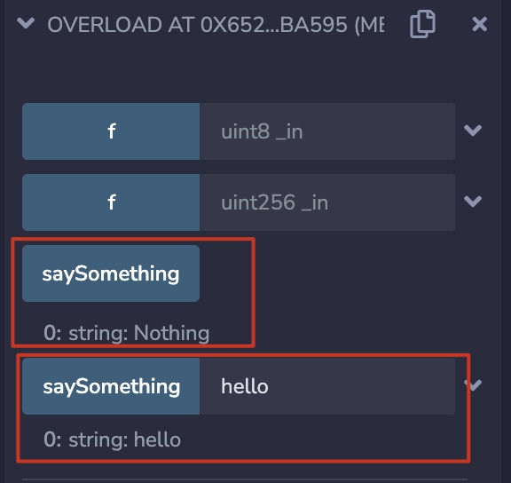

# WTF Solidity极简入门: 16. 函数重载

我最近在重新学 Solidity，巩固一下细节，也写一个“WTF Solidity极简入门”，供小白们使用（编程大佬可以另找教程），每周更新 1-3 讲。

推特：[@0xAA_Science](https://twitter.com/0xAA_Science)｜[@WTFAcademy_](https://twitter.com/WTFAcademy_)

社区：[Discord](https://discord.gg/5akcruXrsk)｜[微信群](https://docs.google.com/forms/d/e/1FAIpQLSe4KGT8Sh6sJ7hedQRuIYirOoZK_85miz3dw7vA1-YjodgJ-A/viewform?usp=sf_link)｜[官网 wtf.academy](https://wtf.academy)

所有代码和教程开源在 github: [github.com/AmazingAng/WTFSolidity](https://github.com/AmazingAng/WTFSolidity)

---

## 重载

`Solidity`中允许函数进行重载（`overloading`），即名字相同但输入参数类型不同的函数可以同时存在，他们被视为不同的函数。注意，`Solidity`不允许修饰器（`modifier`）重载。

### 函数重载

举个例子，我们可以定义两个都叫`saySomething()`的函数，一个没有任何参数，输出`"Nothing"`；另一个接收一个`string`参数，输出这个`string`。

```solidity
function saySomething() public pure returns(string memory){
    return("Nothing");
}

function saySomething(string memory something) public pure returns(string memory){
    return(something);
}
```

最终重载函数在经过编译器编译后，由于不同的参数类型，都变成了不同的函数选择器（selector）。关于函数选择器的具体内容可参考[WTF Solidity极简入门: 29. 函数选择器Selector](https://github.com/AmazingAng/WTFSolidity/tree/main/29_Selector)。

以 `Overloading.sol` 合约为例，在 Remix 上编译部署后，分别调用重载函数 `saySomething()` 和 `saySomething(string memory something)`，可以看到他们返回了不同的结果，被区分为不同的函数。



### 实参匹配（Argument Matching）

在调用重载函数时，会把输入的实际参数和函数参数的变量类型做匹配。
如果出现多个匹配的重载函数，则会报错。下面这个例子有两个叫`f()`的函数，一个参数为`uint8`，另一个为`uint256`：

```solidity
function f(uint8 _in) public pure returns (uint8 out) {
    out = _in;
}

function f(uint256 _in) public pure returns (uint256 out) {
    out = _in;
}
```

我们调用`f(50)`，因为`50`既可以被转换为`uint8`，也可以被转换为`uint256`，因此会报错。

## 总结

这一讲，我们介绍了`Solidity`中函数重载的基本用法：名字相同但输入参数类型不同的函数可以同时存在，他们被视为不同的函数。
