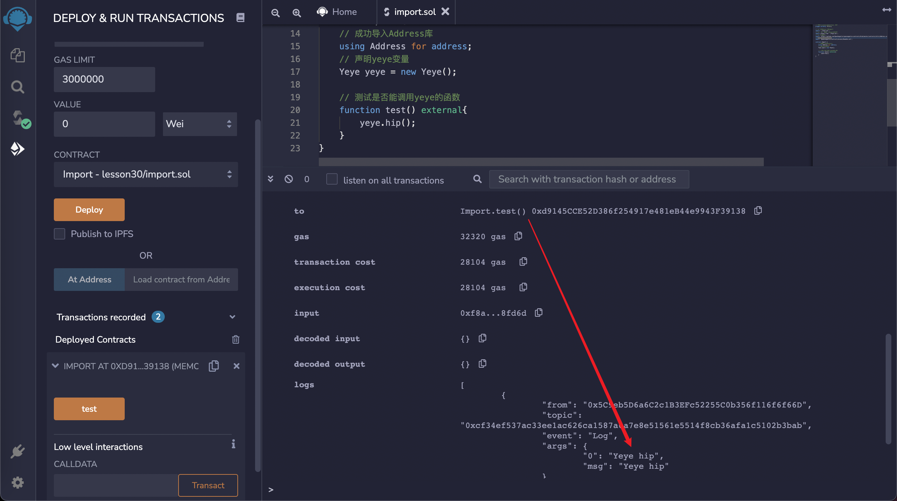

# WTF Solidity极简入门: 18. Import

我最近在重新学 Solidity，巩固一下细节，也写一个“WTF Solidity极简入门”，供小白们使用（编程大佬可以另找教程），每周更新 1-3 讲。

推特：[@0xAA_Science](https://twitter.com/0xAA_Science)｜[@WTFAcademy_](https://twitter.com/WTFAcademy_)

社区：[Discord](https://discord.gg/5akcruXrsk)｜[微信群](https://docs.google.com/forms/d/e/1FAIpQLSe4KGT8Sh6sJ7hedQRuIYirOoZK_85miz3dw7vA1-YjodgJ-A/viewform?usp=sf_link)｜[官网 wtf.academy](https://wtf.academy)

所有代码和教程开源在 github: [github.com/AmazingAng/WTFSolidity](https://github.com/AmazingAng/WTFSolidity)

---

在Solidity中，`import`语句可以帮助我们在一个文件中引用另一个文件的内容，提高代码的可重用性和组织性。本教程将向你介绍如何在Solidity中使用`import`语句。

## `import`用法

- 通过源文件相对位置导入，例子：

  ```text
  文件结构
  ├── Import.sol
  └── Yeye.sol

  // 通过文件相对位置import
  import './Yeye.sol';
  ```

- 通过源文件网址导入网上的合约的全局符号，例子：

  ```text
  // 通过网址引用
  import 'https://github.com/OpenZeppelin/openzeppelin-contracts/blob/master/contracts/utils/Address.sol';
  ```

- 通过`npm`的目录导入，例子：

  ```solidity
  import '@openzeppelin/contracts/access/Ownable.sol';
  ```

- 通过指定`全局符号`导入合约特定的全局符号，例子：

  ```solidity
  import {Yeye} from './Yeye.sol';
  ```

- 引用(`import`)在代码中的位置为：在声明版本号之后，在其余代码之前。

## 测试导入结果

我们可以用下面这段代码测试是否成功导入了外部源代码：

```solidity
// SPDX-License-Identifier: MIT
pragma solidity ^0.8.21;

// 通过文件相对位置import
import './Yeye.sol';
// 通过`全局符号`导入特定的合约
import {Yeye} from './Yeye.sol';
// 通过网址引用
import 'https://github.com/OpenZeppelin/openzeppelin-contracts/blob/master/contracts/utils/Address.sol';
// 引用OpenZeppelin合约
import '@openzeppelin/contracts/access/Ownable.sol';

contract Import {
    // 成功导入Address库
    using Address for address;
    // 声明yeye变量
    Yeye yeye = new Yeye();

    // 测试是否能调用yeye的函数
    function test() external{
        yeye.hip();
    }
}
```



## 总结

这一讲，我们介绍了利用`import`关键字导入外部源代码的方法。通过`import`关键字，可以引用我们写的其他文件中的合约或者函数，也可以直接导入别人写好的代码，非常方便。
