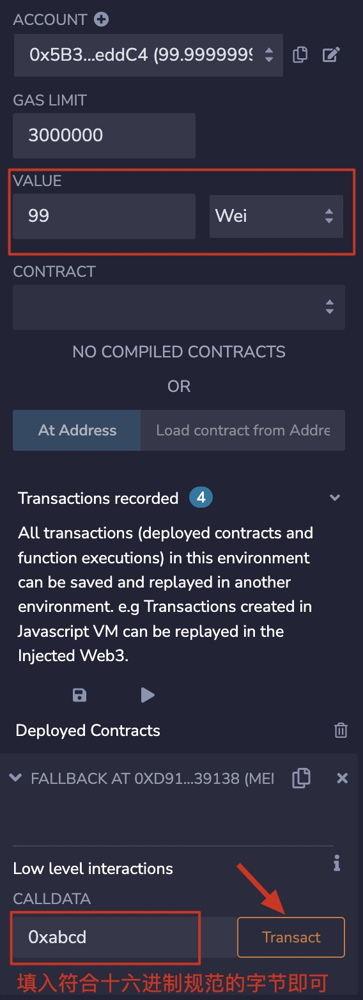
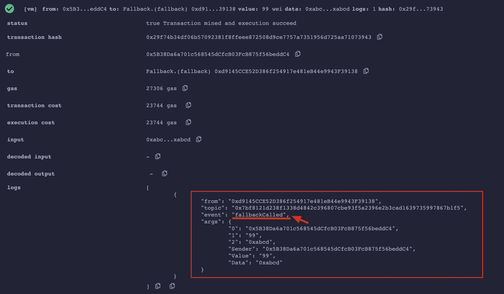

# WTF Solidity极简入门: 19. 接收ETH receive和fallback

我最近在重新学Solidity，巩固一下细节，也写一个“WTF Solidity极简入门”，供小白们使用（编程大佬可以另找教程），每周更新1-3讲。

推特：[@0xAA_Science](https://twitter.com/0xAA_Science)

社区：[Discord](https://discord.gg/5akcruXrsk)｜[微信群](https://docs.google.com/forms/d/e/1FAIpQLSe4KGT8Sh6sJ7hedQRuIYirOoZK_85miz3dw7vA1-YjodgJ-A/viewform?usp=sf_link)｜[官网 wtf.academy](https://wtf.academy)

所有代码和教程开源在github: [github.com/AmazingAng/WTFSolidity](https://github.com/AmazingAng/WTFSolidity)

-----

`Solidity`支持两种特殊的回调函数，`receive()`和`fallback()`，他们主要在两种情况下被使用：

1. 接收ETH
2. 处理合约中不存在的函数调用（代理合约proxy contract）

注意⚠️：在Solidity 0.6.x版本之前，语法上只有 `fallback()` 函数，用来接收用户发送的ETH时调用以及在被调用函数签名没有匹配到时，来调用。
0.6版本之后，Solidity才将 `fallback()` 函数拆分成 `receive()` 和 `fallback()` 两个函数。

我们这一讲主要讲接收ETH的情况。

## 接收ETH函数 receive

`receive()`函数是在合约收到`ETH`转账时被调用的函数。一个合约最多有一个`receive()`函数，声明方式与一般函数不一样，不需要`function`关键字：`receive() external payable { ... }`。`receive()`函数不能有任何的参数，不能返回任何值，必须包含`external`和`payable`。

当合约接收ETH的时候，`receive()`会被触发。`receive()`最好不要执行太多的逻辑因为如果别人用`send`和`transfer`方法发送`ETH`的话，`gas`会限制在`2300`，`receive()`太复杂可能会触发`Out of Gas`报错；如果用`call`就可以自定义`gas`执行更复杂的逻辑（这三种发送ETH的方法我们之后会讲到）。

我们可以在`receive()`里发送一个`event`，例如：

```solidity
// 定义事件
event Received(address Sender, uint Value);
// 接收ETH时释放Received事件
receive() external payable {
    emit Received(msg.sender, msg.value);
}
```

有些恶意合约，会在`receive()` 函数（老版本的话，就是 `fallback()` 函数）嵌入恶意消耗`gas`的内容或者使得执行故意失败的代码，导致一些包含退款和转账逻辑的合约不能正常工作，因此写包含退款等逻辑的合约时候，一定要注意这种情况。

## 回退函数 fallback

`fallback()`函数会在调用合约不存在的函数时被触发。可用于接收ETH，也可以用于代理合约`proxy contract`。`fallback()`声明时不需要`function`关键字，必须由`external`修饰，一般也会用`payable`修饰，用于接收ETH:`fallback() external payable { ... }`。

我们定义一个`fallback()`函数，被触发时候会释放`fallbackCalled`事件，并输出`msg.sender`，`msg.value`和`msg.data`:

```solidity
event fallbackCalled(address Sender, uint Value, bytes Data);

// fallback
fallback() external payable{
    emit fallbackCalled(msg.sender, msg.value, msg.data);
}
```

## receive和fallback的区别

`receive`和`fallback`都能够用于接收`ETH`，他们触发的规则如下：

```text
触发fallback() 还是 receive()?
           接收ETH
              |
         msg.data是空？
            /  \
          是    否
          /      \
receive()存在?   fallback()
        / \
       是  否
      /     \
receive()   fallback()
```

简单来说，合约接收`ETH`时，`msg.data`为空且存在`receive()`时，会触发`receive()`；`msg.data`不为空或不存在`receive()`时，会触发`fallback()`，此时`fallback()`必须为`payable`。

`receive()`和`payable fallback()`均不存在的时候，向合约**直接**发送`ETH`将会报错（你仍可以通过带有`payable`的函数向合约发送`ETH`）。

## Remix 演示

1. 首先在 Remix 上部署合约 "Fallback.sol"。
2. "VALUE" 栏中填入要发送给合约的金额（单位是 Wei），然后点击 "Transact"。

    
3. 可以看到交易成功，并且触发了 "receivedCalled" 事件。

    
4. "VALUE" 栏中填入要发送给合约的金额（单位是 Wei），"CALLDATA" 栏中填入随意编写的`msg.data`，然后点击 "Transact"。

    
5. 可以看到交易成功，并且触发了 "fallbackCalled" 事件。

    

## 总结

这一讲，我介绍了`Solidity`中的两种特殊函数，`receive()`和`fallback()`，他们主要在两种情况下被使用，他们主要用于处理接收`ETH`和代理合约`proxy contract`。
