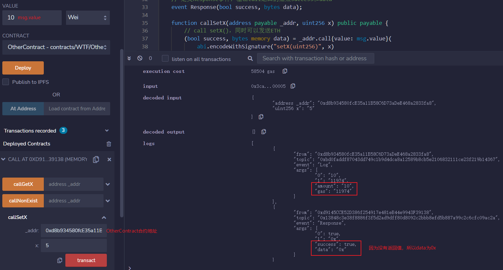

# WTF Solidity极简入门: 22. Call

我最近在重新学Solidity，巩固一下细节，也写一个“WTF Solidity极简入门”，供小白们使用（编程大佬可以另找教程），每周更新1-3讲。

推特：[@0xAA_Science](https://twitter.com/0xAA_Science)

社区：[Discord](https://discord.gg/5akcruXrsk)｜[微信群](https://docs.google.com/forms/d/e/1FAIpQLSe4KGT8Sh6sJ7hedQRuIYirOoZK_85miz3dw7vA1-YjodgJ-A/viewform?usp=sf_link)｜[官网 wtf.academy](https://wtf.academy)

所有代码和教程开源在github: [github.com/AmazingAng/WTFSolidity](https://github.com/AmazingAng/WTFSolidity)

-----

我们曾在[第20讲：发送ETH](https://github.com/AmazingAng/WTFSolidity/tree/main/20_SendETH)那一讲介绍过利用`call`来发送`ETH`，这一讲我们将介绍如何利用它调用合约。

## Call

`call` 是`address`类型的低级成员函数，它用来与其他合约交互。它的返回值为`(bool, bytes memory)`，分别对应`call`是否成功以及目标函数的返回值。

- `call`是`Solidity`官方推荐的通过触发`fallback`或`receive`函数发送`ETH`的方法。
- 不推荐用`call`来调用另一个合约，因为当你调用不安全合约的函数时，你就把主动权交给了它。推荐的方法仍是声明合约变量后调用函数，见[第21讲：调用其他合约](https://github.com/AmazingAng/WTFSolidity/tree/main/21_CallContract)
- 当我们不知道对方合约的源代码或`ABI`，就没法生成合约变量；这时，我们仍可以通过`call`调用对方合约的函数。

### `call`的使用规则

`call`的使用规则如下：

```text
目标合约地址.call(字节码);
```

其中`字节码`利用结构化编码函数`abi.encodeWithSignature`获得：

```text
abi.encodeWithSignature("函数签名", 逗号分隔的具体参数)
```

`函数签名`为`"函数名（逗号分隔的参数类型）"`。例如`abi.encodeWithSignature("f(uint256,address)", _x, _addr)`。

另外`call`在调用合约时可以指定交易发送的`ETH`数额和`gas`数额：

```text
目标合约地址.call{value:发送数额, gas:gas数额}(字节码);
```

看起来有点复杂，下面我们举个`call`应用的例子。

### 目标合约

我们先写一个简单的目标合约`OtherContract`并部署，代码与第21讲中基本相同，只是多了`fallback`函数。

```solidity
contract OtherContract {
    uint256 private _x = 0; // 状态变量x
    // 收到eth的事件，记录amount和gas
    event Log(uint amount, uint gas);
    
    fallback() external payable{}

    // 返回合约ETH余额
    function getBalance() view public returns(uint) {
        return address(this).balance;
    }

    // 可以调整状态变量_x的函数，并且可以往合约转ETH (payable)
    function setX(uint256 x) external payable{
        _x = x;
        // 如果转入ETH，则释放Log事件
        if(msg.value > 0){
            emit Log(msg.value, gasleft());
        }
    }

    // 读取x
    function getX() external view returns(uint x){
        x = _x;
    }
}
```

这个合约包含一个状态变量`x`，一个在收到`ETH`时触发的事件`Log`，三个函数：

- `getBalance()`: 返回合约`ETH`余额。
- `setX()`: `external payable`函数，可以设置`x`的值，并向合约发送`ETH`。
- `getX()`: 读取`x`的值。

### 利用`call`调用目标合约

#### 1. Response事件

我们写一个`Call`合约来调用目标合约函数。首先定义一个`Response`事件，输出`call`返回的`success`和`data`，方便我们观察返回值。

```solidity
// 定义Response事件，输出call返回的结果success和data
event Response(bool success, bytes data);
```

#### 2. 调用setX函数

我们定义`callSetX`函数来调用目标合约的`setX()`，转入`msg.value`数额的`ETH`，并释放`Response`事件输出`success`和`data`：

```solidity
function callSetX(address payable _addr, uint256 x) public payable {
    // call setX()，同时可以发送ETH
    (bool success, bytes memory data) = _addr.call{value: msg.value}(
        abi.encodeWithSignature("setX(uint256)", x)
    );

    emit Response(success, data); //释放事件
}
```

接下来我们调用`callSetX`把状态变量`_x`改为5，参数为`OtherContract`地址和`5`，由于目标函数`setX()`没有返回值，因此`Response`事件输出的`data`为`0x`，也就是空。



#### 3. 调用getX函数

下面我们调用`getX()`函数，它将返回目标合约`_x`的值，类型为`uint256`。我们可以利用`abi.decode`来解码`call`的返回值`data`，并读出数值。

```solidity
function callGetX(address _addr) external returns(uint256){
    // call getX()
    (bool success, bytes memory data) = _addr.call(
        abi.encodeWithSignature("getX()")
    );

    emit Response(success, data); //释放事件
    return abi.decode(data, (uint256));
}
```

从`Response`事件的输出，我们可以看到`data`为`0x0000000000000000000000000000000000000000000000000000000000000005`。而经过`abi.decode`，最终返回值为`5`。


#### 4. 调用不存在的函数

如果我们给`call`输入的函数不存在于目标合约，那么目标合约的`fallback`函数会被触发。

```solidity
function callNonExist(address _addr) external{
    // call 不存在的函数
    (bool success, bytes memory data) = _addr.call(
        abi.encodeWithSignature("foo(uint256)")
    );

    emit Response(success, data); //释放事件
}
```

上面例子中，我们`call`了不存在的`foo`函数。`call`仍能执行成功，并返回`success`，但其实调用的目标合约`fallback`函数。


## 总结

这一讲，我们介绍了如何用`call`这一低级函数来调用其他合约。`call`不是调用合约的推荐方法，因为不安全。但他能让我们在不知道源代码和`ABI`的情况下调用目标合约，很有用。
