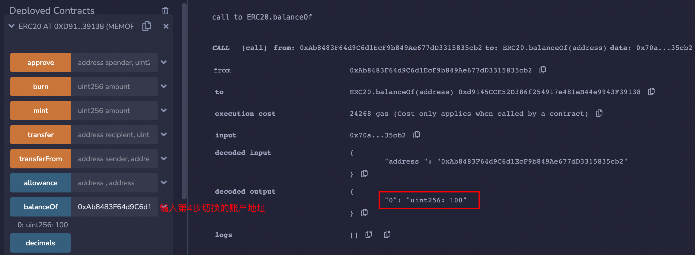

# WTF Solidity极简入门: 32. 代币水龙头

我最近在重新学Solidity，巩固一下细节，也写一个“WTF Solidity极简入门”，供小白们使用（编程大佬可以另找教程），每周更新1-3讲。

推特：[@0xAA_Science](https://twitter.com/0xAA_Science)

社区：[Discord](https://discord.gg/5akcruXrsk)｜[微信群](https://docs.google.com/forms/d/e/1FAIpQLSe4KGT8Sh6sJ7hedQRuIYirOoZK_85miz3dw7vA1-YjodgJ-A/viewform?usp=sf_link)｜[官网 wtf.academy](https://wtf.academy)

所有代码和教程开源在github: [github.com/AmazingAng/WTFSolidity](https://github.com/AmazingAng/WTFSolidity)

-----

我们在第31讲学习了`ERC20`代币标准。这一讲，我们将学习`ERC20`水龙头的智能合约。在这个合约中，用户可以领到免费的`ERC20`代币。

## 代币水龙头

当人渴的时候，就要去水龙头接水；当人想要免费代币的时候，就要去代币水龙头领。代币水龙头就是让用户免费领代币的网站/应用。

最早的代币水龙头是比特币（BTC）水龙头：现在BTC一枚要\$30,000，但是在2010年，BTC的价格只有不到\$0.1，并且持有人很少。为了扩大影响力，比特币社区的Gavin Andresen开发了BTC水龙头，让别人可以免费领BTC。撸羊毛大家都喜欢，当时就有很多人去撸，一部分变为了BTC的信徒。BTC水龙头一共送出了超过19,700枚BTC，现在价值约6亿美元！

## ERC20水龙头合约

这里，我们实现一个简版的`ERC20`水龙头，逻辑非常简单：我们将一些`ERC20`代币转到水龙头合约里，用户可以通过合约的`requestToken()`函数来领取`100`单位的代币，每个地址只能领一次。

### 状态变量

我们在水龙头合约中定义3个状态变量

- `amountAllowed`设定每次能领取代币数量（默认为`100`，不是一百枚，因为代币有小数位数）。
- `tokenContract`记录发放的`ERC20`代币合约地址。
- `requestedAddress`记录领取过代币的地址。

```solidity
uint256 public amountAllowed = 100; // 每次领 100 单位代币
address public tokenContract;   // token合约地址
mapping(address => bool) public requestedAddress;   // 记录领取过代币的地址
```

### 事件

水龙头合约中定义了1个`SendToken`事件，记录了每次领取代币的地址和数量，在`requestTokens()`函数被调用时释放。

```solidity
// SendToken事件    
event SendToken(address indexed Receiver, uint256 indexed Amount); 
```

### 函数

合约中只有两个函数：

- 构造函数：初始化`tokenContract`状态变量，确定发放的`ERC20`代币地址。

    ```solidity
    // 部署时设定ERC20代币合约
    constructor(address _tokenContract) {
	    tokenContract = _tokenContract; // set token contract
    }
    ```

- `requestTokens()`函数，用户调用它可以领取`ERC20`代币。

    ```solidity
    // 用户领取代币函数
    function requestTokens() external {
        require(!requestedAddress[msg.sender], "Can't Request Multiple Times!"); // 每个地址只能领一次
        IERC20 token = IERC20(tokenContract); // 创建IERC20合约对象
        require(token.balanceOf(address(this)) >= amountAllowed, "Faucet Empty!"); // 水龙头空了

        token.transfer(msg.sender, amountAllowed); // 发送token
        requestedAddress[msg.sender] = true; // 记录领取地址 
        
        emit SendToken(msg.sender, amountAllowed); // 释放SendToken事件
    }
    ```

## Remix演示

1. 首先，部署`ERC20`代币合约，名称和符号为`WTF`，并给自己`mint` 10000 单位代币。
    

2. 部署`Faucet`水龙头合约，初始化的参数填上面`ERC20`代币的合约地址。
    

3. 利用`ERC20`代币合约的`transfer()`函数，将 10000 单位代币转账到`Faucet`合约地址。
    

4. 换一个新账户，调用`Faucet`合约`requestTokens()`函数，领取代币。可以在终端看到`SendToken`事件被释放。
    

    

5. 在`ERC20`代币合约上利用`balanceOf`查询领取水龙头的账户余额，可以看到余额变为`100`，领取成功！
    

## 总结

这一讲，我们介绍了代币水龙头的历史和`ERC20`水龙头合约。大家觉得下一个`BTC`水龙头会在哪里？