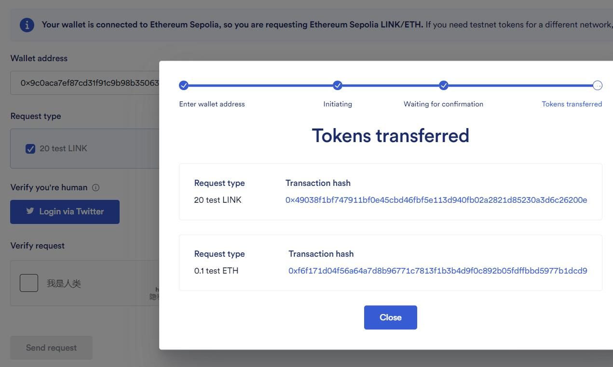
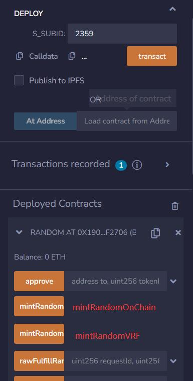
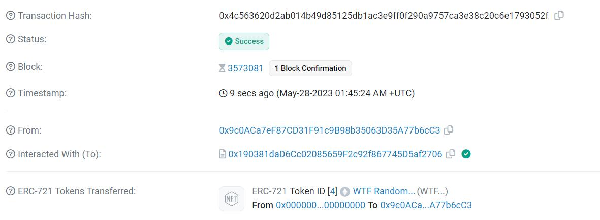
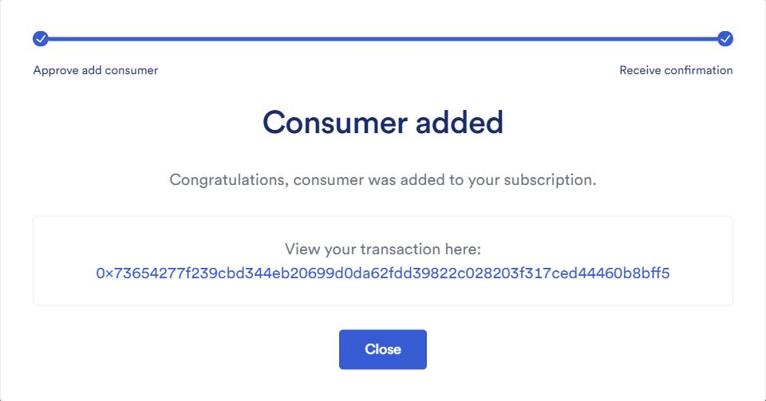
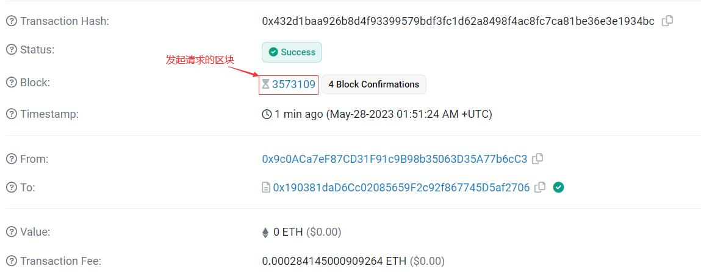

# WTF Solidity极简入门: 39. 链上随机数

我最近在重新学 Solidity，巩固一下细节，也写一个“WTF Solidity极简入门”，供小白们使用（编程大佬可以另找教程），每周更新 1-3 讲。

推特：[@0xAA_Science](https://twitter.com/0xAA_Science)｜[@WTFAcademy_](https://twitter.com/WTFAcademy_)

社区：[Discord](https://discord.gg/5akcruXrsk)｜[微信群](https://docs.google.com/forms/d/e/1FAIpQLSe4KGT8Sh6sJ7hedQRuIYirOoZK_85miz3dw7vA1-YjodgJ-A/viewform?usp=sf_link)｜[官网 wtf.academy](https://wtf.academy)

所有代码和教程开源在 github: [github.com/AmazingAng/WTFSolidity](https://github.com/AmazingAng/WTFSolidity)

---

很多以太坊上的应用都需要用到随机数，例如`NFT`随机抽取`tokenId`、抽盲盒、`gamefi`战斗中随机分胜负等等。但是由于以太坊上所有数据都是公开透明（`public`）且确定性（`deterministic`）的，它没法像其他编程语言一样给开发者提供生成随机数的方法。这一讲我们将介绍链上（哈希函数）和链下（`chainlink`预言机）随机数生成的两种方法，并利用它们做一款`tokenId`随机铸造的`NFT`。

## 链上随机数生成

我们可以将一些链上的全局变量作为种子，利用`keccak256()`哈希函数来获取伪随机数。这是因为哈希函数具有灵敏性和均一性，可以得到“看似”随机的结果。下面的`getRandomOnchain()`函数利用全局变量`block.timestamp`，`msg.sender`和`blockhash(block.number-1)`作为种子来获取随机数：

```solidity
    /** 
    * 链上伪随机数生成
    * 利用keccak256()打包一些链上的全局变量/自定义变量
    * 返回时转换成uint256类型
    */
    function getRandomOnchain() public view returns(uint256){
        // remix运行blockhash会报错
        bytes32 randomBytes = keccak256(abi.encodePacked(block.timestamp, msg.sender, blockhash(block.number-1)));
        
        return uint256(randomBytes);
    }
```

**注意:**，这个方法并不安全：
- 首先，`block.timestamp`，`msg.sender`和`blockhash(block.number-1)`这些变量都是公开的，使用者可以预测出用这些种子生成出的随机数，并挑出他们想要的随机数执行合约。
- 其次，矿工可以操纵`blockhash`和`block.timestamp`，使得生成的随机数符合他的利益。

尽管如此，由于这种方法是最便捷的链上随机数生成方法，大量项目方依靠它来生成不安全的随机数，包括知名的项目`meebits`，`loots`等。当然，这些项目也无一例外的被[攻击](https://forum.openzeppelin.com/t/understanding-the-meebits-exploit/8281)了：攻击者可以铸造任何他们想要的稀有`NFT`，而非随机抽取。

## 链下随机数生成

我们可以在链下生成随机数，然后通过预言机把随机数上传到链上。`Chainlink`提供`VRF`（可验证随机函数）服务，链上开发者可以支付`LINK`代币来获取随机数。` Chainlink VRF`有两个版本，第二个版本需要官网注册并预付费，比第一个版本多许多操作，需要花费更多的gas，但取消订阅后可以拿回剩余的Link，这里介绍第二个版本`Chainlink VRF V2`。

### `Chainlink VRF`使用步骤


我们将用一个简单的合约介绍使用`Chainlink VRF`的步骤。`RandomNumberConsumer`合约可以向`VRF`请求随机数，并存储在状态变量`randomWords`中。

**1. 申请Subscription并转入`Link`代币’** 

在Chainlink VRF网站[这里](https://vrf.chain.link/)上创建一个`Subscription`，其中邮箱和项目名都是选填

创建完成后往`Subscription`中转入一些`Link`代币。测试网的`LINK`代币可以从[LINK水龙头](https://faucets.chain.link/)领取。

**2. 用户合约继承`VRFConsumerBaseV2`** 

为了使用`VRF`获取随机数，合约需要继承`VRFConsumerBaseV2`合约，并在构造函数中初始化`VRFCoordinatorV2Interface`和`Subscription Id`。

**注意:** 不同链对应不同的参数，在[这里](https://docs.chain.link/vrf/v2/subscription/supported-networks)查询。

教程中我们使用`Sepolia`测试网。

```solidity
// SPDX-License-Identifier: MIT
pragma solidity ^0.8.21;

import "@chainlink/contracts/src/v0.8/interfaces/VRFCoordinatorV2Interface.sol";
import "@chainlink/contracts/src/v0.8/VRFConsumerBaseV2.sol";

contract RandomNumberConsumer is VRFConsumerBaseV2{

    //请求随机数需要调用VRFCoordinatorV2Interface接口
    VRFCoordinatorV2Interface COORDINATOR;
    
    // 申请后的subId
    uint64 subId;

    //存放得到的 requestId 和 随机数
    uint256 public requestId;
    uint256[] public randomWords;
    
    /**
     * 使用chainlink VRF，构造函数需要继承 VRFConsumerBaseV2
     * 不同链参数填的不一样
     * 具体可以看：https://docs.chain.link/vrf/v2/subscription/supported-networks
     * 网络: Sepolia测试网
     * Chainlink VRF Coordinator 地址: 0x8103B0A8A00be2DDC778e6e7eaa21791Cd364625
     * LINK 代币地址: 0x01BE23585060835E02B77ef475b0Cc51aA1e0709
     * 30 gwei Key Hash: 0x474e34a077df58807dbe9c96d3c009b23b3c6d0cce433e59bbf5b34f823bc56c
     * Minimum Confirmations 最小确认块数 : 3 （数字大安全性高，一般填12）
     * callbackGasLimit gas限制 : 最大 2,500,000
     * Maximum Random Values 一次可以得到的随机数个数 : 最大 500          
     */
    address vrfCoordinator = 0x8103B0A8A00be2DDC778e6e7eaa21791Cd364625;
    bytes32 keyHash = 0x474e34a077df58807dbe9c96d3c009b23b3c6d0cce433e59bbf5b34f823bc56c;
    uint16 requestConfirmations = 3;
    uint32 callbackGasLimit = 200_000;
    uint32 numWords = 3;
    
    constructor(uint64 s_subId) VRFConsumerBaseV2(vrfCoordinator){
        COORDINATOR = VRFCoordinatorV2Interface(vrfCoordinator);
        subId = s_subId;
    }
```
**2. 用户合约申请随机数** 

用户可以调用从`VRFCoordinatorV2Interface`接口合约中的`requestRandomWords`函数申请随机数，并返回申请标识符`requestId`。这个申请会传递给`VRF`合约。

**注意:** 合约部署后，需要把合约加入到`Subscription`的`Consumers`中，才能发送申请。

```solidity
    /** 
     * 向VRF合约申请随机数 
     */
    function requestRandomWords() external {
        requestId = COORDINATOR.requestRandomWords(
            keyHash,
            subId,
            requestConfirmations,
            callbackGasLimit,
            numWords
        );
    }
```

**3. `Chainlink`节点链下生成随机数和[数字签名](https://github.com/AmazingAng/WTFSolidity/blob/main/37_Signature/readme.md)，并发送给`VRF`合约**

**4. `VRF`合约验证签名有效性**

**5. 用户合约接收并使用随机数**

在`VRF`合约验证签名有效之后，会自动调用用户合约的回退函数`fulfillRandomness()`，将链下生成的随机数发送过来。用户要把消耗随机数的逻辑写在这里。

**注意:** 用户申请随机数时调用的`requestRandomness()`和`VRF`合约返回随机数时调用的回退函数`fulfillRandomness()`是两笔交易，调用者分别是用户合约和`VRF`合约，后者比前者晚几分钟（不同链延迟不一样）。

```solidity
    /**
     * VRF合约的回调函数，验证随机数有效之后会自动被调用
     * 消耗随机数的逻辑写在这里
     */
    function fulfillRandomWords(uint256 requestId, uint256[] memory s_randomWords) internal override {
        randomWords = s_randomWords;
    }
```

## `tokenId`随机铸造的`NFT`

这一节，我们将利用链上和链下随机数来做一款`tokenId`随机铸造的`NFT`。`Random`合约继承`ERC721`和`VRFConsumerBaseV2`合约。

```Solidity
// SPDX-License-Identifier: MIT
pragma solidity ^0.8.21;

import "https://github.com/AmazingAng/WTFSolidity/blob/main/34_ERC721/ERC721.sol";
import "@chainlink/contracts/src/v0.8/interfaces/VRFCoordinatorV2Interface.sol";
import "@chainlink/contracts/src/v0.8/VRFConsumerBaseV2.sol";

contract Random is ERC721, VRFConsumerBaseV2{
```

### 状态变量

- `NFT`相关
    - `totalSupply`：`NFT`总供给。
    - `ids`：数组，用于计算可供`mint`的`tokenId`，见`pickRandomUniqueId()`函数。
    - `mintCount`：已经`mint`的数量。
- `Chainlink VRF`相关
    - `COORDINATOR`：调用`VRFCoordinatorV2Interface`接口
    - `vrfCoordinator`:`VRF`合约地址 
    - `keyHash`:`VRF`唯一标识符。
    - `requestConfirmations`:确认块数
    - `callbackGasLimit`：`VRF`手续费。
    - `numWords`:请求的随机数个数
    - `subId`：申请的`Subscription Id`
    - `requestId`:申请标识符
    - `requestToSender`：记录申请`VRF`用于铸造的用户地址。

```solidity
    // NFT相关
    uint256 public totalSupply = 100; // 总供给
    uint256[100] public ids; // 用于计算可供mint的tokenId
    uint256 public mintCount; // 已mint数量

    // chainlink VRF参数
    
    //VRFCoordinatorV2Interface
    VRFCoordinatorV2Interface COORDINATOR;
    
    /**
     * 使用chainlink VRF，构造函数需要继承 VRFConsumerBaseV2
     * 不同链参数填的不一样
     * 网络: Sepolia测试网
     * Chainlink VRF Coordinator 地址: 0x8103B0A8A00be2DDC778e6e7eaa21791Cd364625
     * LINK 代币地址: 0x01BE23585060835E02B77ef475b0Cc51aA1e0709
     * 30 gwei Key Hash: 0x474e34a077df58807dbe9c96d3c009b23b3c6d0cce433e59bbf5b34f823bc56c
     * Minimum Confirmations 最小确认块数 : 3 （数字大安全性高，一般填12）
     * callbackGasLimit gas限制 : 最大 2,500,000
     * Maximum Random Values 一次可以得到的随机数个数 : 最大 500          
     */
    address vrfCoordinator = 0x8103B0A8A00be2DDC778e6e7eaa21791Cd364625;
    bytes32 keyHash = 0x474e34a077df58807dbe9c96d3c009b23b3c6d0cce433e59bbf5b34f823bc56c;
    uint16 requestConfirmations = 3;
    uint32 callbackGasLimit = 1_000_000;
    uint32 numWords = 1;
    uint64 subId;
    uint256 public requestId;
    
    // 记录VRF申请标识对应的mint地址
    mapping(uint256 => address) public requestToSender;
```

### 构造函数
初始化继承的`VRFConsumerBaseV2`和`ERC721`合约的相关变量。

```solidity
    constructor(uint64 s_subId) 
        VRFConsumerBaseV2(vrfCoordinator)
        ERC721("WTF Random", "WTF"){
            COORDINATOR = VRFCoordinatorV2Interface(vrfCoordinator);
            subId = s_subId;
    }
```

### 其他函数
除了构造函数以外，合约里还定义了`5`个函数。

- `pickRandomUniqueId()`：输入随机数，获取可供`mint`的`tokenId`。

- `getRandomOnchain()`：获取链上随机数（不安全）。

- `mintRandomOnchain()`：利用链上随机数铸造`NFT`，调用了`getRandomOnchain()`和`pickRandomUniqueId()`。

- `mintRandomVRF()`：申请`Chainlink VRF`用于铸造随机数。由于使用随机数铸造的逻辑在回调函数`fulfillRandomness()`，而回调函数的调用者是`VRF`合约，而非铸造`NFT`的用户，这里必须利用`requestToSender`状态变量记录`VRF`申请标识符对应的用户地址。

- `fulfillRandomWords()`：`VRF`的回调函数，由`VRF`合约在验证随机数真实性后自动调用，用返回的链下随机数铸造`NFT`。

```solidity
    /** 
    * 输入uint256数字，返回一个可以mint的tokenId
    * 算法过程可理解为：totalSupply个空杯子（0初始化的ids）排成一排，每个杯子旁边放一个球，编号为[0, totalSupply - 1]。
    每次从场上随机拿走一个球（球可能在杯子旁边，这是初始状态；也可能是在杯子里，说明杯子旁边的球已经被拿走过，则此时新的球从末尾被放到了杯子里）
    再把末尾的一个球（依然是可能在杯子里也可能在杯子旁边）放进被拿走的球的杯子里，循环totalSupply次。相比传统的随机排列，省去了初始化ids[]的gas。
    */
    function pickRandomUniqueId(uint256 random) private returns (uint256 tokenId) {
        //先计算减法，再计算++, 关注(a++，++a)区别
        uint256 len = totalSupply - mintCount++; // 可mint数量
        require(len > 0, "mint close"); // 所有tokenId被mint完了
        uint256 randomIndex = random % len; // 获取链上随机数

        //随机数取模，得到tokenId，作为数组下标，同时记录value为len-1，如果取模得到的值已存在，则tokenId取该数组下标的value
        tokenId = ids[randomIndex] != 0 ? ids[randomIndex] : randomIndex; // 获取tokenId
        ids[randomIndex] = ids[len - 1] == 0 ? len - 1 : ids[len - 1]; // 更新ids 列表
        ids[len - 1] = 0; // 删除最后一个元素，能返还gas
    }

    /** 
    * 链上伪随机数生成
    * keccak256(abi.encodePacked()中填上一些链上的全局变量/自定义变量
    * 返回时转换成uint256类型
    */
    function getRandomOnchain() public view returns(uint256){
        /*
         * 本例链上随机只依赖区块哈希，调用者地址，和区块时间，
         * 想提高随机性可以再增加一些属性比如nonce等，但是不能根本上解决安全问题
         */
        bytes32 randomBytes = keccak256(abi.encodePacked(blockhash(block.number-1), msg.sender, block.timestamp));
        return uint256(randomBytes);
    }

    // 利用链上伪随机数铸造NFT
    function mintRandomOnchain() public {
        uint256 _tokenId = pickRandomUniqueId(getRandomOnchain()); // 利用链上随机数生成tokenId
        _mint(msg.sender, _tokenId);
    }

    /** 
     * 调用VRF获取随机数，并mintNFT
     * 要调用requestRandomness()函数获取，消耗随机数的逻辑写在VRF的回调函数fulfillRandomness()中
     * 调用前，需要在Subscriptions中转入足够的Link
     */
    function mintRandomVRF() public {
        // 调用requestRandomness获取随机数
        requestId = COORDINATOR.requestRandomWords(
            keyHash,
            subId,
            requestConfirmations,
            callbackGasLimit,
            numWords
        );
        requestToSender[requestId] = msg.sender;
    }

    /**
     * VRF的回调函数，由VRF Coordinator调用
     * 消耗随机数的逻辑写在本函数中
     */
    function fulfillRandomWords(uint256 requestId, uint256[] memory s_randomWords) internal override{
        address sender = requestToSender[requestId]; // 从requestToSender中获取minter用户地址
        uint256 tokenId = pickRandomUniqueId(s_randomWords[0]); // 利用VRF返回的随机数生成tokenId
        _mint(sender, tokenId);
    }
```
## `remix`验证

### 1. 在`Chainlink VRF`上申请`Subscription`


### 2. 利用`Chainlink`水龙头获取测试网的`LINK`和`ETH`


### 3. 在`Subscription`中转入`LINK`代币


### 4. 在`Sepolia`测试网部署`Random`合约


### 5. 利用链上随机数铸造`NFT`

在`remix`界面中，点击左侧橙色函数`mintRandomOnchain`在弹出的小狐狸钱包中点击确认，利用链上随机数铸造交易就开始了



### 6. 在`Consumers`中添加合约地址

将合约加入到`Subscription`的`Consumers`中


### 7. 利用`Chainlink VRF`链下随机数铸造`NFT`

同理，在`remix`界面中，点击左侧橙色函数`mintRandomVRF`，在弹出的小狐狸钱包中点击确认，利用`Chainlink VRF`链下随机数铸造交易就开始了

**注意:** 采用`VRF`铸造`NFT`时，发起交易和铸造成功不在同一个区块




### 8. 验证`NFT`已被铸造

通过以上截图可以看出，本例中，`tokenId=4`的`NFT`被链上随机铸造出来，`tokenId=61`的`NFT`被`VRF`铸造出来。

### 9. 取消订阅

当合约不使用后可以在`Chainlink VRF`上取消订阅，取出剩余的`LINK`代币


## 总结

在`Solidity`中生成随机数没有其他编程语言那么容易。这一讲我们将介绍链上（哈希函数）和链下（`chainlink`预言机）随机数生成的两种方法，并利用它们做一款`tokenId`随机铸造的`NFT`。这两种方法各有利弊：使用链上随机数高效，但是不安全；而链下随机数生成依赖于第三方提供的预言机服务，比较安全，但是没那么简单经济。项目方要根据业务场景来选择适合自己的方案。

除此以外，还有一些组织在尝试RNG(Random Number Generation)的新鲜方式，如[randao](https://github.com/randao/randao)就提出以DAO的模式来提供一个`on-chain`且`true randomness`的服务
