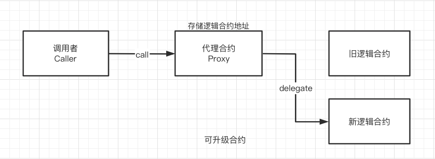
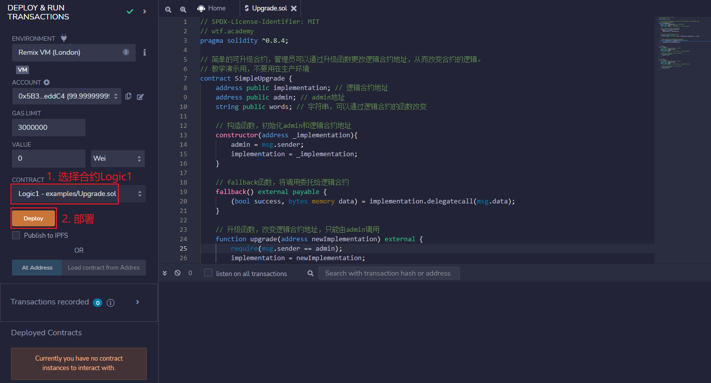
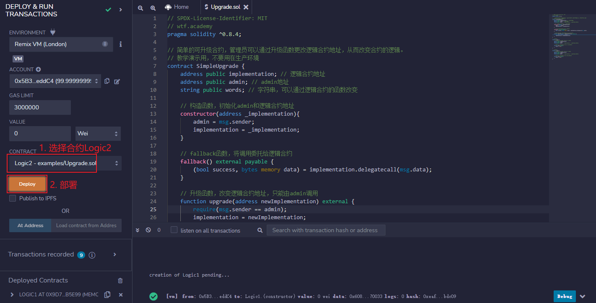
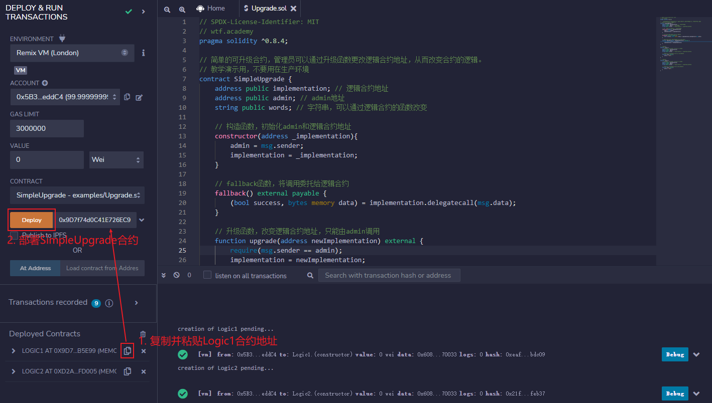
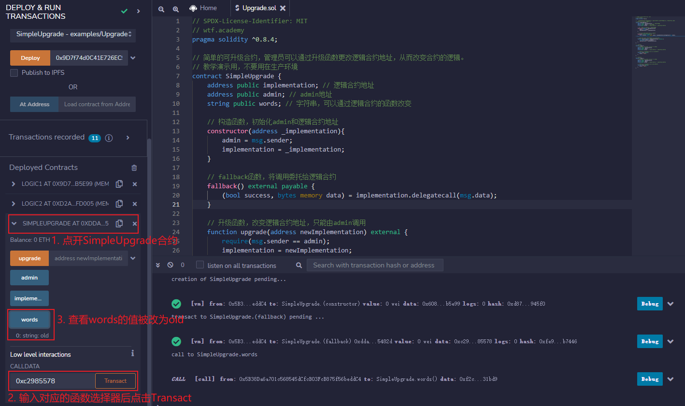
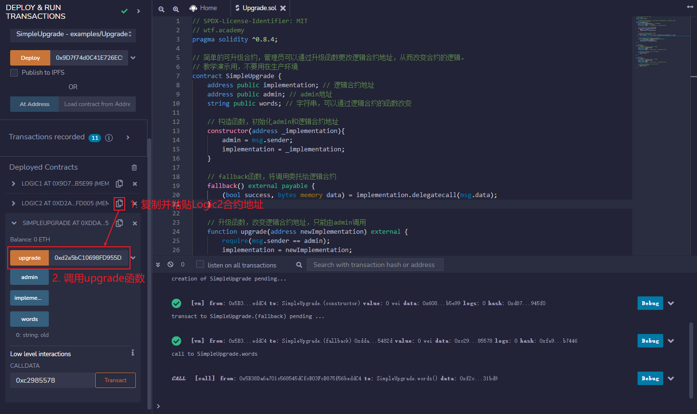
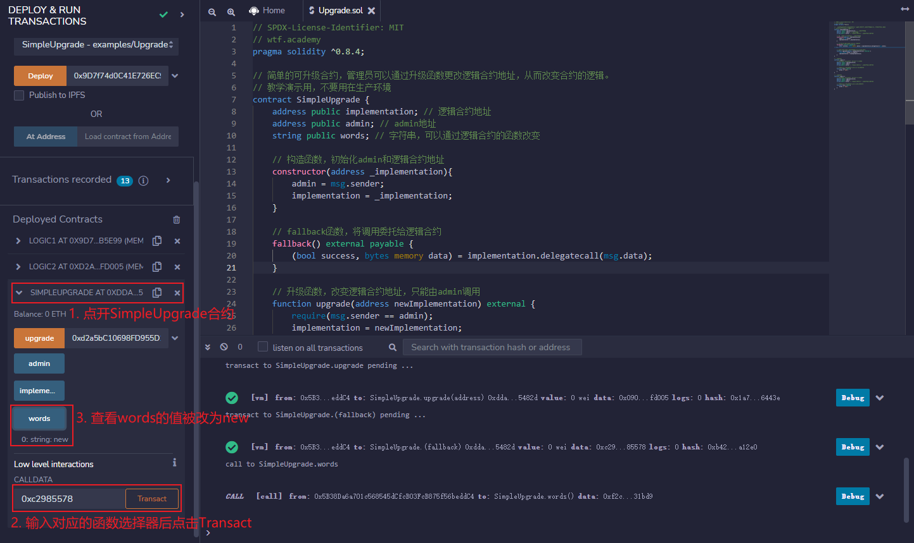

# WTF Solidity极简入门: 47. 可升级合约

我最近在重新学 Solidity，巩固一下细节，也写一个“WTF Solidity极简入门”，供小白们使用（编程大佬可以另找教程），每周更新 1-3 讲。

推特：[@0xAA_Science](https://twitter.com/0xAA_Science)｜[@WTFAcademy_](https://twitter.com/WTFAcademy_)

社区：[Discord](https://discord.gg/5akcruXrsk)｜[微信群](https://docs.google.com/forms/d/e/1FAIpQLSe4KGT8Sh6sJ7hedQRuIYirOoZK_85miz3dw7vA1-YjodgJ-A/viewform?usp=sf_link)｜[官网 wtf.academy](https://wtf.academy)

所有代码和教程开源在 github: [github.com/AmazingAng/WTFSolidity](https://github.com/AmazingAng/WTFSolidity)

---

这一讲，我们将介绍可升级合约（Upgradeable Contract）。教学用的合约由`OpenZeppelin`中的合约简化而来，可能有安全问题，不要用于生产环境。

## 可升级合约

如果你理解了代理合约，就很容易理解可升级合约。它就是一个可以更改逻辑合约的代理合约。



## 简单实现

下面我们实现一个简单的可升级合约，它包含`3`个合约：代理合约，旧的逻辑合约，和新的逻辑合约。

### 代理合约

这个代理合约比[第46讲](https://github.com/AmazingAng/WTFSolidity/blob/main/46_ProxyContract/readme.md)中的简单。我们没有在它的`fallback()`函数中使用`内联汇编`，而仅仅用了`implementation.delegatecall(msg.data);`。因此，回调函数没有返回值，但足够教学使用了。

它包含`3`个变量：
- `implementation`：逻辑合约地址。
- `admin`：admin地址。
- `words`：字符串，可以通过逻辑合约的函数改变。

它包含`3`个函数

- 构造函数：初始化admin和逻辑合约地址。
- `fallback()`：回调函数，将调用委托给逻辑合约。
- `upgrade()`：升级函数，改变逻辑合约地址，只能由`admin`调用。

```solidity
// SPDX-License-Identifier: MIT
// wtf.academy
pragma solidity ^0.8.4;

// 简单的可升级合约，管理员可以通过升级函数更改逻辑合约地址，从而改变合约的逻辑。
// 教学演示用，不要用在生产环境
contract SimpleUpgrade {
    address public implementation; // 逻辑合约地址
    address public admin; // admin地址
    string public words; // 字符串，可以通过逻辑合约的函数改变

    // 构造函数，初始化admin和逻辑合约地址
    constructor(address _implementation){
        admin = msg.sender;
        implementation = _implementation;
    }

    // fallback函数，将调用委托给逻辑合约
    fallback() external payable {
        (bool success, bytes memory data) = implementation.delegatecall(msg.data);
    }

    // 升级函数，改变逻辑合约地址，只能由admin调用
    function upgrade(address newImplementation) external {
        require(msg.sender == admin);
        implementation = newImplementation;
    }
}
```

### 旧逻辑合约

这个逻辑合约包含`3`个状态变量，与保持代理合约一致，防止插槽冲突。它只有一个函数`foo()`，将代理合约中的`words`的值改为`"old"`。

```solidity
// 逻辑合约1
contract Logic1 {
    // 状态变量和proxy合约一致，防止插槽冲突
    address public implementation; 
    address public admin; 
    string public words; // 字符串，可以通过逻辑合约的函数改变

    // 改变proxy中状态变量，选择器： 0xc2985578
    function foo() public{
        words = "old";
    }
}
```

### 新逻辑合约

这个逻辑合约包含`3`个状态变量，与保持代理合约一致，防止插槽冲突。它只有一个函数`foo()`，将代理合约中的`words`的值改为`"new"`。

```solidity
// 逻辑合约2
contract Logic2 {
    // 状态变量和proxy合约一致，防止插槽冲突
    address public implementation; 
    address public admin; 
    string public words; // 字符串，可以通过逻辑合约的函数改变

    // 改变proxy中状态变量，选择器：0xc2985578
    function foo() public{
        words = "new";
    }
}
```

## `Remix`实现

1. 部署新旧逻辑合约`Logic1`和`Logic2`。



2. 部署可升级合约`SimpleUpgrade`，将`implementation`地址指向把旧逻辑合约。


3. 利用选择器`0xc2985578`，在代理合约中调用旧逻辑合约`Logic1`的`foo()`函数，将`words`的值改为`"old"`。


4. 调用`upgrade()`，将`implementation`地址指向新逻辑合约`Logic2`。


5. 利用选择器`0xc2985578`，在代理合约中调用新逻辑合约`Logic2`的`foo()`函数，将`words`的值改为`"new"`。


## 总结

这一讲，我们介绍了一个简单的可升级合约。它是一个可以改变逻辑合约的代理合约，给不可更改的智能合约增加了升级功能。但是，这个合约`有选择器冲突`的问题，存在安全隐患。之后我们会介绍解决这一隐患的可升级合约标准：透明代理和`UUPS`。
