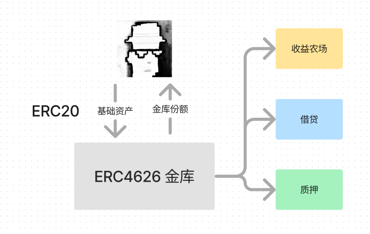
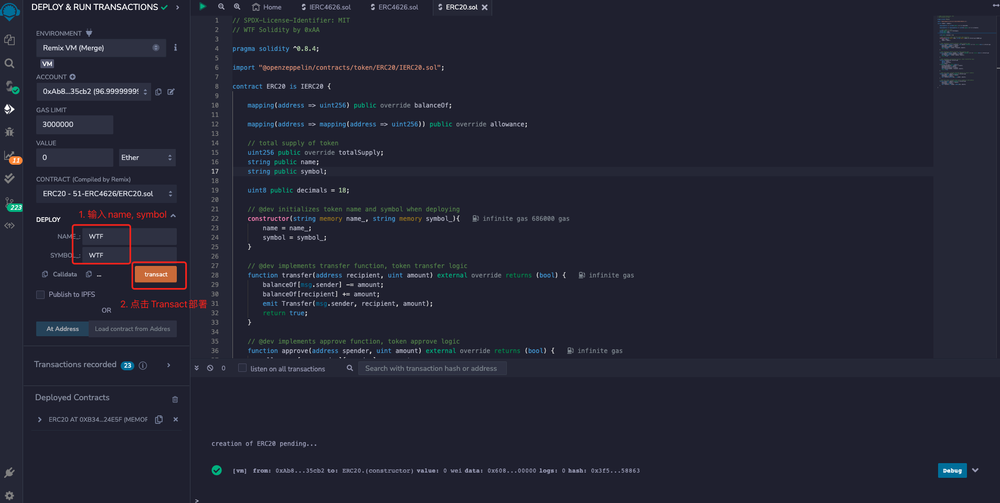
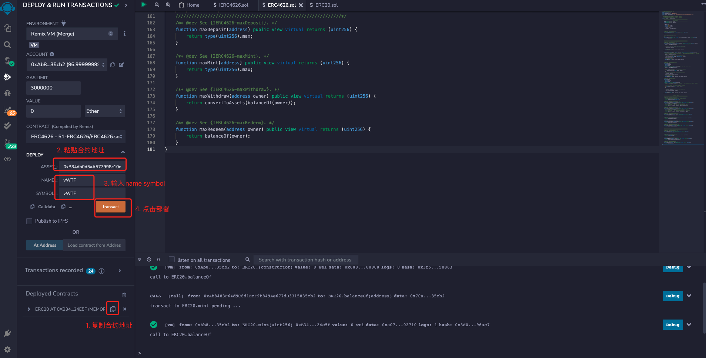

# WTF Solidity极简入门: 51. ERC4626 代币化金库标准

我最近在重新学solidity，巩固一下细节，也写一个“WTF Solidity极简入门”，供小白们使用（编程大佬可以另找教程），每周更新1-3讲。

推特：[@0xAA_Science](https://twitter.com/0xAA_Science)

社区：[Discord](https://discord.gg/5akcruXrsk)｜[微信群](https://docs.google.com/forms/d/e/1FAIpQLSe4KGT8Sh6sJ7hedQRuIYirOoZK_85miz3dw7vA1-YjodgJ-A/viewform?usp=sf_link)｜[官网 wtf.academy](https://wtf.academy)

所有代码和教程开源在github: [github.com/AmazingAng/WTFSolidity](https://github.com/AmazingAng/WTFSolidity)

-----

我们经常说 DeFi 是货币乐高，可以通过组合多个协议来创造新的协议；但由于 DeFi 缺乏标准，严重影响了它的可组合性。而 ERC4626 扩展了 ERC20 代币标准，旨在推动收益金库的标准化。这一讲，我们将介绍 DeFi 新一代标准 ERC4626，并写一个简单的金库合约。教学代码参考 openzeppelin 和 solmate 中的 ERC4626 合约，仅用作教学。

## 金库

金库合约是 DeFi 乐高中的基础，它允许你把基础资产（代币）质押到合约中，换取一定收益，包括以下应用场景:

- 收益农场: 在 Yearn Finance 中，你可以质押 `USDT` 获取利息。
- 借贷: 在 AAVE 中，你可以出借 `ETH` 获取存款利息和贷款。
- 质押: 在 Lido 中，你可以质押 `ETH` 参与 ETH 2.0 质押，得到可以升息的 `stETH`。

## ERC4626



由于金库合约缺乏标准，写法五花八门，一个收益聚合器需要写很多接口对接不同的 DeFi 项目。ERC4626 代币化金库标准（Tokenized Vault Standard）横空出世，使得 DeFi 能够轻松扩展。它具有以下优点:

1. 代币化: ERC4626 继承了 ERC20，向金库存款时，将得到同样符合 ERC20 标准的金库份额，比如质押 ETH，自动获得 stETH。

2. 更好的流通性: 由于代币化，你可以在不取回基础资产的情况下，利用金库份额做其他事情。拿 Lido 的 stETH 为例，你可以用它在 Uniswap 上提供流动性或交易，而不需要取出其中的 ETH。

3. 更好的可组合性: 有了标准之后，用一套接口可以和所有 ERC4626 金库交互，让基于金库的应用、插件、工具开发更容易。

总而言之，ERC4626 对于 DeFi 的重要性不亚于 ERC721 对于 NFT 的重要性。

### ERC4626 要点

ERC4626 标准主要实现了一下几个逻辑：

1. ERC20: ERC4626 继承了 ERC20，金库份额就是用 ERC20 代币代表的：用户将特定的 ERC20 基础资产（比如 WETH）存进金库，合约会给他铸造特定数量的金库份额代币；当用户从金库中提取基础资产时，会销毁相应数量的金库份额代币。`asset()` 函数会返回金库的基础资产的代币地址。
2. 存款逻辑：让用户存入基础资产，并铸造相应数量的金库份额。相关函数为 `deposit()` 和 `mint()`。`deposit(uint assets, address receiver)` 函数让用户存入 `assets` 单位的资产，并铸造相应数量的金库份额给 `receiver` 地址。`mint(uint shares, address receiver)` 与它类似，只不过是以将铸造的金库份额作为参数。
3. 提款逻辑：让用户销毁金库份额，并提取金库中相应数量的基础资产。相关函数为 `withdraw()` 和 `redeem()`，前者以取出基础资产数量为参数，后者以销毁的金库份额为参数。
4. 会计和限额逻辑：ERC4626 标准中其他的函数是为了统计金库中的资产，存款/提款限额，和存款/提款的基础资产和金库份额数量。

### IERC4626 接口合约

IERC4626 接口合约共包含 `2` 个事件:
- `Deposit` 事件: 存款时触发。
- `Withdraw` 事件: 取款时触发。

IERC4626 接口合约还包含 `16` 个函数，根据功能分为 `4` 大类：元数据，存款/提款逻辑，会计逻辑，和存款/提款限额逻辑。

- 元数据

    - `asset()`: 返回金库的基础资产代币地址，用于存款，取款。
- 存款/提款逻辑
    - `deposit()`: 存款函数，用户向金库存入 `assets` 单位的基础资产，然后合约铸造 `shares` 单位的金库额度给 `receiver` 地址。会释放 `Deposit` 事件。
    - `mint()`: 铸造函数（也是存款函数），用户指定想获得的 `shares` 单位的金库额度，函数经过计算后得出需要存入的 `assets` 单位的基础资产数量，然后合约从用户账户转出 `assets` 单位的基础资产，再给 `receiver` 地址铸造指定数量的金库额度。会释放 `Deposit` 事件。    
    - `withdraw()`: 提款函数，`owner` 地址销毁 `share` 单位的金库额度，然后合约将相应数量的基础资产发送给 `receiver` 地址。
    - `redeem()`: 赎回函数（也是提款函数），`owner` 地址销毁 `shares` 数量的金库额度，然后合约将相应单位的基础资产发给 `receiver` 地址
- 会计逻辑
    - `totalAssets()`: 返回金库中管理的基础资产代币总额。
    - `convertToShares()`: 返回利用一定数额基础资产可以换取的金库额度。
    - `convertToAssets()`: 返回利用一定数额金库额度可以换取的基础资产。
    - `previewDeposit()`: 用于用户在当前链上环境模拟存款一定数额的基础资产能够获得的金库额度。
    - `previewMint()`: 用于用户在当前链上环境模拟铸造一定数额的金库额度需要存款的基础资产数量。
    - `previewWithdraw()`: 用于用户在当前链上环境模拟提款一定数额的基础资产需要赎回的金库份额。
    - `previewRedeem()`: 用于链上和链下用户在当前链上环境模拟销毁一定数额的金库额度能够赎回的基础资产数量。
- 存款/提款限额逻辑
    - `maxDeposit()`: 返回某个用户地址单次存款可存的最大基础资产数额。
    - `maxMint()`: 返回某个用户地址单次铸造可以铸造的最大金库额度。
    - `maxWithdraw()`: 返回某个用户地址单次取款可以提取的最大基础资产额度。
    - `maxRedeem()`: 返回某个用户地址单次赎回可以销毁的最大金库额度。

```solidity
// SPDX-License-Identifier: MIT
// Author: 0xAA from WTF Academy

pragma solidity ^0.8.0;

import "@openzeppelin/contracts/token/ERC20/IERC20.sol";
import "@openzeppelin/contracts/token/ERC20/extensions/IERC20Metadata.sol";

/**
 * @dev ERC4626 "代币化金库标准"的接口合约
 * https://eips.ethereum.org/EIPS/eip-4626[ERC-4626].
 */
interface IERC4626 is IERC20, IERC20Metadata {
    /*//////////////////////////////////////////////////////////////
                                 事件
    //////////////////////////////////////////////////////////////*/
    // 存款时触发
    event Deposit(address indexed sender, address indexed owner, uint256 assets, uint256 shares);

    // 取款时触发
    event Withdraw(
        address indexed sender,
        address indexed receiver,
        address indexed owner,
        uint256 assets,
        uint256 shares
    );

    /*//////////////////////////////////////////////////////////////
                            元数据
    //////////////////////////////////////////////////////////////*/
    /**
     * @dev 返回金库的基础资产代币地址 （用于存款，取款）
     * - 必须是 ERC20 代币合约地址.
     * - 不能revert
     */
    function asset() external view returns (address assetTokenAddress);

    /*//////////////////////////////////////////////////////////////
                        存款/提款逻辑
    //////////////////////////////////////////////////////////////*/
    /**
     * @dev 存款函数: 用户向金库存入 assets 单位的基础资产，然后合约铸造 shares 单位的金库额度给 receiver 地址
     *
     * - 必须释放 Deposit 事件.
     * - 如果资产不能存入，必须revert，比如存款数额大大于上限等。
     */
    function deposit(uint256 assets, address receiver) external returns (uint256 shares);

    /**
     * @dev 铸造函数: 用户需要存入 assets 单位的基础资产，然后合约给 receiver 地址铸造 share 数量的金库额度
     * - 必须释放 Deposit 事件.
     * - 如果全部金库额度不能铸造，必须revert，比如铸造数额大大于上限等。
     */
    function mint(uint256 shares, address receiver) external returns (uint256 assets);

    /**
     * @dev 提款函数: owner 地址销毁 share 单位的金库额度，然后合约将 assets 单位的基础资产发送给 receiver 地址
     * - 释放 Withdraw 事件
     * - 如果全部基础资产不能提取，将revert
     */
    function withdraw(uint256 assets, address receiver, address owner) external returns (uint256 shares);

    /**
     * @dev 赎回函数: owner 地址销毁 shares 数量的金库额度，然后合约将 assets 单位的基础资产发给 receiver 地址
     * - 释放 Withdraw 事件
     * - 如果金库额度不能全部销毁，则revert
     */
    function redeem(uint256 shares, address receiver, address owner) external returns (uint256 assets);

    /*//////////////////////////////////////////////////////////////
                            会计逻辑
    //////////////////////////////////////////////////////////////*/

    /**
     * @dev 返回金库中管理的基础资产代币总额
     * - 要包含利息
     * - 要包含费用
     * - 不能revert
     */
    function totalAssets() external view returns (uint256 totalManagedAssets);

    /**
     * @dev 返回利用一定数额基础资产可以换取的金库额度
     * - 不要包含费用
     * - 不包含滑点
     * - 不能revert
     */
    function convertToShares(uint256 assets) external view returns (uint256 shares);

    /**
     * @dev 返回利用一定数额金库额度可以换取的基础资产
     * - 不要包含费用
     * - 不包含滑点
     * - 不能revert
     */
    function convertToAssets(uint256 shares) external view returns (uint256 assets);

    /**
     * @dev 用于链上和链下用户在当前链上环境模拟存款一定数额的基础资产能够获得的金库额度
     * - 返回值要接近且不大于在同一交易进行存款得到的金库额度
     * - 不要考虑 maxDeposit 等限制，假设用户的存款交易会成功
     * - 要考虑费用
     * - 不能revert
     * NOTE: 可以利用 convertToAssets 和 previewDeposit 返回值的差值来计算滑点
     */
    function previewDeposit(uint256 assets) external view returns (uint256 shares);

    /**
     * @dev 用于链上和链下用户在当前链上环境模拟铸造 shares 数额的金库额度需要存款的基础资产数量
     * - 返回值要接近且不小于在同一交易进行铸造一定数额金库额度所需的存款数量
     * - 不要考虑 maxMint 等限制，假设用户的存款交易会成功
     * - 要考虑费用
     * - 不能revert
     */
    function previewMint(uint256 shares) external view returns (uint256 assets);

    /**
     * @dev 用于链上和链下用户在当前链上环境模拟提款 assets 数额的基础资产需要赎回的金库份额
     * - 返回值要接近且不大于在同一交易进行提款一定数额基础资产所需赎回的金库份额
     * - 不要考虑 maxWithdraw 等限制，假设用户的提款交易会成功
     * - 要考虑费用
     * - 不能revert
     */
    function previewWithdraw(uint256 assets) external view returns (uint256 shares);

    /**
     * @dev 用于链上和链下用户在当前链上环境模拟销毁 shares 数额的金库额度能够赎回的基础资产数量
     * - 返回值要接近且不小于在同一交易进行销毁一定数额的金库额度所能赎回的基础资产数量
     * - 不要考虑 maxRedeem 等限制，假设用户的赎回交易会成功
     * - 要考虑费用
     * - 不能revert.
     */
    function previewRedeem(uint256 shares) external view returns (uint256 assets);

    /*//////////////////////////////////////////////////////////////
                     存款/提款限额逻辑
    //////////////////////////////////////////////////////////////*/
    /**
     * @dev 返回某个用户地址单次存款可存的最大基础资产数额。
     * - 如果有存款上限，那么返回值应该是个有限值
     * - 返回值不能超过 2 ** 256 - 1 
     * - 不能revert
     */
    function maxDeposit(address receiver) external view returns (uint256 maxAssets);

    /**
     * @dev 返回某个用户地址单次铸造可以铸造的最大金库额度
     * - 如果有铸造上限，那么返回值应该是个有限值
     * - 返回值不能超过 2 ** 256 - 1 
     * - 不能revert
     */
    function maxMint(address receiver) external view returns (uint256 maxShares);

    /**
     * @dev 返回某个用户地址单次取款可以提取的最大基础资产额度
     * - 返回值应该是个有限值
     * - 不能revert
     */
    function maxWithdraw(address owner) external view returns (uint256 maxAssets);

    /**
     * @dev 返回某个用户地址单次赎回可以销毁的最大金库额度
     * - 返回值应该是个有限值
     * - 如果没有其他限制，返回值应该是 balanceOf(owner)
     * - 不能revert
     */
    function maxRedeem(address owner) external view returns (uint256 maxShares);
}
```

### ERC4626 合约

下面，我们实现一个极简版的代币化金库合约：
- 构造函数初始化基础资产的合约地址，金库份额的代币名称和符号。注意，金库份额的代币名称和符号要和基础资产有关联，比如基础资产叫 `WTF`，金库份额最好叫 `vWTF`。
- 存款时，当用户向金库存 `x` 单位的基础资产，会铸造 `x` 单位（等量）的金库份额。
- 取款时，当用户销毁 `x` 单位的金库份额，会提取 `x` 单位（等量）的基础资产。

**注意**: 在实际使用时，要特别小心和会计逻辑相关函数的计算是向上取整还是向下取整，可以参考 [openzeppelin](https://github.com/OpenZeppelin/openzeppelin-contracts/blob/master/contracts/token/ERC20/extensions/ERC4626.sol) 和 [solmate](https://github.com/transmissions11/solmate/blob/main/src/mixins/ERC4626.sol) 的实现。本节的教学例子中不考虑它。

```solidity
// SPDX-License-Identifier: MIT
pragma solidity >=0.8.0;

import {IERC4626} from "./IERC4626.sol";
import {ERC20, IERC20Metadata} from "@openzeppelin/contracts/token/ERC20/ERC20.sol";

/**
 * @dev ERC4626 "代币化金库标准"合约，仅供教学使用，不要用于生产
 */
contract ERC4626 is ERC20, IERC4626 {
    /*//////////////////////////////////////////////////////////////
                    状态变量
    //////////////////////////////////////////////////////////////*/
    ERC20 private immutable _asset; // 
    uint8 private immutable _decimals;

    constructor(
        ERC20 asset_,
        string memory name_,
        string memory symbol_
    ) ERC20(name_, symbol_) {
        _asset = asset_;
        _decimals = asset_.decimals();

    }

    /** @dev See {IERC4626-asset}. */
    function asset() public view virtual override returns (address) {
        return address(_asset);
    }

    /**
     * See {IERC20Metadata-decimals}.
     */
    function decimals() public view virtual override(IERC20Metadata, ERC20) returns (uint8) {
        return _decimals;
    }

    /*//////////////////////////////////////////////////////////////
                        存款/提款逻辑
    //////////////////////////////////////////////////////////////*/
    /** @dev See {IERC4626-deposit}. */
    function deposit(uint256 assets, address receiver) public virtual returns (uint256 shares) {
        // 利用 previewDeposit() 计算将获得的金库份额
        shares = previewDeposit(assets);

        // 先 transfer 后 mint，防止重入
        _asset.transferFrom(msg.sender, address(this), assets);
        _mint(receiver, shares);

        // 释放 Deposit 事件
        emit Deposit(msg.sender, receiver, assets, shares);
    }

    /** @dev See {IERC4626-mint}. */
    function mint(uint256 shares, address receiver) public virtual returns (uint256 assets) {
        // 利用 previewMint() 计算需要存款的基础资产数额
        assets = previewMint(shares);

        // 先 transfer 后 mint，防止重入
        _asset.transferFrom(msg.sender, address(this), assets);
        _mint(receiver, shares);

        // 释放 Deposit 事件
        emit Deposit(msg.sender, receiver, assets, shares);

    }

    /** @dev See {IERC4626-withdraw}. */
    function withdraw(
        uint256 assets,
        address receiver,
        address owner
    ) public virtual returns (uint256 shares) {
        // 利用 previewWithdraw() 计算将销毁的金库份额
        shares = previewWithdraw(assets);

        // 如果调用者不是 owner，则检查并更新授权
        if (msg.sender != owner) {
            _spendAllowance(owner, msg.sender, shares);
        }

        // 先销毁后 transfer，防止重入
        _burn(owner, shares);
        _asset.transfer(receiver, assets);

        // 释放 Withdraw 事件
        emit Withdraw(msg.sender, receiver, owner, assets, shares);
    }

    /** @dev See {IERC4626-redeem}. */
    function redeem(
        uint256 shares,
        address receiver,
        address owner
    ) public virtual returns (uint256 assets) {
        // 利用 previewRedeem() 计算能赎回的基础资产数额
        assets = previewRedeem(shares);

        // 如果调用者不是 owner，则检查并更新授权
        if (msg.sender != owner) {
            _spendAllowance(owner, msg.sender, shares);
        }

        // 先销毁后 transfer，防止重入
        _burn(owner, shares);
        _asset.transfer(receiver, assets);

        // 释放 Withdraw 事件       
        emit Withdraw(msg.sender, receiver, owner, assets, shares);
    }

    /*//////////////////////////////////////////////////////////////
                            会计逻辑
    //////////////////////////////////////////////////////////////*/
    /** @dev See {IERC4626-totalAssets}. */
    function totalAssets() public view virtual returns (uint256){
        // 返回合约中基础资产持仓
        return _asset.balanceOf(address(this));
    }

    /** @dev See {IERC4626-convertToShares}. */
    function convertToShares(uint256 assets) public view virtual returns (uint256) {
        uint256 supply = totalSupply();
        // 如果 supply 为 0，那么 1:1 铸造金库份额
        // 如果 supply 不为0，那么按比例铸造
        return supply == 0 ? assets : assets * supply / totalAssets();
    }

    /** @dev See {IERC4626-convertToAssets}. */
    function convertToAssets(uint256 shares) public view virtual returns (uint256) {
        uint256 supply = totalSupply();
        // 如果 supply 为 0，那么 1:1 赎回基础资产
        // 如果 supply 不为0，那么按比例赎回
        return supply == 0 ? shares : shares * totalAssets() / supply;
    }

    /** @dev See {IERC4626-previewDeposit}. */
    function previewDeposit(uint256 assets) public view virtual returns (uint256) {
        return convertToShares(assets);
    }

    /** @dev See {IERC4626-previewMint}. */
    function previewMint(uint256 shares) public view virtual returns (uint256) {
        return convertToAssets(shares);
    }

    /** @dev See {IERC4626-previewWithdraw}. */
    function previewWithdraw(uint256 assets) public view virtual returns (uint256) {
        return convertToShares(assets);
    }

    /** @dev See {IERC4626-previewRedeem}. */
    function previewRedeem(uint256 shares) public view virtual returns (uint256) {
        return convertToAssets(shares);
    }

    /*//////////////////////////////////////////////////////////////
                     存款/提款限额逻辑
    //////////////////////////////////////////////////////////////*/
    /** @dev See {IERC4626-maxDeposit}. */
    function maxDeposit(address) public view virtual returns (uint256) {
        return type(uint256).max;
    }

    /** @dev See {IERC4626-maxMint}. */
    function maxMint(address) public view virtual returns (uint256) {
        return type(uint256).max;
    }
    
    /** @dev See {IERC4626-maxWithdraw}. */
    function maxWithdraw(address owner) public view virtual returns (uint256) {
        return convertToAssets(balanceOf(owner));
    }
    
    /** @dev See {IERC4626-maxRedeem}. */
    function maxRedeem(address owner) public view virtual returns (uint256) {
        return balanceOf(owner);
    }
}
```

## `Remix`演示

**注意:** 以下运行示例使用了remix中第二个账户,即`0xAb8483F64d9C6d1EcF9b849Ae677dD3315835cb2`, 来部署合约, 调用合约方法.

1. 部署 `ERC20` 代币合约，将代币名称和符号均设为 `WTF`，并给自己铸造 `10000` 代币。



2. 部署 `ERC4626` 代币合约，将基础资产的合约地址设为 `WTF` 的地址，名称和符号均设为 `vWTF`。


3. 调用 `ERC20` 合约的 `approve()` 函数，将代币授权给 `ERC4626` 合约。


4. 调用 `ERC4626` 合约的 `deposit()` 函数，存款 `1000` 枚代币。然后调用 `balanceOf()` 函数，查看自己的金库份额变为 `1000`。


5. 调用 `ERC4626` 合约的 `mint()` 函数，存款 `1000` 枚代币。然后调用 `balanceOf()` 函数查看自己的金库份额变为 `2000`。


6. 调用 `ERC4626` 合约的 `withdraw()` 函数，取款 `1000` 枚代币。然后调用 `balanceOf()` 函数查看自己的金库份额变为 `1000`。


7. 调用 `ERC4626` 合约的 `redeem()` 函数，取款 `1000` 枚代币。然后调用 `balanceOf()` 函数查看自己的金库份额变为 `0`。


## 总结

这一讲，我们介绍了代币化金库标准 ERC4626，并写了一个简单的金库合约，可以将基础资产 1:1 的转换为金库份额代币。ERC4626 为 DeFi 提升流动性和可组合性，未来将逐渐普及。你会用 ERC4626 做什么应用呢？

