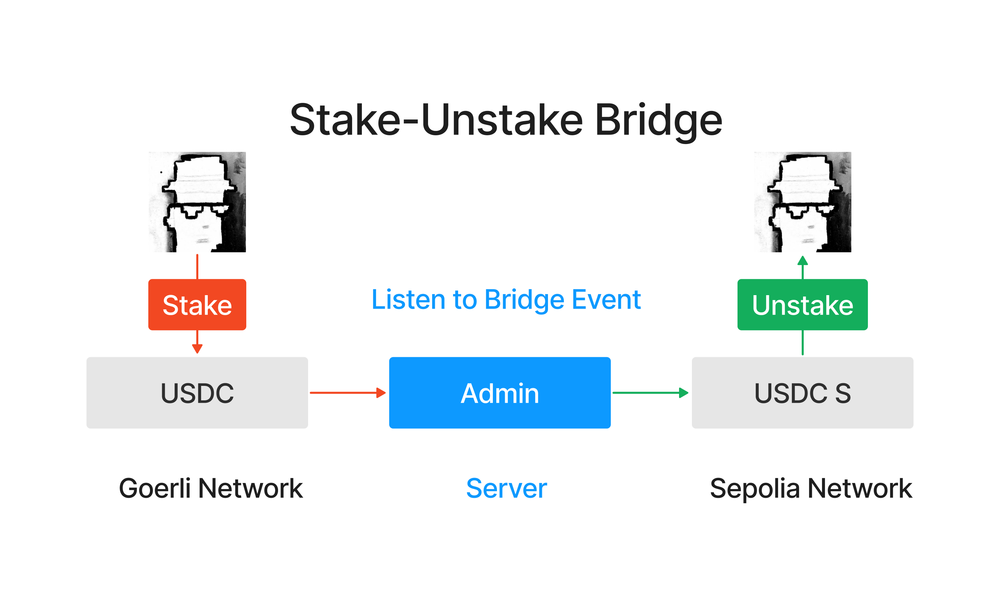

# WTF Solidity极简入门: 54. 跨链桥

我最近在重新学solidity，巩固一下细节，也写一个“WTF Solidity极简入门”，供小白们使用（编程大佬可以另找教程），每周更新1-3讲。

推特：[@0xAA_Science](https://twitter.com/0xAA_Science)

社区：[Discord](https://discord.gg/5akcruXrsk)｜[微信群](https://docs.google.com/forms/d/e/1FAIpQLSe4KGT8Sh6sJ7hedQRuIYirOoZK_85miz3dw7vA1-YjodgJ-A/viewform?usp=sf_link)｜[官网 wtf.academy](https://wtf.academy)

所有代码和教程开源在github: [github.com/AmazingAng/WTFSolidity](https://github.com/AmazingAng/WTFSolidity)

-----

这一讲，我们介绍跨链桥，能将资产从一条区块链转移到另一条区块链的基础设施，并实现一个简单的跨链桥。


## 1. 什么是跨链桥

跨链桥是一种区块链协议，它允许在两个或多个区块链之间移动数字资产和信息。例如，一个在以太坊主网上运行的ERC20代币，可以通过跨链桥转移到其他兼容以太坊的侧链或独立链。

同时，跨链桥不是区块链原生支持的，跨链操作需要可信第三方来执行，这也带来了风险。近两年，针对跨链桥的攻击已造成超过**20亿美元**的用户资产损失。

## 2. 跨链桥的种类

跨链桥主要有以下三种类型：

- **Burn/Mint**：在源链上销毁（burn）代币，然后在目标链上创建（mint）同等数量的代币。此方法好处是代币的总供应量保持不变，但是需要跨链桥拥有代币的铸造权限，适合项目方搭建自己的跨链桥。

    

- **Stake/Mint**：在源链上锁定（stake）代币，然后在目标链上创建（mint）同等数量的代币（凭证）。源链上的代币被锁定，当代币从目标链移回源链时再解锁。这是一般跨链桥使用的方案，不需要任何权限，但是风险也较大，当源链的资产被黑客攻击时，目标链上的凭证将变为空气。

    

- **Stake/Unstake**：在源链上锁定（stake）代币，然后在目标链上释放（unstake）同等数量的代币，在目标链上的代币可以随时兑换回源链的代币。这个方法需要跨链桥在两条链都有锁定的代币，门槛较高，一般需要激励用户在跨链桥锁仓。

    

## 3. 搭建一个简单的跨链桥

为了更好理解这个跨链桥，我们将搭建一个简单的跨链桥，并实现Goerli测试网和Sepolia测试网之间的ERC20代币转移。我们使用的是burn/mint方式，源链上的代币将被销毁，并在目标链上创建。这个跨链桥由一个智能合约（部署在两条链上）和一个Ethers.js脚本组成。

> **请注意**，这是一个非常简单的跨链桥实现，仅用于教学目的。它没有处理一些可能出现的问题，如交易失败、链的重组等。在生产环境中，建议使用专业的跨链桥解决方案或其他经过充分测试和审计的框架。

### 3.1 跨链代币合约

首先，我们需要在Goerli和Sepolia测试网上部署一个ERC20代币合约，`CrossChainToken`。这个合约中定义了代币的名字、符号和总供应量，还有一个用于跨链转移的`bridge()`函数。

```solidity
// SPDX-License-Identifier: MIT
pragma solidity ^0.8.10;

import "@openzeppelin/contracts/token/ERC20/ERC20.sol";
import "@openzeppelin/contracts/access/Ownable.sol";

contract CrossChainToken is ERC20, Ownable {
    
    // Bridge event
    event Bridge(address indexed user, uint256 amount);
    // Mint event
    event Mint(address indexed to, uint256 amount);

    /**
     * @param name Token Name
     * @param symbol Token Symbol
     * @param totalSupply Token Supply
     */
    constructor(
        string memory name,
        string memory symbol,
        uint256 totalSupply
    ) payable ERC20(name, symbol) {
        _mint(msg.sender, totalSupply);
    }

    /**
     * Bridge function
     * @param amount: burn amount of token on the current chain and mint on the other chain
     */
    function bridge(uint256 amount) public {
        _burn(msg.sender, amount);
        emit Bridge(msg.sender, amount);
    }

    /**
     * Mint function
     */
    function mint(address to, uint amount) external onlyOwner {
        _mint(to, amount);
        emit  Mint(to, amount);
    }
}
```

这个合约有三个主要的函数：

- `constructor()`: 构造函数，在部署合约时会被调用一次，用于初始化代币的名字、符号和总供应量。

- `bridge()`: 用户调用此函数进行跨链转移，它会销毁用户指定数量的代币，并释放`Bridge`事件。

- `mint()`: 只有合约的所有者才能调用此函数，用于处理跨链事件，并释放`Mint`事件。当用户在另一条链调用`bridge()`函数销毁代币，脚本会监听`Bridge`事件，并给用户在目标链铸造代币。

### 3.2 跨链脚本

有了代币合约之后，我们需要一个服务器来处理跨链事件。我们可以编写一个ethers.js脚本（v6版本）监听`Bridge`事件，当事件被触发时，在目标链上创建同样数量的代币。如果你不了解Ethers.js，可以阅读[WTF Ethers极简教程](https://github.com/WTFAcademy/WTF-Ethers)。

```javascript
import { ethers } from "ethers";

// 初始化两条链的provider
const providerGoerli = new ethers.JsonRpcProvider("Goerli_Provider_URL");
const providerSepolia = new ethers.JsonRpcProvider("Sepolia_Provider_URL://eth-sepolia.g.alchemy.com/v2/RgxsjQdKTawszh80TpJ-14Y8tY7cx5W2");

// 初始化两条链的signer
// privateKey填管理者钱包的私钥
const privateKey = "Your_Key";
const walletGoerli = new ethers.Wallet(privateKey, providerGoerli);
const walletSepolia = new ethers.Wallet(privateKey, providerSepolia);

// 合约地址和ABI
const contractAddressGoerli = "0xa2950F56e2Ca63bCdbA422c8d8EF9fC19bcF20DD";
const contractAddressSepolia = "0xad20993E1709ed13790b321bbeb0752E50b8Ce69";

const abi = [
    "event Bridge(address indexed user, uint256 amount)",
    "function bridge(uint256 amount) public",
    "function mint(address to, uint amount) external",
];

// 初始化合约实例
const contractGoerli = new ethers.Contract(contractAddressGoerli, abi, walletGoerli);
const contractSepolia = new ethers.Contract(contractAddressSepolia, abi, walletSepolia);

const main = async () => {
    try{
        console.log(`开始监听跨链事件`)

        // 监听chain Sepolia的Bridge事件，然后在Goerli上执行mint操作，完成跨链
        contractSepolia.on("Bridge", async (user, amount) => {
            console.log(`Bridge event on Chain Sepolia: User ${user} burned ${amount} tokens`);

            // 在执行burn操作
            let tx = await contractGoerli.mint(user, amount);
            await tx.wait();

            console.log(`Minted ${amount} tokens to ${user} on Chain Goerli`);
        });

        // 监听chain Goerli的Bridge事件，然后在Sepolia上执行mint操作，完成跨链
        contractGoerli.on("Bridge", async (user, amount) => {
            console.log(`Bridge event on Chain Goerli: User ${user} burned ${amount} tokens`);

            // 在执行burn操作
            let tx = await contractSepolia.mint(user, amount);
            await tx.wait();

            console.log(`Minted ${amount} tokens to ${user} on Chain Sepolia`);
        });
    } catch(e) {
        console.log(e);
    } 
}

main();
```

## Remix 复现

1. 在Goerli和Sepolia测试链部署分别部署`CrossChainToken`合约，合约会自动给我们铸造 10000 枚代币

    

2. 补全跨链脚本 `crosschain.js` 中的RPC节点URL和管理员私钥，将部署在Goerli和Sepolia的代币合约地址填写到相应位置，并运行脚本。

3. 调用Goerli链上代币合约的`bridge()`函数，跨链100枚代币。

    

4. 脚本监听到跨链事件，并在Sepolia链上铸造100枚代币。

    

5. 在Sepolia链上调用`balance()`查询余额，发现代币余额变为10100枚，跨链成功！

    

## 总结

这一讲我们介绍了跨链桥，它允许在两个或多个区块链之间移动数字资产和信息，方便用户在多链操作资产。同时，它也有很大的风险，近两年针对跨链桥的攻击已造成超过**20亿美元**的用户资产损失。在本教程中，我们搭建一个简单的跨链桥，并实现Goerli测试网和Sepolia测试网之间的ERC20代币转移。相信通过本教程，你对跨链桥会有更深的理解。
