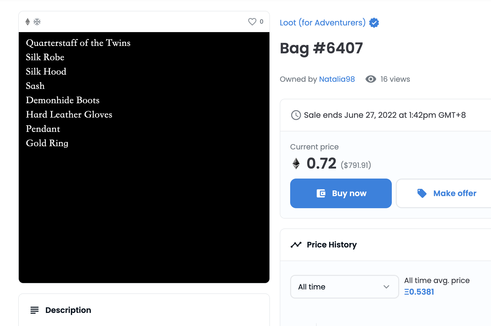
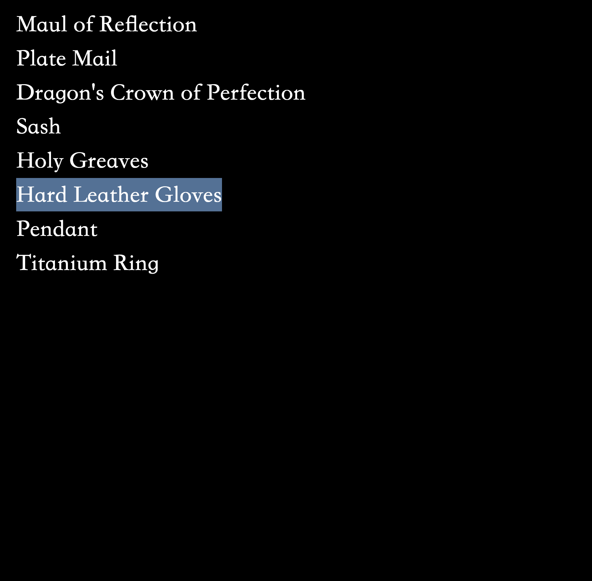

# Solidity极简入门 ERC721专题5：Loot

我最近在重新学solidity，巩固一下细节，也写一个“Solidity极简入门”，供小白们使用（编程大佬可以另找教程），每周更新1-3讲。

欢迎关注我的推特：[@0xAA_Science](https://twitter.com/0xAA_Science)

WTF技术社群discord，内有加微信群方法：[链接](https://discord.gg/5akcruXrsk)

所有代码和教程开源在github（1024个star发课程认证，2048个star发社群NFT）: [github.com/AmazingAng/WTFSolidity](https://github.com/AmazingAng/WTFSolidity)

-----

## Loot



`Loot`是以太坊链上的实验性NFT项目，发行于21年8月，共有8000个，前7777个免费`mint`，后233个项目方预留，最高时地板价突破20 `ETH`，目前稳定在1 `ETH`左右。与充斥市场的图片NFT不同，`Loot`是文字类NFT，所有元数据都保存在链上，保证了绝对的去中心化，没人能篡改。

它的内容比较简单，就是用文字描述了玩家的一套装备，包括武器、头盔、戒指共8类物品。“金指环”，“双子之剑”，“硬皮手套”，复古的名字让我回忆起小时候玩的《暗黑破坏神》。

`Loot`是一个开放的生态，项目方希望有更多团队能加入到`Loot`元宇宙的建设中。这一讲，我将介绍`Loot`是怎么用智能合约生成的文字，又是怎么把它放上链的。

## Loot代码
`Loot`代码在etherscan上开源，地址：[链接](https://etherscan.io/address/0xff9c1b15b16263c61d017ee9f65c50e4ae0113d7#code)

主合约`Loot`从`1291行`开始，继承了`ERC721Enumerable`，`ReentrancyGuard`和`Ownable`，这些合约都是`oppenzepplin`标准库中的。

```solidity
contract Loot is ERC721Enumerable, ReentrancyGuard, Ownable {
```

### 1. 装备描述基本词组
`Loot`在状态变量中定义了11个`String数组`用于生成装备描述的基本词组：

- 其中8个是装备列表，用于描述不同部位的装备，包括`weapon`, `chestArmor`, `headArmor`, `waistArmor`, `footArmor`, `handArmor`, `necklaces`, `rings`。拿`weapon`举例，它的`String数组`包含`战锤`, `木棒`等内容：

```solidity
        string[] private weapons = [
        "Warhammer",
        "Quarterstaff",
        "Maul",
        "Mace",
        "Club",
        "Katana",
        "Falchion",
        "Scimitar",
        "Long Sword",
        "Short Sword",
        "Ghost Wand",
        "Grave Wand",
        "Bone Wand",
        "Wand",
        "Grimoire",
        "Chronicle",
        "Tome",
        "Book"
    ];
```

- 剩余3个是修饰装备的前缀和后缀，包括`suffixes`, `namePrefixes`和`nameSuffixes`。前缀后缀可以让装备看起来更牛逼，例如：`龙的完美之冠`，`鹰吼-华丽的巨人胸甲`。拿装备后缀举例，`suffixes`包括：

```solidity
    string[] private suffixes = [
        "of Power",
        "of Giants",
        "of Titans",
        "of Skill",
        "of Perfection",
        "of Brilliance",
        "of Enlightenment",
        "of Protection",
        "of Anger",
        "of Rage",
        "of Fury",
        "of Vitriol",
        "of the Fox",
        "of Detection",
        "of Reflection",
        "of the Twins"
    ];
```

装备列表和修饰词随机结合，就能生成出`Loot`的文本NFT。

### 2. 随机生成描述文本

为了区分装备的稀有度，`Loot`利用链上伪随机数生成函数`random()`为装备描述文本提供随机性：

```solidity
    function random(string memory input) internal pure returns (uint256) {
        return uint256(keccak256(abi.encodePacked(input)));
    }
```

`random()`函数参数为`input`字符串，它计算`input`的哈希，再转换为`uint256`，将不同的`input`均匀的映射到不同的数字上。之后将得到数字映射到稀有度，就可以了，`Loot`定义了`pluck()`函数来做这一点。

```solidity
    function pluck(uint256 tokenId, string memory keyPrefix, string[] memory sourceArray) internal view returns (string memory) {
        uint256 rand = random(string(abi.encodePacked(keyPrefix, toString(tokenId))));
        string memory output = sourceArray[rand % sourceArray.length];
        uint256 greatness = rand % 21;
        if (greatness > 14) {
            output = string(abi.encodePacked(output, " ", suffixes[rand % suffixes.length]));
        }
        if (greatness >= 19) {
            string[2] memory name;
            name[0] = namePrefixes[rand % namePrefixes.length];
            name[1] = nameSuffixes[rand % nameSuffixes.length];
            if (greatness == 19) {
                output = string(abi.encodePacked('"', name[0], ' ', name[1], '" ', output));
            } else {
                output = string(abi.encodePacked('"', name[0], ' ', name[1], '" ', output, " +1"));
            }
        }
        return output;
    }
```

`pluck()`函数的作用就是在给定`tokenId`, `keyPrefix` (装备部位)和`sourceArray` (装备列表)，来生成特定部位装备的描述。一个装备有`33.3%`的概率拥有后缀，其中有`9.5%`的概率拥有`特殊名称`。因此，`Loot`中每件装备有`66.7%`为普通，`23.8%`为稀有，`9.5%`为史诗。

`Loot`包含8个`get()`函数来获取8个部位的装备，拿`getWeapon()`举例，这个函数获得武器描述：它调用了`pluck`函数，装备部位为`"WEAPON"`,装备列表为状态变量`weapons`。

```solidity
    function getWeapon(uint256 tokenId) public view returns (string memory) {
        return pluck(tokenId, "WEAPON", weapons);
    }
```

### 3. 元数据上链
由于`keyPrefix`和`sourceArray`都是复用的，因此`Loot`的装备描述
/稀有度完全由`tokenId`决定：给定`tokenId`，总会得到同一组装备。因此，`Loot`没有"保存"所有装备描述。每次用户查询元数据的时候，合约会生成一份装备描述。这个方法非常创新非常聪明，显著减少了存储占用，让元数据上链成为可能。

我们看一下它的`tokenURI()`函数：

```solidity
    function tokenURI(uint256 tokenId) override public view returns (string memory) {
        string[17] memory parts;
        parts[0] = '<svg xmlns="http://www.w3.org/2000/svg" preserveAspectRatio="xMinYMin meet" viewBox="0 0 350 350"><style>.base { fill: white; font-family: serif; font-size: 14px; }</style><rect width="100%" height="100%" fill="black" /><text x="10" y="20" class="base">';

        parts[1] = getWeapon(tokenId);

        parts[2] = '</text><text x="10" y="40" class="base">';

        parts[3] = getChest(tokenId);

        parts[4] = '</text><text x="10" y="60" class="base">';

        parts[5] = getHead(tokenId);

        parts[6] = '</text><text x="10" y="80" class="base">';

        parts[7] = getWaist(tokenId);

        parts[8] = '</text><text x="10" y="100" class="base">';

        parts[9] = getFoot(tokenId);

        parts[10] = '</text><text x="10" y="120" class="base">';

        parts[11] = getHand(tokenId);

        parts[12] = '</text><text x="10" y="140" class="base">';

        parts[13] = getNeck(tokenId);

        parts[14] = '</text><text x="10" y="160" class="base">';

        parts[15] = getRing(tokenId);

        parts[16] = '</text></svg>';

        string memory output = string(abi.encodePacked(parts[0], parts[1], parts[2], parts[3], parts[4], parts[5], parts[6], parts[7], parts[8]));
        output = string(abi.encodePacked(output, parts[9], parts[10], parts[11], parts[12], parts[13], parts[14], parts[15], parts[16]));
        
        string memory json = Base64.encode(bytes(string(abi.encodePacked('{"name": "Bag #', toString(tokenId), '", "description": "Loot is randomized adventurer gear generated and stored on chain. Stats, images, and other functionality are intentionally omitted for others to interpret. Feel free to use Loot in any way you want.", "image": "data:image/svg+xml;base64,', Base64.encode(bytes(output)), '"}'))));
        output = string(abi.encodePacked('data:application/json;base64,', json));

        return output;
    }
```

一般pfp NFT的`tokenURI()`函数是直接返回一个带有元数据`json`的网址；而`Loot`的则是直接返回一个`json`。它定义了`parts`变量，然后通过8个`get()`函数拼接出含有装备描述的`svg`文件，作为元数据的`image`，方便展示。最后，它把`name`，`description`和`image`一起打包成一个`Base64`编码的`json`，作为`tokenURI()`查询的返回值。

下面是一个`tokenURI()`的返回值例子：

```solidity

```

把它复制到浏览器打开，可以直接获取`Loot`的元数据，挺神奇的：


下面是`Loot`生成的文字描述`svg`图片的例子
```

```

把它复制到浏览器打开，得到下面的图片：




## Loot的铸造漏洞

由于`tokenId`对应的稀有度在`mint`前已经决定，黑客可以写一个合约来`mint`稀有的NFT。

具体方法：计算每个`tokenURI`对应在`pluck()`函数中`greatness`，当`greatness%21 >= 19`，装备必是史诗。优先加高`gas`来`mint`这类稀有的`Loot NFT`。

## 总结

`Loot`是我知道的第一个将元数据全部上链的文字`NFT`项目，非常有开创性和可拓展性。它并不是把元数据直接存到链上（太费链上存储空间），而是每次都通过智能合约重新生成一份元数据返回。如果大家想`fork`这个项目，需要认真看下`random()`, `pluck()`和`tokenURI()`这三个函数。
