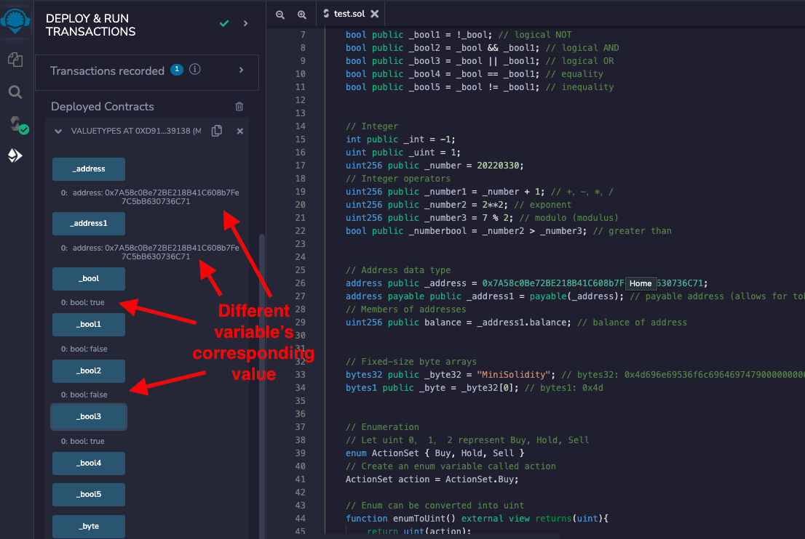

# WTF Solidity Tutorial: 2. Value Types

Recently, I have been revisiting Solidity, consolidating the finer details, and writing "WTF Solidity" tutorials for newbies. 

Twitter: [@0xAA_Science](https://twitter.com/0xAA_Science) | [@WTFAcademy_](https://twitter.com/WTFAcademy_)

Community: [Discord](https://discord.gg/5akcruXrsk)｜[Wechat](https://docs.google.com/forms/d/e/1FAIpQLSe4KGT8Sh6sJ7hedQRuIYirOoZK_85miz3dw7vA1-YjodgJ-A/viewform?usp=sf_link)｜[Website wtf.academy](https://wtf.academy)

Codes and tutorials are open source on GitHub: [github.com/AmazingAng/WTFSolidity](https://github.com/AmazingAng/WTFSolidity)


-----

## Variable Types

1. **Value Type**：This include boolean, integer, etc. These variables directly pass values when assigned.

2. **Reference Type**：including arrays and structures. These variables take up more space, directly pass addresses (similar to pointers) when assigned, and can be modified with multiple variable names.

3. **Mapping Type**: hash tables in Solidity.

4. **Function Type**：The Solidity documentation classifies functions into value types. But its very different from other types, and I put it in a separate category.

Only the commonly used types will be introduced here. In this chapter, we will introduce value types.

## Value types

### 1. Boolean

Boolean is a binary variable, and its values are `true` or `false`.

```solidity
    // Boolean
    bool public _bool = true;
```

Operators for Boolean type include:

- `!`   (logical NOT)
- `&&`  (logical AND)
- `||`  (logical OR)
- `==`  (equality)
- `!=`  (inequality)

Code：

```solidity
    // Boolean operators
    bool public _bool1 = !_bool; // logical NOT
    bool public _bool2 = _bool && _bool1; // logical AND
    bool public _bool3 = _bool || _bool1; // logical OR
    bool public _bool4 = _bool == _bool1; // equality
    bool public _bool5 = _bool != _bool1; // inequality
```

From the above source code：the value of the variable `_bool` is `true`; `_bool1` is not`_bool`, which yields `false`; `_bool && _bool1` is `false`；`_bool || _bool1` is `true`；`_bool == _bool1` is `false`；and `_bool != _bool1` is `true`.

**Important note：** The `&&` and `||` operator follows a short-circuit evaluation rule. This means that for an expression such as `f(x) || g(y)`, if `f(x)` is `true`, `g(y)` will not be evaluated.

### 2. Integers

Integers types in Solidity includes signed integer `int` and unsigned integer `uint`. It can store up to a 256-bit integers or data units.

```solidity
    // Integer
    int public _int = -1; // integers including negative numbers
    uint public _uint = 1; // non-negative numbers
    uint256 public _number = 20220330; // 256-bit positive integers
```
Commonly used integer operators include:

- Inequality operator (which returns a Boolean)： `<=`,  `<`,  `==`,  `!=`,  `>=`,  `>` 
- Arithmetic operator： `+`,  `-`,  `*`,  `/`,  `%` (modulo), `**` (exponent)

Code：

```solidity
    // Integer operations
    uint256 public _number1 = _number + 1; // +, -, *, /
    uint256 public _number2 = 2**2; // Exponent
    uint256 public _number3 = 7 % 2; // Modulo (Modulus)
    bool public _numberbool = _number2 > _number3; // Great than
```

You can run the above code and check the values of each variable.

### 3. Addresses

Addresses have following 2 types: 
- `address`: Holds a 20 byte value (size of an Ethereum address).

- `address payable`: Same as `address`, but with the additional members `transfer` and `send` to allow ETH transfers.

Code:

```solidity
    // Address
    address public _address = 0x7A58c0Be72BE218B41C608b7Fe7C5bB630736C71;
    address payable public _address1 = payable(_address); // payable address (can transfer fund and check balance)
    // Members of address
    uint256 public balance = _address1.balance; // balance of address
```

### 4. Fixed-size byte arrays

Byte arrays in Solidity come in two types:

- Fixed-length byte arrays: belong to value types, including `byte`, `bytes8`, `bytes32`, etc, depending on the size of each element (maximum 32 bytes). The length of the array can not be modified after declaration.
- Variable-length byte arrays: belong to reference type, including `bytes`, etc. The length of the array can be modified after declaration. We will learn more detail in later chapters


Code：

```solidity
    // Fixed-size byte arrays
    bytes32 public _byte32 = "MiniSolidity"; 
    bytes1 public _byte = _byte32[0]; 
```

In the above code, we assigned value `MiniSolidity` to the variable `_byte32`, or in hexadecimal: `0x4d696e69536f6c69646974790000000000000000000000000000000000000000`

And `_byte` takes the value of the first byte of `_byte32`, which is `0x4d`.

### 5. Enumeration

Enumeration (`enum`) is a user-defined data type within Solidity. It is mainly used to assign names to `uint`, which keeps the program easy to read.

Code:

```solidity
    // Let uint 0,  1,  2 represent Buy, Hold, Sell
    enum ActionSet { Buy, Hold, Sell }
    // Create an enum variable called action
    ActionSet action = ActionSet.Buy;
```

It can be converted to `uint` easily:

```solidity
    // Enum can be converted into uint
    function enumToUint() external view returns(uint){
        return uint(action);
    }
```

`enum` is a less popular type in Solidity. 

## Demo in Remix

- After deploying the contract, you can check the values of each variable:

   
  
- Conversion between enum and uint:

   

   

## Summary 

In this chapter, we introduced the variable types in Solidity, they are value type, reference type, mapping type, and function type. Then we introduced commonly used types: boolean, integer, address, fixed-length byte array, and enumeration in value types. We will cover other types in the subsequent tutorials.
