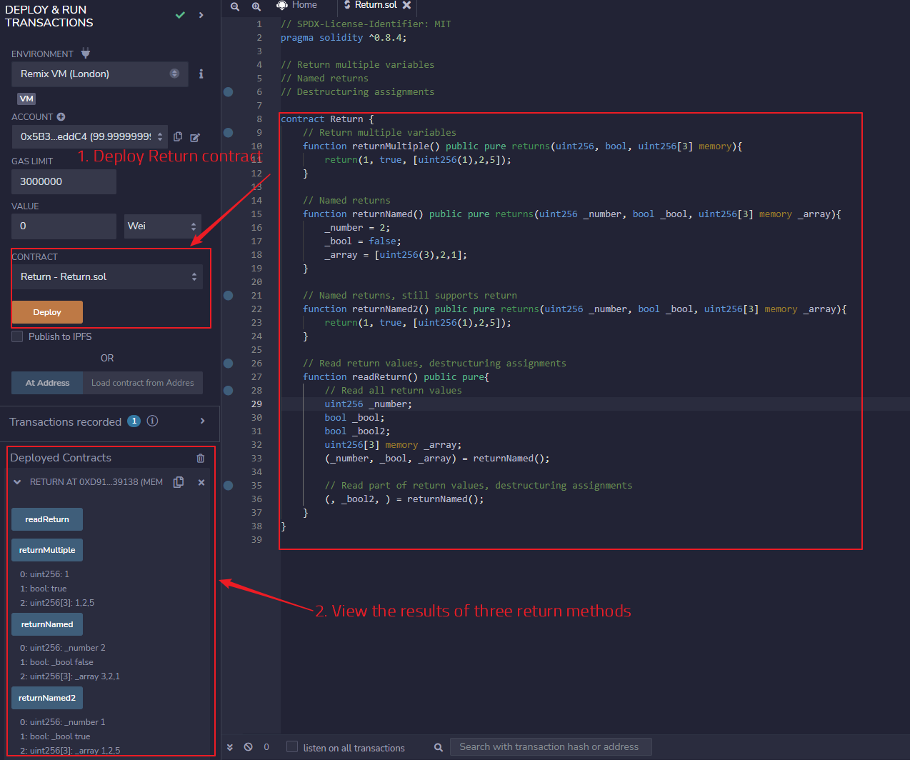

# Solidity Minimalist Primer: 4. Function output (return/returns)

Recently, I have been relearning the Solidity, consolidating the finer details, and also writing a "Solidity Minimalist Primer" for newbies to learn and use from (advanced programmers can find another tutorial). Lectures are updated 1~3 times weekly. 

Everyone is welcomed to follow my Twitter: [@0xAA_Science](https://twitter.com/0xAA_Science)

WTF Solidity Discord: [Link](https://discord.gg/5akcruXrsk)

All codebase and tutorial notes are open source and available on GitHub (At 1024 repo stars, course certification is unlocked. At 2048 repo stars, community NFT is unlocked.): [github.com/AmazingAng/WTFSolidity](https://github.com/AmazingAng/WTFSolidity)

-----

In this section, we will introduce `Solidity` function output including return multiple variables, named returns, and reading full and part of return values using destructuring assignments. 

## Return values(return and returns)
`There are two keywords about function output: `return` and `returns`, which differ from:`
- `returns` is added after the function name to declare the variable type and variable name;
- `return` is used for the function body and returns the specified variables.

```solidity
    // return multiple variables
    function returnMultiple() public pure returns(uint256, bool, uint256[3] memory){
            return(1, true, [uint256(1),2,5]);
        }
```
In the above code, we stated that the `returnMultiple()` function will have multiple outputs: `returns (uint256, bool, uint256[3] memory) `, and then we determined the return values in the function body with `return (1, true, [uint256 (1), 2,5]) `.

## Named returns
We can indicate the name of the return variables in the `returns`, so that the `solidity` automatically initializes these variables, and automatically returns the values of these functions, without adding a `return`.

```solidity
    // named returns
    function returnNamed() public pure returns(uint256 _number, bool _bool, uint256[3] memory _array){
        _number = 2;
        _bool = false; 
        _array = [uint256(3),2,1];
    }
```
In the above code, we declare the return variable type and variable name with the `returns (uint256 _number, bool _bool, uint256[3] memory _array) `. This way, we will only need to assign values to the variables ` _ number` in the body, ` _bool ` and ` _array ` and they will automatically return.

Of course, you can also return variables with `return` in named returns:
```solidity
    // Named return, still support return
    function returnNamed2() public pure returns(uint256 _number, bool _bool, uint256[3] memory _array){
        return(1, true, [uint256(1),2,5]);
    }
```
## Destructuring assignments
`solidity` uses rules for destructuring assignments and supports the full or part of return values of the function.
- Read all return values: declare variables and variables to be assigned are separated by `, ` in order.
```solidity
        uint256 _number;
        bool _bool;
        uint256[3] memory _array;
        (_number, _bool, _array) = returnNamed();
```
- Read part of return values: declare the variable corresponding to the return values to read, keep the values not to read blank . In the following code, we only read the ` _bool `, but not the returned ` _ number` and ` _array `:
```solidity
        (, _bool2, ) = returnNamed();
```

## Verify on Remix
- View the results of the three return methods after deploying the contract



## Tutorial summary
In this section, we introduced function return values `return` and `returns`, including return multiple variables, named returns, and reading full and part of return values using destructuring assignments. 


