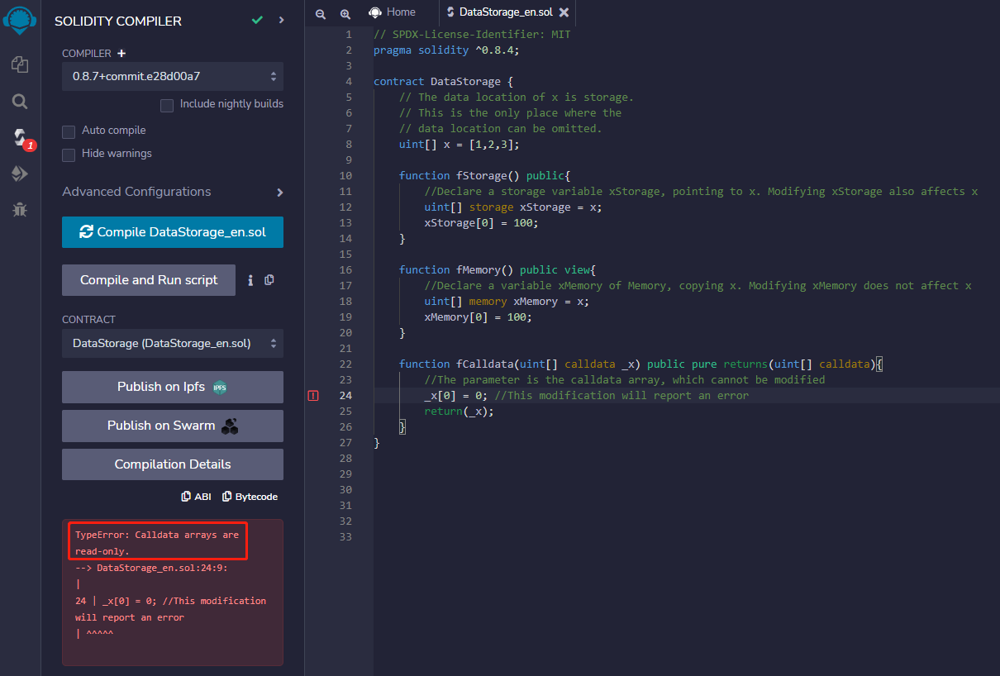
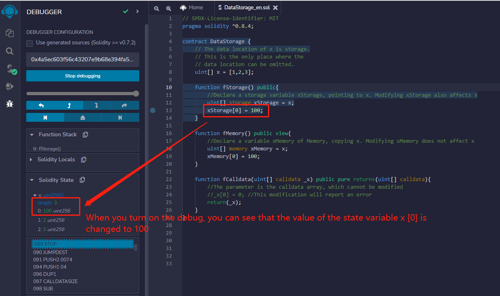

# Solidity Minimalist Tutorial: Tutorial 5. Variable data storage and scope storage/memory/calldata

Recently, I have been relearning the Solidity, consolidating the finer details, and also writing a "Solidity Minimalist Tutorial" for newbies to learn. Lectures are updated 1 o 3 times weekly. 

Everyone is welcomed to follow my Twitter: [@0xAA_Science](https://twitter.com/0xAA_Science)

WTF Solidity Discord server, herein contains the method to join the Chinese WeChat communinity: [Link](https://discord.gg/5akcruXrsk)

All codebase and tutorial notes are open source and available on GitHub (At 1024 repo stars, course certification is unlocked. At 2048 repo stars, community NFT is unlocked.): [github.com/AmazingAng/WTFSolidity](https://github.com/AmazingAng/WTFSolidity)

-----

## Reference types in Solidity
**Reference Type**:include `array`, `struct` and `mapping`, This type of variable takes up a lot of space, and the address (similar to a pointer) is directly passed when assigning a value. 

Because such variables are complex and take up a lot of storage space, we must declare the location of the data storage when using them.

## data location
There are three types of solidity data storage locations:`storage`, `memory` and `calldata`. `gas` cost is different for different storage locations. 

The data of `storage` type is stored on the chain, similar to the hard disk of a computer, and consumes a lot of `gas`；

Temporary storage of `memory` and `calldata` types in memory, consumes less `gas`. 

General usage:

1. `storage`: The state variables in the contract are `storage` by default, which are stored on the chain. 

2. `memory`: The parameters and temporary variables in the function generally use `memory`, which is stored in memory and not on the chain. 

3. `calldata`: Similar to `memory`, stored in memory, not on the chain. The difference from `memory` is that the `calldata` variable cannot be modified (`immutable`), and is generally used for function parameters. Example:

```solidity
    function fCalldata(uint[] calldata _x) public pure returns(uint[] calldata){
        //The parameter is the calldata array, which cannot be modified.
        // _x[0] = 0 //This modification will report an error.
        return(_x);
    }
```
**Example:**


### Rules for assigning different types to each other
When different storage types are assigned to each other, sometimes an independent copy is generated (modifying the new variable will not affect the original variable), and sometimes a reference is generated (modifying the new variable will affect the original variable). The rules are as follows:

1. When `storage` (the state variable of the contract) is assigned to the local `storage` (in the function), a reference will be created, and changing the new variable will affect the original variable. Example:
```solidity
    uint[] x = [1,2,3]; // state variable: array x

    function fStorage() public{
        //Declare a storage variable xStorage, pointing to x. Modifying xStorage will also affect x
        uint[] storage xStorage = x;
        xStorage[0] = 100;
    }
```
**Example:**


2. Assigning `storage` to `memory` creates separate copies, and changes to one will not affect the other; and vice versa. Example:
```solidity
    uint[] x = [1,2,3]; // state variable: array x
    
    function fMemory() public view{
        //Declare a variable xMemory of Memory, copy x. Modifying xMemory will not affect x
        uint[] memory xMemory = x;
        xMemory[0] = 100;
    }
```
**Example:**


3. Assigning `memory` to `memory` will create a reference, and changing the new variable will affect the original variable.

4. Otherwise, assigning a variable to `storage` will create separate copies, and modifying one will not affect the other.

## variable scope
There are three types of variables in `Solidity` according to their scope, which are state variables, local variables and global variables.
### 1. State variables
State variables are variables whose data is stored on the chain and can be accessed by all in-contract functions, `gas` consumption is high. 
State variables are declared inside contracts and outside functions:
```solidity
contract Variables {
    uint public x = 1;
    uint public y;
    string public z;
```

We can change the value of the state variable in the function:
```solidity
    function foo() external{
        // You can change the value of the state variable in the function
        x = 5;
        y = 2;
        z = "0xAA";
    }
```

### 2. Local variable
Local variables are variables that are only valid during function execution. After the function exits, the variables are invalid. The data of local variables is stored in memory, not on the chain, and `gas` is low. 
Local variables are declared inside a function:
```solidity
    function bar() external pure returns(uint){
        uint xx = 1;
        uint yy = 3;
        uint zz = xx + yy;
        return(zz);
    }
```

### 3. Global variable
Global variables are variables that work in the global scope and are reserved keywords for `solidity`. They can be used directly in functions without declaring them:

```solidity
    function global() external view returns(address, uint, bytes memory){
        address sender = msg.sender;
        uint blockNum = block.number;
        bytes memory data = msg.data;
        return(sender, blockNum, data);
    }
```
In the above example, we use three common global variables: `msg.sender`, `block.number` and `msg.data`, which represent the request originating address, current block height, and request data respectively. 

Below are some commonly used global variables, see this for a more complete list[Link](https://learnblockchain.cn/docs/solidity/units-and-global-variables.html#special-variables-and-functions):

- `blockhash(uint blockNumber)`: (`bytes32`)         The hash of the given block - only applies to the 256 most recent block, not the current block. 
- `block.coinbase`             : (`address payable`) The address of the current block miner
- `block.gaslimit`             : (`uint`)            The gaslimit of the current block
- `block.number`               : (`uint`)            The number of the current block
- `block.timestamp`            : (`uint`)            The timestamp of the current block, in seconds since the unix epoch
- `gasleft()`                  : (`uint256`)         Remaining gas
- `msg.data`                   : (`bytes calldata`)  Full call data
- `msg.sender`                 : (`address payable`) Message sender (current caller)
- `msg.sig`                    : (`bytes4`)          First four bytes of calldata (function identifier)
- `msg.value`                  : (`bytes4`)          First four bytes of calldata (function identifier)

**Example:**

## Summarize
In Tutorial 4, we covered reference types, data locations and variable scope in `solidity`. The focus is on the usage of the three keywords `storage`, `memory` and `calldata`. 

The reason they appear is to save on-chain limited storage space and reduce `gas`. 

In the next lecture we will introduce arrays in reference types. 

