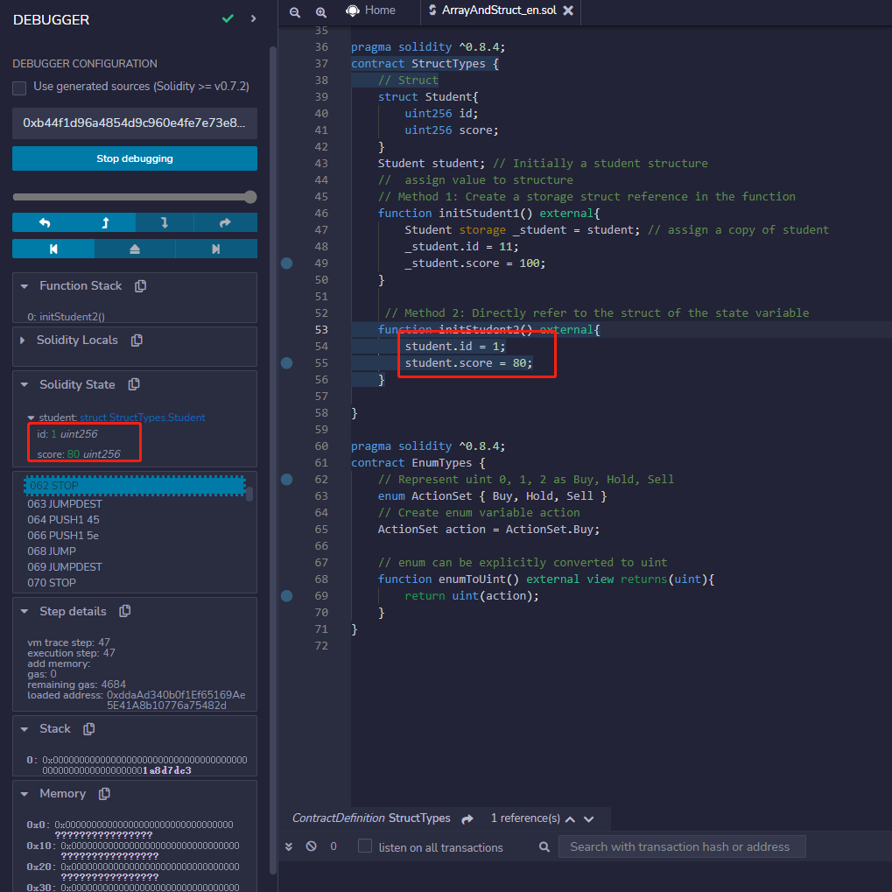

# WTF Solidity Tutorial: 6. Array & Struct

Recently, I have been revisiting Solidity, consolidating the finer details, and writing "WTF Solidity" tutorials for newbies. 

Twitter: [@0xAA_Science](https://twitter.com/0xAA_Science) | [@WTFAcademy_](https://twitter.com/WTFAcademy_)

Community: [Discord](https://discord.gg/5akcruXrsk)｜[Wechat](https://docs.google.com/forms/d/e/1FAIpQLSe4KGT8Sh6sJ7hedQRuIYirOoZK_85miz3dw7vA1-YjodgJ-A/viewform?usp=sf_link)｜[Website wtf.academy](https://wtf.academy)

Codes and tutorials are open source on GitHub: [github.com/AmazingAng/WTFSolidity](https://github.com/AmazingAng/WTFSolidity)


-----

In this lecture, we will introduce two important variable types in Solidity: `array` and `struct`.

## Array

An `array` is a variable type commonly used in Solidity to store a set of data (integers, bytes, addresses, etc.).

There are two types of arrays: fixed-sized and dynamically-sized arrays.：

- fixed-sized arrays: The length of the array is specified at the time of declaration. An `array` is declared in the format `T[k]`, where `T` is the element type and `k` is the length.

```solidity
    // fixed-length array
    uint[8] array1;
    byte[5] array2;
    address[100] array3;
```

- Dynamically-sized array（dynamic array）：Length of the array is not specified during declaration.  It uses the format of `T[]`, where `T` is the element type. 

```solidity
    // variable-length array
    uint[] array4;
    byte[] array5;
    address[] array6;
    bytes array7;
```

**Notice**: `bytes` is special case, it is a dynamic array, but you don't need to add `[]` to it. You can use either `bytes` or `bytes1[]` to declare byte array, but not `byte[]`. `bytes` is recommended and consumes less gas than `bytes1[]`.

### Rules for creating arrays

In Solidity, there are some rules for creating arrays：

- For a `memory` dynamic array, it can be created with the `new` operator, but the length must be declared, and the length cannot be changed after the declaration. For example：

```solidity
    // memory dynamic array
    uint[] memory array8 = new uint[](5);
    bytes memory array9 = new bytes(9);
```

- Array literal are arrays in the form of one or more expressions, and are not immediately assigned to variables; such as `[uint(1),2,3]` (the type of the first element needs to be declared, otherwise the type with the smallest storage space is used by default).

- When creating a dynamic array, you need an element-by-element assignment.

```solidity
    uint[] memory x = new uint[](3);
    x[0] = 1;
    x[1] = 3;
    x[2] = 4;
```

### Members of Array

- `length`: Arrays have a `length` member containing the number of elements, and the length of a `memory` array is fixed after creation.
- `push()`: Dynamic arrays have a `push()` member function that adds a `0` element at the end of the array.
- `push(x)`: Dynamic arrays have a `push(x)` member function, which can add an `x` element at the end of the array.
- `pop()`: Dynamic arrays have a `pop()` member that removes the last element of the array.

**Example:**


## Struct

You can define new types in the form of `struct` in Solidity. Elements of `struct` can be primitive types or reference types. And `struct` can be the element for `array` or `mapping`.

```solidity
    // struct
    struct Student{
        uint256 id;
        uint256 score; 
    }

    Student student; // Initially a student structure
```

 There are 4 ways to assign values to `struct`:

```solidity
    //  assign value to structure
    // Method 1: Create a storage struct reference in the function
    function initStudent1() external{
        Student storage _student = student; // assign a copy of student
        _student.id = 11;
        _student.score = 100;
    }
```

**Example:**


```solidity
     // Method 2: Directly refer to the struct of the state variable
    function initStudent2() external{
        student.id = 1;
        student.score = 80;
    }
```

**Example:**



```solidity
    // Method 3: struct constructor
    function initStudent3() external {
        student = Student(3, 90);
    }
    
    // Method 4: key value
    function initStudent4() external {
        student = Student({id: 4, score: 60});
    }
```


## Summary

In this lecture, we introduced the basic usage of `array` and `struct` in Solidity. In the next lecture, we will introduce the hash table in Solidity - `mapping`。

