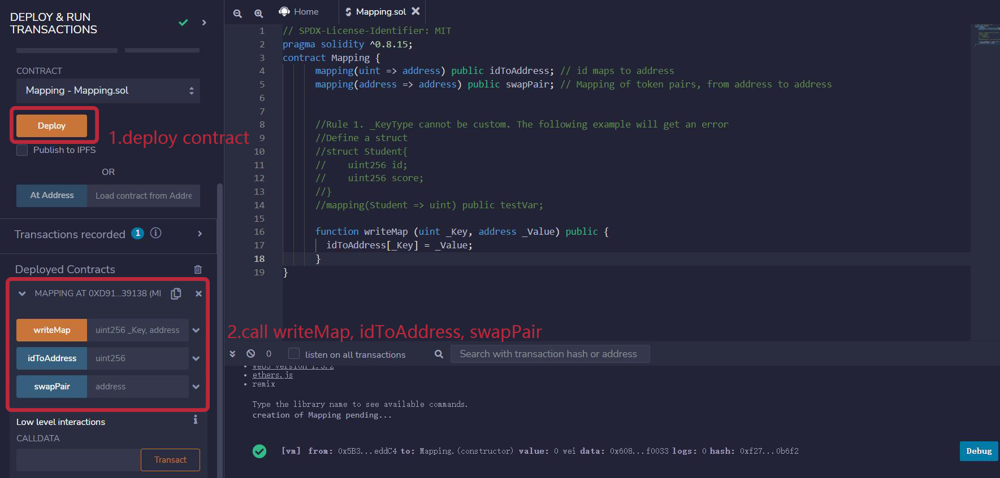
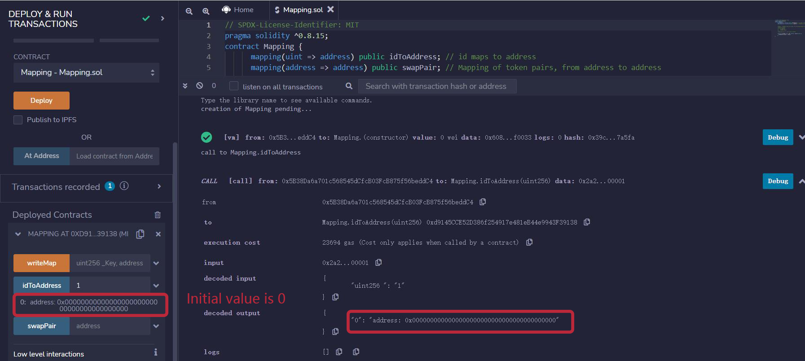
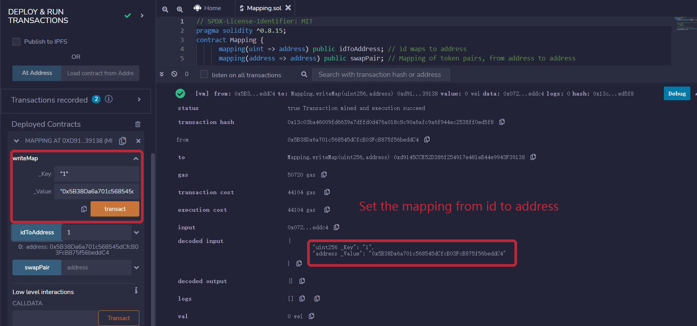

# Solidity Minimalist Primer: Tutorial 7. Mapping type

Recently, I have been relearning the Solidity, consolidating the finer details, and also writing a "Solidity Minimalist Primer" for newbies to learn and use from (advanced programmers can find another tutorial). Lectures are updated 1 o 3 times weekly. 

Everyone is welcomed to follow my Twitter: [@0xAA_Science](https://twitter.com/0xAA_Science)

WTF Solidity Discord server, herein contains the method to join the Chinese WeChat communinity: [Link](https://discord.gg/5akcruXrsk)

All codebase and tutorial notes are open source and available on GitHub (At 1024 repo stars, course certification is unlocked. At 2048 repo stars, community NFT is unlocked.): [github.com/AmazingAng/WTFSolidity](https://github.com/AmazingAng/WTFSolidity)

-----

In this section, we will introduce the hash table in Solidity: `Mapping` type.

## Mapping
In the mapping, people can query the corresponding `Value` by the `Key`. For example, a person's wallet address can be queried by his `id`.

The format of declaring the mapping is `mapping(_KeyType => _ValueType)`, where `_KeyType` and `_ValueType` are the variable types of `Key` and `Value` respectively. Example:
```solidity
    mapping(uint => address) public idToAddress; // id maps to address
    mapping(address => address) public swapPair; // Mapping of token pairs, from address to address
```

## Rules of mapping
- **Rule 1**: The `_KeyType` of the map can only select the default types in `solidity` such as ` uint `, `address`, etc. No custom struct can be used. However, `_ValueType` can use a custom type. The following example will throw an error, because `_KeyType` uses our custom struct:
```solidity
      //Define a struct
      struct Student{
          uint256 id;
          uint256 score;
      }
      mapping(Student => uint) public testVar;
```
- **Rule 2**: The storage location of the mapping must be `storage`, so it can be used for the state variable of the contract, the `storage` variable in the function. But it can't be used in arguments or return results of `public` function because what `mapping` records is a relationship (key - value pair).

- **Rule 3**: If the mapping is declared as `public` then `solidity` will automatically create a `getter` function for you to query for the Value by the Key.

- **Rule 4**：The syntax of adding a key-value pair to a mapping is `_Var[_Key] = _Value`, where '_Var' is the name of the mapping variable, and '_Key' and '_Value' correspond to the new key-value pair. An example is as follows:
```solidity
    function writeMap (uint _Key, address _Value) public {
        idToAddress[_Key] = _Value;
      }
```
## Principle of mapping
- **principle 1**: The mapping does not store any `key` information or length information.

- **principle 2**: Mapping use `keccak256(key)` as offset to access value.

- **principle 3**: Since Ethereum defines all unused space as 0, all `key` that are not assigned a `Value` will have an initial Value of 0.

## Verify on Remix (use `Mapping.sol` as example)
- Example of mapping 1 deploy

    

- Example of mapping 2 initial value

    

- Example of mapping 3 key-value pair

    


## Tutorial summary
In this section，we introduced the use of the hash table `Mapping` in `solidity`. So far, we've learned all kinds of common variables, and then we'll learn control flow such as `if-else`, `while` and so on..
