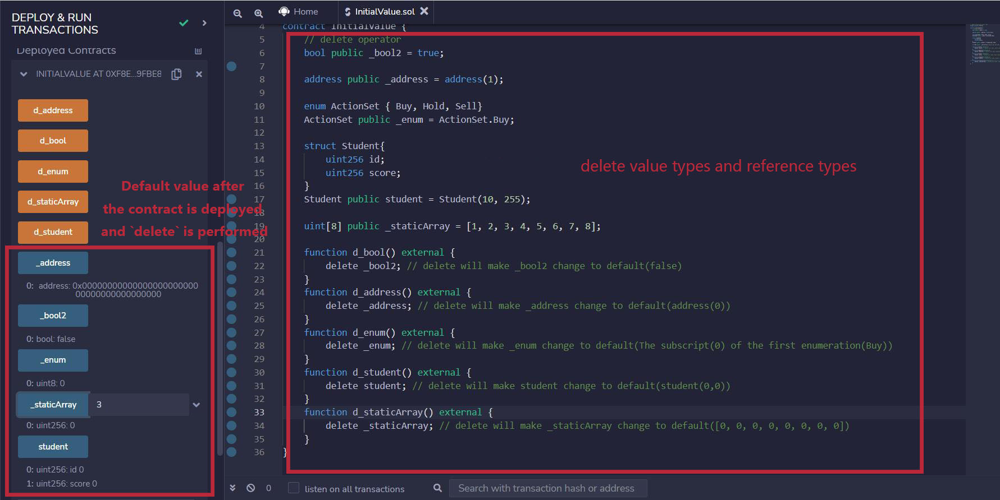

# Solidity Minimalist Tutorial: 8. Initial value

Recently, I have been relearning Solidity, consolidating the finer details, and also writing a "Solidity Minimalist Tutorial" for newbies to learn. Lectures are updated 1~3 times weekly. 

Everyone is welcomed to follow my Twitter: [@0xAA_Science](https://twitter.com/0xAA_Science)

WTF Academy Discord: [Link](https://discord.gg/5akcruXrsk)

All codebase and tutorial notes are open source and available on GitHub (At 1024 repo stars, course certification is unlocked. At 2048 repo stars, community NFT is unlocked.): [github.com/AmazingAng/WTFSolidity](https://github.com/AmazingAng/WTFSolidity)

-----

## Initial values of variables

In Solidity, variables declared but not assigned have their initial/default values. In this tutorial, we will introduce the initial values of common variables.

### Initial values of value types

- `boolean`: `false`
- `string`: `""`
- `int`: `0`
- `uint`: `0`
- `enum`: first element in enumeration
- `address`: `0x0000000000000000000000000000000000000000` (or `address(0)`)
- `function`
    - `internal`: blank equation
    - `external`: blank equation

You can use `getter` function of `public` variables to confirm the above initial values:

```solidity
    bool public _bool; // false
    string public _string; // ""
    int public _int; // 0
    uint public _uint; // 0
    address public _address; // 0x0000000000000000000000000000000000000000

    enum ActionSet {Buy, Hold, Sell}
    ActionSet public _enum; // first element 0

    function fi() internal{} // internal blank equation
    function fe() external{} // external blank equation
```

### Initial values of reference types

- `mapping`: a `mapping` which all members set to their default values
- `struct`: a `struct` which all members set to their default values

- `array`
    - dynamic array: `[]`
    - static array（fixed-length): a static array where all members set to their default values.

You can use `getter` function of `public` variables to confirm initial values:

```solidity
    // reference types
    uint[8] public _staticArray; // a static array which all members set to their default values[0,0,0,0,0,0,0,0]
    uint[] public _dynamicArray; // `[]`
    mapping(uint => address) public _mapping; // a mapping which all members set to their default values
    // a struct which all members set to their default values 0, 0
    struct Student{
        uint256 id;
        uint256 score; 
    }
    Student public student;
```

### `delete` operator

`delete a` will change the value of `a` to its initial value.

```solidity
    // delete operator
    bool public _bool2 = true; 
    function d() external {
        delete _bool2; // delete will make _bool2 change to default(false)
    }
```

## Verify on Remix

- Deploy `InitialValue.sol` and check the initial values of the different types.

    

- After using the `delete` operator, the value of the variables are reset to their initial values.

    

## Tutorial summary

In this section, we introduced the initial values of variables in Solidity. When a variable is declared but not assigned, its value defaults to the initial value. Variables with different types have different initial values. The `delete` operator can reset the value of the variable to the initial value.
