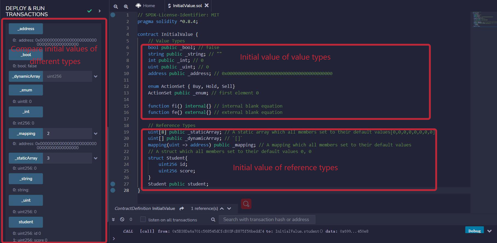

# Solidity Minimalist Primer: Tutorial 8. Initial value

Recently, I have been relearning the Solidity, consolidating the finer details, and also writing a "Solidity Minimalist Primer" for newbies to learn and use from (advanced programmers can find another tutorial). Lectures are updated 1 o 3 times weekly. 

Everyone is welcomed to follow my Twitter: [@0xAA_Science](https://twitter.com/0xAA_Science)

WTF Solidity Discord server, herein contains the method to join the Chinese WeChat communinity: [Link](https://discord.gg/5akcruXrsk)

All codebase and tutorial notes are open source and available on GitHub (At 1024 repo stars, course certification is unlocked. At 2048 repo stars, community NFT is unlocked.): [github.com/AmazingAng/WTFSolidity](https://github.com/AmazingAng/WTFSolidity)

-----

## Initial values of variables

In `solidity`, variables declared but not assigned have their initial or default values. In this section, we will introduce the initial values of common variables.

### Initial values of value types

- `boolean`: `false`
- `string`: `""`
- `int`: `0`
- `uint`: `0`
- `enum`: first element in enumeration
- `address`: `0x0000000000000000000000000000000000000000` (or `address(0)`)
- `function`
    - `internal`: blank equation
    - `external`: blank equation

You can use `getter` function of `public` variables to verify whether the initial value written above is correct:
```solidity
    bool public _bool; // false
    string public _string; // ""
    int public _int; // 0
    uint public _uint; // 0
    address public _address; // 0x0000000000000000000000000000000000000000

    enum ActionSet { Buy, Hold, Sell}
    ActionSet public _enum; // first element 0

    function fi() internal{} // internal blank equation
    function fe() external{} // external blank equation
```

### Initial values of reference types
- `mapping`: a `mapping` which all members set to their default values
- `struct`: a `struct` which all members set to their default values

- `array`
    - dynamic array: `[]`
    - static array（fixed length）: a static array which all members set to their default values.

You can use `getter` function of `public` variables to verify whether the initial value written above is correct:
```solidity
    // Reference Types
    uint[8] public _staticArray; // a static array which all members set to their default values[0,0,0,0,0,0,0,0]
    uint[] public _dynamicArray; // `[]`
    mapping(uint => address) public _mapping; // a mapping which all members set to their default values
    // a struct which all members set to their default values 0, 0
    struct Student{
        uint256 id;
        uint256 score; 
    }
    Student public student;
```

### `delete` operator
`delete a` will make the value of `a` change to initial value.
```solidity
    // delete operator
    bool public _bool2 = true; 
    function d() external {
        delete _bool2; // delete will make _bool2 change to default(false)
    }
```
## Verify on Remix
- Deploy and view initial values of value types and reference types


- Default value after `delete` value types and reference types


## Tutorial summary
In this section, We introduce the initial values of variables in `solidity`. When a variable is declared but not assigned, its value defaults to initial value. Different types of variables have different initial values. The `delete` operator can delete value of a variable and replace it with the initial value.
