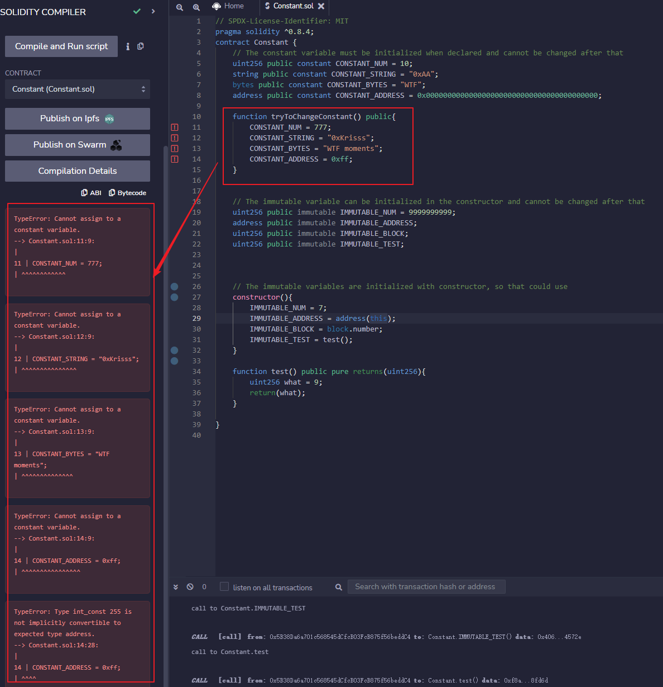
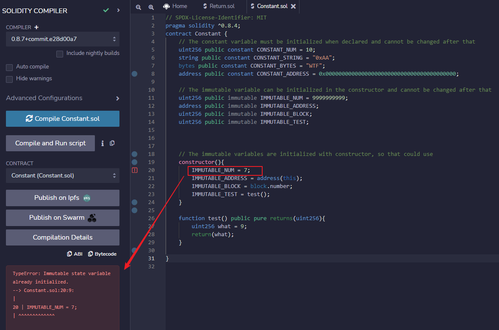

# WTF Solidity Tutorial: 9. Constant and Immutable

Recently, I have been revisiting Solidity, consolidating the finer details, and writing "WTF Solidity" tutorials for newbies. 

Twitter: [@0xAA_Science](https://twitter.com/0xAA_Science) | [@WTFAcademy_](https://twitter.com/WTFAcademy_)

Community: [Discord](https://discord.wtf.academy)｜[Wechat](https://docs.google.com/forms/d/e/1FAIpQLSe4KGT8Sh6sJ7hedQRuIYirOoZK_85miz3dw7vA1-YjodgJ-A/viewform?usp=sf_link)｜[Website wtf.academy](https://wtf.academy)

Codes and tutorials are open source on GitHub: [github.com/AmazingAng/WTFSolidity](https://github.com/AmazingAng/WTFSolidity)


-----

In this section, we will introduce two keywords in Solidity, `constant` and `immutable`. After the state variable are declared with them, you cannot change the values after the contract is compiled. They will restrict the modication of variables and save `gas`. 

Value-typed variables can declare them as `constant` and `immutable`; `string` and `bytes` can be declared as `constant`, but not as `immutable`.

## Constant and immutable

### Constant

The `constant` variable must be initialized when declared and cannot be changed afterwards. Any modification attempt will cause errors at compilation. 

``` solidity
    // The constant variable must be initialized when declared and cannot be changed after that
    uint256 constant CONSTANT_NUM = 10;
    string constant CONSTANT_STRING = "0xAA";
    bytes constant CONSTANT_BYTES = "WTF";
    address constant CONSTANT_ADDRESS = 0x0000000000000000000000000000000000000000;
```

### Immutable

The `immutable` variable can be initialized at declaration or in the constructor, so it is more flexible.

``` solidity
    // The immutable variable can be initialized in the constructor and cannot be changed later
    uint256 public immutable IMMUTABLE_NUM = 9999999999;
    address public immutable IMMUTABLE_ADDRESS;
    uint256 public immutable IMMUTABLE_BLOCK;
    uint256 public immutable IMMUTABLE_TEST;
```

You can initialize the `immutable` variable using a global variable such as `address(this)`, `block.number`, or a custom function. In the following example, we use the `test()` function to initialize the `IMMUTABLE_TEST` variable to a value of `9`:

``` solidity
    // The immutable variables are initialized with constructor, so that could use
    constructor(){
        IMMUTABLE_ADDRESS = address(this);
        IMMUTABLE_BLOCK = block.number;
        IMMUTABLE_TEST = test();
    }

    function test() public pure returns(uint256){
        uint256 what = 9;
        return(what);
    }
```


## Verify on Remix

1. After the contract is deployed, initialized values of the `constant` and `immutable` variables can be obtained through the `getter` function. 

      
   
2. After the `constant` variable is initialized, the contract cannot be compiled if there is an attempt to change its value and the compiler will issue an error of `TypeError: Cannot assign to a constant variable.`

      
   
3. After the `immutable` variable is initialized, the contract cannot be compiled if there is an attempt to change its value and the compiler will issue an error of `TypeError: Immutable state variable already initialized.`

   

## Summary

In this section, we introduced two keywords in Solidity, `constant` and `immutable`, to keep the variables that should not be changed. It will help to save `gas` while improving the contract's security.


