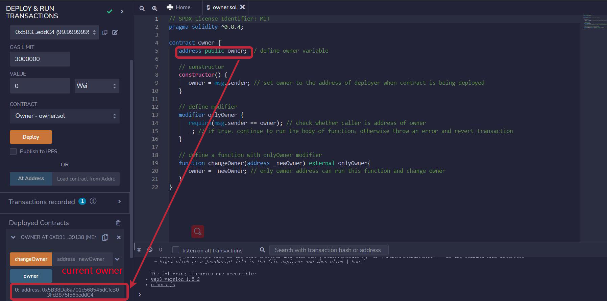

# WTF Solidity Tutorial: 10. Control Flow, and Solidity Implementation of Insertion Sort

Recently, I have been relearning Solidity, consolidating the finer details, and also writing a "WTF Solidity Tutorial" for newbies to learn. Lectures are updated 1~3 times weekly. 

Everyone is welcomed to follow my Twitter: [@0xAA_Science](https://twitter.com/0xAA_Science)

WTF Academy Discord, where you can find the way to join WeChat group: [Link](https://discord.gg/5akcruXrsk)

All codebase and tutorial notes are open source and available on GitHub (At 1024 repo stars, course certification is unlocked. At 2048 repo stars, community NFT is unlocked.): [github.com/AmazingAng/WTFSolidity](https://github.com/AmazingAng/WTFSolidity)

-----

In this section, we will introduce `constructor` and unique `modifier` in solidity language using the example of contract privilege control（`Ownable`）.

## constructor
`constructor` is a special function and each contract can define one, which will automatically run once when the contract is deployed. It can be used to initialize some parameters of a contract. For example, it can initialize `owner` address of a contract:
```solidity
   address owner; // define owner variable

   // constructor
   constructor() {
      owner = msg.sender; //  set owner to the address of deployer when contract is being deployed
   }
```

**notice**⚠️：The syntax of constructor in different solidity versions is not consistent，Before Solidity 0.4.22, constructors did not use `constructor`. Instead, it used functions with the same name as the contract name as constructor. This old method of writing makes it easy for developers to make mistakes in writing (e.g., the contract is called `Parents` and the constructor is called `parents`), making constructor change to a normal function and occurring a mistake, So in version 0.4.22 and later, new writing of `constructor` was used.

Example of old code of constructor：
```solidity
pragma solidity =0.4.21;
contract Parents {
    // The function with the same name as the contract name(Parents) is constructor
    function Parents () public {
    }
}
```
## modifier
`modifier` is unique syntax of `solidity`. It is similar to `decorator` in object-oriented programming, which used to declare peculiar properties of functions and reduce code redundancy. It's like Iron Man's intelligent armor. The function wear it will have some specific behaviors. The main use scenario of modifier is to check before running a function, such as address, variable, balance, etc.


Let's define a modifier called `onlyOwner`：
```solidity
   // define modifier
   modifier onlyOwner {
      require(msg.sender == owner); // check whether caller is address of owner
      _; // if true，continue to run the body of function；otherwise throw an error and revert transaction
   }
```
Functions with `onlyOwner` modifier can only be called by `owner` address, as in the following example：
```solidity
   function changeOwner(address _newOwner) external onlyOwner{
      owner = _newOwner; // only owner address can run this function and change owner
   }
```
We define a `changeOwner` function, which can be run to change the `owner` of contract. However, due to the `onlyOwner` modifier, only original `owner` can call and an error will be thrown if others call. This is also the most common way to control smart contract privilege.

### OppenZepplin's standards implementation of Ownable：
`OppenZepplin` is an organization that maintains a standardized code base for `Solidity`, His standard implementation of `Ownable` is as follows：
[https://github.com/OpenZeppelin/openzeppelin-contracts/blob/master/contracts/access/Ownable.sol](https://github.com/OpenZeppelin/openzeppelin-contracts/blob/master/contracts/access/Ownable.sol)

## Remix Demo example
Take `Owner.sol` for example.
1. compile and deploy code in Remix.
2. click `owner` button to view current owner variable.
    
3. The transaction succeeds when `changeOwner` function is called by the owner address user.
    
4. The transaction fails when `changeOwner` function is not called by the owner address user, because the check statement of modifier `onlyOwner` is not satisfied.
    


## Summary
In this lecture, we introduced constructor and modifier in `solidity` and learned an `Ownable` contract which controls contract privilege.
