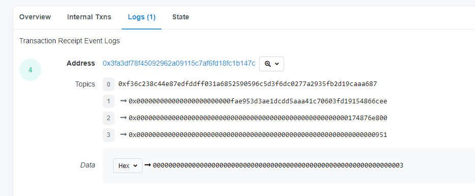
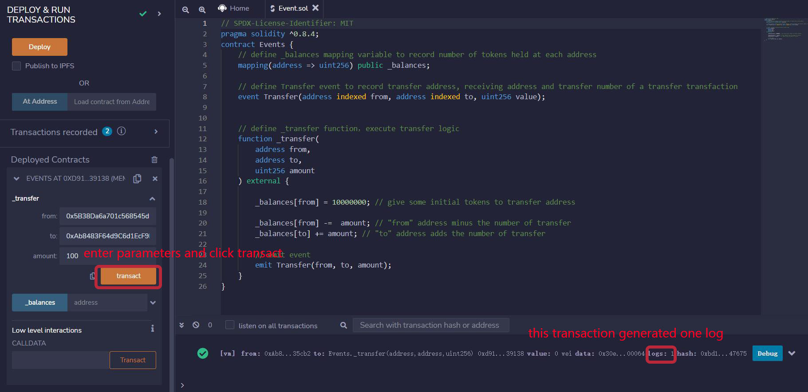
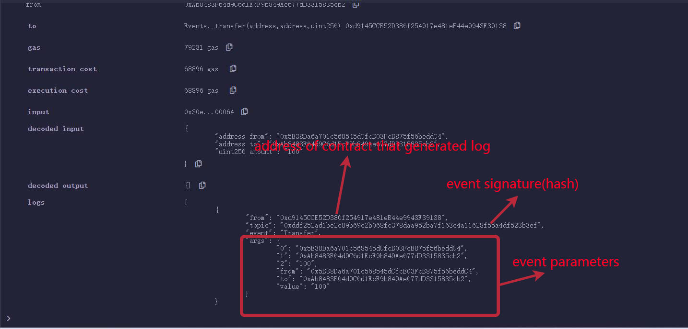

# WTF Solidity Tutorial: 10. Control Flow, and Solidity Implementation of Insertion Sort

Recently, I have been relearning Solidity, consolidating the finer details, and also writing a "WTF Solidity Tutorial" for newbies to learn. Lectures are updated 1~3 times weekly. 

Everyone is welcomed to follow my Twitter: [@0xAA_Science](https://twitter.com/0xAA_Science)

WTF Academy Discord, where you can find the way to join WeChat group: [Link](https://discord.gg/5akcruXrsk)

All codebase and tutorial notes are open source and available on GitHub (At 1024 repo stars, course certification is unlocked. At 2048 repo stars, community NFT is unlocked.): [github.com/AmazingAng/WTFSolidity](https://github.com/AmazingAng/WTFSolidity)

-----

In this section, we take transferring ERC20 tokens for example to introduce `event` in `solidity`.

## event
`event` in `solidity` is an abstraction of the log on `EVM`. It has two characteristics：

- response：Applications([`ether.js`](https://learnblockchain.cn/docs/ethers.js/api-contract.html#id18))can subscribe and listen to these events through `RPC` interface and respond at front end.
- economical：`event` is an economical way to store data on `EVM`, each costing about 2,000 `gas`; By comparison, it takes at least 20,000 `gas` to store a new variable on the chain.

### rule
The declaration of event starts with the `event` keyword, followed by event name, then the type and name of variables to be recorded in parenthesis. Take the `Transfer` event of the `ERC20` token contract for example：
```solidity
event Transfer(address indexed from, address indexed to, uint256 value);
```
We can see that `Transfer` event records three variables `from`，`to` and `value`，which correspond to the transfer address of token, the receiving address and transfer number.

At the same time, `from` and `to` are marked by the keyword `indexed`. Each variable marked by `indexed` can be understood as the index "key" of retrieving events, which is stored and indexed separately as a `topic` on Ethereum, so program can easily screen out specific transfer address and transfer event of receiving address. Each event has up to three variables marked with `indexed`. The size of each `indexed` variable is fixed 256 bits. The hash of event and these three variables marked with `indexed` are usually stored as `topic` in `EVM` log, where `topic[0]` is `keccak256` hash of this event, and `topic[1]` to `topic[3]` store `keccak256` hash of variables marked with `indexed`.


`value` which doesn't marked with `indexed` will be stored in `data` section of the event, and it can be interpreted as "value" of the event. Variables in `data` section can't be retrieved directly, but it can store data of any size. Therefore, in general, `data` section can be used to store complex data structures, such as arrays and strings, etc., because these data exceed 256 bits. Even if stored in `topic` section of the event, it is stored in the hash way. Besides, Variables in `data` part consume less gas on storage compared to `topic`.

We can emit events in functions. In the following example, each time the `_transfer()` function is used to transfer token, `Transfer` event will be emitted and corresponding variables will be recorded.
```solidity
    // define _transfer function，execute transfer logic
    function _transfer(
        address from,
        address to,
        uint256 amount
    ) external {

        _balances[from] = 10000000; // give some initial tokens to transfer address

        _balances[from] -=  amount; // "from" address minus the number of transfer
        _balances[to] += amount; // "to" address adds the number of transfer

        // emit event
        emit Transfer(from, to, amount);
    }
```

### Remix demo
Take `Event.sol` contract for example，compile and deploy.

Then call `_transfer` function.


Click transaction on the right to view details of the log


### Query event on etherscan
We try to transfer 100 tokens on `Rinkeby` test network by `_transfer()` function, and the corresponding `tx` can be queried on `etherscan`：[URL](https://rinkeby.etherscan.io/tx/0x8cf87215b23055896d93004112bbd8ab754f081b4491cb48c37592ca8f8a36c7)

Click `Logs` button to see details of the event：


There are three elements in `Topics`, `[0]` is hash of the event, `[1]` and `[2]` are the information of two variables marked with `indexed` we defined, namely outgoing address and receiving address of the transfer. The remaining element in `Data` is variable without `indexed`, namely the transfer number.

## Summary
In this lecture, we introduced how to use and query events in `solidity`. Many on-chain Analysis tools, including `Nansen` and `Dune Analysis`, work based on events.
