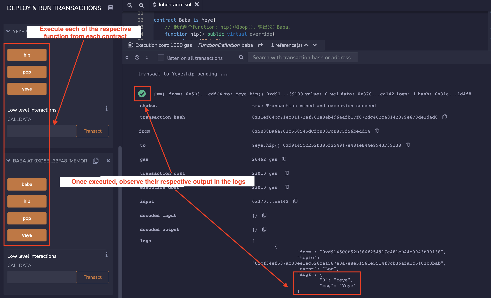
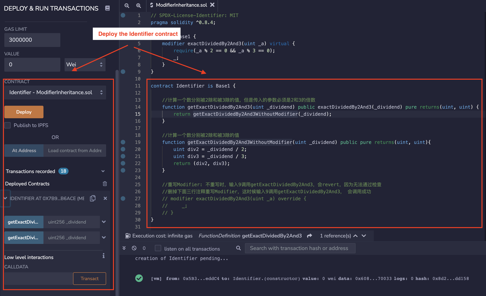
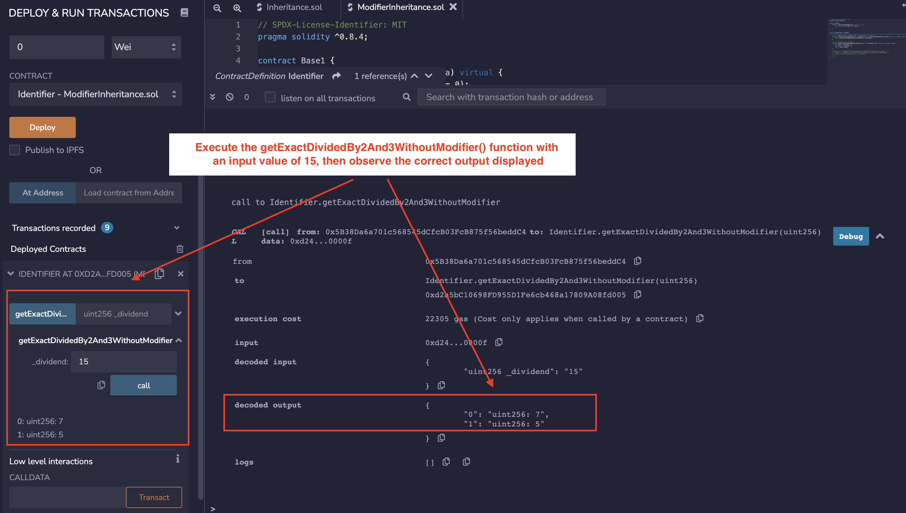
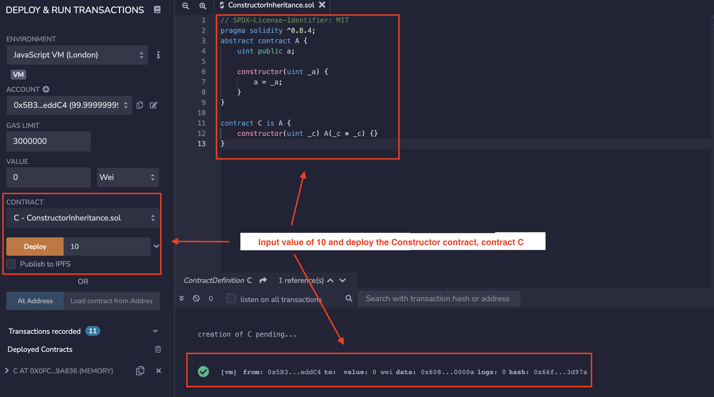
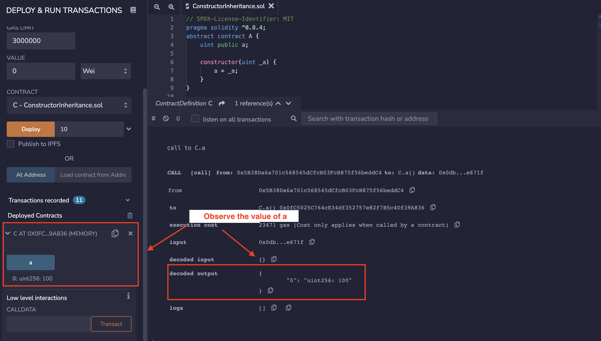

# WTF Solidity Tutorial: 13. Inheritance

Recently, I have been revisiting Solidity, consolidating the finer details, and writing "WTF Solidity" tutorials for newbies. 

Twitter: [@0xAA_Science](https://twitter.com/0xAA_Science) | [@WTFAcademy_](https://twitter.com/WTFAcademy_)

Community: [Discord](https://discord.wtf.academy)｜[Wechat](https://docs.google.com/forms/d/e/1FAIpQLSe4KGT8Sh6sJ7hedQRuIYirOoZK_85miz3dw7vA1-YjodgJ-A/viewform?usp=sf_link)｜[Website wtf.academy](https://wtf.academy)

Codes and tutorials are open source on GitHub: [github.com/AmazingAng/WTFSolidity](https://github.com/AmazingAng/WTFSolidity)

-----

In this section, we introduce inheritance in Solidity, including single inheritance, multiple inheritance, and inheritance of modifiers and constructors.

## Inheritance
Inheritance is an important part of object-oriented programming and can significantly reduce code duplication. If contracts are considered objects, Solidity is also object-oriented programming language and supports the use of inheritance.

### Function overriding rules
- `virtual`:  For child contract to be able to override the base functions in the parent contract, the `virtual` keyword must be stated.

- `override`：The child contract can override the function in the parent contract by adding the `override` keyword.

### Single inheritance

Let's start by writing a simple `Grandfather` contract, which contains 1 `Log` event and 3 functions: `hip()`, `pop()`, `grandfather()`, with the output `"Grandfather"`.

```solidity
contract Grandfather {
    event Log(string msg);

    // Apply inheritance to the following 3 functions: hip(), pop(), man()，then log "Grandfather".
    function hip() public virtual{
        emit Log("Grandfather");
    }

    function pop() public virtual{
        emit Log("Grandfather");
    }

    function Grandfather() public virtual {
        emit Log("Grandfather");
    }
}
```

Let's define another contract called `Father` and let him inherit the `Grandfather` contract, the syntax is `contract Father is Grandfather`, which is very intuitive when applied to understanding inheritance. In the `Father` contract, we rewrote the functions `hip()` and `pop()`, added the `override` keyword, and changed their output to `Father`; we also added a new function called `father` with the output `"Father"`.


```solidity
contract Father is Grandfather{
    // Apply inheritance to the following 2 functions: hip() and pop()，then change the log value to "Father".
    function hip() public virtual override{
        emit Log("Father");
    }

    function pop() public virtual override{
        emit Log("Father");
    }

    function father() public virtual{
        emit Log("Father");
    }
}
```

When we deploy the contract, we can see that there are 4 functions in the `Father` contract, where the outputs of `hip()` and `pop()` are successfully rewritten as `Father`, while the output of the inherited `grandfather()` function is still `"Gatherfather"`.


### Multiple inheritance

A Solidity contract can inherit multiple contracts together, this is called multiple inheritance. The rules are:

Inheritance should be arranged in the order of the highest to the lowest order, in this case, the order from the highest to lowest generational senority, similar to a hierarchical sequence. For example, if we write a `Son` contract and inherit the `Grandfather` contract and the `Father` contract, then we must write `contract Son is Gatherfather, Father`, and not `contract son is Father, Gatherfather`, otherwise it will output an error.

When overriding a renamed function in multiple parent contracts, the `override` keyword is followed by all parent contract names, such as `override(Grandfather, Father)`.

Example：
```solidity
contract Son is Grandfather, Father{
    // Apply inheritance to the following 2 functions: hip() and pop()，then change the log value to "Son".
    function hip() public virtual override(Grandfather, Father){
        emit Log("Son");
    }

    function pop() public virtual override(Grandfather, Father) {
        emit Log("Son");
    }
```

We can see that in the `Son` contract, we rewrote the `hip()` and `pop()` functions, changed the output to `"Son"`, and also inherited the `grandfather()` and `father()` functions from the `Grandfather` and `Father` contracts, respectively.

### Inheritance of modifiers

Likewise, modifiers in Solidity can be inherited as well. The usage is similar to the inheritance function, where one only need to add the `virtual` and `override` keywords to the corresponding places.

```solidity
contract Base1 {
    modifier exactDividedBy2And3(uint _a) virtual {
        require(_a % 2 == 0 && _a % 3 == 0);
        _;
    }
}

contract Identifier is Base1 {

    // Calculate the value of a number divided by 2 and divided by 3, respectively, but the parameters passed in must be multiples of 2 and 3
    function getExactDividedBy2And3(uint _dividend) public exactDividedBy2And3(_dividend) pure returns(uint, uint) {
        return getExactDividedBy2And3WithoutModifier(_dividend);
    }

    // Calculate the value of a number divided by 2 and divided by 3, respectively
    function getExactDividedBy2And3WithoutModifier(uint _dividend) public pure returns(uint, uint){
        uint div2 = _dividend / 2;
        uint div3 = _dividend / 3;
        return (div2, div3);
    }
}
```

The identifier above can use the exactDividedBy2And3 modifier directly in the code, or it can be rewritten as shown in the following code sample.

```solidity
    modifier exactDividedBy2And3(uint _a) override {
        _;
    }
```

### Inheritance of constructors

There are two ways to inherit the constructor of a parent contract. For example, the parent contract `A` will have a state variable `a` in it, which is determined by the parameters of the constructor:

```solidity
// Applying inheritance to the constructor functions
abstract contract A {
    uint public a;

    constructor(uint _a) {
        a = _a;
    }
}
```

1. Declare the parameters of the parent constructor at inheritance time. For example: `contract B is A(1)`.
2. Declare the constructor's parameters in the constructor of the child contract. For example:

```solidity
contract C is A {
    constructor(uint _c) A(_c * _c) {}
}
```

### Calling the functions from the parent contracts

There are two ways for a child contract to call the functions of the parent contract, either directly or by using the `super` keyword.

1. Direct calling：The child contract can directly use the `parentContractName.functionName()` way to call on the parent contract's function. For example, `Grandfather.pop()`.

```solidity
    function callParent() public{
        Grandfather.pop();
    }
```

2. `super` keyword：The child contract can use the `super.functionName()` to call on the parent contract's function in hierarchical order. Solidity child contracts can use the `super.functionName()` way to use the parent contract's function that is the most derived. Solidity inheritance relationships are in right-to-left order when declared：`contract Son is Grandfather, Father`，then `Father` is the most derived parent contract，so a `super.pop()` function will call for `Father.pop()` and not `Grandfather.pop()`：

```solidity
    function callParentSuper() public{
        // Calling for the most derived parent contract，Father.pop()
        super.pop();
    }
```

#### Multiple inheritance + diamond inheritance 

The diamond inheritance problem, also known as the diamond problem, means that a derived class has two or more base classes at the same time.
When using the `super` keyword on a multiple + diamond inheritance chain, it should be noted that using the `super` keyword will call the relevant function of each contract in the inheritance chain, not just the nearest parent contract.

We first write a contract called `God`, and let `Adam` and `Eve` inherit this contract. Finally, we let the creation contract `people` inherit from `Adam` and `Eve`, take note that each contract has the two functions of `foo` and `bar` in their respective contracts.

```solidity
// SPDX-License-Identifier: MIT
pragma solidity ^0.8.13;

/* Inheritance tree visualized：
  God
 /  \
Adam Eve
 \  /
people
*/
contract God {
    event Log(string message);
    function foo() public virtual {
        emit Log("God.foo called");
    }
    function bar() public virtual {
        emit Log("God.bar called");
    }
}
contract Adam is God {
    function foo() public virtual override {
        emit Log("Adam.foo called");
        Adam.foo();
    }
    function bar() public virtual override {
        emit Log("Adam.bar called");
        super.bar();
    }
}
contract Eve is God {
    function foo() public virtual override {
        emit Log("Eve.foo called");
        Eve.foo();
    }
    function bar() public virtual override {
        emit Log("Eve.bar called");
        super.bar();
    }
}
contract people is Adam, Eve {
    function foo() public override(Adam, Eve) {
        super.foo();
    }
    function bar() public override(Adam, Eve) {
        super.bar();
    }
}
```

In this example, calling the `super.bar()` function in the `people` contract will in turn call the `Eve`, `Adam`, and finally `God` contract's `bar()` function, respectively.

Although `Eve` and `Adam` are both child contracts of the `God` parent contract, the `God` contract will only be called once in the whole process. The specific reason is that Solidity borrows the way of Python, forcing a DAG (directed acyclic graph) composed of base classes to guarantee a specific order based on C3 Linearization. For more information on inheritance and linearization, read the official [Solidity docs here](https://docs.soliditylang.org/en/v0.8.17/contracts.html#multiple-inheritance-and-linearization).

## Verify on Remix
- Example of simple inheritance of contracts, it can be observed that the `Father` contract has `Grandfather` functions, too.

  

  

* For multiple inheritance of contracts, you can refer to the operation steps of simple inheritance to increase the deployment of the child contracts, and then observe the exposed functions and try to call them to view the logs

- Inheritance of modifiers examples

  
  
  
  
  
  
- Inheritance of constructor examples

  
  
  
  
- Calling the functions from parent contracts

  
  
  
  
- Diamond inheritance example

   

## Summary
In this tutorial, we introduced the basic uses of Solidity's inheritance function, including simple inheritance, multiple inheritance, inheritance of modifiers and constructors, and calling functions from the parent contract.
