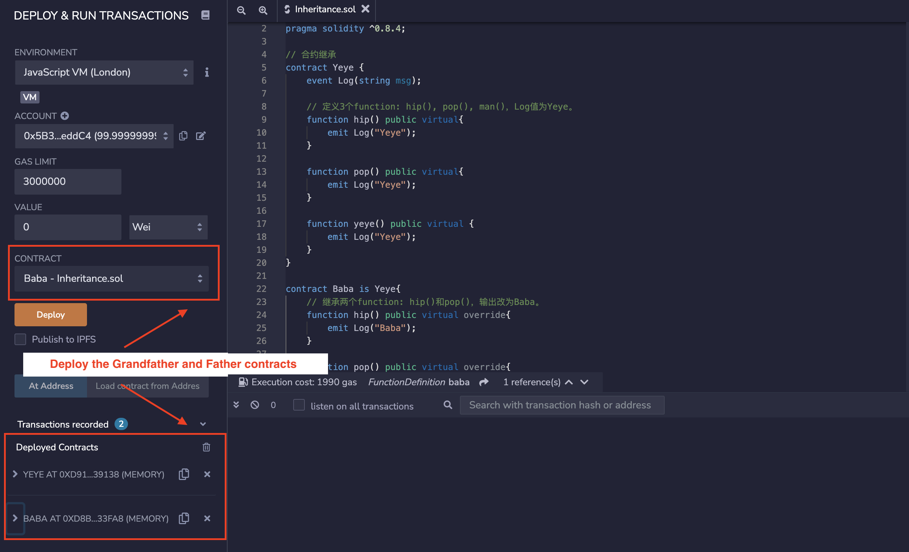
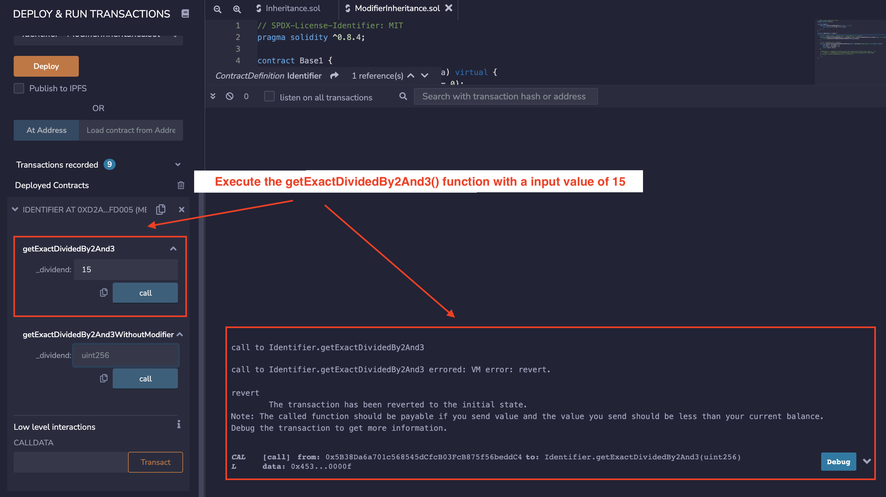
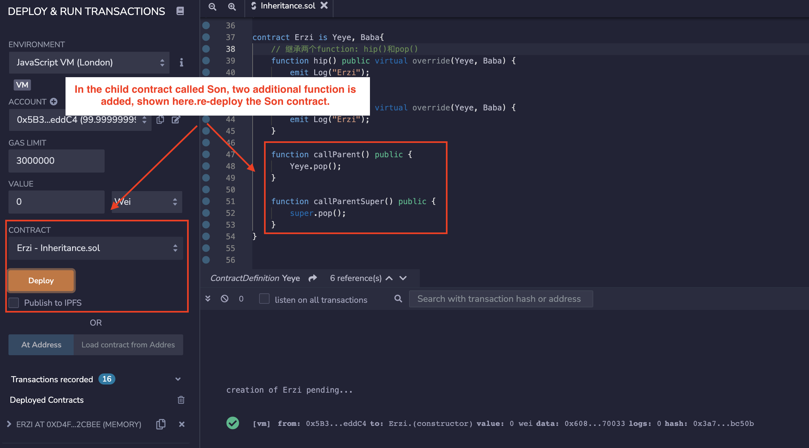
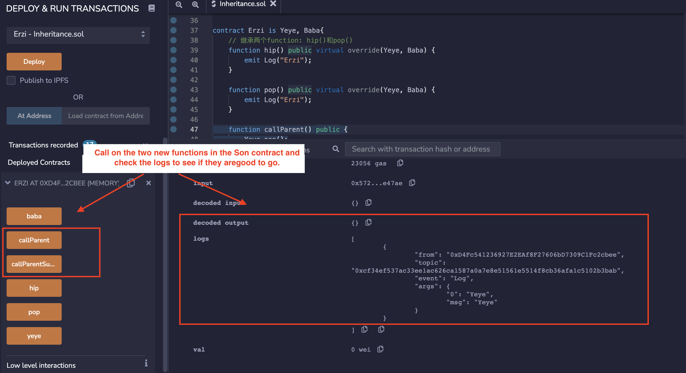

# WTF Solidity Tutorial: 13. Inheritance

Recently, I have been revisiting Solidity, consolidating the finer details, and writing "WTF Solidity" tutorials for newbies. 

Twitter: [@0xAA_Science](https://twitter.com/0xAA_Science) | [@WTFAcademy_](https://twitter.com/WTFAcademy_)

Community: [Discord](https://discord.gg/5akcruXrsk)｜[Wechat](https://docs.google.com/forms/d/e/1FAIpQLSe4KGT8Sh6sJ7hedQRuIYirOoZK_85miz3dw7vA1-YjodgJ-A/viewform?usp=sf_link)｜[Website wtf.academy](https://wtf.academy)

Codes and tutorials are open source on GitHub: [github.com/AmazingAng/WTFSolidity](https://github.com/AmazingAng/WTFSolidity)

-----

In this section, we introduce `inheritance` in Solidity, including simple inheritance, multiple inheritance, and inheritance of modifiers and constructors.

## Inheritance
Inheritance is one of the core concepts in object-oriented programming, which can significantly reduce code redundancy. It is a mechanism where you can derive a class from another class for a hierarchy of classes that share a set of attributes and methods. In solidity, smart contracts can be viewed as objects, which support inheritance.

### Rules

There are two important keywords for inheritance in Solidity:

- `virtual`: If the functions in the parent contract are expected to be overridden in its child contracts, they should be declared as `virtual`.

- `override`：If the functions in the child contract override the functions in its parent contract, they should be declared as `override`.

**Note 1**: If a function both overrides and is expected to be overridden, it should be labelled as `virtual override`.

**Note 2**: If a `public` state variable is labelled as `override`, its `getter` function will be overridden. For example:

```solidity
mapping(address => uint256) public override balanceOf;
```

### Simple inheritance

Let's start by writing a simple `Grandfather` contract, which contains 1 `Log` event and 3 functions: `hip()`, `pop()`, `grandfather()`, which outputs a string `"Grandfather"`.

```solidity
contract Grandfather {
    event Log(string msg);

    // Apply inheritance to the following 3 functions: hip(), pop(), man()，then log "Grandfather".
    function hip() public virtual{
        emit Log("Grandfather");
    }

    function pop() public virtual{
        emit Log("Grandfather");
    }

    function Grandfather() public virtual {
        emit Log("Grandfather");
    }
}
```

Let's define another contract called `Father`, which inherits the `Grandfather` contract. The syntax for inheritance is `contract Father is Grandfather`, which is very intuitive. In the `Father` contract, we rewrote the functions `hip()` and `pop()` with the `override` keyword, changing their output to `"Father"`. We also added a new function called `father`, which outputs a string `"Father"`.


```solidity
contract Father is Grandfather{
    // Apply inheritance to the following 2 functions: hip() and pop()， then change the log value to "Father".
    function hip() public virtual override{
        emit Log("Father");
    }

    function pop() public virtual override{
        emit Log("Father");
    }

    function father() public virtual{
        emit Log("Father");
    }
}
```

After deploying the contract, we can see that the `Father` contract contains 4 functions. The outputs of `hip()` and `pop()` are successfully rewritten with the output `"Father"`, while the output of the inherited `grandfather()` function is still `"Grandfather"`.


### Multiple inheritance

A solidity contract can inherit multiple contracts. The rules are:

1. For multiple inheritance, parent contracts should be ordered by seniority, from the highest to the lowest. For example: `contract Son is Grandfather, Father`. An error will be thrown if the order is not correct.

2. If a function exists in multiple parent contracts, it must be overridden in the child contract, otherwise an error will occur.

3. When a function exists in multiple parent contracts, you need to put all parent contract names after the `override` keyword. For example: `override(Grandfather, Father)`.

Example：
```solidity
contract Son is Grandfather, Father{
    // Apply inheritance to the following 2 functions: hip() and pop()， then change the log value to "Son".
    function hip() public virtual override(Grandfather, Father){
        emit Log("Son");
    }

    function pop() public virtual override(Grandfather, Father) {
        emit Log("Son");
    }
```

After deploying the contract, we can see that we successfully rewrote the `hip()` and `pop()` functions in the `Son` contract, changing the output to `"Son"`. While the `grandfather()` and `father()` functions inherited from its parent contracts remain unchanged.

### Inheritance of modifiers

Likewise, modifiers in Solidity can be inherited as well. Rules for modifier inheritance are similar to the function inheritance, using the `virtual` and `override` keywords.

```solidity
contract Base1 {
    modifier exactDividedBy2And3(uint _a) virtual {
        require(_a % 2 == 0 && _a % 3 == 0);
        _;
    }
}

contract Identifier is Base1 {
    // Calculate _dividend/2 and _dividend/3, but the _dividend must be a multiple of 2 and 3
    function getExactDividedBy2And3(uint _dividend) public exactDividedBy2And3(_dividend) pure returns(uint, uint) {
        return getExactDividedBy2And3WithoutModifier(_dividend);
    }

    // Calculate _dividend/2 and _dividend/3
    function getExactDividedBy2And3WithoutModifier(uint _dividend) public pure returns(uint, uint){
        uint div2 = _dividend / 2;
        uint div3 = _dividend / 3;
        return (div2, div3);
    }
}
```

`Identifier` contract can directly use the `exactDividedBy2And3` modifier because it inherits the `Base1` contract. We can also rewrite the modifier in the contract:

```solidity
    modifier exactDividedBy2And3(uint _a) override {
        _;
        require(_a % 2 == 0 && _a % 3 == 0);
    }
```

### Inheritance of constructors

Constructors can also be inherited. Let first consider a parent contract `A` with a state variable `a`, which is initialized in its constructor:

```solidity
// Applying inheritance to the constructor functions
abstract contract A {
    uint public a;

    constructor(uint _a) {
        a = _a;
    }
}
```

There are two ways for a child contract to inherit the constructor from its parent `A`: 
1. Declare the parameters of the parent constructor at inheritance: 

    ```solidity
    contract B is A(1){}
    ```

2. Declare the parameter of the parent constructor in the constructor of the child contract:

    ```solidity
    contract C is A {
        constructor(uint _c) A(_c * _c) {}
    }
    ```

### Calling the functions from the parent contracts

There are two ways for a child contract to call the functions of the parent contract:

1. Direct calling：The child contract can directly call the parent's function with `parentContractName.functionName()`. For example:

    ```solidity
        function callParent() public{
            Grandfather.pop();
        }
    ```

2. `super` keyword：The child contract can use the `super.functionName()` to call the function in the neareast parent contract in the inheritance hierarchy. Solidity inheritance is declared in a right-to-left order: for `contract Son is Grandfather, Father`, the `Father` contract is closer than the `Grandfather` contract. Thus, `super.pop()` in the `Son` contract will call `Father.pop()` but not `Grandfather.pop()`.

    ```solidity
        function callParentSuper() public{
            // call the function one level higher up in the inheritance hierarchy
            super.pop();
        }
    ```

### Diamond inheritance 

In Object-Oriented Programming, diamond inheritance refers to the scenario in which a derived class has two or more base classes.

When using the `super` keyword on a diamond inheritance chain, it should be noted that it will call the relevant function of each contract in the inheritance chain, not just the nearest parent contract.

First, we write a base contract called `God`. Then we write two contracts `Adam` and `Eve` inheriting from the `God` contract. Lastly, we write another contract `people` inheriting from `Adam` and `Eve`. Each contract has two functions, `foo()` and `bar()`:

```solidity
// SPDX-License-Identifier: MIT
pragma solidity ^0.8.13;

/* Inheritance tree visualized：
  God
 /  \
Adam Eve
 \  /
people
*/
contract God {
    event Log(string message);
    function foo() public virtual {
        emit Log("God.foo called");
    }
    function bar() public virtual {
        emit Log("God.bar called");
    }
}
contract Adam is God {
    function foo() public virtual override {
        emit Log("Adam.foo called");
        Adam.foo();
    }
    function bar() public virtual override {
        emit Log("Adam.bar called");
        super.bar();
    }
}
contract Eve is God {
    function foo() public virtual override {
        emit Log("Eve.foo called");
        Eve.foo();
    }
    function bar() public virtual override {
        emit Log("Eve.bar called");
        super.bar();
    }
}
contract people is Adam, Eve {
    function foo() public override(Adam, Eve) {
        super.foo();
    }
    function bar() public override(Adam, Eve) {
        super.bar();
    }
}
```

In this example, calling the `super.bar()` function in the `people` contract will call the `Eve`, `Adam`, and `God` contract's `bar()` function, which is different from ordinary multiple inheritance.

Although `Eve` and `Adam` are both child contracts of the `God` parent contract, the `God` contract will only be called once in the whole process. This is because Solidity borrows the paradigm from Python, forcing a DAG (directed acyclic graph) composed of base classes to guarantee a specific order based on C3 Linearization. For more information on inheritance and linearization, read the official [Solidity docs here](https://docs.soliditylang.org/en/v0.8.17/contracts.html#multiple-inheritance-and-linearization).

## Verify on Remix
1. After deploying example contract in Simple Inheritance session, we can see that the `Father` contract has `Grandfather` functions:

  

  

2. Modifier inheritance examples:

  
  
  
  
  
  
3. Inheritance of constructors:

  
  
  
  
4. Calling the functions from parent contracts:

  
  
  
  
5. Diamond inheritance:

   

## Summary
In this tutorial, we introduced the basic uses of inheritance in Solidity, including simple inheritance, multiple inheritance, inheritance of modifiers and constructors, and calling functions from parent contracts.
