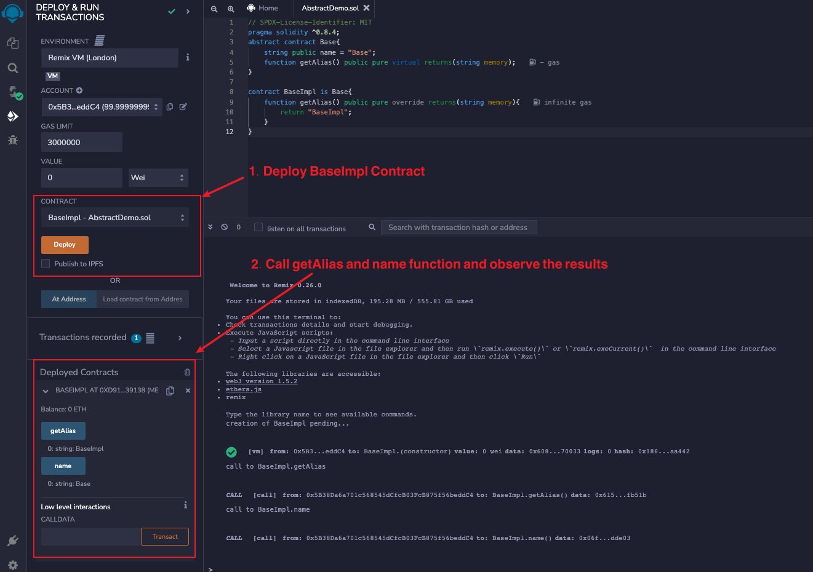

# WTF Solidity Tutorial: 14. Abstract and Interface

Recently, I have been revisiting Solidity, consolidating the finer details, and writing "WTF Solidity" tutorials for newbies. 

Twitter: [@0xAA_Science](https://twitter.com/0xAA_Science) | [@WTFAcademy_](https://twitter.com/WTFAcademy_)

Community: [Discord](https://discord.gg/5akcruXrsk)｜[Wechat](https://docs.google.com/forms/d/e/1FAIpQLSe4KGT8Sh6sJ7hedQRuIYirOoZK_85miz3dw7vA1-YjodgJ-A/viewform?usp=sf_link)｜[Website wtf.academy](https://wtf.academy)

Codes and tutorials are open source on GitHub: [github.com/AmazingAng/WTFSolidity](https://github.com/AmazingAng/WTFSolidity)

-----

In this section, we will introduce the `abstract` and `interface` contracts in Solidity, using the interface of `ERC721` as an example. They are used to write contract templates and reduce code redundancy.

## Abstract contract

If a contract contains at least one unimplemented function (no contents in the function body `{}`), it must be labeled as `abstract`; Otherwise it will not compile. Moreover, the unimplemented function needs to be labeled as `virtual`. 
Take our previous [Insertion Sort Contract](https://github.com/AmazingAng/WTFSolidity/tree/main/07_InsertionSort) as an example, 
if we haven't figured out how to implement the insertion sort function, we can mark the contract as `abstract`, and let others overwrite it in the future.

```solidity
abstract contract InsertionSort{
    function insertionSort(uint[] memory a) public pure virtual returns(uint[] memory);
}
```

## Interface

The `interface` contract is similar to the `abstract` contract, but it requires no functions are implemented. Rules of the interface:

1. Cannot contain state variables.
2. Cannot contain constructors.
3. Cannot inherit non-interface contracts.
4. All functions must be external and cannot have contents in the function body.
5. The contract that inherits the interface contract must implement all the functions defined in it.

Although the interface does not implement any functionality, it is the skeleton of smart contracts. Interface 
defines what the contract does and how to interact with them: if a smart contract implements an interface (like `ERC20` or `ERC721`), 
other Dapps and smart contracts will know how to interact with it. Because it provides two important pieces of information:

1. The `bytes4` selector for each function in the contract, and the function signatures `function name (parameter type)`.
2. Interface id (see [EIP165](https://eips.ethereum.org/EIPS/eip-165) for more information)

In addition, the interface is equivalent to the contract `ABI` (Application Binary Interface), 
and they can be converted to each other: compiling the interface contract will give you the contract `ABI`, 
and [abi-to-sol tool](https://gnidan.github.io/ abi-to-sol/) will convert the `ABI` back to the interface contract.

We take `IERC721` contract, the interface for the `ERC721` token standard, as an example. It consists of 3 events and 9 functions, 
which all `ERC721` contracts need to implement. In interface, each function ends with `;` instead of the function body `{ }`. Moreover, every function in interface contract is by default `virtual`, so you do not need to label function as `virtual` explicitly.

```solidity
interface IERC721 is IERC165 {
    event Transfer(address indexed from, address indexed to, uint256 indexed tokenId);
    event Approval(address indexed owner, address indexed approved, uint256 indexed tokenId);
    event ApprovalForAll(address indexed owner, address indexed operator, bool approved);
    
    function balanceOf(address owner) external view returns (uint256 balance);

    function ownerOf(uint256 tokenId) external view returns (address owner);

    function safeTransferFrom(address from, address to, uint256 tokenId) external;

    function transferFrom(address from, address to, uint256 tokenId) external;

    function approve(address to, uint256 tokenId) external;

    function getApproved(uint256 tokenId) external view returns (address operator);

    function setApprovalForAll(address operator, bool _approved) external;

    function isApprovedForAll(address owner, address operator) external view returns (bool);

    function safeTransferFrom( address from, address to, uint256 tokenId, bytes calldata data) external;
}
```

### IERC721 Event
`IERC721` contains 3 events.
- `Transfer` event: emitted during transfer, records the sending address `from`, the receiving address `to`, and `tokenid`.
- `Approval` event: emitted during approval, records the token owner address `owner`, the approved address `approved`, and `tokenid`.
- `ApprovalForAll` event: emitted during batch approval, records the owner address `owner` of batch approval, the approved address `operator`, and whether the approve is enabled or disabled `approved` .

### IERC721 Function
`IERC721` contains 3 events.
- `balanceOf`: Count all NFTs held by an owner.
- `ownerOf`: Find the owner of an NFT (`tokenId`).
- `transferFrom`: Transfer ownership of an NFT with `tokenId` from `from` to `to`.
- `safeTransferFrom`: Transfer ownership of an NFT with `tokenId` from `from` to `to`. Extra check: if the receiver is a contract address, it will be required to implement the `ERC721Receiver` interface.
- `approve`: Enable or disable another address to manage your NFT.
- `getApproved`: Get the approved address for a single NFT.
- `setApprovalForAll`: Enable or disable approval for a third party to manage all your NFTs in this contract.
- `isApprovedForAll`: Query if an address is an authorized operator for another address.
- `safeTransferFrom`: Overloaded function for safe transfer, containing `data` in its parameters.


### When to use an interface?
If we know that a contract implements the `IERC721` interface, we can interact with it without knowing its detailed implementation.

The Bored Ape Yacht Club `BAYC` is an `ERC721` NFT, which implements all functions in the `IERC721` interface. We can interact with the `BAYC` contract with the `IERC721` interface and its contract address, without knowing its source code.
For example, we can use `balanceOf()` to query the `BAYC` balance of an address, or use `safeTransferFrom()` to transfer a `BAYC` NFT.


```solidity
contract interactBAYC {
    // Use BAYC address to create interface contract variables (ETH Mainnet)
    IERC721 BAYC = IERC721(0xBC4CA0EdA7647A8aB7C2061c2E118A18a936f13D);

    // Call BAYC's balanceOf() to query the open interest through the interface
    function balanceOfBAYC(address owner) external view returns (uint256 balance){
        return BAYC.balanceOf(owner);
    }

    // Safe transfer by calling BAYC's safeTransferFrom() through the interface
    function safeTransferFromBAYC(address from, address to, uint256 tokenId) external{
        BAYC.safeTransferFrom(from, to, tokenId);
    }
}
```

## Remix demo
1. Abstract example:
  
2. Interface example:
  

## Summary
In this chapter, we introduced the `abstract` and `interface` contracts in Solidity, which are used to write contract templates and reduce code redundancy.
We also learned the interface of `ERC721` token standard and how to interact with the `BAYC` contract using interface.
