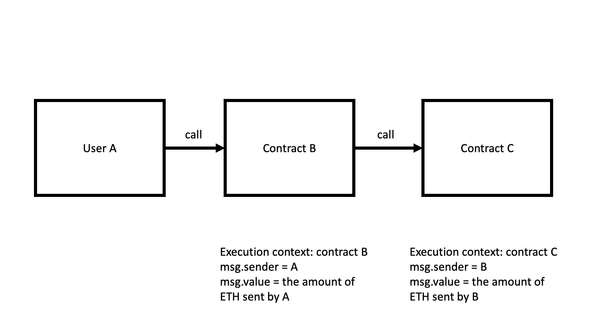
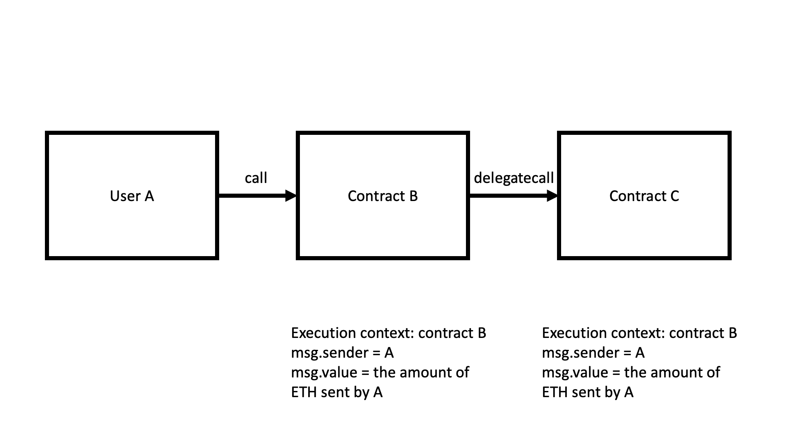
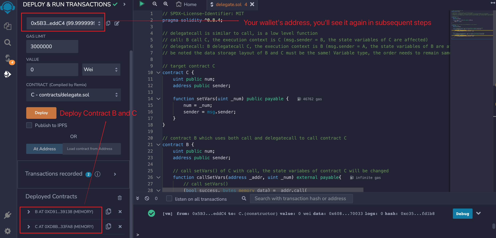
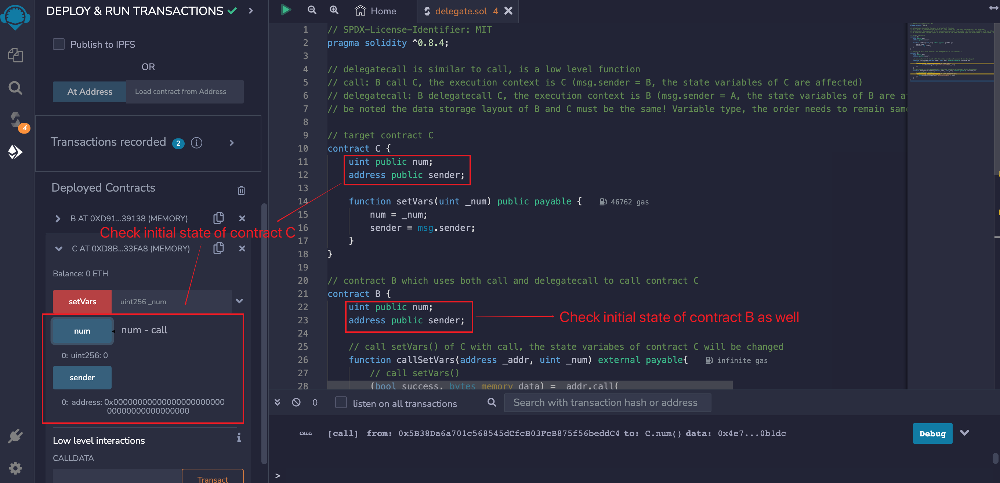
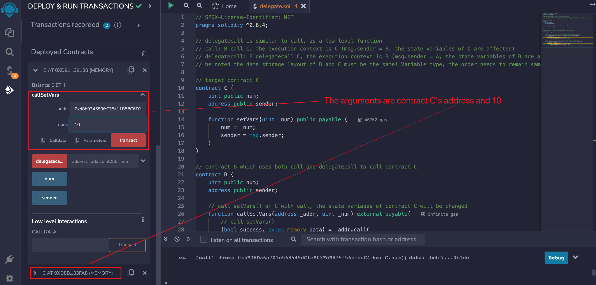
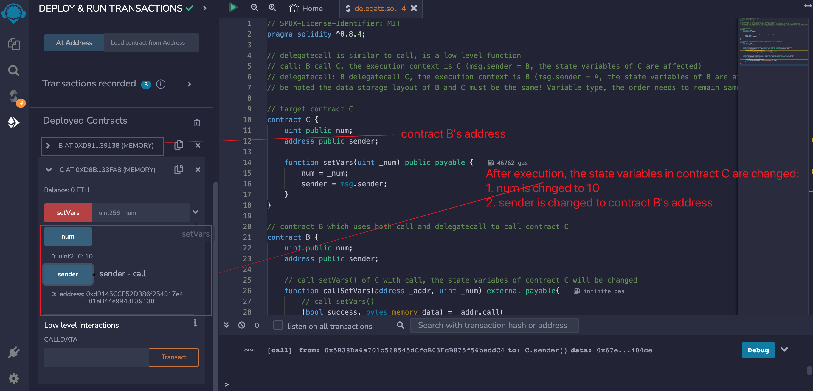
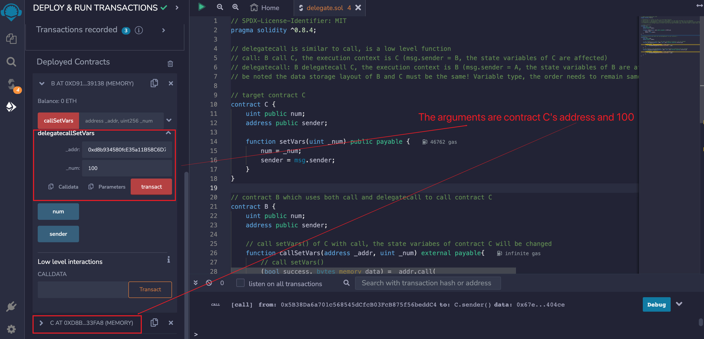
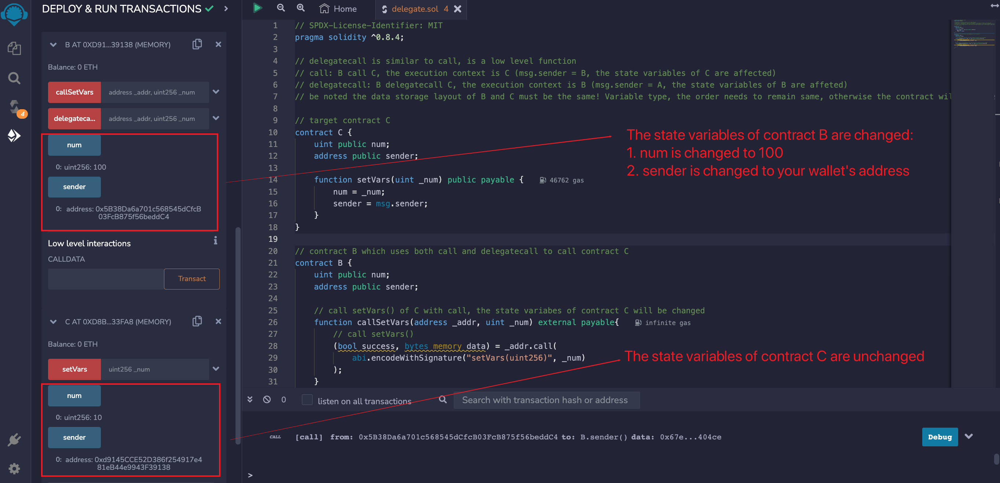

# WTF Solidity Tutorial: 23. Delegatecall

Recently, I have been revisiting Solidity, consolidating the finer details, and writing "WTF Solidity" tutorials for newbies. 

Twitter: [@0xAA_Science](https://twitter.com/0xAA_Science) | [@WTFAcademy_](https://twitter.com/WTFAcademy_)

Community: [Discord](https://discord.gg/5akcruXrsk)｜[Wechat](https://docs.google.com/forms/d/e/1FAIpQLSe4KGT8Sh6sJ7hedQRuIYirOoZK_85miz3dw7vA1-YjodgJ-A/viewform?usp=sf_link)｜[Website wtf.academy](https://wtf.academy)

Codes and tutorials are open source on GitHub: [github.com/AmazingAng/WTFSolidity](https://github.com/AmazingAng/WTFSolidity)
-----

## `delegatecall`
`delegatecall` is similar to `call`, is a low level function in `Solidity`. `delegate` means entrust/represent, so what does `delegatecall` entrust?

When user `A` `call` contract `C` via contract `B`, the executed functions are from contract `C`, the `execution context` (the environment including state and variable) is in contract `C`: `msg.sender` is contract `B`'s address, and if state variables are changed due to function call, the affected state variables are in contract `C`.



And when user `A` `delegatecall` contract `C` via contract `B`, the executed functions are from contract `C`, the `execution context` is in contract `B`: `msg.sender` is user `A`'s address, and if state variables are changed due to function call, the affected state variables are in contract `B`.



You can understand it like this: a `rich businessman` entrusts his asset (`state variables`) to a `VC` (functions of target contract) for management. The executed functions are from the `VC`, but the state variables get changed is from the `businessman`.

The syntax of `delegatecall` is simimar to `call`:

```
targetContractAddress.delegatecall(binary code);
```

the `binary code` is generated by `abi.encodeWithSignature`:

```solidity
abi.encodeWithSignature("function signature", parameters separated by comma)
```
`function signature` is `"functionName(parameters separated by comma)"`. For example, `abi.encodeWithSignature("f(uint256,address)", _x, _addr)`。

Unlike `call`, `delegatecall` can specify the value of `gas` when calling smart contract, but the value of `ETH` can't be specified.

> **Attention**: using delegatecall could incur risk, make sure the storage layout of state variables of current contract and target contract is same, and target contract is safe, otherwise could cause loss of funds.

## `delegatecall` use cases?
Currently there are 2 major use cases for delegatecall:

1. `Proxy Contract`: separating the storage part and logic part of smart contract: `proxy contract` is used to store all related variables, and also store the address of logic contract; all functions are stored in the `logic contract`, and called via delegatecall. When upgrading, you only need to redirect `proxy contract` to a new `logic contract`.
2. EIP-2535 Diamonds: Diamond is a standard that supports building modular smart contract systems that can scale in production. Diamond is a proxy contract with multiple implementation contracts. For more information, check: [Introduction to EIP-2535 Diamonds](https://eip2535diamonds.substack.com/p/introduction-to-the-diamond-standard).

## `delegatecall` example
Call mechanism: you (`A`) call contract `C` via contract `B`.

### Target Contract C
First we create a target contract `C` with 2 `public` variables: `num` and `sender` which are `uint256` and `address` respectively; and a function which sets `num` based on `_num`, and set `sender` as `msg.sender`.

```solidity
// Target contract C
contract C {
    uint public num;
    address public sender;

    function setVars(uint _num) public payable {
        num = _num;
        sender = msg.sender;
    }
}
```
### Call Initialization Contract B
First, contract `B` must have the same state variable layout as target contract `C`, 2 variables and the order is `num` and `sender`.

```solidity
contract B {
    uint public num;
    address public sender;
```

Next, we use `call` and `delegatecall` respectively to call `setVars` from contract `C`, so we can understand the difference better.

Function `callSetVars` calls `setVars` via `call`. callSetVars has 2 parameters, `_addr` and `_num`, which correspond to contract `C`'s address and the parameter of `setVars`.

```solidity
    // Calling setVars() of contract C with call, the state variables of contract C will be changed
    function callSetVars(address _addr, uint _num) external payable{
        // call setVars()
        (bool success, bytes memory data) = _addr.call(
            abi.encodeWithSignature("setVars(uint256)", _num)
        );
    }
```

While function `delegatecallSetVars` calls `setVars` via `delegatecall`. Similar to `callSetVars`, delegatecallSetVars has 2 parameters, `_addr` and `_num`, which correspond to contract `C`'s address and the parameter of `setVars`.

```solidity
    // Calling setVars() of contract C with delegatecall, the state variables of contract B will be changed
    function delegatecallSetVars(address _addr, uint _num) external payable{
        // delegatecall setVars()
        (bool success, bytes memory data) = _addr.delegatecall(
            abi.encodeWithSignature("setVars(uint256)", _num)
        );
    }
}
```

### Verify on Remix
1. First we deploy contract B and contract C




2. After deployment, check the initial value of state variables in contract `C`, also the initial value of state variables in contract `B`.



3. Next, call `callSetVars` in contract `B` with arguments of contract `C`'s address and `10`



4. After execution, the state variables in contract `C` are changed: `num` is changed to 10, `sender` is changed to contract B's address




5. Next, we call `delegatecallsetVars` in contract `B` with arguments of contract `C`'s address and `100`



6. Because of `delegatecall`, the execution context is contract `B`. Afte execution, the state variables of contract `B` are changed: `num` is changed to 100, `sender` is changed to your wallet's address. The state variables of contract `C` are unchanged.



## Summary
In this lecture we introduce another low level function in `Solidity`, `delegatecall`. Similar to `call`, `delegatecall` can be used to call another contract; the difference of `delegatecall` and `call` is `execution context`, the `execution context` is `C` if `B` `call` `C`; but the `execution context` is `B` if `B` `delegatecall` `C`. The major use cases for delegatecall is `proxy contract` and `EIP-2535 Diamonds`.

