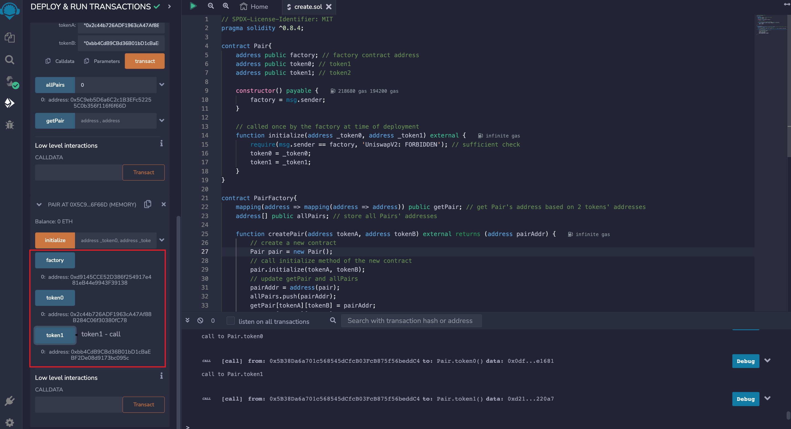
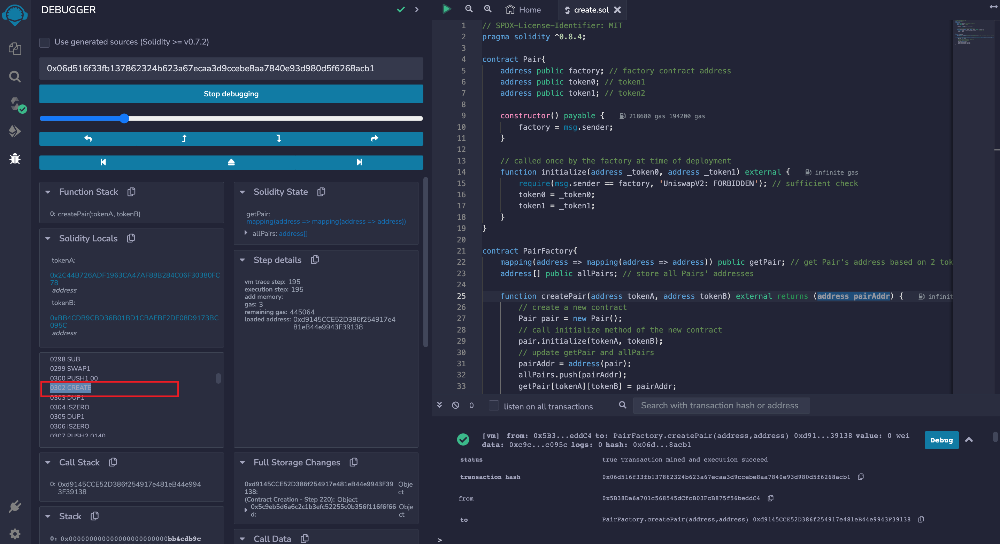

# WTF Solidity Tutorial: 24. Creating a new smart contract in an existed smart contract

Recently, I have been revisiting Solidity, consolidating the finer details, and writing "WTF Solidity" tutorials for newbies. 

Twitter: [@0xAA_Science](https://twitter.com/0xAA_Science) | [@WTFAcademy_](https://twitter.com/WTFAcademy_)

Community: [Discord](https://discord.gg/5akcruXrsk)｜[Wechat](https://docs.google.com/forms/d/e/1FAIpQLSe4KGT8Sh6sJ7hedQRuIYirOoZK_85miz3dw7vA1-YjodgJ-A/viewform?usp=sf_link)｜[Website wtf.academy](https://wtf.academy)

Codes and tutorials are open source on GitHub: [github.com/AmazingAng/WTFSolidity](https://github.com/AmazingAng/WTFSolidity)
-----

On Ethereum, user (Externally-owned account, `EOA`) can create smart contracts, a smart contract can also create new smart contracts. The decentralized exchange `Uniswap` creates an infinite number of `Pair` contracts with its `Factory` contract. In this lecture, I will explain how to create new smart contracts in an existed smart contract by using a simplied version of `Uniswap`.

## `create` and `create2`
There are two ways to create a new contract in an existed contract, `create` and `create2`, this lecture will introduce `create`, next lecture will introduce `create2`.

The usage of `create` is very simple, creating a contract with `new` keyword, and passing the arguments required by the constructor of the new smart contract:

```solidity
Contract x = new Contract{value: _value}(params)
```

`Contract` is the name of the smart contract to be created, `x` is the smart contract object (address), if the constructor is `payable`, the creator can transfer `_value` `ETH` to the new smart contract, `params` are the parameters of the constructor of the new smart cotnract.

## Simplified Uniswap
The core smart contracts of `Uniswap V2` include 2 smart contracts:

1. UniswapV2Pair: Pair contract, used to manage token addresses, liquidity, swap.
2. UniswapV2Factory: Factory contract, used to create new Pair contracts, and manage Pair address.

Below we will implement a simplified `Uniswap` with `create`: `Pair` contract is used to manage token addresses, `PairFactory` contract is used to create new Pair contract, and manage Pair addresses.

###  `Pair` contract

```solidity
contract Pair{
    address public factory; // factory contract address
    address public token0; // token1
    address public token1; // token2

    constructor() payable {
        factory = msg.sender;
    }

    // called once by the factory at time of deployment
    function initialize(address _token0, address _token1) external {
        require(msg.sender == factory, 'UniswapV2: FORBIDDEN'); // sufficient check
        token0 = _token0;
        token1 = _token1;
    }
}
```
`Pair` contract is very simple, including 3 state variables: `factory`, `token0` and `token1`.

The `constructor` assigns Factory contract's address to `factory` at the time of delpoyment. `initialize` function will be called once by the `Factory` contract when the `Pair` contract is created, and update `token0` and `token1` with the addresses of 2 tokens in the token pair.

> **Ask**: Why doesn't `Uniswap` set the addresses of `token0` and `token1` in the `constructor`?
>
> **Answer**: Because `Uniswap` uses `create2` creating new smart contracts, parameters is not allowed in the constructor when using create2. When using `create`, it is allowed to have parameters in `Pair` contract, and you can set the addresses of `token0` and `token1` in the `constructor`.

### `PairFactory`
```solidity
contract PairFactory{
    mapping(address => mapping(address => address)) public getPair; // get Pair's address based on 2 tokens' addresses
    address[] public allPairs; // store all Pair addresses

    function createPair(address tokenA, address tokenB) external returns (address pairAddr) {
        // create a new contract
        Pair pair = new Pair(); 
        // call initialize function of the new contract
        pair.initialize(tokenA, tokenB);
        // update getPair and allPairs
        pairAddr = address(pair);
        allPairs.push(pairAddr);
        getPair[tokenA][tokenB] = pairAddr;
        getPair[tokenB][tokenA] = pairAddr;
    }
}
```
Factory contract (`PairFactory`) has 2 state variables, `getPair` is a map of 2 token address and Pair contract address,  and is used to find `Pair` contract address based on 2 token addresses. `allPairs` is an array of Pair contract addresses, which is used to store all Pair contract addresses.

There's only one function in `PairFactory`, `createPair`, which creates a new `Pair` contract based on 2 token addresses `tokenA` and tokenB.``

```solidity
Pair pair = new Pair(); 
```

The above code is used to create a new smart contract, very straightforward. You can deploy `PairFactory` contract first, then call `createPair` with the following 2 addresses as arguments, and find out what is the address of the new `Pair` contract.

```solidity
WBNB address: 0x2c44b726ADF1963cA47Af88B284C06f30380fC78
PEOPLE address on BSC: 0xbb4CdB9CBd36B01bD1cBaEBF2De08d9173bc095c
```

### Verify on Remix

1. Call `createPair` with the arguments of the addresses of `WBNB` and `PEOPLE`, we will have the address of `Pair` contract: 0x5C9eb5D6a6C2c1B3EFc52255C0b356f116f6f66D


2. Check the state variables of `Pair` contract



3. Use debug to check `create` opcode



## Summary
In this lecture, we introduce how to create a new smart contract in an existed smart contract with `create` method by using a simplified version of `Uniswap`, in next lecture we will introduce how to implement a simplified `Uniswap` with `create2`.

