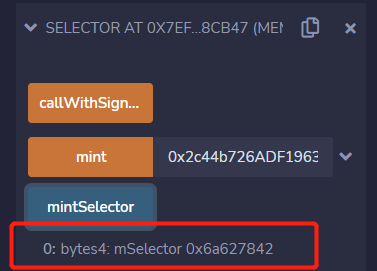
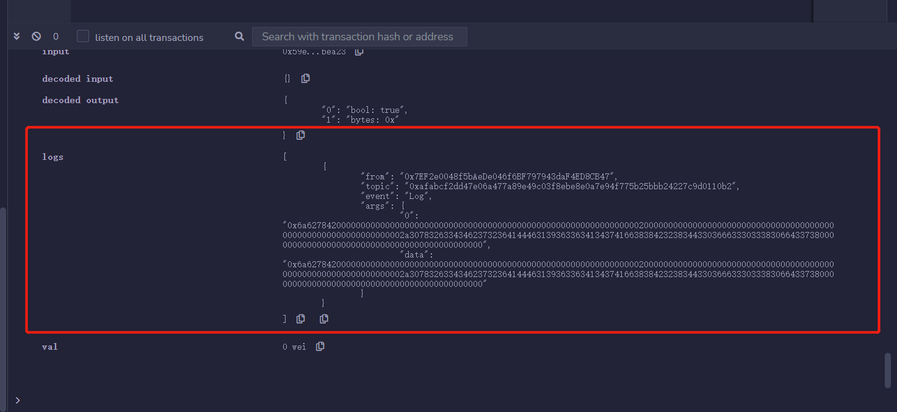

# WTF Solidity Tutorial: 29. Function Selector

Recently, I have been relearning Solidity, consolidating the finer details, and also writing a "WTF Solidity Tutorial" for newbies to learn. Lectures are updated 1~3 times weekly.

Everyone is welcomed to follow my Twitter: [@0xAA_Science](https://twitter.com/0xAA_Science)

WTF Academy Discord, where you can find the way to join WeChat group: [Link](https://discord.gg/5akcruXrsk)

All codebase and tutorial notes are open source and available on GitHub (At 1024 repo stars, course certification is unlocked. At 2048 repo stars, community NFT is unlocked.): [github.com/AmazingAng/WTFSolidity](https://github.com/AmazingAng/WTFSolidity)

---

## `selector`

When we call a smart contract, we essentially send a `calldata` to the target contract. After sending a transaction in remix, we can see in the details that `input` is the `calldata` of this transaction.


The first 4 bytes of calldata is called a function selector. In this section, we will introduce what `selector` is and how to use it.

### `msg.data`

`msg.data` is a global variable in `solidity`. The value of `msg.data` is the full `calldata` (the data passed in when the function is called).

In the following code, we can output the `calldata` that calls the `mint` function through the `Log` event:

```solidity
    // event returns msg.data
    event Log(bytes data);

    function mint(address to) external{
        emit Log(msg.data);
    }
```

When the parameter is `0x2c44b726ADF1963cA47Af88B284C06f30380fC78`, the output `calldata` is

```
0x6a6278420000000000000000000000002c44b726adf1963ca47af88b284c06f30380fc78
```

This messy bytecode can be divided into two parts:

```
The first 4 bytes are the selector:
0x6a627842

The next 32 bytes are the input parameters:
0x0000000000000000000000002c44b726adf1963ca47af88b284c06f30380fc78
```

Actually, this  `calldata` is to tell the smart contract which function I want to call and what the parameters are.

### `method id`、`selector` and `Function Signatures`

The `method id` is defined as the first 4 bytes after the `Keccak` hash of the `function signature`. The function is called when the `selector` matches the `method id`.

Then what is the `function signature` ? In section 21, we introduced function signature. The function signature is `"function_name(comma-separated parameter types)"`. For example, the function signature of `mint` in the code above is `"mint(address)"`. In the same smart contract, different functions have different function signatures, so we can determine which function to call by the function signature.

Please note that `uint` and `int` are written as `uint256` and `int256` in the function signature.

Let's define a function to verify that the `method id` of the `mint` function is `0x6a627842`. You can call the function below and see the result.

```solidity
    function mintSelector() external pure returns(bytes4 mSelector){
        return bytes4(keccak256("mint(address)"));
    }
```

The result is `0x6a627842`:



### how to use `selector`

We can use `selector` to call the target function. For example, if I want to call the `mint` function, I just need to use `abi.encodeWithSelector` to pack and encode the `mint` function's `method id` as the `selector` and parameters, and pass it to the `call` function:

````solidity
     function callWithSignature() external returns(bool, bytes memory){
         (bool success, bytes memory data) = address(this).call(abi.encodeWithSelector(0x6a627842, "0x2c44b726ADF1963cA47Af88B284C06f30380fC78"));
         return(success, data);
     }
````

We can see in the log that the `mint` function was successfully called and the `Log` event was output.



## Summary

In this section, we introduce what is `selector` and its relationship with `msg.data`, `function signature`, and how to use it to call the target function.
