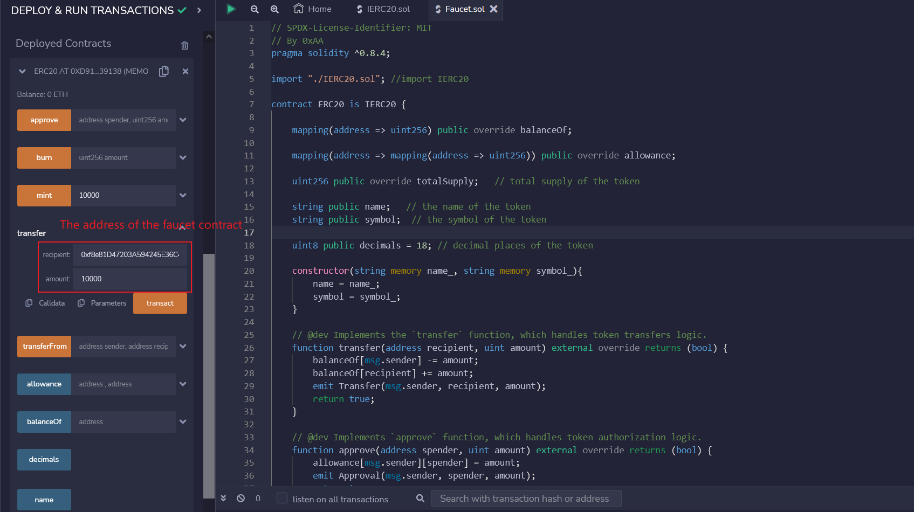

# WTF Solidity Crash Course: 32. Token Faucet

Recently, I have been revisiting Solidity, consolidating the finer details, and writing "WTF Solidity" tutorials for newbies. 

Twitter: [@0xAA_Science](https://twitter.com/0xAA_Science) | [@WTFAcademy_](https://twitter.com/WTFAcademy_)

Community: [Discord](https://discord.gg/5akcruXrsk)｜[Wechat](https://docs.google.com/forms/d/e/1FAIpQLSe4KGT8Sh6sJ7hedQRuIYirOoZK_85miz3dw7vA1-YjodgJ-A/viewform?usp=sf_link)｜[Website wtf.academy](https://wtf.academy)

Codes and tutorials are open source on GitHub: [github.com/AmazingAng/WTFSolidity](https://github.com/AmazingAng/WTFSolidity)

-----

In lesson 31, we learned about the `ERC20` token standard. In this lesson, we will learn about the smart contract for an `ERC20` faucet. In this contract, users can receive free `ERC20` tokens.

## Token Faucet

When a person is thirsty, they go to a faucet to get water. When a person wants free tokens, they go to a token faucet to receive them. A token faucet is a website or application that allows users to receive tokens for free.

The earliest token faucet was the Bitcoin (BTC) faucet. In 2010, the price of BTC was less than \$0.1, and there were few holders of the currency. To increase its popularity, Gavin Andresen, a member of the Bitcoin community, created the BTC faucet, allowing others to receive BTC for free. Many people took advantage of the opportunity, and some of them became BTC enthusiasts. The BTC faucet gave away over 19,700 BTC, which is now worth approximately \$600 million!

## ERC20 Faucet Contract

Here, we will implement a simplified version of an `ERC20` faucet. The logic is very simple: we will transfer some `ERC20` tokens to the faucet contract, and users can use the `requestToken()` function of the contract to receive `100` units of the token. Each address can only receive tokens once.

### State Variables

We define `3` state variables in the faucet contract:

- `amountAllowed` sets the amount of tokens that can be claimed per request (default value is `100`, not 100 tokens as tokens may have decimal places).
- `tokenContract` stores the address of the `ERC20` token contract.
- `requestedAddress` keeps track of the addresses that have already claimed tokens.

```solidity
uint256 public amountAllowed = 100; // the allowed amount for each request is 100
address public tokenContract;   // contract address of the token
mapping(address => bool) public requestedAddress;   // a map contains requested address
```

### Event

The faucet contract defines a `SendToken` event that records the address and amount of tokens claimed each time the `requestTokens()` function is called.

```solidity
// Event SendToken
event SendToken(address indexed Receiver, uint256 indexed Amount); 
```

### Functions

There are only `2` functions in the contract:

- Constructor: Initializes the `tokenContract` state variable and determines the address of the issued `ERC20` tokens.

```solidity
// Set the ERC20'S contract address during deployment
constructor(address _tokenContract) {
	tokenContract = _tokenContract; // set token contract
}
```

The `requestTokens()` function allows users to claim `ERC20` tokens.

```solidity
// Function for users to request tokens
function requestTokens() external {
    require(requestedAddress[msg.sender] == false, "Can't Request Multiple Times!"); // Only one request per address
    IERC20 token = IERC20(tokenContract); // Create an IERC20 contract object
    require(token.balanceOf(address(this)) >= amountAllowed, "Faucet Empty!"); // Faucet is empty

    token.transfer(msg.sender, amountAllowed); // Send token
    requestedAddress[msg.sender] = true; // Record the requested address
    
    emit SendToken(msg.sender, amountAllowed); // Emit SendToken event
}
```

## Remix Demonstration

1. First, deploy the `ERC20` token contract with the name and symbol `WTF`, and `mint` yourself 10000 tokens.
    

2. Deploy the `Faucet` contract, and fill in the initialized parameters with the address of the `ERC20` token contract above.
    

3. Use the `transfer()` function of the `ERC20` token contract to transfer 10000 tokens to the `Faucet` contract address.
    

4. Switch to a new account and call the `requestTokens()` function of the `Faucet` contract to receive tokens. You can see that the `SendToken` event is released in the terminal.    
    

5. Use the `balanceOf` function on the `ERC20` token contract to query the balance of the account that received tokens from the faucet. The balance should now be `100`, indicating a successful request!
    

## Conclusion

In this lecture, we introduced the history of token faucets and the `ERC20` faucet contract. Where do you think the next BTC faucet will be?