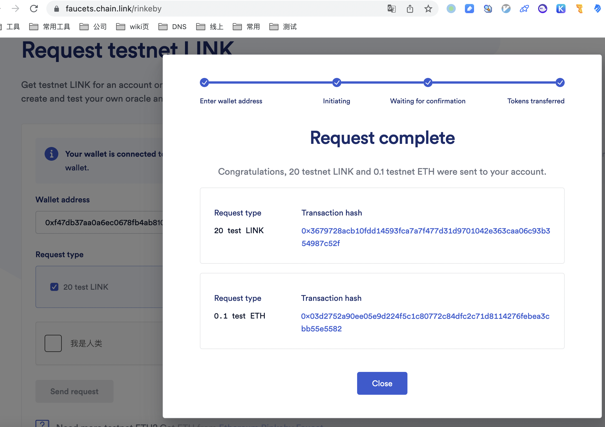
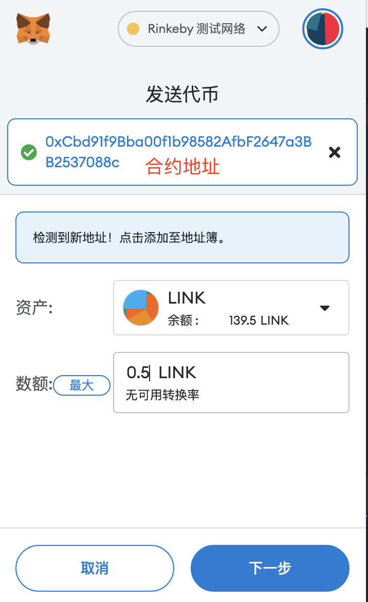
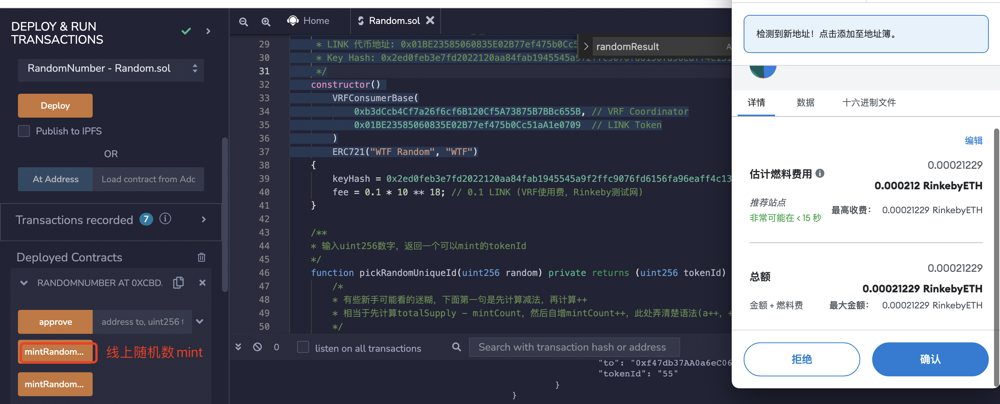
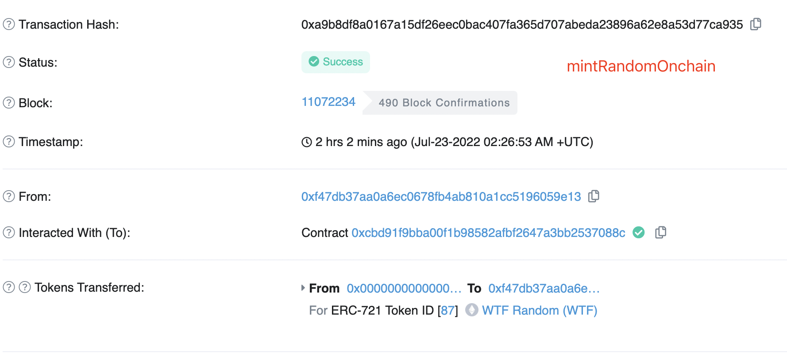
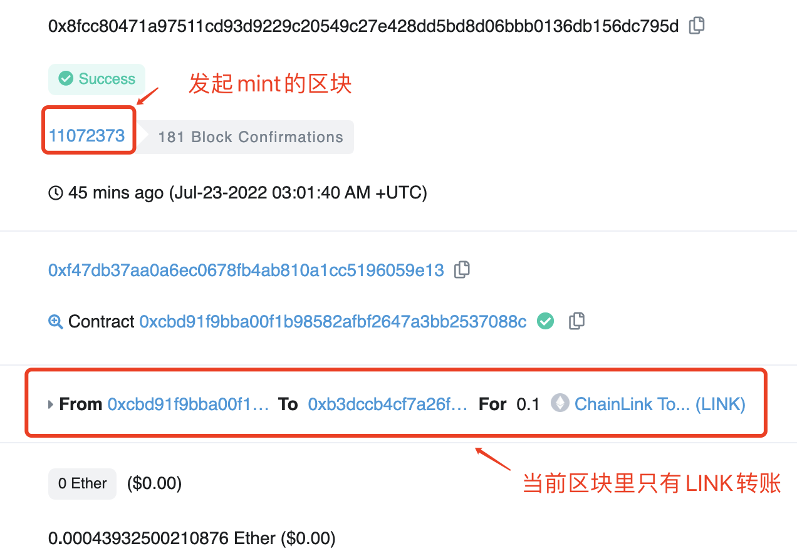

# WTF Solidity Quick Start: 39. Chainlink Randomness

I am currently re-learning Solidity to sharpen my skills and writing a "WTF Solidity Quick Start" guide for beginners to use (advanced programmers can look for other tutorials). I will update 1-3 lectures every week.

Twitter: [@0xAA_Science](https://twitter.com/0xAA_Science)

Discord: [WTF Academy](https://discord.gg/5akcruXrsk)

All code and tutorials are open source on GitHub: [github.com/AmazingAng/WTFSolidity](https://github.com/AmazingAng/WTFSolidity)

Many Ethereum applications require the use of random numbers, such as NFT random tokenId selection, blind box drawing, and randomly determining the winner in gamefi battles. However, since all data on Ethereum is public and deterministic, it cannot provide developers with a method of generating random numbers like other programming languages. In this tutorial, we will introduce two methods of on-chain (hash function) and off-chain (Chainlink oracle) random number generation, and use them to create a tokenId random minting NFT.

## On-chain Random Number Generation

We can use some on-chain global variables as seeds and use the `keccak256()` hash function to obtain pseudo-random numbers. This is because the hash function has sensitivity and uniformity, and can generate "apparently" random results. The `getRandomOnchain()` function below uses the global variables `block.timestamp`, `msg.sender`, and `blockhash(block.number-1)` as seeds to obtain random numbers:

```solidity
/** 
 * Generating pseudo-random numbers on the chain.
 * Using keccak256() to pack some on-chain global variables/custom variables.
 * Converted to uint256 type when returned.
*/
function getRandomOnchain() public view returns(uint256){
     // Generating blockhash in Remix will result in an error.
     bytes32 randomBytes = keccak256(abi.encodePacked(block.timestamp, msg.sender, blockhash(block.number-1)));
        
     return uint256(randomBytes);
}
```

**Note**: This method is not secure: 
- Firstly, variables such as `block.timestamp`, `msg.sender`, and `blockhash(block.number-1)` are all publicly visible. Users can predict the random number generated by these seeds and select the output they want to execute the smart contract.
- Secondly, miners can manipulate `blockhash` and `block.timestamp` to generate a random number that suits their interests.

However, this method is the most convenient on-chain random number generation method, and many project parties rely on it to generate insecure random numbers, including well-known projects such as `meebits` and `loots`. Of course, all these projects have been attacked: attackers can forge any rare `NFT` they want, instead of randomly drawing them.

## Off-chain random number generation

We can generate random numbers off-chain and upload them to the chain through oracles. Chainlink provides a VRF (Verifiable Random Function) service, and on-chain developers can pay the LINK token to obtain a random number. Chainlink VRF has two versions. Since the second version requires registration on the official website and prepaid fees, and the usage is similar, only the first version VRF v1 is introduced here.

### Steps to use `Chainlink VRF`


We will use a simple contract to introduce the steps to use Chainlink VRF. The `RandomNumberConsumer` contract can request a random number from the VRF and store it in the state variable `randomResult`.

**1. The user contract inherits from `VRFConsumerBase` and transfers the `LINK` token**

To use VRF to obtain a random number, the contract needs to inherit the `VRFConsumerBase` contract and initialize the `VRF Coordinator` address, `LINK` token address, unique identifier `Key Hash`, and usage fee `fee` in the constructor.

**Note:** Different chains correspond to different parameters, please refer to [here](https://docs.chain.link/docs/vrf-contracts/v1/) to find out.

In the tutorial, we use the `Rinkeby` testnet. After deploying the contract, users need to transfer some `LINK` tokens to the contract. Testnet `LINK` tokens can be obtained from the [LINK faucet](https://faucets.chain.link/).

```solidity
// SPDX-License-Identifier: MIT
pragma solidity ^0.8.21;

import "@chainlink/contracts/src/v0.8/VRFConsumerBase.sol";

contract RandomNumberConsumer is VRFConsumerBase {
    
    bytes32 internal keyHash; // VRF unique identifier
    uint256 internal fee; // VRF usage fee
    
uint256 public randomResult; // store random numbers
    
     /**
      * When using chainlink VRF, the constructor needs to inherit VRFConsumerBase
      * Different chain parameters are filled in differently.
      *Network: Rinkeby testnet
      * Chainlink VRF Coordinator address: 0xb3dCcb4Cf7a26f6cf6B120Cf5A73875B7BBc655B
      * LINK token address: 0x01BE23585060835E02B77ef475b0Cc51aA1e0709
      * Key Hash: 0x2ed0feb3e7fd2022120aa84fab1945545a9f2ffc9076fd6156fa96eaff4c1311
      */
    constructor() 
        VRFConsumerBase(
            0xb3dCcb4Cf7a26f6cf6B120Cf5A73875B7BBc655B, // VRF Coordinator
            0x01BE23585060835E02B77ef475b0Cc51aA1e0709  // LINK Token
        )
    {
        keyHash = 0x2ed0feb3e7fd2022120aa84fab1945545a9f2ffc9076fd6156fa96eaff4c1311;
fee = 0.1 * 10 ** 18; // 0.1 LINK (VRF usage fee, Rinkeby test network)
    }
```

**2. User requests random number through contract**

Users can call `requestRandomness()` inherited from the `VRFConsumerBase` contract to request a random number and receive a request identifier `requestId`. This request will be passed on to the `VRF` contract.

```solidity
    /** 
     * Request a random number from the VRF contract 
     */
    function getRandomNumber() public returns (bytes32 requestId) {
        // The contract needs to have sufficient LINK
        require(LINK.balanceOf(address(this)) >= fee, "Not enough LINK - fill contract with faucet");

        return requestRandomness(keyHash, fee);
    }
```

3. The `Chainlink` node generates a random number and a digital signature off-chain and sends them to the `VRF` contract.
 
4. The `VRF` contract verifies the validity of the signature.
 
5. The user contract receives and uses the random number.
 
After verifying the validity of the signature in the `VRF` contract, the fallback function `fulfillRandomness()` of the user contract will be automatically called, and the off-chain generated random number will be sent over. The logic of consuming the random number should be implemented in this function.
 
Note: The `requestRandomness()` function is called by the user to request a random number and the fallback function `fulfillRandomness()` is called when the `VRF` contract returns the random number are two separate transactions, with the user contract and the `VRF` contract being the callers, respectively. The latter will be a few minutes later than the former (with different chain delays).

```solidity
    /**
* The callback function of the VRF contract will be automatically called after verifying that the random number is valid.
      * The logic of consuming random numbers is written here
     */
    function fulfillRandomness(bytes32 requestId, uint256 randomness) internal override {
        randomResult = randomness;
    }
```

## `tokenId` Randomly Minted `NFT`

In this section, we will use on-chain and off-chain random numbers to create a `tokenId` randomly minted `NFT`. The `Random` contract inherits from both the `ERC721` and `VRFConsumerBase` contracts.

```Solidity
// SPDX-License-Identifier: MIT
pragma solidity ^0.8.21;

import "https://github.com/AmazingAng/WTFSolidity/blob/main/34_ERC721/ERC721.sol";
import "@chainlink/contracts/src/v0.8/VRFConsumerBase.sol";

contract Random is ERC721, VRFConsumerBase{
```

### State Variables

- `NFT` related
    - `totalSupply`: Total supply of `NFT`.
    - `ids`: Array used for calculating `tokenId`s that can be `minted`, see `pickRandomUniqueId()` function.
    - `mintCount`: Number of NFTs that have been `minted`.
- `Chainlink VRF` related
    - `keyHash`: Unique identifier for `VRF`.
    - `fee`: `VRF` fee.
    - `requestToSender`: Records the user address that applied for `VRF` for minting.

```solidity
    // NFT Related
    uint256 public totalSupply = 100; // Total supply
    uint256[100] public ids; // Used to calculate the tokenId that can be minted
    uint256 public mintCount; // Number of minted tokens
    // Chainlink VRF Related
    bytes32 internal keyHash; // Key hash for Chainlink VRF
    uint256 internal fee; // Fee for Chainlink VRF
    // Records the mint address corresponding to the VRF request identifier
    mapping(bytes32 => address) public requestToSender; 
```

### Constructor
Initialize the relevant variables of the inherited `VRFConsumerBase` and `ERC721` contracts.

```
/**
  * Using Chainlink VRF, the constructor needs to inherit from VRFConsumerBase
  * Different chain parameters are filled differently
  * Network: Rinkeby Testnet
  * Chainlink VRF Coordinator address: 0xb3dCcb4Cf7a26f6cf6B120Cf5A73875B7BBc655B
  * LINK token address: 0x01BE23585060835E02B77ef475b0Cc51aA1e0709
  * Key Hash: 0x2ed0feb3e7fd2022120aa84fab1945545a9f2ffc9076fd6156fa96eaff4c1311
**/
constructor()
    VRFConsumerBase(
        0xb3dCcb4Cf7a26f6cf6B120Cf5A73875B7BBc655B, // VRF Coordinator
        0x01BE23585060835E02B77ef475b0Cc51aA1e0709  // LINK Token
    )
    ERC721("WTF Random", "WTF")
{
    keyHash = 0x2ed0feb3e7fd2022120aa84fab1945545a9f2ffc9076fd6156fa96eaff4c1311;
    fee = 0.1 * 10 ** 18; // 0.1 LINK (VRF usage fee, Rinkeby test network)
}
```

### Other Functions
In addition to the constructor function, the contract defines 5 other functions:

- `pickRandomUniqueId()`: takes in a random number and returns a `tokenId` that can be used for minting.

- `getRandomOnchain()`: returns an on-chain random number (insecure).

- `mintRandomOnchain()`: mints an NFT using an on-chain random number, and calls `getRandomOnchain()` and `pickRandomUniqueId()`.

- `mintRandomVRF()`: requests a random number from `Chainlink VRF` to mint an NFT. Since the logic for minting with a random number is in the callback function `fulfillRandomness()`, which is called by the `VRF` contract, not the user minting the NFT, the function here must use the `requestToSender` state variable to record the user address corresponding to the `VRF` request identifier.

- `fulfillRandomness()`: the callback function for `VRF`, which is automatically called by the `VRF` contract after verifying the authenticity of the random number. It uses the returned off-chain random number to mint an NFT.

```solidity
    /**
     * Input a uint256 number and return a tokenId that can be mint
     * The algorithm process can be understood as: totalSupply empty cups (0-initialized ids) are lined up in a row, and a ball is placed next to each cup, numbered [0, totalSupply - 1].
     Every time a ball is randomly taken from the field (the ball may be next to the cup, which is the initial state; it may also be in the cup, indicating that the ball next to the cup has been taken away, then a new ball is placed from the end at this time into the cup)
     Then put the last ball (still may be in the cup or next to the cup) into the cup of the removed ball, and loop totalSupply times. Compared with the traditional random arrangement, the gas for initializing ids[] is omitted.
     */
    function pickRandomUniqueId(
        uint256 random
    ) private returns (uint256 tokenId) {
        // Calculate the subtraction first, then calculate ++, pay attention to the difference between (a++, ++a)
        uint256 len = totalSupply - mintCount++; // mint quantity
        require(len > 0, "mint close"); // all tokenIds are mint finished
        uint256 randomIndex = random % len; // get the random number on the chain

        // Take the modulus of the random number to get the tokenId as an array subscript, and record the value as len-1 at the same time. If the value obtained by taking the modulus already exists, then tokenId takes the value of the array subscript
        tokenId = ids[randomIndex] != 0 ? ids[randomIndex] : randomIndex; // get tokenId
        ids[randomIndex] = ids[len - 1] == 0 ? len - 1 : ids[len - 1]; // update ids list
        ids[len - 1] = 0; // delete the last element, can return gas
    }

    /**
     * On-chain pseudo-random number generation
     * keccak256(abi.encodePacked() fill in some global variables/custom variables on the chain
     * Convert to uint256 type when returning
     */
    function getRandomOnchain() public view returns (uint256) {
        /*
         * In this case, randomness on the chain only depends on block hash, caller address, and block time,
         * If you want to improve the randomness, you can add some attributes such as nonce, etc., but it cannot fundamentally solve the security problem
         */
        bytes32 randomBytes = keccak256(
            abi.encodePacked(
                blockhash(block.number - 1),
                msg.sender,
                block.timestamp
            )
        );
        return uint256(randomBytes);
    }

    // Use the pseudo-random number on the chain to cast NFT
    function mintRandomOnchain() public {
        uint256 _tokenId = pickRandomUniqueId(getRandomOnchain()); // Use the random number on the chain to generate tokenId
        _mint(msg.sender, _tokenId);
    }

    /**
     * Call VRF to get random number and mintNFT
     * To call the requestRandomness() function to obtain, the logic of consuming random numbers is written in the VRF callback function fulfillRandomness()
     * Before calling, transfer LINK tokens to this contract
     */
    function mintRandomVRF() public returns (bytes32 requestId) {
        // Check the LINK balance in the contract
        require(
            LINK.balanceOf(address(this)) >= fee,
            "Not enough LINK - fill contract with faucet"
        );
        // Call requestRandomness to get a random number
        requestId = requestRandomness(keyHash, fee);
        requestToSender[requestId] = msg.sender;
        return requestId;
    }

    /**
     * VRF callback function, called by VRF Coordinator
     * The logic of consuming random numbers is written in this function
     */
    function fulfillRandomness(
        bytes32 requestId,
        uint256 randomness
    ) internal override {
        address sender = requestToSender[requestId]; // Get minter user address from requestToSender
        uint256 _tokenId = pickRandomUniqueId(randomness); // Use the random number returned by VRF to generate tokenId
        _mint(sender, _tokenId);
    }
```

## `remix` Verification

### 1. Deploy the `Random` contract on the `Rinkeby` testnet


### 2. Get `LINK` and `ETH` on the `Rinkeby` testnet using `Chainlink` faucet


### 3. Transfer `LINK` tokens into the `Random` contract

After the contract is deployed, copy the contract address, and transfer `LINK` to the contract address just as you would for a normal transfer.


### 4. Mint NFTs using on-chain random numbers

In the `remix` interface, click on the orange function `mintRandomOnchain` on the left side, then click confirm in the pop-up `Metamask` to start minting the transaction using on-chain random numbers.



### 5. Mint NFTs using `Chainlink VRF` off-chain random numbers

Similarly, in the `remix` interface, click on the orange function `mintRandomVRF` on the left and click confirm in the pop-up little fox wallet. The transaction of minting an `NFT` using `Chainlink VRF` off-chain random number has started.

Note: when using `VRF` to mint `NFT`, initiating the transaction and the success of minting is not in the same block.




### 6. Verify that the `NFT` has been minted

From the above screenshots, it can be seen that in this example, the `NFT` with `tokenId=87` has been randomly minted on-chain, and the `NFT` with `tokenId=77` has been minted using `VRF`.

## Conclusion

Generating a random number in `Solidity` is not as straightforward as in other programming languages. In this tutorial, we introduced two methods of generating random numbers on-chain (using hash functions) and off-chain (`Chainlink` oracle), and used them to create an `NFT` with a randomly assigned `tokenId`. Both methods have their advantages and disadvantages: using on-chain random numbers is efficient but insecure while generating off-chain random numbers relies on third-party Oracle services, which is relatively safe but not as easy and economical. Project teams should choose the appropriate method according to their specific business needs.

Apart from these methods, there are other organizations that are trying new ways of RNG (Random Number Generation), such as [randao](https://github.com/randao/randao), which proposes to provide an on-chain and true randomness service in a DAO pattern.
