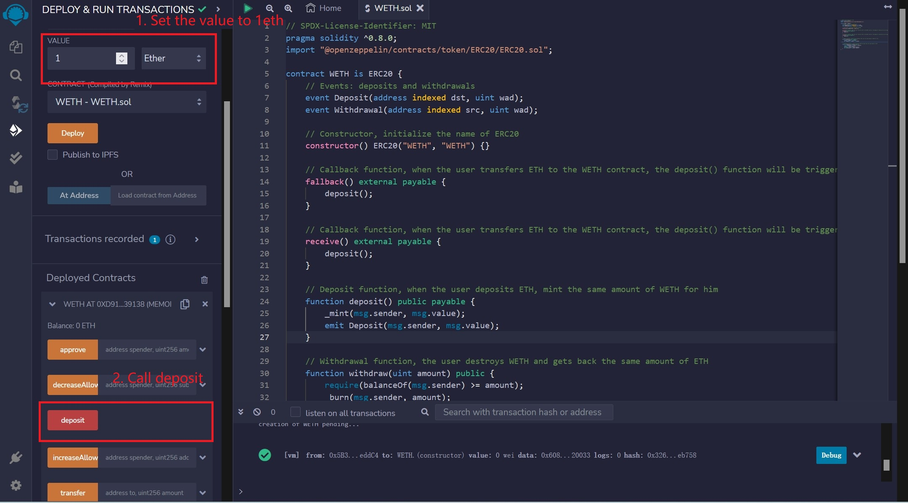
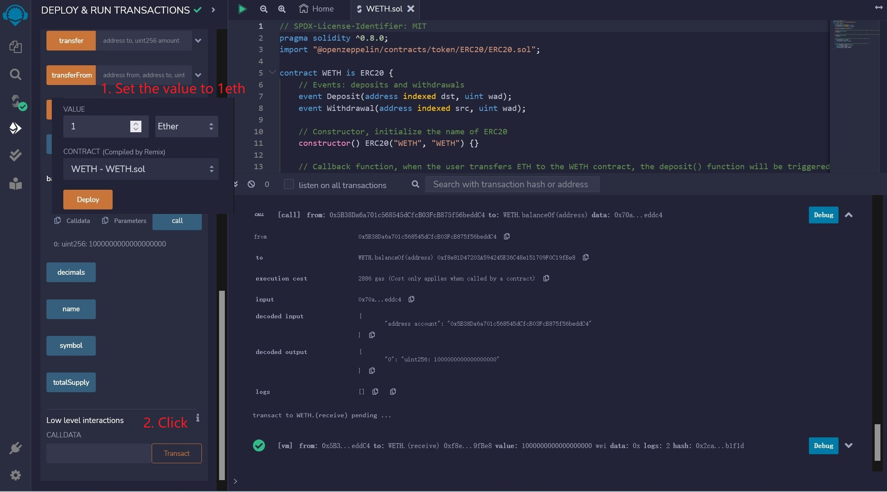
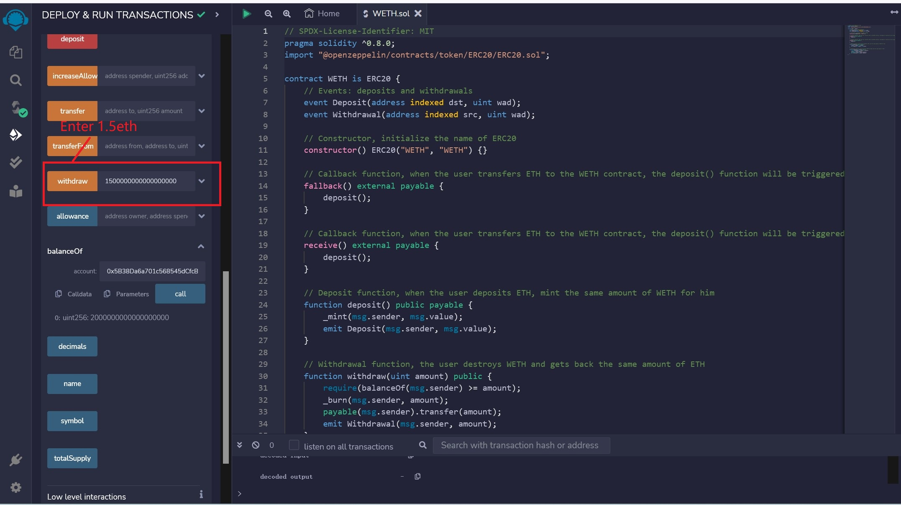
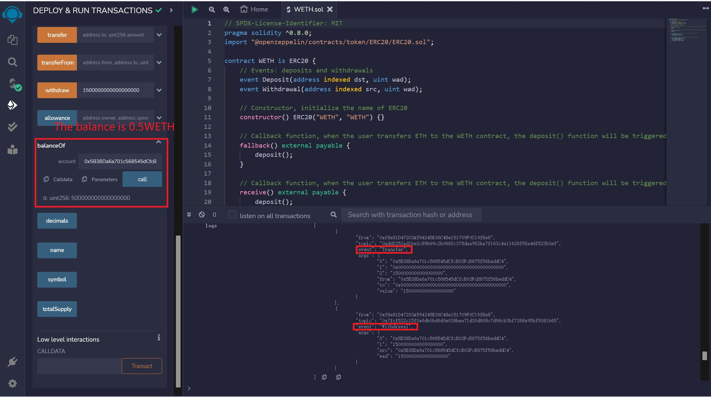

# WTF Solidity Crash Course: 41. WETH

I am currently re-learning Solidity to refresh my knowledge and create a "WTF Solidity Crash Course" for beginners to use (advanced programmers may find other resources more suitable). A new lesson will be added each week.

Twitter: [@0xAA_Science](https://twitter.com/0xAA_Science)

Discord: [WTF Academy](https://discord.gg/5akcruXrsk)

All code and tutorials are open-sourced on GitHub: [github.com/AmazingAng/WTFSolidity](https://github.com/AmazingAng/WTFSolidity)

-----

In this lecture, we will learn about `WETH` - the wrapped version of `ETH`.

## What is `WETH`?


`WETH` (Wrapped ETH) is a wrapped version of `ETH`. The commonly seen `WETH`, `WBTC`, and `WBNB` are all wrapped native tokens. Why do we need to wrap them?

In 2015, the [ERC20](https://github.com/AmazingAng/WTFSolidity/blob/main/20_SendETH/readme.md) standard was introduced, which aimed to establish a set of standard rules for tokens on Ethereum, simplifying the release of new tokens and making all tokens on the blockchain comparable to each other. Unfortunately, Ether itself does not adhere to the `ERC20` standard. The development of `WETH` is to improve interoperability between blockchains and allow the use of `ETH` in decentralized applications (dApps). It is like putting a smart contract's clothing on the native token: when the clothing is put on, it becomes `WETH`, complying with the `ERC20` standard for fungible tokens, and can be used for dApps and cross-chain transfer. When the clothing is taken off, it can be exchanged 1:1 for `ETH`.

## The `WETH` Contract

The currently used [mainnet `WETH` contract](https://rinkeby.etherscan.io/token/0xc778417e063141139fce010982780140aa0cd5ab?a=0xe16c1623c1aa7d919cd2241d8b36d9e79c1be2a2) was written in 2015, and is very old, with solidity version 0.4. We will rewrite a `WETH` contract using version 0.8.

`WETH` complies with the `ERC20` standard and has two additional features compared to a typical `ERC20` contract:

1. Deposit: Wrapping - users deposit `ETH` into the `WETH` contract and receive an equivalent amount of `WETH`.
2. Withdrawal: Unwrapping - users destroy `WETH` and receive an equivalent amount of `ETH`.

```
// SPDX-License-Identifier: MIT
pragma solidity ^0.8.0;

import "@openzeppelin/contracts/token/ERC20/ERC20.sol";

contract WETH is ERC20{
    // 事件：存款和取款
    event  Deposit(address indexed dst, uint wad);
    event  Withdrawal(address indexed src, uint wad);

    // 构造函数，初始化ERC20的名字和代号
    constructor() ERC20("WETH", "WETH"){
    }

    // 回调函数，当用户往WETH合约转ETH时，会触发deposit()函数
    fallback() external payable {
        deposit();
    }
    // 回调函数，当用户往WETH合约转ETH时，会触发deposit()函数
    receive() external payable {
        deposit();
    }

    // 存款函数，当用户存入ETH时，给他铸造等量的WETH
    function deposit() public payable {
        _mint(msg.sender, msg.value);
        emit Deposit(msg.sender, msg.value);
    }

    // 提款函数，用户销毁WETH，取回等量的ETH
    function withdraw(uint amount) public {
        require(balanceOf(msg.sender) >= amount);
        _burn(msg.sender, amount);
        payable(msg.sender).transfer(amount);
        emit Withdrawal(msg.sender, amount);
    }
}
```

### Inheritance

`WETH` conforms to the `ERC20` token standard, so the `WETH` contract inherits from the `ERC20` contract.

### Events

The `WETH` contract has `2` events:

1. `Deposit`: Triggered when a deposit is made.
2. `Withdraw`: Triggered when a withdrawal is made.

### Functions

In addition to the `ERC20` standard functions, the `WETH` contract has `5` additional functions:

- Constructor: Initializes the name and symbol of `WETH`.
- Callback functions: `fallback()` and `receive()`. When a user sends `ETH` to the `WETH` contract, these functions are automatically triggered to execute the `deposit()` function, which mints equivalent `WETH` tokens.
- `deposit()`: Allows a user to deposit `ETH` and mint the equivalent amount of `WETH`.
- `withdraw()`: Allows a user to burn `WETH` tokens and receive back an equivalent amount of `ETH`.

## `Remix` Demonstration

### 1. Deploy the `WETH` contract

Deploy the `WETH` contract as shown in the image.


### 2. Execute `deposit` to deposit `1 ETH`, and check the `WETH` balance.

Execute `deposit` function to deposit `1 ETH`, and check the `WETH` balance.



At this point, the `WETH` balance is `1 WETH`.


### 3. Transfer `1 ETH` directly to the `WETH` contract, and check the `WETH` balance.

Transfer `1 ETH` directly to the `WETH` contract, and check the `WETH` balance.



At this point, the `WETH` balance is `2 WETH`.


### 4. Call `withdraw` to withdraw `1.5 ETH`, and check the `WETH` balance



At this point, the `WETH` balance is `0.5 WETH`.



## Summary

In this tutorial, we introduced `WETH` and implemented the `WETH` contract. It's like putting a smart contract on top of the native `ETH`: when you put on the contract, it becomes `WETH`, which conforms to the `ERC20` standard for homogeneous tokens, can be used across chains, and can be used for `dApps`; when you take off the contract, it can be exchanged with `ETH` at a 1:1 ratio.