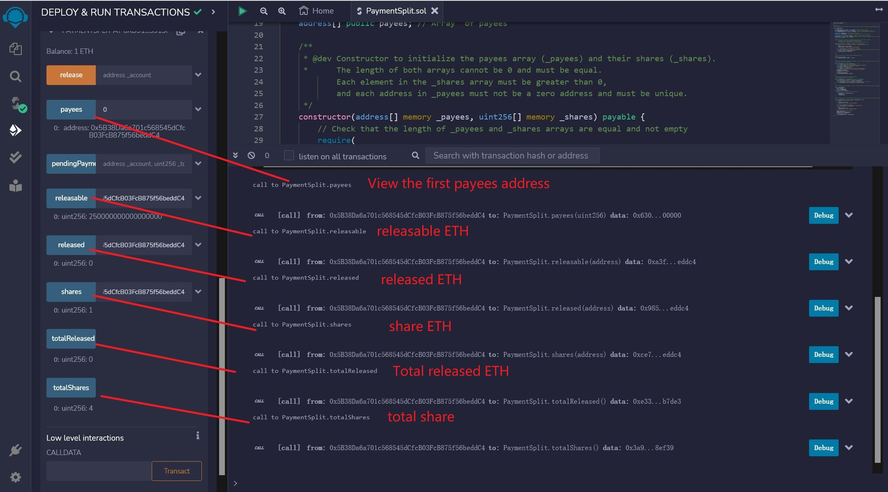
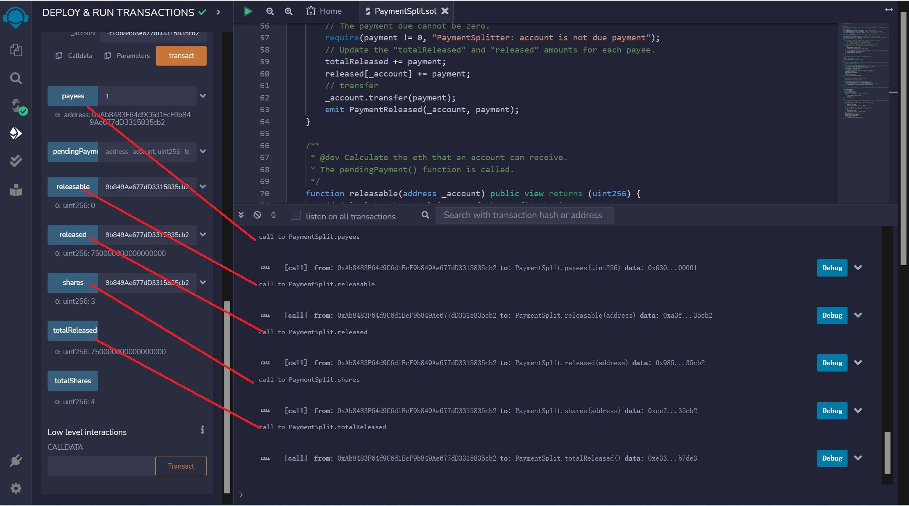

# WTF Solidity Crash Course: 42. Payment Splitting

I have been relearning solidity recently to solidify some of the details and to create a "WTF Solidity Crash Course" for beginners (advanced programmers can seek other tutorials). New lectures will be updated every week, ranging from 1 to 3.

Twitter: [@0xAA_Science](https://twitter.com/0xAA_Science)

Discord: [WTF Academy](https://discord.gg/5akcruXrsk)

All codes and tutorials are open-sourced on Github: [github.com/AmazingAng/WTFSolidity](https://github.com/AmazingAng/WTFSolidity)

-----

In this lecture, we'll introduce the payment splitting contract, which allows the transfer of `ETH` to a group of accounts according to their respective weights for payment splitting purposes. The code section is a simplification of the PaymentSplitter contract provided by the OpenZeppelin library, which can be found on [Github](https://github.com/OpenZeppelin/openzeppelin-contracts/blob/master/contracts/finance/PaymentSplitter.sol).

## Payment Split

Payment split is the act of dividing money according to a certain ratio. In real life, it is common to encounter situations where the spoils are not divided equally. However, in the world of blockchain, `Code is Law`, we can write the proportion that each person should get in the smart contract in advance, and let the smart contract handle the split of income.


## Payment Split Contract

The Payment Split contract (`PaymentSplit`) has the following features:

1. When creating the contract, the beneficiaries `payees` and their share `shares` are predetermined.
2. The shares can be equal or in any other proportions.
3. From all the ETH that the contract receives, each beneficiary is able to withdraw the amount proportional to their allocated share.
4. The Payment Split contract follows the `Pull Payment` pattern, where payments are not automatically transferred to the account, but are kept in the contract. Beneficiaries trigger the actual transfer by calling the `release()` function.

```solidity
// SPDX-License-Identifier: MIT
pragma solidity ^0.8.4;

/**
 * Payment Split Contract 
 * @dev This contract splits received ETH into predetermined percentages among several accounts. Received ETH is stored in the contract and each beneficiary needs to call the release() function to withdraw their share.
 */
contract PaymentSplit{
```

### Events

There are a total of `3` events in the Splitter Contract:

- `PayeeAdded`: Event for adding a payee.
- `PaymentReleased`: Event for payee withdrawing funds.
- `PaymentReceived`: Event for Splitter Contract receiving funds.

```solidity
    // 事件
    event PayeeAdded(address account, uint256 shares); // 增加受益人事件
    event PaymentReleased(address to, uint256 amount); // 受益人提款事件
    event PaymentReceived(address from, uint256 amount); // 合约收款事件
```

### State Variables

There are `5` state variables in the revenue splitting contract, used to record beneficiary addresses, shares, and paid out `ETH`:

- `totalShares`: Total shares, which is the sum of `shares`.
- `totalReleased`: The amount of `ETH` paid out from the revenue splitting contract to beneficiaries, which is the sum of `released`.
- `payees`: An `address` array that records the addresses of beneficiaries.
- `shares`: An `address` to `uint256` mapping that records the shares of each beneficiary.
- `released`: An `address` to `uint256` mapping that records the amount paid to each beneficiary by the revenue splitting contract.

```solidity
    uint256 public totalShares; // 总份额
    uint256 public totalReleased; // 总支付

    mapping(address => uint256) public shares; // 每个受益人的份额
    mapping(address => uint256) public released; // 支付给每个受益人的金额
    address[] public payees; // 受益人数组
```

### Functions

There are `6` functions in the revenue sharing contract:

- Constructor: initializes the beneficiary array `_payees` and the revenue sharing array `_shares`, where the length of both arrays must not be 0 and their lengths must be equal. Elements of the _shares array must be greater than 0, and the addresses in the _payees array can't be the zero address and can't have a duplicate address.
- `receive()`: callback function, releases the `PaymentReceived` event when the revenue sharing contract receives `ETH`.
- `release()`: revenue sharing function, distributes the corresponding `ETH` to the valid beneficiary address `_account`. Anyone can trigger this function, but the `ETH` will be transferred to the beneficiary address `_account`. Calls the releasable() function.
- `releasable()`: calculates the amount of `ETH` that a beneficiary address should receive. Calls the `pendingPayment()` function.
- `pendingPayment()`: calculates the amount of `ETH` that the beneficiary should receive based on their address `_account`, the revenue sharing contract's total income `_totalReceived`, and the money they have already received `_alreadyReleased`.
- `_addPayee()`: function to add a new beneficiary and their sharing percentage. It is called during the initialization of the contract and cannot be modified afterwards.

```solidity
    /**
     * @dev 初始化受益人数组_payees和分账份额数组_shares
     * 数组长度不能为0，两个数组长度要相等。_shares中元素要大于0，_payees中地址不能为0地址且不能有重复地址
     */
    constructor(address[] memory _payees, uint256[] memory _shares) payable {
        // 检查_payees和_shares数组长度相同，且不为0
        require(_payees.length == _shares.length, "PaymentSplitter: payees and shares length mismatch");
        require(_payees.length > 0, "PaymentSplitter: no payees");
        // 调用_addPayee，更新受益人地址payees、受益人份额shares和总份额totalShares
        for (uint256 i = 0; i < _payees.length; i++) {
            _addPayee(_payees[i], _shares[i]);
        }
    }

    /**
     * @dev 回调函数，收到ETH释放PaymentReceived事件
     */
    receive() external payable virtual {
        emit PaymentReceived(msg.sender, msg.value);
    }

    /**
     * @dev 为有效受益人地址_account分帐，相应的ETH直接发送到受益人地址。任何人都可以触发这个函数，但钱会打给account地址。
     * 调用了releasable()函数。
     */
    function release(address payable _account) public virtual {
        // account必须是有效受益人
        require(shares[_account] > 0, "PaymentSplitter: account has no shares");
        // 计算account应得的eth
        uint256 payment = releasable(_account);
        // 应得的eth不能为0
        require(payment != 0, "PaymentSplitter: account is not due payment");
        // 更新总支付totalReleased和支付给每个受益人的金额released
        totalReleased += payment;
        released[_account] += payment;
        // 转账
        _account.transfer(payment);
        emit PaymentReleased(_account, payment);
    }

    /**
     * @dev 计算一个账户能够领取的eth。
     * 调用了pendingPayment()函数。
     */
    function releasable(address _account) public view returns (uint256) {
        // 计算分账合约总收入totalReceived
        uint256 totalReceived = address(this).balance + totalReleased;
        // 调用_pendingPayment计算account应得的ETH
        return pendingPayment(_account, totalReceived, released[_account]);
    }

    /**
     * @dev 根据受益人地址`_account`, 分账合约总收入`_totalReceived`和该地址已领取的钱`_alreadyReleased`，计算该受益人现在应分的`ETH`。
     */
    function pendingPayment(
        address _account,
        uint256 _totalReceived,
        uint256 _alreadyReleased
    ) public view returns (uint256) {
        // account应得的ETH = 总应得ETH - 已领到的ETH
        return (_totalReceived * shares[_account]) / totalShares - _alreadyReleased;
    }

    /**
     * @dev 新增受益人_account以及对应的份额_accountShares。只能在构造器中被调用，不能修改。
     */
    function _addPayee(address _account, uint256 _accountShares) private {
        // 检查_account不为0地址
        require(_account != address(0), "PaymentSplitter: account is the zero address");
        // 检查_accountShares不为0
        require(_accountShares > 0, "PaymentSplitter: shares are 0");
        // 检查_account不重复
        require(shares[_account] == 0, "PaymentSplitter: account already has shares");
        // 更新payees，shares和totalShares
        payees.push(_account);
        shares[_account] = _accountShares;
        totalShares += _accountShares;
        // 释放增加受益人事件
        emit PayeeAdded(_account, _accountShares);
    }
```

## Remix Demo

### 1. Deploy the `PaymentSplit` contract and transfer `1 ETH`

In the constructor, enter two beneficiary addresses with shares of `1` and `3`.


### 2. View beneficiary addresses, shares, and `ETH` to be distributed




### 3. Call `release` function to claim `ETH`


### 4. View overall expenses, beneficiary balances, and changes in `ETH` to be distributed



## Summary

In this lecture, we introduced the revenue sharing contract. In the world of blockchain, `Code is Law`, we can write the proportion that each person should receive in the smart contract beforehand. After receiving revenue, the smart contract will handle revenue sharing to avoid the issue of "unequal distribution of shares" afterwards.