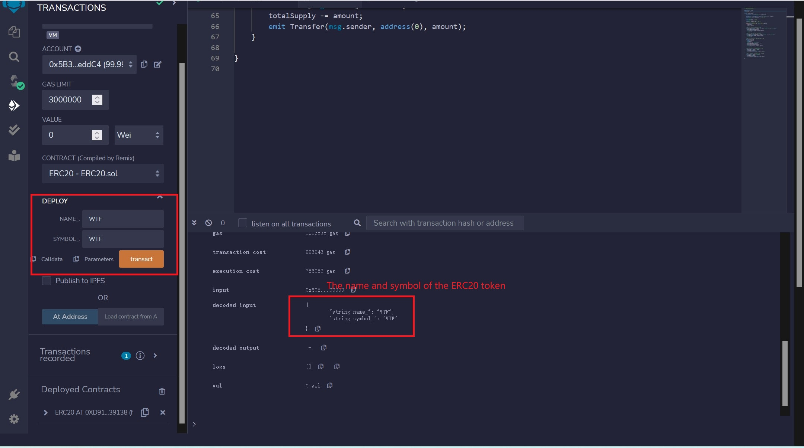
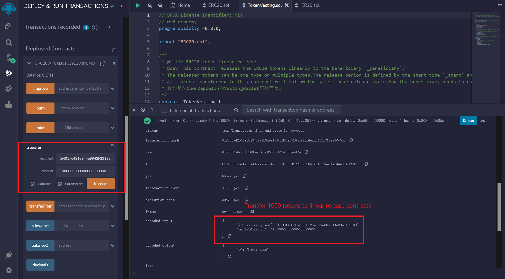
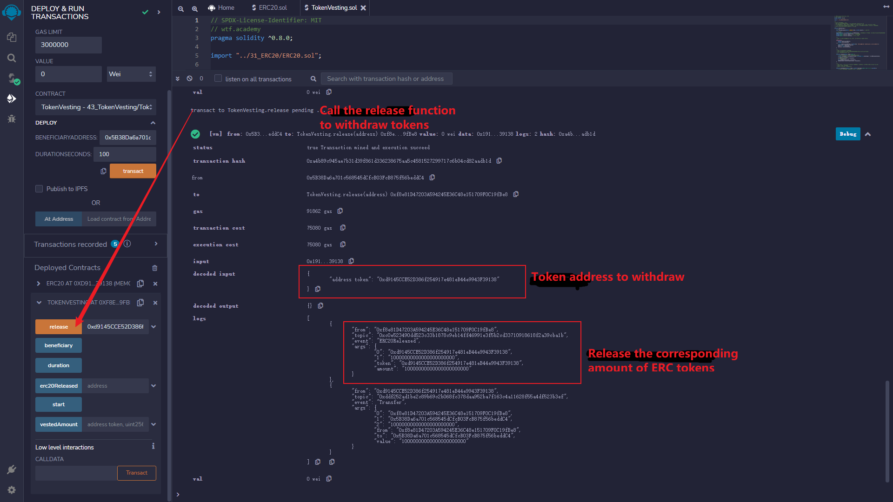

# WTF Simplified Solidity: 43. Linear Release

I am currently re-learning Solidity to consolidate my understanding of the details and to create a "Simplified Solidity for Beginners" guide for newbies (programming experts can find other tutorials). I update this guide with 1-3 lessons per week.

Twitter: [@0xAA_Science](https://twitter.com/0xAA_Science)

Community: [Discord](https://discord.gg/5akcruXrsk)｜[WeChat Group](https://docs.google.com/forms/d/e/1FAIpQLSe4KGT8Sh6sJ7hedQRuIYirOoZK_85miz3dw7vA1-YjodgJ-A/viewform?usp=sf_link)｜[wtf.academy](https://wtf.academy)

All code and tutorials are open-sourced on GitHub: [github.com/AmazingAng/WTFSolidity](https://github.com/AmazingAng/WTFSolidity)

---

In this lesson, we will introduce token vesting clauses and write a contract for linearly releasing ERC20 tokens. The code is simplified from OpenZeppelin's VestingWallet contract.

## Token Vesting Clauses

In traditional finance, some companies provide equity to employees and management. However, a large amount of equity released at the same time can create selling pressure in the short term, dragging down the stock price. Therefore, companies typically introduce a vesting period to delay ownership of committed assets. Similarly, in the blockchain field, Web3 startups allocate tokens to their teams and also sell tokens at a low price to venture capital and private equity. If they simultaneously bring these low-cost tokens to the exchange for liquidity, the token price will be crushed, making retail investors the bag holders.

So, project teams generally agree on token vesting clauses, gradually releasing tokens during the vesting period to reduce selling pressure and prevent teams and capital parties from going out too early.

## Linear Release

Linear release refers to the constant release of tokens during the vesting period. For example, if a private equity holds 365,000 ICU tokens with a vesting period of 1 year (365 days), 1,000 tokens will be released every day.

Now, let's write a contract TokenVesting for locking and linearly releasing ERC20 tokens. Its logic is simple:

- The project team specifies the start time, vesting period, and beneficiary of the linear release.
- The project team transfers the ERC20 tokens to be locked to the TokenVesting contract.
- The beneficiary can call the release function to withdraw the released tokens from the contract.

### Events

There is `1` event in the Linear Release contract.

- `ERC20Released`: withdrawal event, triggered when the beneficiary withdraws the released tokens.

```solidity

contract TokenVesting {
    // Event
    event ERC20Released(address indexed token, uint256 amount); // Withdraw event

```

### State Variables

There are `4` state variables in the linear release contract.

- `beneficiary`: the beneficiary address.
- `start`: the starting timestamp of the vesting period.
- `duration`: the duration of the vesting period in seconds.
- `erc20Released`: a mapping of token address to the amount released, which records the amount of tokens the beneficiary has already claimed.

```solidity
    // State variables
    mapping(address => uint256) public erc20Released; // Token address -> release amount mapping, recording the number of tokens the beneficiary has received
    address public immutable beneficiary; // Beneficiary address
    uint256 public immutable start; // Start timestamp
    uint256 public immutable duration; // Duration
```

### Functions

There are `3` functions in the LinearVesting contract.

- Constructor: initializes the beneficiary address, duration in seconds and starting timestamp. The constructor takes `beneficiaryAddress` and `durationSeconds` as input parameters. The starting timestamp is set to the deployment blockchain timestamp `block.timestamp` for convenience.
- `release()`: transfers the vested tokens to the beneficiary address. This function calls `vestedAmount()` to calculate the amount of vested tokens, emits the `ERC20Released` event, and then calls the `transfer` function to transfer tokens to the beneficiary. The token address is passed as an input parameter `token`.
- `vestedAmount()`: calculates the number of vested tokens based on the linear vesting formula. Developers can modify this function to implement a customized vesting schedule. The function takes `token` and `timestamp` as input parameters.

```solidity
    /**
     * @dev Initialize the beneficiary address,release duration (seconds),start timestamp (current blockchain timestamp)
     */
    constructor(address beneficiaryAddress, uint256 durationSeconds) {
        require(
            beneficiaryAddress != address(0),
            "VestingWallet: beneficiary is zero address"
        );
        beneficiary = beneficiaryAddress;
        start = block.timestamp;
        duration = durationSeconds;
    }

    /**
     * @dev Beneficiary withdraws the released tokens.
     * Calls the vestedAmount() function to calculate the amount of tokens that can be withdrawn, then transfer them to the beneficiary.
     * Emit an {ERC20Released} event.
     */
    function release(address token) public {
        // Calls the vestedAmount() function to calculate the amount of tokens that can be withdrawn.
        uint256 releasable = vestedAmount(token, uint256(block.timestamp)) -
            erc20Released[token];
        // Updates the amount of tokens that have been released.
        erc20Released[token] += releasable;
        // Transfers the tokens to the beneficiary.
        emit ERC20Released(token, releasable);
        IERC20(token).transfer(beneficiary, releasable);
    }

    /**
     * @dev According to the linear release formula, calculate the released quantity. Developers can customize the release method by modifying this function.
     * @param token: Token address
     * @param timestamp: Query timestamp
     */
    function vestedAmount(
        address token,
        uint256 timestamp
    ) public view returns (uint256) {
        // Total amount of tokens received in the contract (current balance + withdrawn)
        uint256 totalAllocation = IERC20(token).balanceOf(address(this)) +
            erc20Released[token];
        // According to the linear release formula, calculate the released quantity
        if (timestamp < start) {
            return 0;
        } else if (timestamp > start + duration) {
            return totalAllocation;
        } else {
            return (totalAllocation * (timestamp - start)) / duration;
        }
    }
```

## `Remix` Demo

### 1. Deploy the `ERC20` contract in [Lesson 31](../31_ERC20/readme.md), and mint yourself `1000` tokens.




### 2. Deploy the `TokenVesting` contract for linear release, set yourself as the beneficiary, and set the vesting period to `100` seconds.


### 3. Transfer `1000` `ERC20` tokens to the linear release contract.



### 4. Call the `release()` function to extract the tokens.



## Summary

A large amount of token unlocking in the short term can cause huge pressure on the token price, while agreed-upon token ownership terms can alleviate selling pressure and prevent the team and capital parties from exiting too early. In this lesson, we introduced token ownership terms and wrote a contract for linear release of ERC20 tokens.
