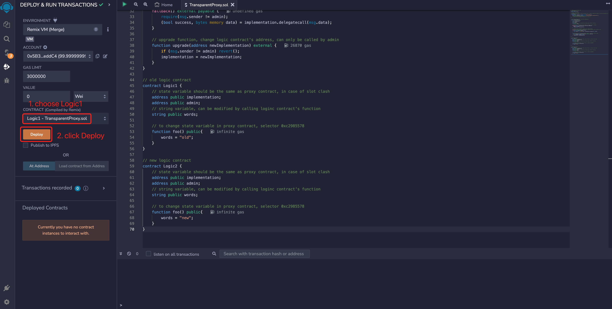
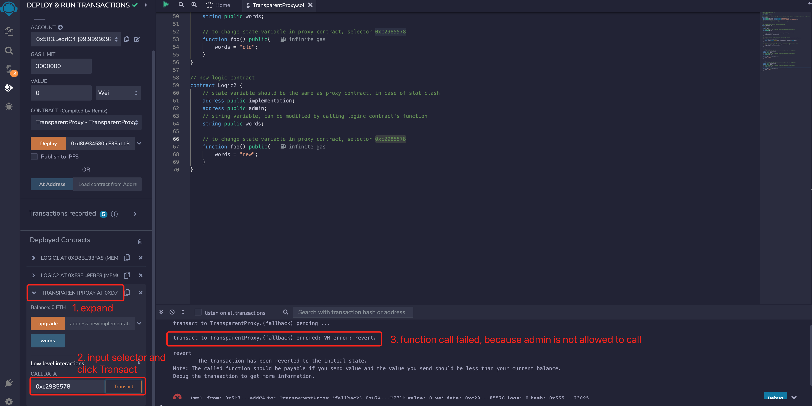

# WTF Solidity Crash Course: 48. Transparent Proxy

I've been relearning Solidity lately to solidify some details and create a "WTF Solidity Crash Course" for beginners (advanced programmers might want to look for other tutorials). I'll be updating with 1-3 lessons per week.

Twitter: [@0xAA_Science](https://twitter.com/0xAA_Science)

Community: [Discord](https://discord.gg/5akcruXrsk) | [WeChat group](https://docs.google.com/forms/d/e/1FAIpQLSe4KGT8Sh6sJ7hedQRuIYirOoZK_85miz3dw7vA1-YjodgJ-A/viewform?usp=sf_link) | [Official website wtf.academy](https://wtf.academy)

All code and tutorials are open source on GitHub: [github.com/AmazingAng/WTFSolidity](https://github.com/AmazingAng/WTFSolidity)

-----

In this lesson, we will introduce the selector clash issue in proxy contracts, and the solution to this problem: transparent proxies. The teaching code is simplified from `OpenZeppelin's` [TransparentUpgradeableProxy](https://github.com/OpenZeppelin/openzeppelin-contracts/blob/master/contracts/proxy/transparent/TransparentUpgradeableProxy.sol) and SHOULD NOT BE APPLIED IN PRODUCTION.

## Selector Clash

In smart contracts, a function selector is the hash of a function signature's first 4 bytes. For example, the selector of function `mint(address account)` is `bytes4(keccak256("mint(address)"))`, which is `0x6a627842`. More about function selectors see [WTF Solidity Tutorial #29: Function Selectors](https://github.com/AmazingAng/WTFSolidity/blob/main/Languages/en/29_Selector_en/readme.md).

Because a function selector has only 4 bytes, its range is very small. Therefore, two different functions may have the same selector, such as the following two functions:

```solidity
// selector clash example
contract Foo {
    function burn(uint256) external {}
    function collate_propagate_storage(bytes16) external {}
}
```

In the example, both the `burn()` and `collate_propagate_storage()` functions have the same selector `0x42966c68`. This situation is called "selector clash". In this case, the EVM cannot differentiate which function the user is calling based on the function selector, so the contract cannot be compiled.

Since the proxy contract and the logic contract are two separate contracts, they can be compiled normally even if there is a "selector clash" between them, which may lead to serious security accidents. For example, if the selector of the `a` function in the logic contract is the same as the upgrade function in the proxy contract, the admin will upgrade the proxy contract to a black hole contract when calling the `a` function, which is disastrous.

Currently, there are two upgradeable contract standards that solve this problem: Transparent Proxy and Universal Upgradeable Proxy Standard (UUPS).

## Transparent Proxy

The logic of the transparent proxy is very simple: admin may mistakenly call the upgradable functions of the proxy contract when calling the functions of the logic contract because of the "selector clash". Restricting the admin's privileges can solve the conflict:

- The admin becomes a tool person and can only upgrade the contract by calling the upgradable function of the proxy contract, without calling the fallback function to call the logic contract.
- Other users cannot call upgradable function, but can call functions of the logic contract.

### Proxy Contract

The proxy contract here is very similar to the one in [Lecture 47](https://github.com/AmazingAng/WTFSolidity/blob/main/Languages/en/47_Upgrade_en/readme.md), except that the `fallback()` function restricts the call by the admin address.

It contains three variables:

- `implementation`: The address of the logic contract.
- `admin`: The admin address.
- `words`: A string that can be changed by calling functions in the logic contract.

It contains `3` functions:

- Constructor: Initializes the admin and logic contract addresses.
- `fallback()`: A callback function that delegates the call to the logic contract and cannot be called by the `admin`.
- `upgrade()`: An upgrade function that changes the logic contract address and can only be called by the `admin`.

```solidity
// FOR TEACHING PURPOSE ONLY, DO NOT USE IN PRODUCTION
contract TransparentProxy {
    // logic contract's address
    address implementation; 
    // admin address
    address admin; 
    // string variable, can be modified by calling loginc contract's function
    string public words;

    // constructor, initializing the admin address and logic contract's address
    constructor(address _implementation){
        admin = msg.sender;
        implementation = _implementation;
    }

    // fallback function, delegates function call to logic contract
    // can not be called by admin, to avoid causing unexpected beahvior due to selector clash
    fallback() external payable {
        require(msg.sender != admin);
        (bool success, bytes memory data) = implementation.delegatecall(msg.data);
    }

    // upgrade function, change logic contract's address, can only be called by admin
    function upgrade(address newImplementation) external {
        if (msg.sender != admin) revert();
        implementation = newImplementation;
    }
}
```

### Logic Contract

The new and old logic contracts here are the same as in [Lecture 47](https://github.com/AmazingAng/WTFSolidity/blob/main/Languages/en/47_Upgrade_en/readme.md). The logic contracts contain `3` state variables, consistent with the proxy contract to prevent slot conflicts. It also contains a function `foo()`, where the old logic contract will change the value of `words` to `"old"`, and the new one will change it to `"new"`.

```solidity
// old logic contract
contract Logic1 {
    // state variable should be the same as proxy contract, in case of slot clash
    address public implementation; 
    address public admin; 
    // string variable, can be modified by calling loginc contract's function
    string public words; 

    // to change state variable in proxy contract, selector 0xc2985578
    function foo() public{
        words = "old";
    }
}

// new logic contract
contract Logic2 {
    // state variable should be the same as proxy contract, in case of slot clash
    address public implementation; 
    address public admin; 
    // string variable, can be modified by calling loginc contract's function
    string public words;

    // to change state variable in proxy contract, selector 0xc2985578
    function foo() public{
        words = "new";
    }
}
```

## Implementation with `Remix`

1. Deploy new and old logic contracts `Logic1` and `Logic2`.



2. Deploy a transparent proxy contract `TransparentProxy`, and set the `implementation` address to the address of the old logic contract.


3. Using the selector `0xc2985578`, call the `foo()` function of the old logic contract `Logic1` in the proxy contract. The call will fail because the admin is not allowed to call the logic contract.


4. Switch to a new wallet, use the selector `0xc2985578` to call the `foo()` function of the old logic contract `Logic1` in the proxy contract, and change the value of `words` to `"old"`. The call will be successful.


5. Switch back to the admin wallet and call `upgrade()`, setting the `implementation` address to the new logic contract `Logic2`.


6. Switch to the new wallet, use the selector `0xc2985578` to call the `foo()` function of the new logic contract `Logic2` in the proxy contract, and change the value of `words` to `"new"`.


## Summary

In this lesson, we introduced the "selector clash" in proxy contracts and how to avoid this problem using transparent proxy. The logic of transparent proxy is simple, solving the "selector clash" problem by restricting the admin's access to the logic contract. However, it has a drawback that every time a user calls a function, there is an additional check for whether or not the caller is the admin, which consumes more gas. Nevertheless, transparent proxy are still the solution chosen by most project teams.

In the next lesson, we will introduce the general Universal Upgradeable Proxy Standard (UUPS), which is more complex but consumes less gas.