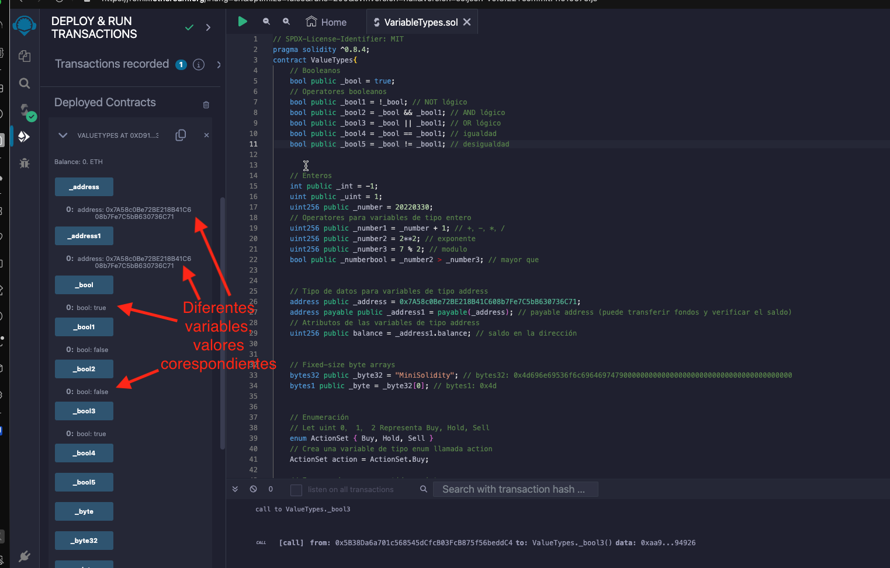
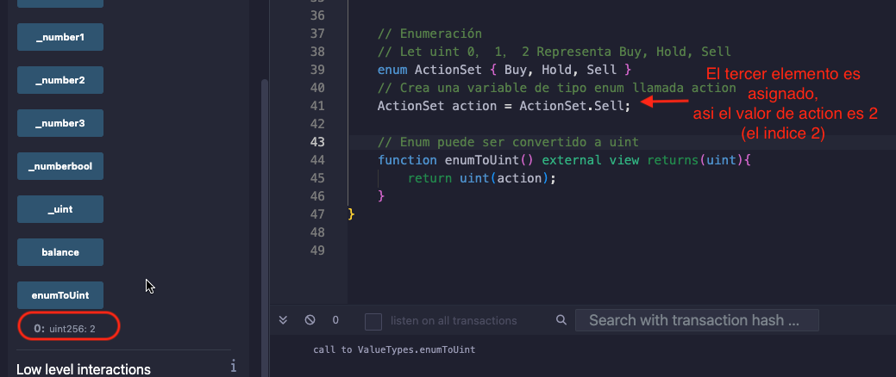

# Tutorial WTM Solidity: 2. Tipos de valor (Value Types)

Recientemente, he estado revisando Solidity y escribiendo tutoriales en "WTF Solidity" para principiantes.

Twitter: [@0xAA_Science](https://twitter.com/0xAA_Science) | [@WTFAcademy_](https://twitter.com/WTFAcademy_)

Comunidad: [Discord](https://discord.gg/5akcruXrsk)｜[Wechat](https://docs.google.com/forms/d/e/1FAIpQLSe4KGT8Sh6sJ7hedQRuIYirOoZK_85miz3dw7vA1-YjodgJ-A/viewform?usp=sf_link)｜[Sitio web wtf.academy](https://wtf.academy)

Los códigos y tutoriales están como código abierto en GitHub: [github.com/AmazingAng/WTFSolidity](https://github.com/AmazingAng/WTFSolidity)


-----

## Tipos de variable (Variable Types)

1. **Tipo de variables**： Booleanas, enteras, etc. Estas variables pasan valores directamente cuando son asignadas.

2. **Tipos de Referencia**：Se incluyen arreglos y estructuras. Pasan direcciones al asignar y pueden ser modificadas por varios nombres de variable. 

3. **Tipo Mapping**: Tablas hash en Solidity.

4. **Tipo Función**：La documentación de Solidity clasifica las funciones en tipo de variables, pero son diferentes de otros tipos. 
Las voy a colocar en una categoría diferente.

Solo se presentaran los tipos más comúnmente usandos. En este capitulo introduciremos los siguientes tipos de variables.

## Tipos de variables (Value types)

### 1. Booleano

Los booleanos son variables binarias con valores `true` o `false` 

```solidity
    // Boolean
    bool public _bool = true;
```

Operadores para variables de tipo booleano:

- `!`   (NOT lógico)
- `&&`  (AND Lógico)
- `||`  (OR Lógico)
- `==`  (igualdad)
- `!=`  (desigualdad)

Código：

```solidity
    // Boolean operators
    bool public _bool1 = !_bool; // NOT Lógico
    bool public _bool2 = _bool && _bool1; // AND Lógico
    bool public _bool3 = _bool || _bool1; // OR Lógico
    bool public _bool4 = _bool == _bool1; // igualdad
    bool public _bool5 = _bool != _bool1; // desigualdad
```

Del anterior código: el valor the la variable `_bool` es `true`; `bool1` es no `_bool` que es `false`; `_bool || _bool1` es `true`; `bool == _bool1` es `false`; y  `_bool != _bool1` is `true`. 

**Nota：** Los operadores `&&` and `||` siguen la regla de evaluación de cortocircuito. 


### 2. Enteros (Integers)

Los tipos enteros en Solidity incluyen el entero con signo `int` y los enteros sin signo `uint`

Código:

```solidity
    // Integer
    int public _int = -1; // Entero consigno
    uint public _uint = 1; // Entero sin signo
    uint256 public _number = 20220330; // 256-bit enteros positivos
```
Operatores más usados en variables de tipo enteras:

- Operadores de desigualdad (Los cuales retornan booleans)： `<=`,  `<`,  `==`,  `!=`,  `>=`,  `>` 
- Operadores aritmeticos： `+`,  `-`,  `*`,  `/`,  `%` (modulo), `**` (exponent)

Código：

```solidity
    // Integer operations
    uint256 public _number1 = _number + 1; // +, -, *, /
    uint256 public _number2 = 2**2; // Exponente
    uint256 public _number3 = 7 % 2; // Modulo
    bool public _numberbool = _number2 > _number3; // Mayor que
```

Puedes correr el código anterior y revisar los valores de cada variable.

### 3. Direcciones (Addresses)

Tipos de direcciones:

- `address`: Contienen un valor de 20 bytes (tamaño de una dirección de Etherehum).

- `address payable`: Igual que `address`, pero con metodos adicionales `transfer` y `send`.

Código:

```solidity
    // Dirección
    address public _address = 0x7A58c0Be72BE218B41C608b7Fe7C5bB630736C71;
    address payable public _address1 = payable(_address); // payable address (puede transferir fondos y verificar el saldo)
    // Atributos de las variables de tipo address
    uint256 public balance = _address1.balance; // saldo en la dirección
```

### 4. Arreglos de bytes de tamaño fijo (Fixed-size byte arrays)

Tipos de arreglos de bytes en Solidity:

- Arreglos de bytes de longitud fija: pertenecen a tipos de valor incluyendo `byte`, `bytes8` y `bytes32` etc, dependiendo del tamaño de cada elemento (máximo 32 bytes). El tamaño del arreglo no puede ser modificado después de su declaración.
- Arreglos de bytes de longitud variable: pertenecen a tipo de referencia incluyendo `bytes` , etc. El tamaño del arreglo puede ser modificado después de su declaración. Los veremos con más detalles en los capítulos siguientes

Código：

```solidity
    // Fixed-size byte arrays
    bytes32 public _byte32 = "MiniSolidity"; 
    bytes1 public _byte = _byte32[0]; 
```

En el código anterior asignamos el valor de `MiniSolidity` a la variable `_bytes32` , o en hexadecimal: `0x4d696e69536f6c69646974790000000000000000000000000000000000000000`
y `_byte` toma el valor del primer byte de `_byte32` que es `0x4d`

### 5. Enumeración (Enumeration)

La enumeración (`enum`) es un tipo de dato definido por el usuario en Solidity. Se utiliza principalmente para asignar nombre a `uint`, para mantener el código más legible.

Code:

```solidity
    // Let uint 0,  1,  2 Representa Buy, Hold, Sell
    enum ActionSet { Buy, Hold, Sell }
    // Crea una variable de tipo enum llamada action
    ActionSet action = ActionSet.Buy;
```

Se puede convertir fácilmente a `uint`:

```solidity
    // Enum puede ser convertido a uint
    function enumToUint() external view returns(uint){
        return uint(action);
    }
```

`enum` es un tipo de variable no muy popular en Solidity.

## Demostración en Remix

- Despues de desplegar el contrato, puedes verificar los valores de cada variable.


   
  
- Conversión entre enum y uint:

   

   

## Resumen 

En este capitulo, introdujimos los tipos de variable en Solidity: tipo valor, tipo referencia, mapping y funciones. Luego presentamos los tipo de variables más comúnmente usados:
Booleano, entero, dirección, arreglo de bytes de tamaño fijo y enumeración.
Cubriremos otros tipos de variables en tutoriales posterioes.
