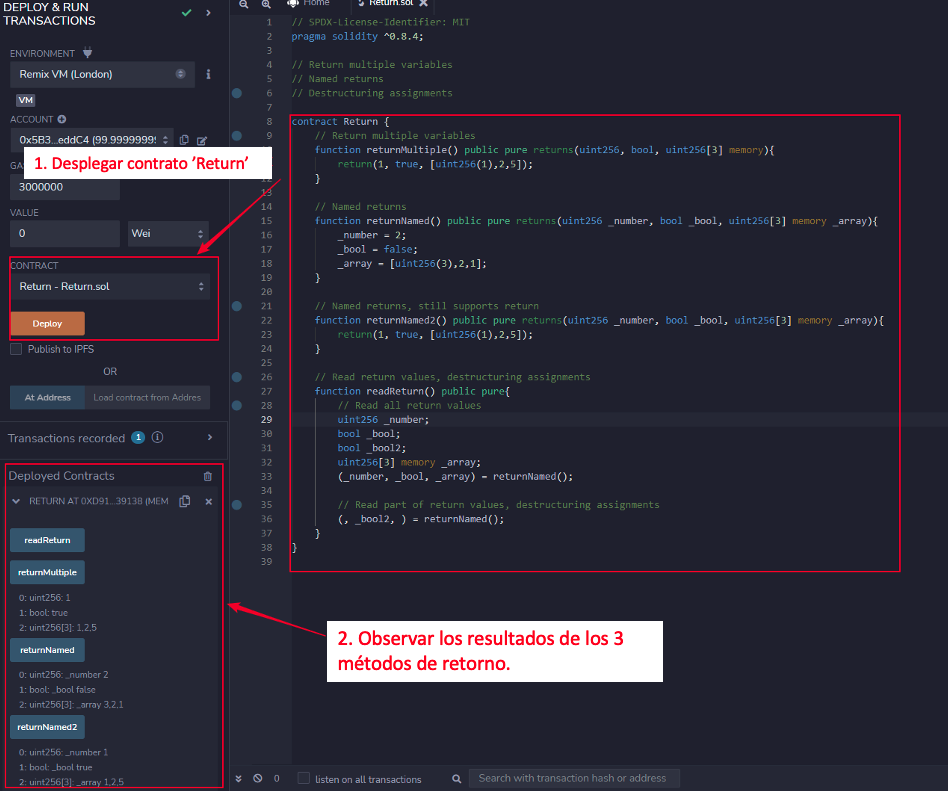

# Tutorial WTF Solidity : 4. Salida de Función (return/returns)

Recientemente, he estado revisando Solidity, consolidando detalles y escribiendo tutoriales "WTF Solidity" para principiantes.

Twitter: [@0xAA_Science](https://twitter.com/0xAA_Science) | [@WTFAcademy_](https://twitter.com/WTFAcademy_)

Comunidad: [Discord](https://discord.gg/5akcruXrsk)｜[Wechat](https://docs.google.com/forms/d/e/1FAIpQLSe4KGT8Sh6sJ7hedQRuIYirOoZK_85miz3dw7vA1-YjodgJ-A/viewform?usp=sf_link)｜[Website wtf.academy](https://wtf.academy)

La traducción al español ha sido realizada por Angela Ocando con el objetivo de hacer estos recursos accesibles a la comunidad de habla hispana.

Twitter: [@ocandocrypto](https://twitter.com/ocandocrypto)

Los códigos y tutoriales están como código abierto en GitHub: [github.com/AmazingAng/WTFSolidity](https://github.com/AmazingAng/WTFSolidity)


-----

En este capítulo, se introducirá la salida de función en `Solidity`, incluyendo el retorno de múltiples valores, retornos con nombre y la lectura completa o parcial de valores de retorno usando asignaciones de desestructuración.

## Valores de retorno (return y returns)
Hay dos palabras clave relacionadas con la salida de función: `return` y `returns`:
- `returns`  se añade después del nombre de la función para declarar el tipo y nombre de las variables que devuelve la función.
- `return` se utiliza en el cuerpo de la función y devuelve las variables deseadas.

```solidity
    // devolviendo múltiples variables sin nombrarlas
    function returnMultiple() public pure returns(uint256, bool, uint256[3] memory){
            return(1, true, [uint256(1),2,5]);
        }
```
En el código anterior, la función `returnMultiple()` tiene múltiples retornos: `returns (uint256, bool, uint256[3] memory)`, y luego se especifican las variables/valores de retorno en el cuerpo de la función con `return (1, true, [uint256 (1), 2,5])`.

## Retornos con nombre
Se puede indicar el nombre de las variables de retorno en `returns`, para que `Solidity` inicialice automáticamente estas variables, y devuelva automáticamente los valores de estas funciones sin añadir la palabra clave `return`.

```solidity
    // retornos con nombre
    function returnNamed() public pure returns(uint256 _number, bool _bool, uint256[3] memory _array){
        _number = 2;
        _bool = false; 
        _array = [uint256(3),2,1];
    }
```
En el código anterior, se declara el tipo de variable de retorno y el nombre de la variable con `returns (uint256 _number, bool _bool, uint256[3] memory _array)`. Así, solo se necesita asignar los valores a la variable `_number`, `_bool` y `_array` en el cuerpo de la función, y se devolverán automáticamente.

Por supuesto, también se pueden devolver variables con la palabra clave `return` en retornos nombrados:
```solidity
    //Parámetros de retorno con nombre, también soportan return
    function returnNamed2() public pure returns(uint256 _number, bool _bool, uint256[3] memory _array){
        return(1, true, [uint256(1),2,5]);
    }
```
## Asignaciones de desestructuración
`Solidity` permite internamente tipos de tuplas, es decir, una lista de objetos de tipos potencialmente diferentes cuyo número es constante en tiempo de compilación. Las tuplas se pueden usar para devolver múltiples valores al mismo tiempo.

- En las variables declaradas con tipo y asignadas desde la tupla retornada, no todos los elementos tienen que ser especificados (pero el número debe coincidir):
```solidity
        uint256 _number;
        bool _bool;
        uint256[3] memory _array;
        (_number, _bool, _array) = returnNamed();
```
- Al asignar parte de los valores de retorno: Los componentes pueden omitirse. En el siguiente código, solo se asigna el valor de retorno `_bool2`, pero no `_number` y `_array`:
```solidity
        (, _bool2, ) = returnNamed();
```

## Verificar en Remix
- Desplegar el contrato y comprobar los valores de retorno de las funciones.




## Resumen
En esta sección, se introdujeron los valores de retorno para una función `return` y `returns`, incluyendo la devolución de múltiples variables, retornos nombrados y la lectura completa o parcial de valores de retorno usando asignaciones de desestructuración.