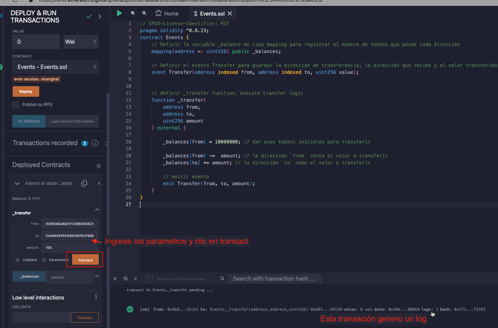

# Tutorial WTF Solidity: 12. Eventos

Recientemente, he estado revisando Solidity y escribiendo tutoriales en "WTF Solidity" para principiantes.

Twitter: [@0xAA_Science](https://twitter.com/0xAA_Science) | [@WTFAcademy_](https://twitter.com/WTFAcademy_)

Comunidad: [Discord](https://discord.gg/5akcruXrsk)｜[Wechat](https://docs.google.com/forms/d/e/1FAIpQLSe4KGT8Sh6sJ7hedQRuIYirOoZK_85miz3dw7vA1-YjodgJ-A/viewform?usp=sf_link)｜[Sitio web wtf.academy](https://wtf.academy)

La traducción al español ha sido realizada por Jonathan Díaz con el objetivo de hacer estos recursos accesibles a la comunidad de habla hispana.

Twitter: [@jonthdiaz](https://twitter.com/jonthdiaz)

Los códigos y tutoriales están como código abierto en GitHub: [github.com/AmazingAng/WTFSolidity](https://github.com/AmazingAng/WTFSolidity)

-----

En esta sección, se introducirá el concepto de `event` en Solidity, utilizando tokens de tipo ERC20 como ejemplos.

## Eventos
Eventos en `solidity` son registros de transacciones almacenados en la `EVM` (Ethereum Virtual Machine). Los eventos pueden emitirse durante las llamadas a funciones y son accesibles a través de la dirección del contrato inteligente. Los eventos tienen dos características.

- Responsivo: Las aplicaciones (por ejemplo [`ethers.js`](https://learnblockchain.cn/docs/ethers.js/api-contract.html#id18)) pueden suscribirse y escuchar estos eventos usando la interfaz `RPC` y enviar una respuesta al frontend.  
- Económicos: Es barato almacenar datos en eventos, costando alrededor de 2,000 `gas` cada uno. En comparación con almacenar una nueva variable en la cadena que requiere al menos 20,000 `gas`. 

### Declarar eventos 
Los eventos se declaran con la palabra clave `event`, seguida del nombre del evento, el tipo y el nombre de cada parámetro. Se usa como ejemplo el evento `Transfer` del contrato `ERC20`
```solidity
event Transfer(address indexed from, address indexed to, uint256 value);
```
El evento `Transfer` registra tres parámetros `from`, `to` y `value`, que corresponden a la dirección de donde se envían los tokens, la dirección que recibe y la cantidad de tokens transferidos. Los parámetros `from` y `to` están marcados con la palabra clave `indexed`, lo que significa que se almacenaran en una estructura de datos especial conocida como `topics`, estos valores se pueden consultar fácilmente por otras aplicaciones.


### Emitir eventos
Se pueden emitir eventos en funciones. En el siguiente ejemplo, cada vez que se llama a la función `_transfer()`, se emitirán eventos `Transfer` y se almacenaran los parámetros correspondientes.
```solidity
    // definir la función _transfer y ejecutar la lógica de la función
    function _transfer(
        address from,
        address to,
        uint256 amount
    ) external {

        _balances[from] = 10000000; // Emitir unos tokens iniciales para transferir

        _balances[from] -=  amount; // la dirección `from` resta el valor a transferir
        _balances[to] += amount; // la dirección `to` suma el valor a transferir

        // emitir el evento
        emit Transfer(from, to, amount);
    }
```

## Registro EVM

EVM utiliza `Log` para almacenar eventos en Solidity. Cada registro contiene dos partes: `topics` y `data`.


### `Tópicos` (topics)

Los `Topics` se utilizan para describir eventos. Cada evento contiene un máximo de 4 `topics`. Normalmente, el primer `topic` es el hash del evento. 
El hash del evento `Transfer` se calcula de la siguiente manera:

```solidity
keccak256("Transfer(address,address,uint256)")

//0xddf252ad1be2c89b69c2b068fc378daa952ba7f163c4a11628f55a4df523b3ef
```

Además del hash del evento, los `topics` pueden incluir 3 parámetros `indexed` como son los parámetros `from` y `to` en el evento `Transfer`. Un evento anónimo es especial, no tiene nombre de evento y puede tener un máximo de 4 parámetros `indexed`.

Los parámetros `indexed` se pueden entender como la clave "indexada" para los eventos, estos parámetros se pueden consultar fácilmente por programas. El tamaño de cada parámetro `indexed` es de 32 bytes. Cuando el parámetro es mayor de 32 bytes, como son `array` y `string`, se almacena el hash.

### `Datos`

Los parámetros no indexados se almacenarán en la sección `data` del registro. Se pueden interpretar como el "valor" del evento y no se pueden recuperar directamente. Pero pueden almacenar datos de mayor tamaño. Por lo tanto, la sección `data` se puede utilizar para almacenar estructuras de datos complejas, como `array` y `string`. Además, `data` consume menos gas en comparación con `topic`.

## Demo en Remix
Tomemos el contrato `Event.sol` como ejemplo.

1. Desplegar el contrato `Event`.

2. Llamar la función `transfer` para emitir el evento `Transfer`.



3. Revisar los detalles de la transacción para verificar el evento emitido.


### Consultar el evento en etherscan

Etherscan es un explorador de bloques que permite ver datos públicos sobre transacciones, contratos inteligentes y más en la blockchain de Ethereum. Primero, Desplegar el contrato en una red de pruebas (Sepolia o Goerli). Segundo, llamar a la función `_transfer` para transferir 100 tokens. Después de eso, se puede verificar los detalles de la transacción en `etherscan`：[URL](https://rinkeby.etherscan.io/tx/0x8cf87215b23055896d93004112bbd8ab754f081b4491cb48c37592ca8f8a36c7)

Hacer clic en el botón `Logs` para verificar los detalles del evento:


Hay 3 elementos: `Topics`: `[0]` es el hash del evento, `[1]` y `[2]` son los parámetros `indexed` definidos en el evento, `Transfer` (`from` y `to`). El elemento `Data` es el parámetro no indexado `amount`.

## Resumen
En esta lección, se introdujo cómo usar y consultar eventos en `solidity`. Muchas herramientas de análisis en on-chain se basan en eventos de solidity, como `Dune Analytics`.
