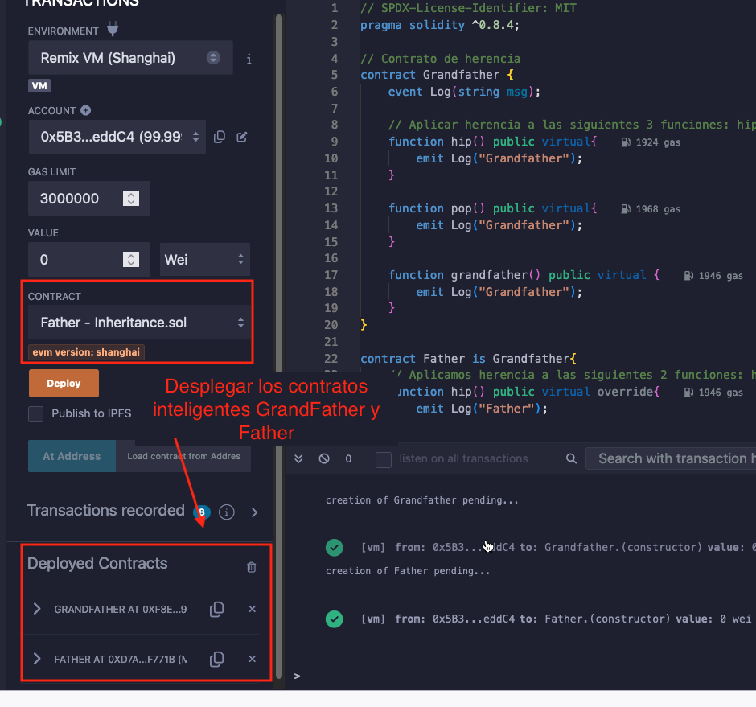
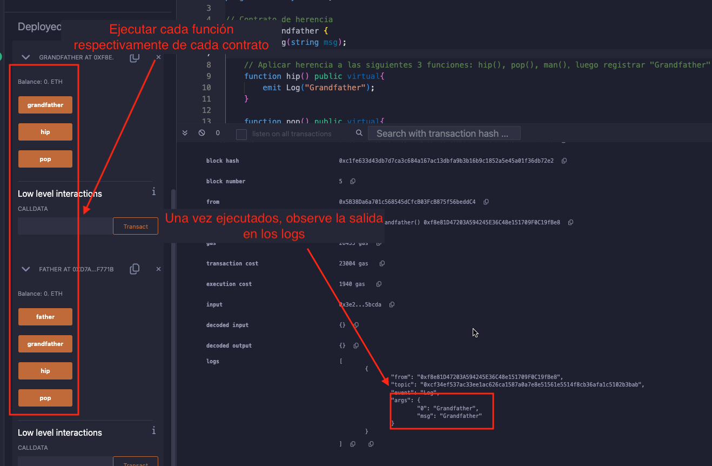
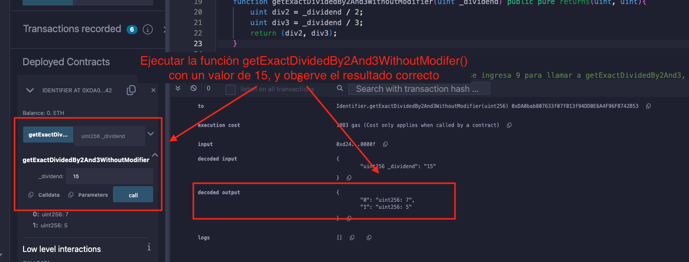
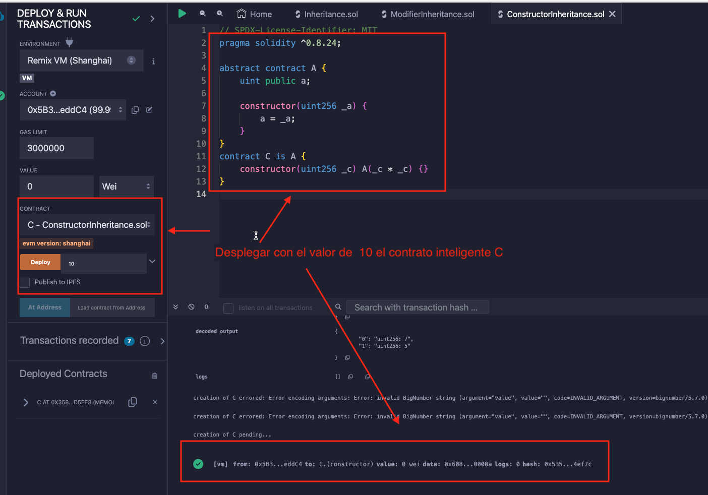
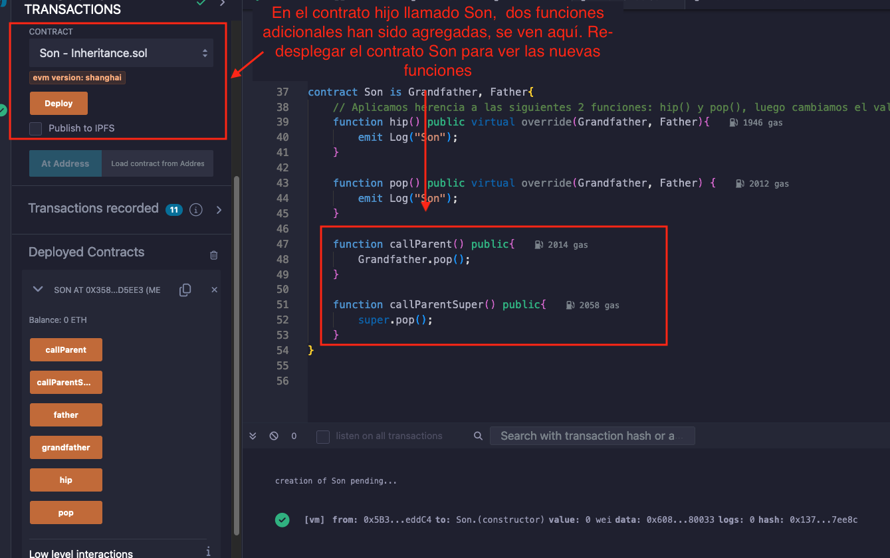
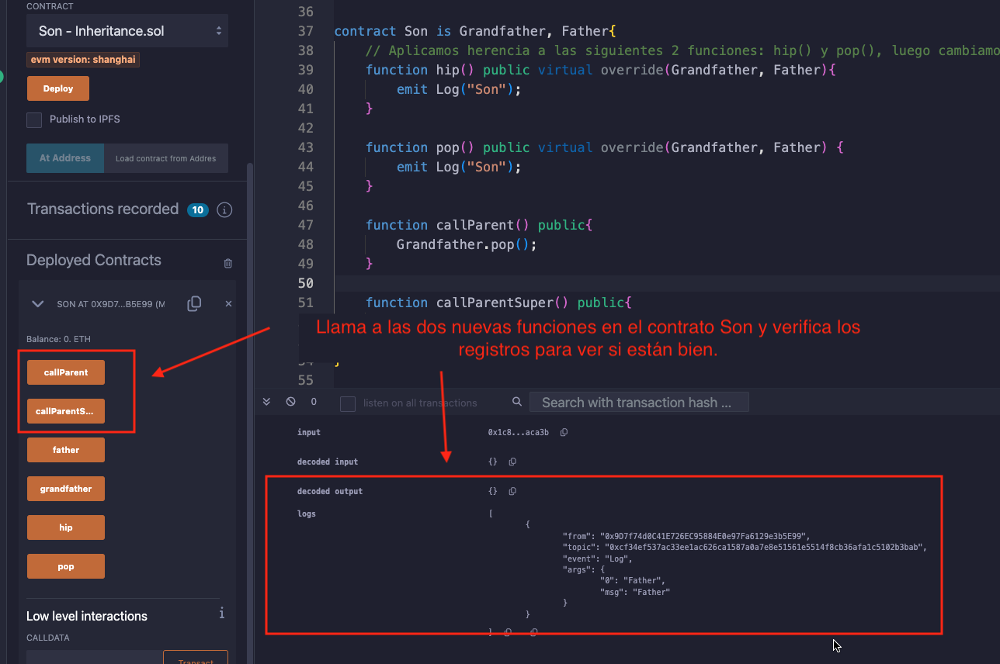
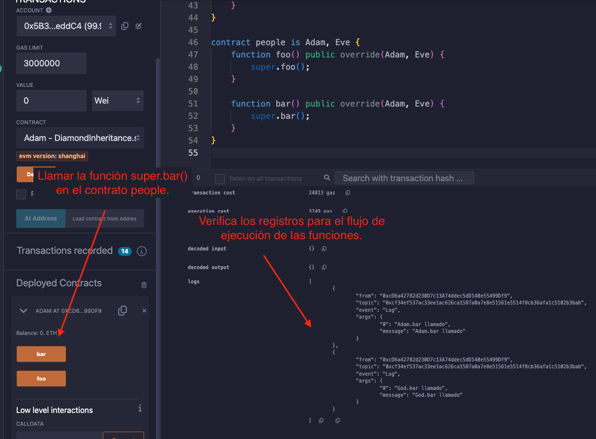

# Tutorial WTF Solidity: 13. Herencia

Recientemente, he estado revisando Solidity y escribiendo tutoriales en "WTF Solidity" para principiantes.

Twitter: [@0xAA_Science](https://twitter.com/0xAA_Science) | [@WTFAcademy_](https://twitter.com/WTFAcademy_)

Comunidad: [Discord](https://discord.gg/5akcruXrsk)｜[Wechat](https://docs.google.com/forms/d/e/1FAIpQLSe4KGT8Sh6sJ7hedQRuIYirOoZK_85miz3dw7vA1-YjodgJ-A/viewform?usp=sf_link)｜[Sitio web wtf.academy](https://wtf.academy)

La traducción al español ha sido realizada por Jonathan Díaz con el objetivo de hacer estos recursos accesibles a la comunidad de habla hispana.

Twitter: [@jonthdiaz](https://twitter.com/jonthdiaz)

Los códigos y tutoriales están como código abierto en GitHub: [github.com/AmazingAng/WTFSolidity](https://github.com/AmazingAng/WTFSolidity)

-----

En esta sección, se introducirá la `herencia` en Solidity, incluyendo la herencia simple, múltiple y la herencia de los modificadores y constructores. 

## Herencia
La herencia es uno de los conceptos fundamentales de la programación orientada a objetos, que puede reducir significativamente la redundancia de código. Es un mecanismo donde se puede derivar una clase de otra clase para tener una jerarquía de clases que comparten un conjunto de atributos y métodos. En Solidity, los contratos inteligentes pueden ser vistos como objetos por lo tanto pueden soporta herencia.

### Reglas

Hay dos palabras claves para la herencia en Solidity:

- `virtual`: Si se desea que las funciones en el contrato padre sean sobrescritas en los contratos hijos, deben ser declaradas como `virtual`.
- `override`: Si las funciones en el contrato hijo sobrescriben las funciones de su contrato padre, deben ser declaradas como `override`.

**Nota 1**: Si una función sobrescribe y se espera que sea sobrescrita, debe ser etiquetada como `virtual override`.

**Nota 2**: Si una variable de estado `public` esta etiquetada como `override` su función `getter` será sobrescrita. Por ejemplo: 

```solidity
mapping(address => uint256) public override balanceOf;
```

### Herencia Simple

Comencemos escribiendo un contrato simple `Grandfather` que contiene 1 evento `log` y 3 funciones `hip()` `pop()` `Grandfather`, que produce la salida de una cadena `"Grandfather"`

```solidity
contract Grandfather {
    event Log(string msg);

    // Aplicar herencia a las siguientes 3 funciones: hip(), pop(), man()，luego registrar "Grandfather".
    function hip() public virtual{
        emit Log("Grandfather");
    }

    function pop() public virtual{
        emit Log("Grandfather");
    }

    function Grandfather() public virtual {
        emit Log("Grandfather");
    }
}
```

Vamos a definir otro contrato llamado `Father` el cual hereda del contrato `Grandfather`. La sintaxis para la herencia es `contract Father is Grandfather`, lo cual es muy intuitivo. En el contrato `Father` se reescriben las funciones `hip()` y `pop()` con la palabra clave `override`, cambiando su salida a `"Father"`. También agregamos una nueva función llamada `father`, que devuelve una cadena `"Father"`.


```solidity
contract Father is Grandfather{
    // Aplicamos herencia a las siguientes 2 funciones: hip() y pop(), luego cambiamos el valor del registro a `Father`.
    function hip() public virtual override{
        emit Log("Father");
    }

    function pop() public virtual override{
        emit Log("Father");
    }

    function father() public virtual{
        emit Log("Father");
    }
}
```

Después de desplegar el contrato, se puede ver que el contrato `Father` contiene 4 funciones. Las salidas de `hip()` y `pop` se reescriben con el el valor `"Father"`, mientras la salida de la funcione heredada `grandfather` sigue siendo `"Grandfather"`


### Herencia múltiple

Un contrato en solidity puede heredar de múltiples contratos. Las reglas son:

1. Para la herencia múltiple, los contratos padres deben estar ordenados por antigüedad, desde el más alto al más bajo. Por ejemplo: `contract Son is Grandfather, Father`. La anterior definición lanzara un error si el orden no es correcto.

2. Si una función existe en múltiples contratos padres, la función debe ser sobrescrita en el contrato hijo, de lo contrario se producirá un error.

3. Cuando una función existe en múltiples contratos padres, se deben colocar todos los nombres de los contratos padres después de la palabra clave `override`. Por ejemplo: `override(Grandfather, Father)`

Ejemplo：
```solidity
contract Son is Grandfather, Father{
    // Aplicamos herencia a las siguientes 2 funciones: hip() y pop(), luego cambiamos el valor del registro a "Son".
    function hip() public virtual override(Grandfather, Father){
        emit Log("Son");
    }

    function pop() public virtual override(Grandfather, Father) {
        emit Log("Son");
    }
```

Después de desplegar el contrato, se puede ver que hemos reescrito con éxito las funciones `hip()` y `pop()` en el contrato `Son`, cambiando la salida `"Son"`. Mientras que las funciones `grandfather` y `father` heredadas de sus contratos padres permanecen sin cambios.

### Herencia en los modificadores

Del mismo modo, los modificadores en Solidity también pueden ser heredados. Las reglas para la herencia de los modificadores son similares a la herencia de las funciones, se utilizan las palabras claves `virtual` y `override`.

```solidity
contract Base1 {
    modifier exactDividedBy2And3(uint _a) virtual {
        require(_a % 2 == 0 && _a % 3 == 0);
        _;
    }
}

contract Identifier is Base1 {
    //Calcular el valor de un número dividido por 2 y dividido por 3, respectivamente, pero los parámetros pasados deben ser múltiplos de 2 y 3
    function getExactDividedBy2And3(uint _dividend) public exactDividedBy2And3(_dividend) pure returns(uint, uint) {
        return getExactDividedBy2And3WithoutModifier(_dividend);
    }

    //Calcular del valor de un número devidido por 2 y dividido por 3, respectivamente
    function getExactDividedBy2And3WithoutModifier(uint _dividend) public pure returns(uint, uint){
        uint div2 = _dividend / 2;
        uint div3 = _dividend / 3;
        return (div2, div3);
    }
}
```

El contrato `Identifier` puede usar directamente el modificador `exactDividedBy2And3`, por que hereda del contrato `Base1`. También podemos reescribir el modificador del contrato.

```solidity
    modifier exactDividedBy2And3(uint _a) override {
        _;
        require(_a % 2 == 0 && _a % 3 == 0);
    }
```

### Herencia de los constructores

Los constructores también pueden ser heredados. Primero consideremos un contrato padre `A` con una variable de estado `a`, que se inicializa en su constructor:

```solidity
// Aplicando la herencia al constructor de las funciones.
abstract contract A {
    uint public a;

    constructor(uint _a) {
        a = _a;
    }
}
```

Hay dos formas para que un contrato hijo herede del constructor de su padre `A`:
1. Declarar el parámetro del constructor padre en el constructor del contrato hijo.

    ```solidity
    contract B is A(1){}
    ```

2. Declarar el parámetro del constructor padre dentro del constructor del contrato hijo.

    ```solidity
    contract C is A {
        constructor(uint _c) A(_c * _c) {}
    }
    ```

### Llamando las funciones de los contratos padre

Hay dos formas para que un contrato hijo llame a las funciones del contrato padre.

1. Llamada directa: El contrato hijo puede llamar directamente a la función del padre con `parentContractName.functionName`. Por ejemplo:

    ```solidity
        function callParent() public{
            Grandfather.pop();
        }
    ```

2. Palabra clave `super`: En el contrato hijo se puede usar la palabra clave `super.functionName()` para llamar a la función en el contrato padre más cercano en la jerarquía de herencia. Las herencias en Solidity se declaran en un orden de derecha a izquierda: para `contract Son is Grandfather, Father`, el contrato `Father` está más cerca que el contrato `Grandfather`. Por lo tanto `super.pop()` en el contrato `Son` llamará `Father.pop()` pero no `Grandfather.pop()`.

    ```solidity
        function callParentSuper() public{
            // Llamar la función un nivel más arriba en la jerarquía.
            super.pop();
        }
    ```

### Herencia en forma de diamante

En la programación orientada a objetos, la herencia en forma de diamante se refiere al escenario en que una clase derivada tiene dos o más clases base.

Al usar la palabra clave `super` en una cadena de herencia en forma diamante, se debe tener en cuenta que se llamará a la función relevante de cada contrato en la cadena de herencia, no solo al contrato padre más cercano.

Primero, se escribirá un contrato base llamado `God`. Luego escribimos dos contratos `Adan` y `Eve` que heredan del contrato `God`. Por último, escribimos otro contrato `people` que hereda de `Adan` y `Eve`. Cada contrato tiene dos funciones `foo()` y `bar()`:

```solidity
// SPDX-License-Identifier: MIT
pragma solidity ^0.8.13;

/* Árbol de herencia visualizado:
  God
 /  \
Adam Eve
 \  /
people
*/
contract God {
    event Log(string message);
    function foo() public virtual {
        emit Log("God.foo llamado");
    }
    function bar() public virtual {
        emit Log("God.bar llamado");
    }
}
contract Adam is God {
    function foo() public virtual override {
        emit Log("Adam.foo llamado");
        Adam.foo();
    }
    function bar() public virtual override {
        emit Log("Adam.bar llamado");
        super.bar();
    }
}
contract Eve is God {
    function foo() public virtual override {
        emit Log("Eve.foo llamado");
        Eve.foo();
    }
    function bar() public virtual override {
        emit Log("Eve.bar llamado");
        super.bar();
    }
}
contract people is Adam, Eve {
    function foo() public override(Adam, Eve) {
        super.foo();
    }
    function bar() public override(Adam, Eve) {
        super.bar();
    }
}
```

En este ejemplo, llamar la función `super.bar()` en el contrato `people` llamará la función `bar()` de los contratos `Eve`, `Adam` y `God`, lo cual es diferente de la herencia múltiple ordinaria.

Aunque `Eve` y `Adam` son ambos contratos hijos del contrato padre `God` el contrato `God` solo se llamará una vez en todo el proceso. Esto se debe a que Solidity toma prestado el paradigma de Python, forzando un DAG (grafo dirigido acíclico) compuesto por clases base para garantizar un orden especifico basado en la linearización C3. Para obtener más información sobre la herencia y la linearización, se puede leer la documentación oficial de Solidity [Aca](https://docs.soliditylang.org/en/v0.8.17/contracts.html#multiple-inheritance-and-linearization).


## Verificación en Remix
1. Después de desplegar el contrato de ejemplo en la sección de Herencia Simple, se puede ver que el contrato `Father` tiene las funciones de `Grandfather`

  

  

2. Ejemplo de herencia de modificadores:

  
  
  
  
  
  
3. Herencia de constructores.

  
  
  
  
4. Llamado a las funciones de los contratos padres:

  
  
  
  
5. Herencia en forma diamante:

   

## Resumen
En este tutorial, se presentaron los usos básicos de la herencia en Solidity, incluyendo herencia simple, herencia múltiple, herencia de los modificadores y constructores, además se presentó el llamado a funciones desde contratos padres.
