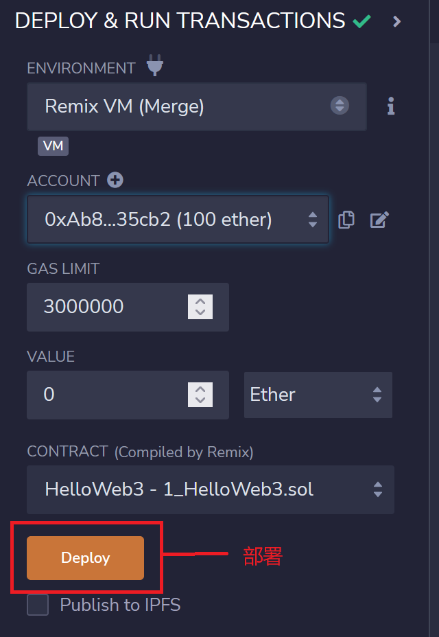

## 1. Olá Web3 (Três linhas de código)

Recentemente, tenho revisitado o estudo do Solidity para consolidar alguns detalhes e criar um "Guia de Introdução ao Solidity" para iniciantes (programadores avançados podem buscar outros tutoriais). Será atualizado semanalmente com 1-3 lições.

Twitter: [@0xAA_Science](https://twitter.com/0xAA_Science)

Comunidade: [Discord](https://discord.gg/5akcruXrsk) | [Grupo do WhatsApp](https://docs.google.com/forms/d/e/1FAIpQLSe4KGT8Sh6sJ7hedQRuIYirOoZK_85miz3dw7vA1-YjodgJ-A/viewform?usp=sf_link) | [Website wtf.academy](https://wtf.academy)

Todo o código e tutorial estão disponíveis no GitHub: [github.com/AmazingAng/WTFSolidity](https://github.com/AmazingAng/WTF-Solidity)

-----

## Introdução ao Solidity

`Solidity` é uma linguagem de programação utilizada para escrever contratos inteligentes na Máquina Virtual Ethereum (`EVM`). Acredito que dominar o `Solidity` seja uma habilidade essencial para quem deseja se envolver em projetos blockchain: a maioria dos projetos blockchain são de código aberto e entender o código pode ajudar a evitar perder dinheiro em projetos ruins.

`Solidity` possui duas características:

1. "Orientado a Objetos": Aprender `Solidity` pode ajudá-lo a conseguir um bom emprego no campo blockchain e encontrar parceiros ideais.
2. "Avançado": Não saber `Solidity` em um ambiente de criptomoedas pode ser visto como desatualizado.

## Ferramenta de Desenvolvimento: Remix

Neste tutorial, utilizaremos o `Remix` para trabalhar com contratos `Solidity`. O `Remix` é um ambiente integrado de desenvolvimento de contratos inteligentes recomendado oficialmente pela Ethereum, ideal para iniciantes, pois permite o rápido desenvolvimento e a implantação de contratos diretamente no navegador, sem a necessidade de instalar nada localmente.

Site: [https://remix.ethereum.org](https://remix.ethereum.org)

No `Remix`, o menu à esquerda tem três botões, que correspondem a arquivos (para escrever código), compilar (para executar o código) e implantar (para implantar o contrato na blockchain). Clique no botão "Criar novo arquivo" (`Create New File`), para criar um contrato `Solidity` em branco.


## Primeiro Programa em Solidity

Este programa simples consiste em 1 linha de comentário e 3 linhas de código:

```solidity
// SPDX-License-Identifier: MIT
pragma solidity ^0.8.4;
contract HelloWeb3{
    string public _string = "Olá Web3!";
}
```

Vamos analisar o programa e aprender sobre a estrutura de um arquivo de código Solidity:

1. A primeira linha é um comentário que indica a licença de software que o código está utilizando, neste caso, a licença MIT. Se a licença não for especificada, o compilador emitirá um aviso, mas o programa ainda será executado. Comentários em Solidity começam com "//" seguido pelo conteúdo do comentário.

   ```solidity
   // SPDX-License-Identifier: MIT
   ```

2. A segunda linha declara a versão do Solidity que este arquivo está usando, pois a sintaxe varia entre versões. Esta linha indica que o arquivo só pode ser compilado com a versão 0.8.4 do compilador Solidity, até a versão 0.9.0 (a segunda condição é fornecida pelo "^"). As declarações em Solidity terminam com ponto e vírgula (`;`).

   ```solidity
   pragma solidity ^0.8.4;
   ```

3. As linhas 3-4 são a parte do contrato. A linha 3 cria o contrato (`contract`) e declara que o nome do contrato é `HelloWeb3`. A linha 4 é o corpo do contrato, declarando uma variável string `_string` pública, com o valor "Olá Web3!".

   ```solidity
   contract HelloWeb3 {
       string public _string = "Olá Web3!";
   }
   ```

Continuaremos a investigar variáveis mais detalhadamente no Solidity.

## Compilando e Implantando o Código

Na página de edição de código do Remix, pressione Ctrl + S para compilar o código, é muito conveniente.

Após a compilação, clique no botão "Implantar" no menu à esquerda para acessar a página de implantação.



Por padrão, o `Remix` usa a Máquina Virtual `Remix` (anteriormente conhecida como Máquina Virtual JavaScript) para simular a rede Ethereum ao executar contratos inteligentes, como se fosse uma rede de testes no navegador. O `Remix` também oferece algumas contas de teste, cada uma com 100 ETH (tokens de teste) para uso. Clique em `Deploy` (botão amarelo) para implantar o contrato que escrevemos.


Após a implantação bem-sucedida, você verá o contrato chamado `HelloWeb3`. Clique em `_string` para ver a mensagem "Olá Web3!".

## Conclusão

Nesta lição, introduzimos brevemente o `Solidity` e a ferramenta `Remix`, e concluímos nosso primeiro programa `Solidity` - `HelloWeb3`. A seguir, continuaremos a estudar o `Solidity` de forma mais aprofundada!

### Recursos recomendados em Solidity

1. [Solidity Documentation](https://docs.soliditylang.org/en/latest/)
2. [Solidity Tutorial by freeCodeCamp](https://www.youtube.com/watch?v=ipwxYa-F1uY)

<!-- This file was translated using AI by repo_ai_translate. For more information, visit https://github.com/marcelojsilva/repo_ai_translate -->