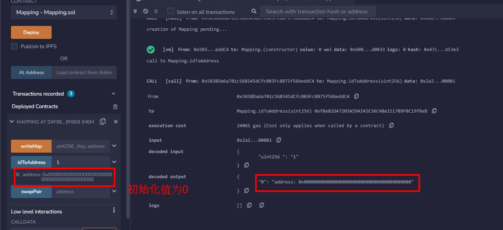

# WTF Introdução básica à Solidity: 7. Tipo de mapeamento

Recentemente tenho revisitado o Solidity para consolidar alguns detalhes e estou escrevendo uma "Introdução básica à Solidity WTF" para iniciantes (programadores experientes devem procurar outros tutoriais). Serão disponibilizadas de 1 a 3 aulas por semana.

Twitter: [@0xAA_Science](https://twitter.com/0xAA_Science)

Comunidades: [Discord](https://discord.gg/5akcruXrsk) | [Grupo do WhatsApp](https://docs.google.com/forms/d/e/1FAIpQLSe4KGT8Sh6sJ7hedQRuIYirOoZK_85miz3dw7vA1-YjodgJ-A/viewform?usp=sf_link) | [Website wtf.academy](https://wtf.academy)

Todo o código e tutorial estão disponíveis no GitHub: [github.com/AmazingAng/WTFSolidity](https://github.com/AmazingAng/WTFSolidity)

-----

Nesta aula, vamos apresentar o tipo de mapeamento (`mapping`), uma estrutura de dados no Solidity que armazena pares chave-valor, semelhante a uma tabela hash.

## Mapeamento (Mapping)

Em um mapeamento, é possível consultar um valor correspondente a uma chave, por exemplo: consultar o endereço da carteira de uma pessoa através de seu `id`.

A sintaxe para declarar um mapeamento é `mapping(_TipoChave => _TipoValor)`, onde `_TipoChave` e `_TipoValor` são os tipos de variáveis para chave e valor, respectivamente. Exemplos:

```solidity
mapping(uint => address) public idParaEndereco; // mapeamento de id para endereço
mapping(address => address) public parDePermuta; // mapeamento de pares, endereço para endereço
```

## Regras dos mapeamentos

- **Regra 1**: O tipo de `_TipoChave` em um mapeamento só pode ser um tipo de valor embutido no Solidity, como `uint`, `address`, etc., não sendo possível utilizar tipos de estruturas personalizadas. Já o `_TipoValor` pode ser um tipo definido pelo usuário. O exemplo a seguir resultará em um erro, pois o `_TipoChave` utiliza uma estrutura personalizada:

    ```solidity
    // Definimos uma estrutura Student
    struct Aluno {
        uint256 id;
        uint256 pontuacao; 
    }
    mapping(Aluno => uint) public testeVar;
    ```

- **Regra 2**: Os mapeamentos devem ser armazenados na posição de `storage`, podendo ser utilizados em variáveis de estado de contrato, variáveis `storage` em funções e nos parâmetros de funções de biblioteca (ver [exemplo](https://github.com/ethereum/solidity/issues/4635)). Não é possível utilizar mapeamentos para parâmetros ou resultados de funções públicas, pois os mapeamentos representam um tipo de relação (par chave-valor).

- **Regra 3**: Se um mapeamento for declarado como `public`, o Solidity criará automaticamente uma função `getter` para permitir a consulta do valor correspondente à chave.

- **Regra 4**: Para adicionar novos pares chave-valor a um mapeamento, a sintaxe é `_Var[_Chave] = _Valor`, onde `_Var` é o nome da variável de mapeamento, `_Chave` e `_Valor` são os valores do novo par chave-valor a serem adicionados. Exemplo:

    ```solidity
    function escreverMapeamento(uint _Chave, address _Valor) public {
        idParaEndereco[_Chave] = _Valor;
    }
    ```

## Princípios dos mapeamentos

- **Princípio 1**: Os mapeamentos não armazenam informações sobre as chaves, nem possuem informações sobre o tamanho.

- **Princípio 2**: Os mapeamentos utilizam o `keccak256(abi.encodePacked(chave, slot))` como offset para acessar o valor, onde `slot` é a posição do slot em que a variável do mapeamento está definida.

- **Princípio 3**: Como o Ethereum define todo o espaço não utilizado como 0, os valores das chaves não atribuídas são os valores padrão de cada tipo, por exemplo, o valor padrão de `uint` é 0.

## Verificação no Remix (utilizando `Mapping.sol` como exemplo)

- Implantação do exemplo de mapeamento 1

    

- Estado inicial do exemplo do mapeamento 2

    

- Par chave-valor do exemplo de mapeamento 3

    

## Conclusão

Nesta aula, aprendemos sobre o uso de tabelas hash (mapeamentos) no Solidity. Com isso, já cobrimos todos os tipos comuns de variáveis, e a próxima etapa será aprender sobre fluxo de controle com `if-else`, `while`, entre outros.

<!-- This file was translated using AI by repo_ai_translate. For more information, visit https://github.com/marcelojsilva/repo_ai_translate -->