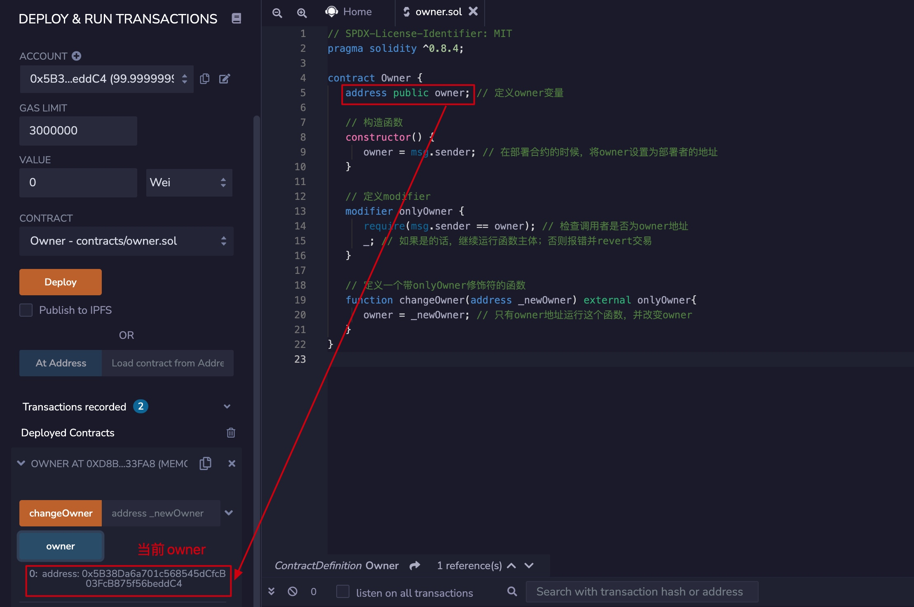

# WTF Introdução básica ao Solidity: 11. Construtores e Modificadores

Recentemente, estou revisando Solidity para reforçar alguns detalhes e escrever uma "Introdução básica ao Solidity da WTF", para uso de iniciantes (programadores experientes podem buscar outros tutoriais). Atualização semanal de 1 a 3 palestras.

Twitter: [@0xAA_Science](https://twitter.com/0xAA_Science)

Comunidade: [Discord](https://discord.gg/5akcruXrsk) | [Grupo do WhatsApp](https://docs.google.com/forms/d/e/1FAIpQLSe4KGT8Sh6sJ7hedQRuIYirOoZK_85miz3dw7vA1-YjodgJ-A/viewform?usp=sf_link) | [Site oficial wtf.academy](https://wtf.academy)

Todo o código e tutoriais estão disponíveis no GitHub: [github.com/AmazingAng/WTFSolidity](https://github.com/AmazingAng/WTFSolidity)

---

Nesta palestra, vamos usar o exemplo do contrato de controle de permissão (`Ownable`) para apresentar os conceitos de construtores (`constructor`) e modificadores (`modifier`) exclusivos do Solidity.

## Construtores

Os construtores (`constructor`) são funções especiais que podem ser definidas em um contrato e são executadas automaticamente uma vez quando o contrato é implantado. Eles podem ser usados para inicializar alguns parâmetros do contrato, como definir o endereço do `owner`:

```solidity
address owner; // Definindo a variável owner

// Construtor
constructor() {
   owner = msg.sender; // Define o owner como o endereço que implantou o contrato.
}
```

**Observação**⚠️: A sintaxe dos construtores varia de acordo com a versão do Solidity. Antes da versão 0.4.22, os construtores eram declarados com o mesmo nome do contrato, o que podia resultar em erros de digitação e, consequentemente, em construtores comuns. A partir da versão 0.4.22, a palavra-chave `constructor` é usada para definir o construtor.

Exemplo de código do antigo estilo de construtor:

```solidity
pragma solidity =0.4.21;

contract Parents {
    // O construtor tem o mesmo nome do contrato (método construtor antigo)
    function Parents() public {
    }
}
```

## Modificadores

Os modificadores (`modifier`) são exclusivos do Solidity e são semelhantes aos decoradores em programação orientada a objetos. Eles declaram características que uma função deve possuir e ajudam a reduzir a redundância de código. Os modificadores são comuns para realizar verificações antes da execução de uma função, como verificar um endereço, uma variável ou um saldo.

Vamos definir um modificador chamado `onlyOwner`:

```solidity
// Definindo um modificador
modifier onlyOwner {
   require(msg.sender == owner); // Verifica se o chamador é o owner
   _; // Se for o owner, executa o corpo da função; caso contrário, reverte a transação
}
```

Uma função com o modificador `onlyOwner` só pode ser chamada pelo endereço do `owner`. Por exemplo:

```solidity
function changeOwner(address _newOwner) external onlyOwner {
   owner = _newOwner; // Apenas o owner pode chamar esta função e alterar o owner
}
```

Neste exemplo, a função `changeOwner` pode alterar o `owner` do contrato, mas somente o endereço original do `owner` pode chamar a função devido ao modificador `onlyOwner`. Este é um dos métodos mais comuns para controlar permissões em contratos inteligentes.

### Implementação padrão de Ownable da OpenZeppelin

A OpenZeppelin mantém uma biblioteca de códigos padronizados em Solidity e sua implementação padrão do `Ownable` pode ser encontrada em: [https://github.com/OpenZeppelin/openzeppelin-contracts/blob/master/contracts/access/Ownable.sol](https://github.com/OpenZeppelin/openzeppelin-contracts/blob/master/contracts/access/Ownable.sol)

## Exemplo de demonstração no Remix

Vamos considerar o arquivo `Owner.sol`.

1. Compile e implante o contrato no Remix.
2. Clique no botão `owner` para ver o valor atual da variável `owner`.

    
3. Chame a função `changeOwner` com o endereço do `owner`. A transação será bem-sucedida.

    
4. Chame a função `changeOwner` com um endereço que não é o `owner`. A transação falhará devido à verificação do modificador `onlyOwner`.

    

## Conclusão

Nesta palestra, apresentamos os construtores e modificadores do Solidity, usando um exemplo do contrato `Ownable` para ilustrar o controle de permissões em contratos inteligentes.

<!-- This file was translated using AI by repo_ai_translate. For more information, visit https://github.com/marcelojsilva/repo_ai_translate -->