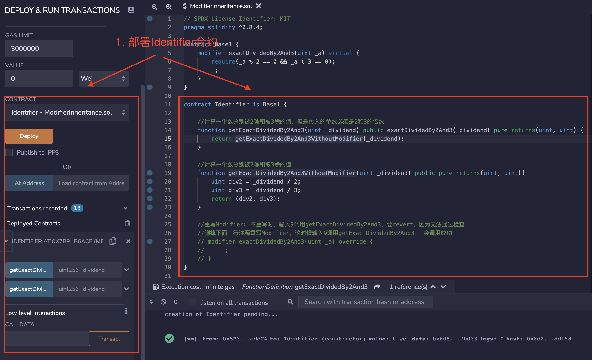
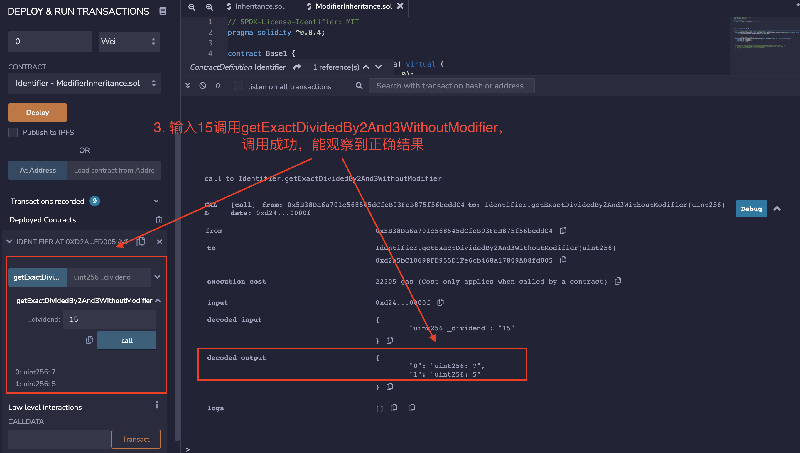

# WTF Solidity Introdução Simples: 13. Herança

Recentemente, tenho estudado Solidity novamente para revisar os detalhes e escrever um "WTF Solidity Introdução Simples" para iniciantes (programadores experientes podem procurar outros tutoriais). Serão lançadas de 1 a 3 aulas por semana.

Twitter: [@0xAA_Science](https://twitter.com/0xAA_Science)

Comunidade: [Discord](https://discord.gg/5akcruXrsk)｜[Grupo do WeChat](https://docs.google.com/forms/d/e/1FAIpQLSe4KGT8Sh6sJ7hedQRuIYirOoZK_85miz3dw7vA1-YjodgJ-A/viewform?usp=sf_link)｜[Site oficial wtf.academy](https://wtf.academy)

Todo o código e tutoriais estão disponíveis no GitHub: [github.com/AmazingAng/WTFSolidity](https://github.com/AmazingAng/WTFSolidity)

-----
Nesta aula, vamos falar sobre herança no Solidity, incluindo herança simples, herança múltipla e herança de modificadores e construtores.

## Herança

A herança é uma parte importante da programação orientada a objetos, pois permite reduzir significativamente a repetição de código. Se considerarmos os contratos como objetos, o Solidity também é uma linguagem de programação orientada a objetos e suporta herança.

### Regras

- `virtual`: Se você deseja que uma função do contrato pai possa ser sobrescrita pelo contrato filho, é necessário adicionar a palavra-chave `virtual` à função do contrato pai.

- `override`: Se o contrato filho sobrescrever uma função do contrato pai, é necessário adicionar a palavra-chave `override` à função do contrato filho.

**Observação**: Ao usar `override` para modificar uma variável pública, a função `getter` com o mesmo nome será sobrescrita. Por exemplo:

```solidity
mapping(address => uint256) public override balanceOf;
```

### Herança Simples

Vamos começar escrevendo um contrato avô simples chamado `Yeye`, que contém um evento `Log` e três funções: `hip()`, `pop()` e `yeye()`, todas elas retornam "Yeye".

```solidity
contract Yeye {
    event Log(string msg);

    function hip() public virtual {
        emit Log("Yeye");
    }

    function pop() public virtual {
        emit Log("Yeye");
    }

    function yeye() public virtual {
        emit Log("Yeye");
    }
}
```

Agora, vamos definir um contrato pai chamado `Baba`, que herda o contrato `Yeye`. A sintaxe para isso é `contract Baba is Yeye`, que é bastante intuitiva. No contrato `Baba`, vamos sobrescrever as funções `hip()` e `pop()` adicionando a palavra-chave `override` e alterando a saída para "Baba". Também adicionaremos uma nova função chamada `baba`, que também retorna "Baba".

```solidity
contract Baba is Yeye {
    function hip() public virtual override {
        emit Log("Baba");
    }

    function pop() public virtual override {
        emit Log("Baba");
    }

    function baba() public virtual {
        emit Log("Baba");
    }
}
```

Ao implantar o contrato, podemos ver que o contrato `Baba` possui quatro funções. As funções `hip()` e `pop()` foram sobrescritas com sucesso para retornar "Baba", enquanto a função `yeye()` herdada ainda retorna "Yeye".

### Herança Múltipla

Os contratos no Solidity podem herdar de vários contratos. Aqui estão as regras:

1. A ordem de herança deve ser da classe mais alta para a mais baixa. Por exemplo, se quisermos criar um contrato chamado `Erzi` que herda os contratos `Yeye` e `Baba`, devemos escrever `contract Erzi is Yeye, Baba` e não `contract Erzi is Baba, Yeye`, caso contrário, ocorrerá um erro.

2. Se uma função estiver presente em vários contratos pai, como as funções `hip()` e `pop()` no exemplo, ela deve ser sobrescrita no contrato filho, caso contrário, ocorrerá um erro.

3. Ao sobrescrever uma função que tem o mesmo nome em vários contratos pai, a palavra-chave `override` deve ser seguida pelos nomes de todos os contratos pai, por exemplo, `override(Yeye, Baba)`.

Exemplo:

```solidity
contract Erzi is Yeye, Baba {
    function hip() public virtual override(Yeye, Baba) {
        emit Log("Erzi");
    }

    function pop() public virtual override(Yeye, Baba) {
        emit Log("Erzi");
    }
}
```

Podemos ver que o contrato `Erzi` sobrescreve as funções `hip()` e `pop()`, alterando a saída para "Erzi" e também herda as funções `yeye()` e `baba()` dos contratos `Yeye` e `Baba`, respectivamente.

### Herança de Modificadores

Os modificadores no Solidity também podem ser herdados. O uso é semelhante à herança de funções, basta adicionar as palavras-chave `virtual` e `override` nos locais apropriados.

```solidity
contract Base1 {
    modifier exactDividedBy2And3(uint _a) virtual {
        require(_a % 2 == 0 && _a % 3 == 0);
        _;
    }
}

contract Identifier is Base1 {

    // Calcula os valores de um número dividido por 2 e por 3, mas o parâmetro deve ser um múltiplo de 2 e 3
    function getExactDividedBy2And3(uint _dividend) public exactDividedBy2And3(_dividend) pure returns(uint, uint) {
        return getExactDividedBy2And3WithoutModifier(_dividend);
    }

    // Calcula os valores de um número dividido por 2 e por 3
    function getExactDividedBy2And3WithoutModifier(uint _dividend) public pure returns(uint, uint){
        uint div2 = _dividend / 2;
        uint div3 = _dividend / 3;
        return (div2, div3);
    }
}
```

O contrato `Identifier` pode usar diretamente o modificador `exactDividedBy2And3` do contrato pai no código ou substituí-lo usando a palavra-chave `override`:

```solidity
modifier exactDividedBy2And3(uint _a) override {
    _;
    require(_a % 2 == 0 && _a % 3 == 0);
}
```

### Herança de Construtores

Existem duas maneiras de um contrato filho herdar o construtor do contrato pai. Vamos dar um exemplo simples: o contrato pai `A` possui uma variável de estado `a` que é determinada pelos parâmetros do construtor:

```solidity
// Herança de construtores
abstract contract A {
    uint public a;

    constructor(uint _a) {
        a = _a;
    }
}
```

1. Ao herdar, declaramos os parâmetros do construtor pai, por exemplo: `contract B is A(1)`
2. No construtor do contrato filho, declaramos os parâmetros do construtor pai, por exemplo:

    ```solidity
    contract C is A {
        constructor(uint _c) A(_c * _c) {}
    }
    ```

### Chamando Funções do Contrato Pai

Existem duas maneiras de um contrato filho chamar funções do contrato pai: chamada direta e uso da palavra-chave `super`.

1. Chamada direta: O contrato filho pode chamar diretamente uma função do contrato pai usando o formato `nomeDoContratoPai.nomeDaFuncao()`, por exemplo `Yeye.pop()`.

    ```solidity
    function callParent() public {
        Yeye.pop();
    }
    ```

2. Palavra-chave `super`: O contrato filho pode usar a palavra-chave `super.nomeDaFuncao()` para chamar a função do contrato pai mais próximo. A ordem de herança no Solidity é da direita para a esquerda na declaração, por exemplo, `contract Erzi is Yeye, Baba`, então `Baba` é o contrato pai mais próximo e `super.pop()` chamará `Baba.pop()` em vez de `Yeye.pop()`:

    ```solidity
    function callParentSuper() public {
        // Chamará a função do contrato pai mais próximo, Baba.pop()
        super.pop();
    }
    ```

### Herança de Diamante

Na programação orientada a objetos, herança de diamante (ou herança em diamante) refere-se a uma classe derivada que tem duas ou mais classes base.

Ao usar a palavra-chave `super` em uma cadeia de herança múltipla de diamante, é importante observar que o uso de `super` chamará todas as funções relevantes em cada contrato da cadeia de herança, e não apenas a função do contrato pai mais próximo.

Vamos começar escrevendo um contrato chamado `God`, em seguida, escreveremos dois contratos `Adam` e `Eve` que herdam o contrato `God`. Por fim, criaremos um contrato chamado `people` que herda `Adam` e `Eve`, e cada contrato terá duas funções: `foo` e `bar`.

```solidity
// SPDX-License-Identifier: MIT
pragma solidity ^0.8.13;

/* Cadeia de herança:
  God
 /  \
Adam Eve
 \  /
people
*/

contract God {
    event Log(string message);

    function foo() public virtual {
        emit Log("God.foo called");
    }

    function bar() public virtual {
        emit Log("God.bar called");
    }
}

contract Adam is God {
    function foo() public virtual override {
        emit Log("Adam.foo called");
        super.foo();
    }

    function bar() public virtual override {
        emit Log("Adam.bar called");
        super.bar();
    }
}

contract Eve is God {
    function foo() public virtual override {
        emit Log("Eve.foo called");
        super.foo();
    }

    function bar() public virtual override {
        emit Log("Eve.bar called");
        super.bar();
    }
}

contract people is Adam, Eve {
    function foo() public override(Adam, Eve) {
        super.foo();
    }

    function bar() public override(Adam, Eve) {
        super.bar();
    }
}

```

Neste exemplo, chamar `super.bar()` no contrato `people` chamará as funções `Eve`, `Adam` e, por fim, `God`.

Embora `Eve` e `Adam` sejam contratos filhos de `God`, o contrato `God` só será chamado uma vez durante todo o processo. Isso ocorre porque o Solidity adota uma abordagem semelhante ao Python, forçando um DAG (grafo acíclico direcionado) composto por classes base para garantir uma ordem específica. Para obter mais detalhes, consulte a [documentação oficial do Solidity](https://solidity-cn.readthedocs.io/zh/develop/contracts.html?highlight=%E7%BB%A7%E6%89%BF#index-16).

## Verificação no Remix

- Exemplo de herança simples: observe que o contrato `Baba` possui as funções herdadas de `Yeye`

  
  
- Para o exemplo de herança múltipla, você pode seguir as etapas do exemplo de herança simples para implantar o contrato `Erzi` e observar as funções expostas e tentar chamá-las para verificar os logs.
- Exemplo de herança de modificadores

  
  
  
- Exemplo de herança de construtores

  
  
- Exemplo de chamada de função do contrato pai

  
  

- Exemplo de herança de diamante

   

## Conclusão

Nesta aula, apresentamos os conceitos básicos da herança no Solidity, incluindo herança simples, herança múltipla, herança de modificadores e construtores, chamada de funções do contrato pai e o problema da herança de diamante na herança múltipla.

<!-- This file was translated using AI by repo_ai_translate. For more information, visit https://github.com/marcelojsilva/repo_ai_translate -->