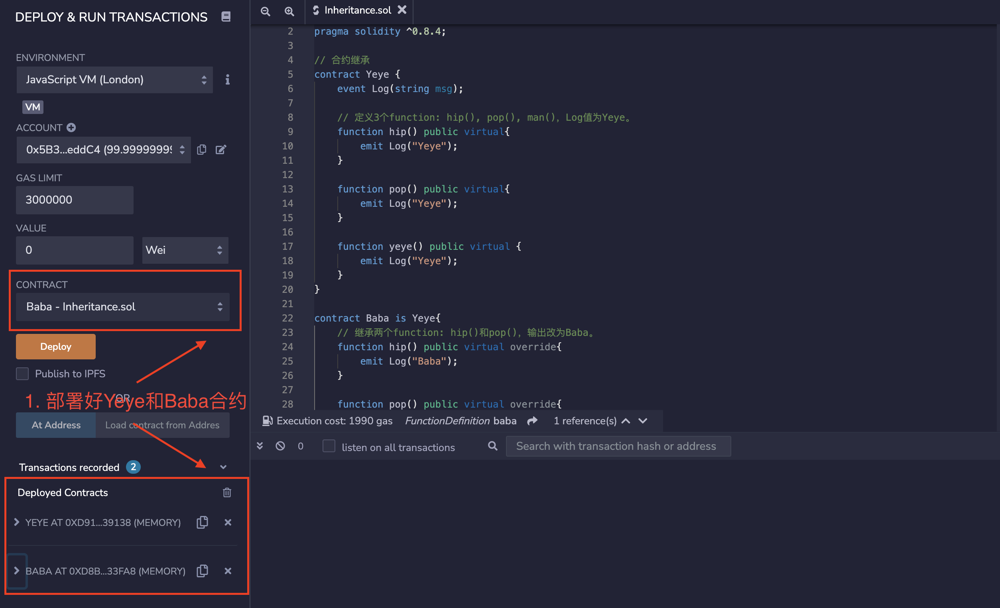
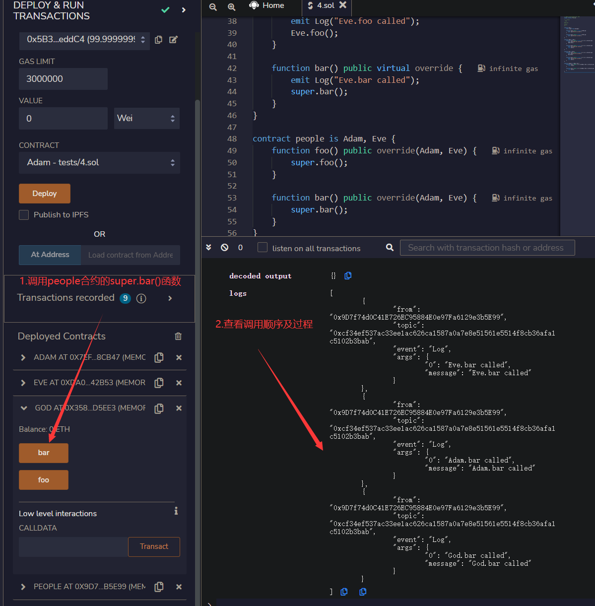

# WTF Introdução Simples ao Solidity: 13. Herança

Eu tenho revisitado o Solidity recentemente para consolidar os detalhes e estou escrevendo uma "Introdução Simples ao Solidity" para ajudar os iniciantes (programadores experientes podem buscar outros tutoriais). Pretendo atualizar o conteúdo semanalmente com 1-3 aulas.

Twitter: [@0xAA_Science](https://twitter.com/0xAA_Science)

Comunidade: [Discord](https://discord.gg/5akcruXrsk) | [Grupo do WhatsApp](https://docs.google.com/forms/d/e/1FAIpQLSe4KGT8Sh6sJ7hedQRuIYirOoZK_85miz3dw7vA1-YjodgJ-A/viewform?usp=sf_link) | [Site ofical wtf.academy](https://wtf.academy)

Todo o código e tutorial estão disponíveis no GitHub: [github.com/AmazingAng/WTFSolidity](https://github.com/AmazingAng/WTFSolidity)

---
Nesta aula, exploraremos a herança em Solidity, incluindo herança simples, herança múltipla, e a herança de modificadores (Modifiers) e construtores (Constructors).

## Herança

Herança é uma parte importante da programação orientada a objetos, pois permite reduzir significativamente a repetição de código. Se pensarmos nos contratos como objetos, Solidity é uma linguagem orientada a objetos que suporta herança.

### Regras

- `virtual`: Funções em um contrato pai que desejamos que o contrato filho sobrescreva precisam ser marcadas com a palavra-chave `virtual`.

- `override`: Quando um contrato filho sobrescreve uma função de um contrato pai, é necessário adicionar a palavra-chave `override`.

**Observação**: Usar `override` para modificar variáveis ​​públicas irá redefinir a função `getter` com o mesmo nome da variável. Por exemplo:

```solidity
mapping(address => uint256) public override balanceOf;
```

### Herança Simples

Vamos começar escrevendo um contrato avô chamado `Yeye` que contém um evento `Log` e três funções: `hip()`, `pop()` e `yeye()`, todas exibindo "Yeye" como saída.

```solidity
contract Yeye {
    event Log(string msg);

    function hip() public virtual {
        emit Log("Yeye");
    }

    function pop() public virtual {
        emit Log("Yeye");
    }

    function yeye() public virtual {
        emit Log("Yeye");
    }
}
```

Agora, vamos definir um contrato pai chamado `Baba` que herda o contrato `Yeye`. A sintaxe é simples: `contract Baba is Yeye`. No contrato `Baba`, vamos sobrescrever as funções `hip()` e `pop()`, alterando a saída para "Baba"; também adicionaremos uma nova função chamada `baba()` com a saída "Baba".

```solidity
contract Baba is Yeye {
    function hip() public virtual override {
        emit Log("Baba");
    }

    function pop() public virtual override {
        emit Log("Baba");
    }

    function baba() public virtual {
        emit Log("Baba");
    }
}
```

Ao implantar este contrato, podemos ver que o contrato `Baba` tem quatro funções, com as saídas de `hip()` e `pop()` sendo alteradas para "Baba", enquanto a saída do `yeye()` permanece como "Yeye".

### Herança Múltipla

Os contratos em Solidity podem herdar de vários contratos. As regras são as seguintes:

1. A hierarquia de herança deve seguir a ordem do ancestral mais distante para o mais próximo. Por exemplo, se escrevermos um contrato `Erzi` que herda os contratos `Yeye` e `Baba`, a declaração deve ser `contract Erzi is Yeye, Baba` e não `contract Erzi is Baba, Yeye`, ou ocorrerá um erro.

2. Se uma função está presente em vários contratos ancestrais, como nos exemplos `hip()` e `pop()`, ela deve ser sobrescrita no contrato filho, ou o compilador irá gerar um erro.

3. Ao sobrescrever uma função que está presente em múltiplos contratos ancestrais, a palavra-chave `override` deve listar todos os nomes dos contratos ancestrais, por exemplo `override(Yeye, Baba)`.

Exemplo:

```solidity
contract Erzi is Yeye, Baba {
    function hip() public virtual override(Yeye, Baba) {
        emit Log("Erzi");
    }

    function pop() public virtual override(Yeye, Baba) {
        emit Log("Erzi");
    }
}
```

No contrato `Erzi`, reescrevemos as funções `hip()` e `pop()`, alterando a saída para "Erzi", além de herdar as funções `yeye()` e `baba()` dos contratos `Yeye` e `Baba`, respectivamente.

### Herança de Modificadores

Os modificadores em Solidity também podem ser herdados, e o uso é semelhante ao da herança de funções, basta adicionar as palavras-chave `virtual` e `override` conforme necessário.

```solidity
contract Base1 {
    modifier exactDividedBy2And3(uint _a) virtual {
        require(_a % 2 == 0 && _a % 3 == 0);
        _;
    }
}

contract Identifier is Base1 {
    function getExactDividedBy2And3(uint _dividend) public exactDividedBy2And3(_dividend) pure returns(uint, uint) {
        return getExactDividedBy2And3WithoutModifier(_dividend);
    }

    function getExactDividedBy2And3WithoutModifier(uint _dividend) public pure returns(uint, uint){
        uint div2 = _dividend / 2;
        uint div3 = _dividend / 3;
        return (div2, div3);
    }
}
```

O contrato `Identifier` pode facilmente usar o modificador `exactDividedBy2And3` do contrato pai em seu código, ou redefinir o modificador conforme necessário:

```solidity
modifier exactDividedBy2And3(uint _a) override {
    _;
    require(_a % 2 == 0 && _a % 3 == 0);
}
```

### Herança de Construtores

Existem duas maneiras de um contrato filho herdar um construtor de um contrato pai. Primeiro, ao declarar os parâmetros do construtor pai ao herdar, por exemplo: `contract B is A(1)`. Segundo, no construtor do contrato filho, você pode declarar os parâmetros do construtor pai, como mostrado a seguir:

```solidity
contract C is A {
    constructor(uint _c) A(_c * _c) {}
}
```

### Chamando Funções do Contrato Pai

Existem duas maneiras de um contrato filho chamar funções de um contrato pai: chamada direta e uso da palavra-chave `super`.

1. Chamada direta: O contrato filho pode chamar diretamente as funções do contrato pai, por exemplo `Yeye.pop()`

    ```solidity
    function callParent() public {
        Yeye.pop();
    }
    ```

2. Palavra-chave `super`: O contrato filho pode usar `super.functionName()` para chamar a função do contrato pai mais próximo. A ordem de herança em Solidity, declarada da direita para a esquerda, é respeitada, então, se tivermos `contract Erzi is Yeye, Baba`, o contrato `Baba` é o contrato pai mais próximo, e `super.pop()` irá chamar `Baba.pop()` e não `Yeye.pop()`:

    ```solidity
    function callParentSuper() public {
        super.pop();
    }
    ```

### Herança em Diamante

Na programação orientada a objetos, a herança em diamante (ou herança em forma de diamante) ocorre quando uma subclasse possui duas ou mais superclasses.

Ao usar a palavra-chave `super` em uma cadeia de herança múltipla/diamante, é importante observar que `super` chamará a função relevante em cada contrato na cadeia de herança, e não apenas a do contrato pai mais próximo.

No exemplo fornecido, há um contrato `God`, e dois contratos `Adam` e `Eve` que herdam de `God`. Em seguida, há o contrato `people` que herda de `Adam` e `Eve`. Cada contrato possui as funções `foo()` e `bar()`.

Ao chamar `super.bar()` no contrato `people`, todas as implementações das funções `bar()` em `God`, `Adam` e `Eve` serão chamadas.

## Verificando no Remix

- Exemplo de herança simples: observe que o contrato `Baba` tem funções adicionais herdadas de `Yeye`

  
  
- Para ver o exemplo de herança múltipla, siga os mesmos passos que no exemplo de herança simples, mas adicione o contrato `Erzi` à implantação e verifique as funções expostas e tente chamar para ver os logs
- Exemplo de herança de modificadores:

  
  
  
- Exemplo de herança de construtores:

  
  
- Exemplo de chamada de função do contrato pai:

  
  

- Exemplo de herança em diamante:

  

## Conclusão

Nesta aula, exploramos os fundamentos da herança em Solidity, incluindo herança simples, herança múltipla, herança de modificadores e construtores, chamadas de funções dos contratos pai e problemas de herança em diamante em múltipla herança.

<!-- This file was translated using AI by repo_ai_translate. For more information, visit https://github.com/marcelojsilva/repo_ai_translate -->