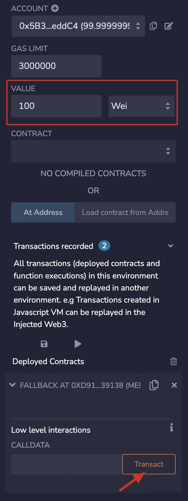

# Introdução Simples ao Solidity do tipo WTF: 19. Recebendo ETH com receive e fallback

Recentemente, tenho revisado meus conhecimentos em Solidity para reforçar alguns detalhes e escrever um guia introdutório chamado "Introdução Simples ao Solidity do tipo WTF", destinado a iniciantes (programadores experientes podem procurar outros tutoriais). Ele será atualizado semanalmente com até três lições.

Twitter: [@0xAA_Science](https://twitter.com/0xAA_Science)

Comunidade: [Discord](https://discord.gg/5akcruXrsk) | [WeChat](https://docs.google.com/forms/d/e/1FAIpQLSe4KGT8Sh6sJ7hedQRuIYirOoZK_85miz3dw7vA1-YjodgJ-A/viewform?usp=sf_link) | [Website WTF.academy](https://wtf.academy)

Todo o código e tutorial estão disponíveis no GitHub: [github.com/AmazingAng/WTFSolidity](https://github.com/AmazingAng/WTF-Solidity)

-----

O Solidity suporta dois tipos especiais de funções de retorno, `receive()` e `fallback()`, que são usadas em duas situações:

1. Receber ETH
2. Lidar com chamadas de função inexistentes no contrato (contratos proxy)

Importante: Antes da versão 0.6.x do Solidity, havia apenas a função `fallback()`, que era chamada quando o contrato recebia uma transferência de ETH e também quando era chamada uma função que não existia.
Somente a partir da versão 0.6, o Solidity dividiu a função `fallback()` em duas funções, `receive()` e `fallback()`.

Nesta lição, vamos focar na situação de receber ETH.

## Função `receive` para receber ETH

A função `receive()` é chamada quando o contrato recebe uma transferência de ETH. Um contrato pode ter no máximo uma função `receive()`, que tem uma declaração diferente das funções normais, não requer a palavra-chave `function`: `receive() external payable { ... }`. A função `receive()` não pode ter argumentos nem retornar valores, e deve ter os modificadores `external` e `payable`.

Quando um contrato recebe ETH, a função `receive()` é acionada. É aconselhável não executar muita lógica dentro da função `receive()`, pois se alguém usar os métodos `send` e `transfer` para enviar ETH, o limite de gás será de 2300 e uma função `receive()` muito complexa poderá causar um erro de "out of gas". Se você usar o método `call`, poderá definir um limite de gás personalizado para executar lógicas mais complexas (explicaremos esses três métodos de envio de ETH posteriormente).

Podemos registrar um evento dentro da função `receive()`. Por exemplo:

```solidity
// Definindo o evento
event Received(address Sender, uint Value);

// Disparando o evento ao receber ETH
receive() external payable {
    emit Received(msg.sender, msg.value);
}
```

Alguns contratos maliciosos podem adicionar um conteúdo malicioso que consume gás ou causa uma falha intencionalmente dentro da função `receive()` (ou a função `fallback()` nas versões mais antigas), o que faz com que contratos com lógicas de reembolso e transferência de ETH não funcionem corretamente. Portanto, ao escrever contratos com lógica de reembolso, é importante prestar atenção a esse aspecto.

## Função fallback

A função `fallback()` é acionada quando uma função inexistente é chamada no contrato. Ela também pode ser usada para receber ETH ou em contratos de proxy. A função `fallback()` não requer a palavra-chave `function` e deve ter o modificador `external` e, normalmente, o modificador `payable` para receber ETH: `fallback() external payable { ... }`.

Podemos definir uma função `fallback()` que dispara um evento chamado `fallbackCalled` e imprime `msg.sender`, `msg.value` e `msg.data` sempre que é acionada:

```solidity
event fallbackCalled(address Sender, uint Value, bytes Data);

// fallback
fallback() external payable{
    emit fallbackCalled(msg.sender, msg.value, msg.data);
}
```

## Diferença entre receive e fallback

As funções `receive()` e `fallback()` podem ser usadas para receber ETH. Aqui estão as regras para acionar cada uma delas:

```text
Qual função é acionada? receive() ou fallback()?
             Receber ETH
                    |
             msg.data está vazio?
               /        \
             Sim        Não
             /            \
     Tem receive()?    fallback()
          / \ 
        Sim Não
        /     \
  receive()  fallback()
```

Simplificando, quando o contrato recebe ETH, se `msg.data` estiver vazio e houver a função `receive()`, ela será acionada. Se `msg.data` não estiver vazio ou não houver a função `receive()`, a função `fallback()` será acionada, desde que essa função seja `payable`.

Se não existirem as funções `receive()` e `payable fallback()`, enviar ETH diretamente para o contrato resultará em um erro (ainda é possível enviar ETH para o contrato por meio de funções com modificador `payable`).

## Demonstração no Remix

1. Primeiro, faça o deploy do contrato "Fallback.sol" no Remix.
2. Preencha o campo "VALUE" com a quantia a ser enviada para o contrato (em Wei) e clique em "Transact".

    
3. Podemos ver que a transação foi concluída com sucesso e o evento "receivedCalled" foi acionado.

    
4. Preencha o campo "VALUE" com a quantia a ser enviada para o contrato (em Wei), preencha o campo "CALLDATA" com um valor aleatório para `msg.data`, e clique em "Transact".

    
5. Podemos ver que a transação foi concluída com sucesso e o evento "fallbackCalled" foi acionado.

    

## Conclusão

Nesta lição, apresentei duas funções especiais do Solidity, `receive()` e `fallback()`, que são usadas principalmente para receber ETH e em contratos proxy ("proxy contract").

