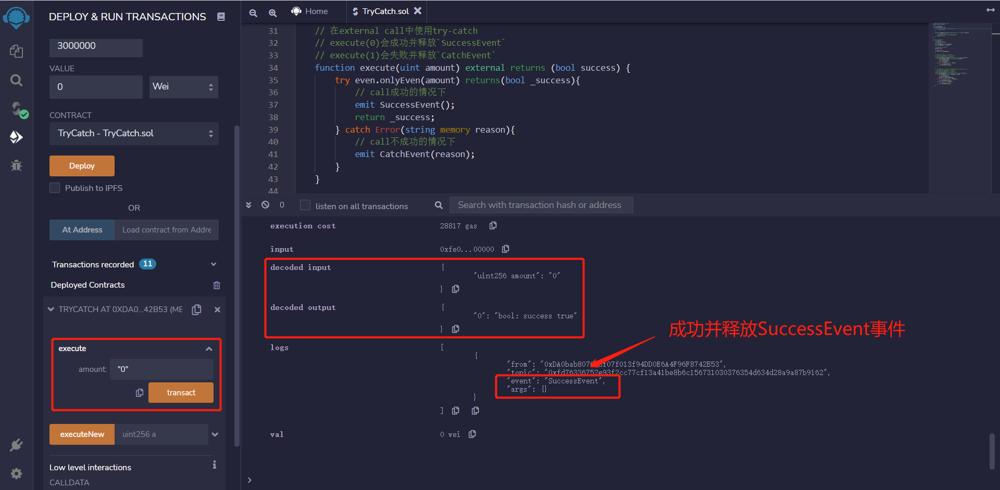
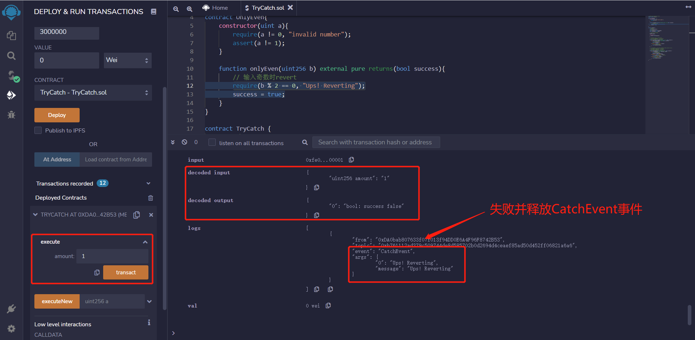
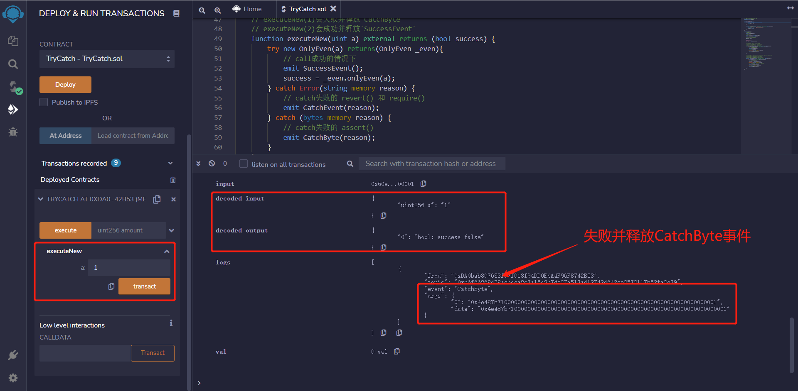
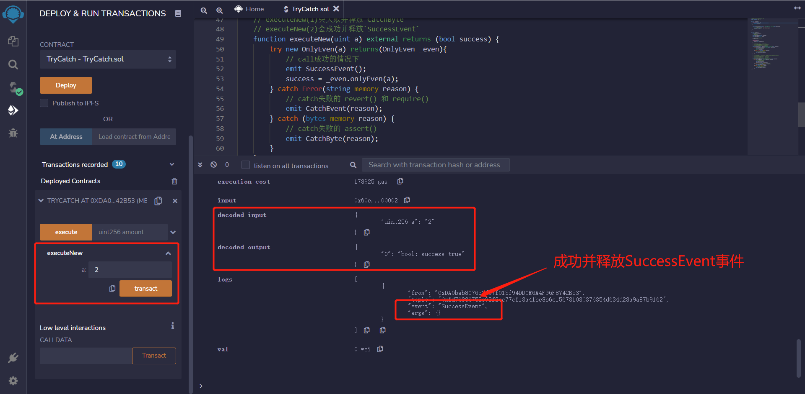

# WTF Introdução Simples à Solidity: 30. Try Catch

Recentemente, tenho revisitado o estudo da Solidity para reforçar alguns detalhes e escrever um "Guia Simples de Solidity" para iniciantes (os experientes em programação podem buscar outros tutoriais). Atualizo 1-3 lições por semana.

Twitter: [@0xAA_Science](https://twitter.com/0xAA_Science)

Comunidade: [Discord](https://discord.gg/5akcruXrsk) | [Grupo do WeChat](https://docs.google.com/forms/d/e/1FAIpQLSe4KGT8Sh6sJ7hedQRuIYirOoZK_85miz3dw7vA1-YjodgJ-A/viewform?usp=sf_link) | [Site oficial wtf.academy](https://wtf.academy)

Todo o código e tutorial estão disponíveis no GitHub: [github.com/AmazingAng/WTFSolidity](https://github.com/AmazingAng/WTFSolidity)

-----

`try-catch` é uma maneira padrão de lidar com exceções em quase todas as linguagens de programação modernas, e foi adicionada ao Solidity na versão 0.6. Nesta lição, vamos aprender como usar o `try-catch` para lidar com exceções em contratos inteligentes.

## `try-catch`

No Solidity, o `try-catch` só pode ser usado em chamadas de funções `external` ou no momento da criação do contrato (no `constructor`, que é tratado como uma função `external`). A sintaxe básica é a seguinte:

```solidity
try externalContract.f() {
    // código a ser executado em caso de chamada bem-sucedida
} catch {
    // código a ser executado em caso de chamada mal-sucedida
}
```

Onde `externalContract.f()` é uma chamada de função em um contrato externo, o bloco `try` é executado se a chamada for bem-sucedida, e o bloco `catch` é executado se a chamada falhar.

Também é possível utilizar `this.f()` em vez de `externalContract.f()`, que é tratado como uma chamada externa, porém não pode ser usado no construtor, pois o contrato ainda não foi criado.

Se a função chamada tiver um valor de retorno, é necessário declarar o tipo de retorno após o `try` e este valor pode ser utilizado dentro do bloco `try`. Se for uma criação de contrato, o valor de retorno será a variável do novo contrato criado.

```solidity
try externalContract.f() returns(returnType val){
    // código a ser executado em caso de chamada bem-sucedida
} catch {
    // código a ser executado em caso de chamada mal-sucedida
}
```

Além disso, o bloco `catch` permite capturar tipos específicos de razões de exceção:

```solidity
try externalContract.f() returns(returnType){
    // código a ser executado em caso de chamada bem-sucedida
} catch Error(string memory /*reason*/) {
    // trata exceções revert("razao") e require(false, "razao")
} catch Panic(uint /*errorCode*/) {
    // trata erros de Panic como falhas de assert, estouro, divisão por zero, acesso de array fora dos limites
} catch (bytes memory /*lowLevelData*/) {
    // Atingido se o revert ocorrer e as exceções anteriores não forem correspondidas, por exemplo, revert() require(false) e outros tipos de erros de revert
}
```

## Aplicação do `try-catch`

### `OnlyEven`

Vamos criar um contrato externo chamado `OnlyEven` e usar o `try-catch` para lidar com exceções:

```solidity
contract OnlyEven{
    constructor(uint a){
        require(a != 0, "número inválido");
        assert(a != 1);
    }

    function onlyEven(uint256 b) external pure returns(bool success){
        // reverte se o número for ímpar
        require(b % 2 == 0, "Ops! Revertendo");
        success = true;
    }
}
```

O contrato `OnlyEven` tem um construtor e uma função `onlyEven`.

- O construtor possui um parâmetro `a`, que lança uma exceção se `a=0`; e falha se `a=1`; caso contrário segue normalmente.
- A função `onlyEven` tem um parâmetro `b` e lança uma exceção se `b` for ímpar.

### Tratando exceções de chamadas de funções externas

Primeiro, no contrato `TryCatch`, precisamos definir alguns eventos e variáveis de estado:

```solidity
// Evento de sucesso
event SuccessEvent();

// Evento de falha
event CatchEvent(string message);
event CatchByte(bytes data);

// Declaração da variável do contrato OnlyEven
OnlyEven even;

constructor() {
    even = new OnlyEven(2);
}
```

O evento `SuccessEvent` é emitido em caso de chamada bem-sucedida, enquanto os eventos `CatchEvent` e `CatchByte` são emitidos em caso de exceção, correspondendo às exceções de `require/revert` e `assert`, respectivamente. `even` é uma variável de estado do tipo contrato `OnlyEven`.

Em seguida, no função `execute`, usaremos o `try-catch` para lidar com exceções na chamada da função externa `onlyEven`:

```solidity
// Usando try-catch em chamadas externas
function execute(uint amount) external returns (bool success) {
    try even.onlyEven(amount) returns(bool _success){
        // Código a ser executado em caso de chamada bem-sucedida
        emit SuccessEvent();
        return _success;
    } catch Error(string memory reason){
        // Código a ser executado em caso de falha na chamada
        emit CatchEvent(reason);
    }
}
```

### Verificação e tratamento de exceções no remix

Ao chamar `execute(0)`, como `0` é um número par, satisfazendo a condição de `require(b % 2 == 0, "Ops! Revertendo");`, não será lançada nenhuma exceção e o evento `SuccessEvent` será emitido.



Ao chamar `execute(1)`, como `1` é um número ímpar e não satisfaz a condição de `require(b % 2 == 0, "Ops! Revertendo");`, uma exceção é lançada e o evento `CatchEvent` é emitido.



### Lidando com exceções na criação de contratos

Aqui, utilizaremos o `try-catch` para lidar com exceções na criação de contratos. Basta modificar o bloco `try` para a criação do contrato `OnlyEven`:

```solidity
// Usando try-catch na criação de novo contrato (a criação de contrato é considerada como uma chamada externa)
// executeNew(0) falhará e emitirá 'CatchEvent'
// executeNew(1) falhará e emitirá 'CatchByte'
// executeNew(2) terá sucesso e emitirá 'SuccessEvent'
function executeNew(uint a) external returns (bool success) {
    try new OnlyEven(a) returns(OnlyEven _even){
        // Código a ser executado em caso de chamada bem-sucedida
        emit SuccessEvent();
        success = _even.onlyEven(a);
    } catch Error(string memory reason) {
        // Lidar com revert() e require() que falharam
        emit CatchEvent(reason);
    } catch (bytes memory reason) {
        // Lidar com falhas em assert()
        emit CatchByte(reason);
    }
}
```

### Verificação e tratamento de exceções no remix ao criar contratos

Ao chamar `executeNew(0)`, como `0` não satisfaz a condição `require(a != 0, "número inválido");`, a chamada falhará e o evento `CatchEvent` será emitido.


Ao chamar `executeNew(1)`, como `1` não satisfaz a condição `assert(a != 1);`, a chamada falhará e o evento `CatchByte` será emitido.



Ao chamar `executeNew(2)`, como `2` satisfaz as condições `require(a != 0, "número inválido");` e `assert(a != 1);`, a chamada será bem-sucedida e o evento `SuccessEvent` será emitido.



## Conclusão

Nesta lição, aprendemos como usar o `try-catch` no Solidity para lidar com exceções em contratos inteligentes:

- Pode ser usado apenas em chamadas a contratos externos e na criação de contratos.
- Se a operação em `try` for bem-sucedida, a variável de retorno deve ser declarada e ter um tipo correspondente.

<!-- This file was translated using AI by repo_ai_translate. For more information, visit https://github.com/marcelojsilva/repo_ai_translate -->