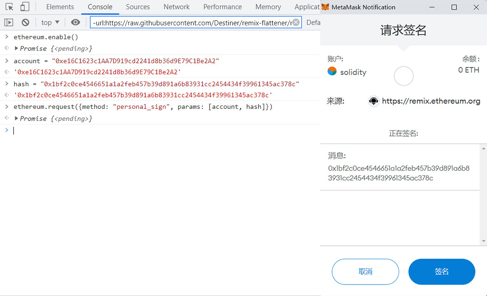
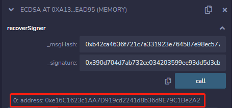

# 37. Assinatura Digital

Recentemente, tenho revisitado o estudo do Solidity para reforçar os detalhes e estou escrevendo um "Guia Simplificado do Solidity" para iniciantes (os programadores avançados podem buscar outros tutoriais). Estarei atualizando o guia com 1-3 lições por semana.

Você também pode me seguir no Twitter: [@0xAA_Science](https://twitter.com/0xAA_Science)

Seja bem-vindo à comunidade de cientistas da WTF, onde você pode encontrar informações sobre como entrar no grupo do WhatsApp: [link](https://discord.gg/5akcruXrsk)

Todo o código e tutoriais estão disponíveis no meu GitHub (curso certificado com 1024 estrelas, lançamento da comunidade NFT após 2048 estrelas): [github.com/AmazingAng/WTFSolidity](https://github.com/AmazingAng/WTFSolidity)

---

Nesta lição, vamos abordar de forma simples a assinatura digital `ECDSA` no Ethereum, e como utilizá-la para distribuir a lista branca de NFTs. A biblioteca `ECDSA` presente no código é simplificada a partir da biblioteca de mesmo nome da OpenZeppelin.

## Assinatura Digital

Se você já fez transações de NFT no `opensea`, a assinatura digital não será algo desconhecido para você. A captura de tela mostrada abaixo é da janela pop-up de assinatura que aparece ao usar a carteira de raposinha (`metamask`), a qual ajuda a provar que você é o titular da chave privada sem precisar revelar essa chave publicamente.

O Ethereum utiliza o algoritmo de assinatura digital de curva elíptica dupla (`ECDSA`), baseado na "chave privada-chave pública" da dupla de chaves de curva elíptica. A assinatura digital tem três principais funções ([fonte](https://en.wikipedia.org/wiki/Digital_signature)):

1. **Autenticação de Identidade**: Provar que quem assinou é o titular da chave privada.
2. **Não-Repúdio**: Quem envia a mensagem não pode negar que a enviou.
3. **Integridade**: Verificar se a mensagem foi alterada durante o transporte.

## Contrato `ECDSA`

O padrão `ECDSA` possui duas partes principais:

1. O signatário usa a `chave privada` (privada) para criar a `assinatura` (pública) da `mensagem` (pública).
2. Outros usam a `mensagem` (pública) e a `assinatura` (pública) para recuperar a `chave pública` do signatário e verificar a assinatura.

Abaixo, vamos abordar essas duas partes com a ajuda da biblioteca `ECDSA`. A seguir estão os dados de `chave privada`, `chave pública`, `mensagem`, `mensagem assinada no Ethereum` e `assinatura` usados no exemplo:

```
Chave privada: 0x227dbb8586117d55284e26620bc76534dfbd2394be34cf4a09cb775d593b6f2b
Chave pública: 0xe16C1623c1AA7D919cd2241d8b36d9E79C1Be2A2
Mensagem: 0x1bf2c0ce4546651a1a2feb457b39d891a6b83931cc2454434f39961345ac378c
Mensagem assinada no Ethereum: 0xb42ca4636f721c7a331923e764587e98ec577cea1a185f60dfcc14dbb9bd900b
Assinatura: 0x390d704d7ab732ce034203599ee93dd5d3cb0d4d1d7c600ac11726659489773d559b12d220f99f41d17651b0c1c6a669d346a397f8541760d6b32a5725378b241c
```

### Criação de Assinaturas

**1. Empacotamento da Mensagem:** No padrão `ECDSA` do Ethereum, a `mensagem` a ser assinada é o hash `keccak256` de um conjunto de dados, no tipo `bytes32`. Podemos empacotar qualquer conteúdo que queiramos assinar usando a função `abi.encodePacked()` e em seguida calcular o hash usando `keccak256()`, resultando na `mensagem`. A `mensagem` do nosso exemplo é obtida juntando uma variável do tipo `address` e uma variável do tipo `uint256`:

```solidity
    function getMessageHash(address _account, uint256 _tokenId) public pure returns(bytes32){
        return keccak256(abi.encodePacked(_account, _tokenId));
    }
```

**2. Cálculo da Mensagem Assinada no Ethereum:** A `mensagem` pode representar uma transação executável ou qualquer outro formato. Para impedir que os usuários assinem transações maliciosas por engano, o `EIP191` sugere adicionar a string `"\x19Ethereum Signed Message:\n32"` na frente da `mensagem` e realizar outro `keccak256` para obter a `mensagem assinada no Ethereum`. A mensagem processada por `toEthSignedMessageHash()` não pode ser usada para executar transações:
```solidity
    function toEthSignedMessageHash(bytes32 hash) public pure returns (bytes32) {
        return keccak256(abi.encodePacked("\x19Ethereum Signed Message:\n32", hash));
    }
```
A mensagem processada é:

```
Mensagem assinada no Ethereum: 0xb42ca4636f721c7a331923e764587e98ec577cea1a185f60dfcc14dbb9bd900b
```

**3-1. Assinatura usando a Carteira:** Na maioria dos casos, os usuários assinam mensagens desta forma. Após obter a mensagem a ser assinada, é necessário usar a carteira `metamask` para realizar a assinatura. O método `personal_sign` do `metamask` automaticamente converte a `mensagem` em `mensagem assinada no Ethereum` e realiza a assinatura. Portanto, só é necessário informar a `mensagem` e o `endereço da carteira do signatário`. É importante observar que o `endereço da carteira do signatário` informado deve ser o mesmo endereço conectado ao `metamask`.

Primeiro, importe a chave privada do exemplo para a carteira de raposinha (`metamask`), então abra a página de console do navegador: `Menu do Chrome - Mais Ferramentas - Ferramentas de Desenvolvimento - Console`. Com o status de conexão da carteira (por exemplo, conectado ao opensea), insira os seguintes comandos para fazer a assinatura:

```
ethereum.enable()
account = "0xe16C1623c1AA7D919cd2241d8b36d9E79C1Be2A2"
hash = "0x1bf2c0ce4546651a1a2feb457b39d891a6b83931cc2454434f39961345ac378c"
ethereum.request({method: "personal_sign", params: [account, hash]})
```

Nos resultados retornados, você pode ver a assinatura criada. Diferentes contas terão chaves privadas diferentes e, portanto, as assinaturas geradas serão diferentes. A assinatura criada com base na chave privada do exemplo é a seguinte:

```
0x390d704d7ab732ce034203599ee93dd5d3cb0d4d1d7c600ac11726659489773d559b12d220f99f41d17651b0c1c6a669d346a397f8541760d6b32a5725378b241c
```



**3-2. Assinatura usando web3.py:** Para operações em lote, é mais comum realizar a assinatura por meio de código. Abaixo está a implementação baseada no web3.py.

```py
from web3 import Web3, HTTPProvider
from eth_account.messages import encode_defunct

private_key = "0x227dbb8586117d55284e26620bc76534dfbd2394be34cf4a09cb775d593b6f2b"
address = "0x5B38Da6a701c568545dCfcB03FcB875f56beddC4"
rpc = 'https://rpc.ankr.com/eth'
w3 = Web3(HTTPProvider(rpc))

#Empacotar a mensagem
msg = Web3.solidityKeccak(['address','uint256'], [address,0])
print(f"Mensagem: {msg.hex()}")
#Construir a mensagem assinável
message = encode_defunct(hexstr=msg.hex())
#Assinar
signed_message = w3.eth.account.sign_message(message, private_key=private_key)
print(f"Assinatura: {signed_message['signature'].hex()}")
```

A execução do código acima resulta no seguinte. A mensagem calculada, a assinatura e a mensagem são iguais aos exemplos anteriores.

```
Mensagem: 0x1bf2c0ce4546651a1a2feb457b39d891a6b83931cc2454434f39961345ac378c
Assinatura: 0x390d704d7ab732ce034203599ee93dd5d3cb0d4d1d7c600ac11726659489773d559b12d220f99f41d17651b0c1c6a669d346a397f8541760d6b32a5725378b241c
```

### Verificando Assinaturas

Para verificar uma assinatura, o verificador deve ter em posse a `mensagem`, a `assinatura` e a `chave pública` usada para assinar. Podemos verificar a assinatura porque somente o titular da `chave privada` pode gerar tal assinatura para uma transação, ninguém mais.

**4. Recuperando a Chave Pública a partir da Assinatura e da Mensagem:** A `assinatura` é gerada por um algoritmo matemático. Aqui estamos usando a `assinatura RSV`, onde a `assinatura` contém as informações `r, s, v`. Podemos usar `r, s, v` e a `mensagem assinada no Ethereum _msgHash` para obter a `chave pública`. A função `recoverSigner()` realiza esse processo, usando uma simples montagem inline para extrair os valores `r, s, v` e realizar a verificação:

```solidity
    function recoverSigner(bytes32 _msgHash, bytes memory _signature) internal pure returns (address){
        require(_signature.length == 65, "invalid signature length");
        bytes32 r;
        bytes32 s;
        uint8 v;
        assembly {
            r := mload(add(_signature, 0x20))
            s := mload(add(_signature, 0x40))
            v := byte(0, mload(add(_signature, 0x60)))
        }
        return ecrecover(_msgHash, v, r, s);
    }
```
Os parâmetros são:
```
_msgHash: 0xb42ca4636f721c7a331923e764587e98ec577cea1a185f60dfcc14dbb9bd900b
_signature: 0x390d704d7ab732ce034203599ee93dd5d3cb0d4d1d7c600ac11726659489773d559b12d220f99f41d17651b0c1c6a669d346a397f8541760d6b32a5725378b241c
```


**5. Comparando as Chaves Públicas e Verificando a Assinatura:** Em seguida, basta comparar a `chave pública` recuperada com a `chave pública signatária _signer`: se forem iguais, a assinatura é válida; caso contrário, a assinatura é inválida:

```solidity
    function verify(bytes32 _msgHash, bytes memory _signature, address _signer) internal pure returns (bool) {
        return recoverSigner(_msgHash, _signature) == _signer;
    }
```
Os parâmetros são:
```
_msgHash: 0xb42ca4636f721c7a331923e764587e98ec577cea1a185f60dfcc14dbb9bd900b
_signature: 0x390d704d7ab732ce034203599ee93dd5d3cb0d4d1d7c600ac11726659489773d559b12d220f99f41d17651b0c1c6a669d346a397f8541760d6b32a5725378b241c
_signer: 0xe16C1623c1AA7D919cd2241d8b36d9E79C1Be2A2
```


## Distribuição de Lista Branca utilizando Assinatura

Os projetos de NFT podem usar essa característica da `ECDSA` para distribuir listas brancas. Como a assinatura é fora da cadeia e não requer `gas`, este método de distribuição de listas brancas é mais econômico do que o método de `Merkle Tree`. O processo é simples: o projeto assina endereços de destaque com o endereço do projeto (que pode incluir o `tokenId` que o endereço pode cunhar). Em seguida, durante a `mintagem`, a validade da assinatura é verificada com `ECDSA` e, se for válida, o `mint` é realizado.

O contrato `SignatureNFT` implementa a distribuição da lista branca de NFTs utilizando assinaturas.

### Variáveis de Estado
Existem duas variáveis de estado no contrato:
- `signer`: Chave pública, endereço de assinatura do projeto.
- `mintedAddress` é um `mapping` que registra os endereços que já foram alvo de `mintagem`.

### Funções
Existem quatro funções no contrato:
- O construtor inicializa o nome e o símbolo do NFT, e também o endereço de assinatura `ECDSA`.
- A função `mint()` recebe endereço, `tokenId` e `_signature` como parâmetros para verificar a validade da assinatura: se válida, o NFT com `tokenId` é cunhado para o endereço, que é então registrado em `mintedAddress`. A função chama `getMessageHash()`, `ECDSA.toEthSignedMessageHash()` e `verify()`.
- A função `getMessageHash()` concatena o endereço de `mintagem` (`address`) e o `tokenId` (`uint256`) para formar uma `mensagem`.
- A função `verify()` chama a função `verify()` da biblioteca `ECDSA` para realizar a verificação da assinatura.

```solidity
contract SignatureNFT is ERC721 {
    address immutable public signer; // Endereço de assinatura
    mapping(address => bool) public mintedAddress;   // Registra os endereços que já foram alvo de mintagem

    // Construtor, inicializa o nome, o símbolo do NFT e o endereço de assinatura do contrato
    constructor(string memory _name, string memory _symbol, address _signer)
    ERC721(_name, _symbol)
    {
        signer = _signer;
    }

    // Verifica a assinatura ECDSA e cunha NFT
    function mint(address _account, uint256 _tokenId, bytes memory _signature)
    external
    {
        bytes32 _msgHash = getMessageHash(_account, _tokenId); // Empacota o _account e o _tokenId na mensagem
        bytes32 _ethSignedMessageHash = ECDSA.toEthSignedMessageHash(_msgHash); // Calcula a mensagem assinada no Ethereum
        require(verify(_ethSignedMessageHash, _signature), "Invalid signature"); // Verificação ECDSA passou
        require(!mintedAddress[_account], "Already minted!"); // Endereço ainda não foi cunhado
        _mint(_account, _tokenId); // Cunhagem
        mintedAddress[_account] = true; // Registra o endereço cunhado
    }

    /*
     * Empacota o endereço de mintagem (tipo address) e o tokenId (tipo uint256) na mensagem msgHash
     * _account: 0x5B38Da6a701c568545dCfcB03FcB875f56beddC4
     * _tokenId: 0
     * Mensagem correspondente: 0x1bf2c0ce4546651a1a2feb457b39d891a6b83931cc2454434f39961345ac378c
     */
    function getMessageHash(address _account, uint256 _tokenId) public pure returns(bytes32){
        return keccak256(abi.encodePacked(_account, _tokenId));
    }

    // Verificar utilizando ECDSA, chama a função verify() da biblioteca ECDSA
    function verify(bytes32 _msgHash, bytes memory _signature)
    public view returns (bool)
    {
        return ECDSA.verify(_msgHash, _signature, signer);
    }
}
```

### Verificação no `remix`

- Assinatura fora da cadeia obtida por meio da assinatura digital Ethereum. Os dados utilizados podem ser encontrados na seção do `ECDSA` no texto original.

<!-- This file was translated using AI by repo_ai_translate. For more information, visit https://github.com/marcelojsilva/repo_ai_translate -->