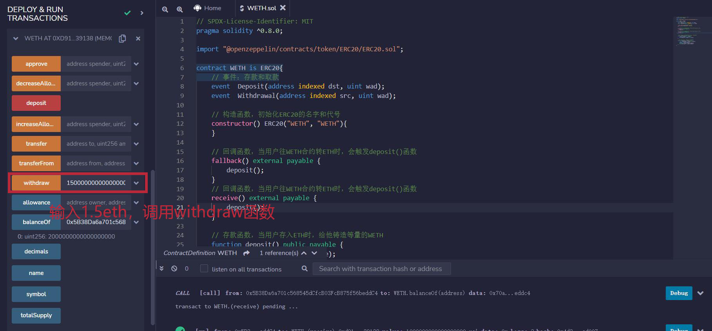
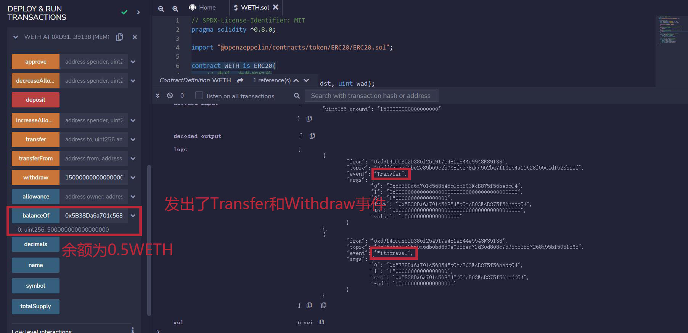

# 41. WETH

Eu recentemente revisitei o Solidity para consolidar os detalhes e estou escrevendo um "WTF Introdução super simplificada ao Solidity" para iniciantes (os mestres da programação podem encontrar outros tutoriais), atualizado semanalmente com 1-3 palestras.

Twitter: [@0xAA_Science](https://twitter.com/0xAA_Science)

Discord: [WTF Academy](https://discord.gg/5akcruXrsk)

Todo o código e tutoriais estão disponíveis no GitHub: [github.com/AmazingAng/WTFSolidity](https://github.com/AmazingAng/WTFSolidity)

---

Nesta palestra, vamos aprender sobre o `WETH` - Ethereum encapsulado.

## O que é o `WETH`?


`WETH` (Wrapped ETH) é a versão encapsulada do `ETH`. `WETH`, `WBTC`, `WBNB` que estamos acostumados são todos tokens nativos encapsulados. Mas por que precisamos encapsulá-los?

Em 2015, o [padrão ERC20](../20_SendETH/readme_pt-br.md) foi introduzido com o objetivo de padronizar as regras para tokens na Ethereum, simplificando o lançamento de novos tokens e permitindo a comparação entre todos os tokens na blockchain. Infelizmente, o próprio Ether não está em conformidade com o padrão ERC20. O desenvolvimento do `WETH` tem o objetivo de aumentar a interoperabilidade entre blockchains e permitir que o `ETH` seja usado em aplicativos descentralizados (dApps). É como se estivéssemos vestindo um contrato inteligente sobre o token nativo: ao colocar a roupa, ele se torna `WETH`, conforme o padrão de tokens homogêneos ERC20, permitindo interoperabilidade entre blockchains e uso em dApps; ao remover a roupa, ele pode ser trocado de volta a uma taxa de 1:1 para `ETH`.

## Contrato do `WETH`

Atualmente, o [contrato WETH na mainnet](https://rinkeby.etherscan.io/token/0xc778417e063141139fce010982780140aa0cd5ab?a=0xe16c1623c1aa7d919cd2241d8b36d9e79c1be2a2) foi escrito em 2015, é bastante antigo e foi desenvolvido com a versão 0.4 do Solidity. Vamos reescrever um contrato do `WETH` usando a versão 0.8.

O `WETH` segue o padrão ERC20 e possui duas funcionalidades adicionais:

1. Depósito: encapsulamento, onde os usuários depositam `ETH` no contrato `WETH` e recebem a quantidade equivalente de `WETH`.
2. Saque: desencapsulamento, onde os usuários destroem `WETH` e recuperam a quantidade equivalente de `ETH`.

```solidity
// SPDX-License-Identifier: MIT
pragma solidity ^0.8.0;

import "@openzeppelin/contracts/token/ERC20/ERC20.sol";

contract WETH is ERC20 {
    // Eventos: depósito e saque
    event  Deposit(address indexed dst, uint wad);
    event  Withdrawal(address indexed src, uint wad);

    // Construtor, inicializa o nome e o símbolo do ERC20
    constructor() ERC20("WETH", "WETH"){
    }

    // Função de fallback, quando os usuários transferem ETH para o contrato WETH, acionará a função deposit()
    fallback() external payable {
        deposit();
    }
    // Função de fallback, quando os usuários transferem ETH para o contrato WETH, acionará a função deposit()
    receive() external payable {
        deposit();
    }

    // Função de depósito, para quando os usuários depositam ETH, recebem a quantidade equivalente de WETH
    function deposit() public payable {
        _mint(msg.sender, msg.value);
        emit Deposit(msg.sender, msg.value);
    }

    // Função de saque, para quando os usuários destroem WETH e recuperam a quantidade equivalente de ETH
    function withdraw(uint amount) public {
        require(balanceOf(msg.sender) >= amount);
        _burn(msg.sender, amount);
        payable(msg.sender).transfer(amount);
        emit Withdrawal(msg.sender, amount);
    }
}
```

### Herança

O `WETH` segue o padrão ERC20 para tokens, então o contrato `WETH` herda o contrato ERC20.

### Eventos

O contrato `WETH` possui 2 eventos:

1. `Deposit`: evento de depósito, acionado durante o depósito.
2. `Withdraw`: evento de saque, acionado durante o saque.

### Funções

Além das funções padrão do ERC20, o contrato `WETH` possui 5 funções:

- Construtor: inicializa o nome e o símbolo do `WETH`.
- Funções de fallback: `fallback()` e `receive()`, acionadas quando os usuários transferem `ETH` para o contrato `WETH`, elas automaticamente acionam a função de depósito (`deposit()`).
- `deposit()`: função de depósito, onde os usuários depositam `ETH` e recebem a quantidade equivalente de WETH.
- `withdraw()`: função de saque, onde os usuários destroem `WETH` e recebem a quantidade equivalente de `ETH`.

## Demonstração no `Remix`

### 1. Implementar o contrato `WETH`


### 2. Chamar `deposit`, depositar `1 ETH` e verificar o saldo de `WETH`


Neste momento, o saldo de `WETH` é de `1 WETH`.


### 3. Transferir diretamente `1 ETH` para o contrato `WETH` e verificar o saldo de `WETH`


Neste momento, o saldo de `WETH` é de `2 WETH`.


### 4. Chamar `withdraw`, sacar `1.5 ETH` e verificar o saldo de `WETH`



Neste momento, o saldo de `WETH` é de `0.5 WETH`.



## Conclusão

Nesta palestra, apresentamos o `WETH` e implementamos o contrato do `WETH`. Ele funciona como uma camada adicional ao Ether nativo: quando vestido, torna-se `WETH`, de acordo com o padrão ERC20, permitindo interoperabilidade entre blockchains e uso em dApps; ao remover a camada, ele pode ser trocado de volta por `ETH` na proporção de 1:1.

<!-- This file was translated using AI by repo_ai_translate. For more information, visit https://github.com/marcelojsilva/repo_ai_translate -->